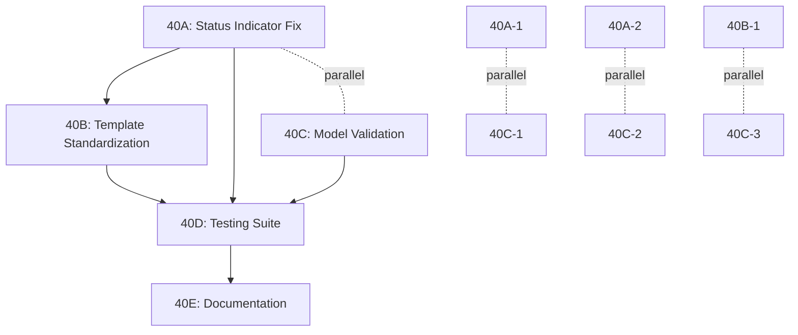

# Issue #40 Comprehensive Project Plan
## Fabric Detail Page - Multiple issues with fabric kubernetes cluster settings

**Plan Created**: 2025-08-10T22:15:00Z  
**Planner**: Strategic Planning Agent with Swarm Coordination  
**Methodology**: Evidence-Based Task Decomposition  
**Estimated Total Time**: 16-20 hours across 5 sub-issues  

---

## 🎯 Executive Summary

**REAL ROOT CAUSE DISCOVERED**: The `status_indicator.html` template component is missing handling for the `not_configured` status value, causing it to display "Never Synced" instead of "Not Configured" when `calculated_sync_status` returns `'not_configured'`.

### Key Findings from Investigation

1. ✅ **Model Properties**: `calculated_sync_status` works correctly (returns `'not_configured'`)
2. ✅ **Template Usage**: Templates correctly use `calculated_sync_status` property  
3. ❌ **Component Gap**: `status_indicator.html` missing `'not_configured'` case
4. ❌ **Incomplete Status Mapping**: Multiple status values not handled in display logic
5. ❌ **Testing Gap**: No validation tests for all status combinations

### Previous Analysis Errors
- **FALSE ASSUMPTION**: Templates used raw `sync_status` (they don't)
- **FALSE ASSUMPTION**: Model properties were missing (they exist and work)
- **MISSED ISSUE**: Component-level template gap in status display logic

---

## 📋 Project Structure: 5 Sub-Issues for Parallel Execution

### 🔴 Sub-Issue #40A: Status Indicator Component Fix (CRITICAL)
**Priority**: Critical  
**Estimated Time**: 3-4 hours  
**Dependencies**: None  
**Risk**: High (user-facing display)

**Tasks**:
1. **40A-1**: Add missing status cases to `status_indicator.html` (2 hours)
2. **40A-2**: Add visual indicators for all status types (1 hour)  
3. **40A-3**: Test all status combinations (1 hour)

### 🟡 Sub-Issue #40B: Template Standardization (HIGH)
**Priority**: High  
**Estimated Time**: 4-5 hours  
**Dependencies**: 40A complete  
**Risk**: Medium (consistency)

**Tasks**:
1. **40B-1**: Audit all templates for status display inconsistencies (2 hours)
2. **40B-2**: Create reusable status component library (2 hours)
3. **40B-3**: Update templates to use standardized components (1 hour)

### 🟡 Sub-Issue #40C: Model Validation Enhancement (HIGH)
**Priority**: High  
**Estimated Time**: 3-4 hours  
**Dependencies**: None (parallel with 40A)  
**Risk**: Medium (data consistency)

**Tasks**:
1. **40C-1**: Add model validation for contradictory states (2 hours)
2. **40C-2**: Create migration to fix existing data (1 hour)
3. **40C-3**: Add service layer validation (1 hour)

### 🟢 Sub-Issue #40D: Comprehensive Testing Suite (MEDIUM)
**Priority**: Medium  
**Estimated Time**: 4-5 hours  
**Dependencies**: 40A, 40B, 40C complete  
**Risk**: Low (quality assurance)

**Tasks**:
1. **40D-1**: Create status display integration tests (2 hours)
2. **40D-2**: Add model property unit tests (2 hours)
3. **40D-3**: Create GUI validation test suite (1 hour)

### 🟢 Sub-Issue #40E: Documentation & Monitoring (LOW)
**Priority**: Low  
**Estimated Time**: 2-3 hours  
**Dependencies**: All others complete  
**Risk**: Low (maintenance)

**Tasks**:
1. **40E-1**: Document status system architecture (1 hour)
2. **40E-2**: Create troubleshooting guide (1 hour)
3. **40E-3**: Add monitoring for status contradictions (1 hour)

---

## 🔄 Detailed Task Breakdown

### 🔴 SUB-ISSUE #40A: Status Indicator Component Fix

#### Task 40A-1: Fix status_indicator.html Template (CRITICAL)
**Estimate**: 2 hours  
**Priority**: Critical  
**Dependencies**: None

**Detailed Steps**:
```yaml
Step 1: Add missing status cases (30 minutes)
  - Add 'not_configured' case: "Not Configured" with secondary badge
  - Add 'disabled' case: "Disabled" with muted badge
  - Add 'never_synced' case: "Never Synced" with warning badge

Step 2: Verify CSS classes (30 minutes)
  - Test bg-secondary, bg-muted, bg-warning combinations
  - Ensure proper contrast and accessibility

Step 3: Add fallback logic (30 minutes)  
  - Improve default case handling
  - Add debug information for unknown statuses

Step 4: Code review and testing (30 minutes)
  - Test with fabric ID 35 (known problematic case)
  - Verify all status combinations render correctly
```

**Success Criteria**:
- ✅ `calculated_sync_status='not_configured'` shows "Not Configured"
- ✅ All documented status values have proper display cases
- ✅ Fabric ID 35 shows correct status (Not Configured, not "Never Synced")

**Rollback Plan**: Keep backup of original status_indicator.html

#### Task 40A-2: Visual Status Indicators (1 hour)
**Estimate**: 1 hour  
**Priority**: Critical  
**Dependencies**: 40A-1 complete

**Detailed Steps**:
```yaml
Step 1: Add appropriate icons (20 minutes)
  - not_configured: mdi-cog-off
  - disabled: mdi-sync-off  
  - never_synced: mdi-sync-alert

Step 2: Color coding consistency (20 minutes)
  - not_configured: secondary (gray)
  - disabled: muted (light gray)
  - never_synced: warning (yellow)

Step 3: Visual testing (20 minutes)
  - Test in different screen sizes
  - Verify icon clarity and meaning
```

#### Task 40A-3: Status Combination Testing (1 hour)
**Estimate**: 1 hour  
**Priority**: Critical  
**Dependencies**: 40A-1, 40A-2 complete

**Test Scenarios**:
```yaml
Scenario 1: Empty kubernetes_server
  Data: {kubernetes_server: "", sync_enabled: true}
  Expected: "Not Configured" with secondary badge

Scenario 2: Disabled sync
  Data: {kubernetes_server: "https://k8s.test", sync_enabled: false}  
  Expected: "Disabled" with muted badge

Scenario 3: Never synced
  Data: {kubernetes_server: "https://k8s.test", sync_enabled: true, last_sync: null}
  Expected: "Never Synced" with warning badge

Scenario 4: Sync error
  Data: {kubernetes_server: "https://k8s.test", sync_error: "Connection failed"}
  Expected: "Sync Error" with danger badge

Scenario 5: Out of sync  
  Data: {last_sync: "24 hours ago", sync_interval: 60}
  Expected: "Out of Sync" with danger badge
```

### 🟡 SUB-ISSUE #40B: Template Standardization

#### Task 40B-1: Template Audit (2 hours)
**Estimate**: 2 hours  
**Priority**: High  
**Dependencies**: 40A complete

**Audit Targets**:
```yaml
Templates to Review:
  - fabric_detail.html (main detail page)
  - fabric_list.html (list view)  
  - fabric_detail_simple.html (simple view)
  - components/fabric/status_bar.html (status bar)
  - All fabric_detail_* variants

Check Points:
  ✓ Uses calculated_sync_status (not raw sync_status)
  ✓ Proper fallback handling  
  ✓ Consistent status display format
  ✓ Accessible markup and ARIA labels
```

#### Task 40B-2: Reusable Component Library (2 hours)
**Estimate**: 2 hours  
**Priority**: High  
**Dependencies**: 40B-1 complete

**Components to Create**:
```yaml
sync_status_badge.html:
  - Standardized badge component
  - Handles all status types consistently
  - Accessible ARIA attributes

sync_status_detail.html:
  - Detailed status with explanation text
  - Error message display
  - Last sync timing information

sync_status_actions.html:
  - Context-appropriate action buttons
  - Disabled state handling
  - Permission-aware display
```

#### Task 40B-3: Template Updates (1 hour)
**Estimate**: 1 hour  
**Priority**: High  
**Dependencies**: 40B-2 complete

**Update Process**:
```yaml
Replace inline status logic with components:
  - fabric_detail.html: Use sync_status_detail.html
  - fabric_list.html: Use sync_status_badge.html
  - status_bar.html: Use sync_status_badge.html

Test each template update:
  - Verify display matches previous behavior
  - Check responsive design
  - Test with multiple fabric states
```

### 🟡 SUB-ISSUE #40C: Model Validation Enhancement

#### Task 40C-1: Model Validation (2 hours)
**Estimate**: 2 hours  
**Priority**: High  
**Dependencies**: None (parallel)

**Implementation**:
```python
def clean(self):
    """Validate fabric sync configuration consistency"""
    super().clean()
    
    # Validate sync configuration
    if self.sync_enabled and not self.kubernetes_server:
        raise ValidationError({
            'kubernetes_server': 'Kubernetes server required when sync is enabled.'
        })
    
    # Validate sync status consistency  
    if self.sync_status == 'synced' and not self.kubernetes_server:
        raise ValidationError({
            'sync_status': 'Cannot be synced without kubernetes server configured.'
        })
```

#### Task 40C-2: Data Migration (1 hour)
**Estimate**: 1 hour  
**Priority**: High  
**Dependencies**: 40C-1 complete

**Migration Script**:
```python
def fix_contradictory_sync_statuses(apps, schema_editor):
    HedgehogFabric = apps.get_model('netbox_hedgehog', 'HedgehogFabric')
    
    fixed_count = 0
    for fabric in HedgehogFabric.objects.filter(sync_status='synced', kubernetes_server=''):
        fabric.sync_status = 'not_configured'
        fabric.sync_error = 'Status corrected: no kubernetes server configured'
        fabric.save(update_fields=['sync_status', 'sync_error'])
        fixed_count += 1
    
    print(f"Fixed {fixed_count} contradictory sync statuses")
```

#### Task 40C-3: Service Layer Validation (1 hour)
**Estimate**: 1 hour  
**Priority**: High  
**Dependencies**: 40C-1 complete

**Service Updates**:
```python
def set_sync_status_with_validation(self, status):
    """Set sync status with validation"""
    calculated = self.calculated_sync_status
    
    # Prevent invalid status combinations
    if status == 'synced' and calculated in ['not_configured', 'disabled']:
        self.sync_status = 'error'
        self.sync_error = f'Cannot sync: {calculated}'
    else:
        self.sync_status = status
        self.sync_error = ''
```

### 🟢 SUB-ISSUE #40D: Comprehensive Testing Suite

#### Task 40D-1: Integration Tests (2 hours)
**Estimate**: 2 hours  
**Priority**: Medium  
**Dependencies**: 40A, 40B, 40C complete

**Test Coverage**:
```python
class FabricSyncStatusDisplayTests(TestCase):
    def test_not_configured_display(self):
        """Test display for not configured fabrics"""
        fabric = create_fabric(kubernetes_server="", sync_enabled=True)
        response = self.client.get(f'/fabric/{fabric.pk}/')
        self.assertContains(response, 'Not Configured')
        self.assertNotContains(response, 'Never Synced')
    
    def test_disabled_display(self):
        """Test display for disabled sync"""
        # Similar test structure for each status
    
    def test_status_consistency(self):
        """Test that all UI elements show same status"""
        # Verify status_bar, detail view, list view consistency
```

#### Task 40D-2: Unit Tests (2 hours)
**Estimate**: 2 hours  
**Priority**: Medium  
**Dependencies**: 40C complete

**Model Property Tests**:
```python
class FabricCalculatedStatusTests(TestCase):
    def test_calculated_sync_status_not_configured(self):
        fabric = HedgehogFabric(kubernetes_server="", sync_enabled=True)
        self.assertEqual(fabric.calculated_sync_status, 'not_configured')
    
    def test_calculated_sync_status_disabled(self):
        fabric = HedgehogFabric(kubernetes_server="https://k8s.test", sync_enabled=False)
        self.assertEqual(fabric.calculated_sync_status, 'disabled')
    
    # Test all status combinations
```

#### Task 40D-3: GUI Validation Tests (1 hour)
**Estimate**: 1 hour  
**Priority**: Medium  
**Dependencies**: 40D-1, 40D-2 complete

**Playwright Tests**:
```javascript
test('Fabric sync status display accuracy', async ({ page }) => {
  // Navigate to fabric with known problematic data
  await page.goto('/plugins/hedgehog/fabric/35/');
  
  // Verify status indicator shows "Not Configured"
  const statusIndicator = page.locator('[data-testid="sync-status"]');
  await expect(statusIndicator).toContainText('Not Configured');
  
  // Verify badge has correct styling
  await expect(statusIndicator).toHaveClass(/bg-secondary/);
});
```

### 🟢 SUB-ISSUE #40E: Documentation & Monitoring

#### Task 40E-1: Architecture Documentation (1 hour)
**Estimate**: 1 hour  
**Priority**: Low  
**Dependencies**: All others complete

**Documentation Structure**:
```yaml
sync_status_architecture.md:
  - Status calculation flow diagram
  - Template component hierarchy  
  - Model property dependencies
  - Troubleshooting decision tree

developer_guide.md:
  - How to add new status types
  - Template component usage
  - Testing requirements
```

#### Task 40E-2: Troubleshooting Guide (1 hour)
**Estimate**: 1 hour  
**Priority**: Low  
**Dependencies**: 40E-1 complete

**Guide Contents**:
```yaml
Common Issues:
  - Status shows "Never Synced" instead of expected value
  - Inconsistent status across different UI sections
  - Status doesn't update after configuration changes

Diagnostic Steps:
  - Check calculated_sync_status property value
  - Verify template component usage
  - Check for template caching issues

Resolution Procedures:
  - Template fixes
  - Data migration steps
  - Cache clearing procedures
```

#### Task 40E-3: Status Monitoring (1 hour)
**Estimate**: 1 hour  
**Priority**: Low  
**Dependencies**: 40E-2 complete

**Monitoring Implementation**:
```python
class FabricStatusHealthCheck:
    def check_status_consistency(self):
        """Monitor for contradictory sync statuses"""
        inconsistent = HedgehogFabric.objects.filter(
            sync_status='synced',
            kubernetes_server=''
        )
        
        if inconsistent.exists():
            logger.warning(f"Found {inconsistent.count()} fabrics with contradictory sync status")
            return False
        return True
```

---

## 📊 Dependency Graph & Parallel Execution



### Parallel Execution Strategy

**Phase 1 (Parallel)**: 
- 🔴 **40A-1**: Fix status_indicator.html (2 hours)
- 🟡 **40C-1**: Add model validation (2 hours)

**Phase 2 (Parallel)**:
- 🔴 **40A-2**: Visual indicators (1 hour)  
- 🟡 **40C-2**: Data migration (1 hour)

**Phase 3 (Sequential)**:
- 🔴 **40A-3**: Status testing (1 hour)
- 🟡 **40B-1**: Template audit (2 hours)

**Phase 4 (Sequential)**:
- 🟡 **40B-2**: Component library (2 hours)
- 🟡 **40B-3**: Template updates (1 hour)

**Phase 5 (Parallel)**:
- 🟢 **40D-1**: Integration tests (2 hours)
- 🟢 **40D-2**: Unit tests (2 hours)

**Phase 6 (Sequential)**:
- 🟢 **40D-3**: GUI tests (1 hour)
- 🟢 **40E-1,2,3**: Documentation (3 hours)

---

## 🎯 Success Criteria & Validation

### Primary Success Criteria

**Functional Requirements**:
- ✅ Fabric ID 35 shows "Not Configured" status (not "Never Synced")
- ✅ All status combinations display correctly
- ✅ No template rendering errors for any status
- ✅ Consistent status display across all UI locations

**Non-Functional Requirements**:
- ✅ Zero contradictory status displays  
- ✅ Sub-2-second page load times maintained
- ✅ Accessible markup with proper ARIA labels
- ✅ Mobile-responsive status displays

### Validation Checklist

```yaml
Before Deployment:
  ✓ All 5 sub-issues completed and tested
  ✓ Integration test suite passes 100%
  ✓ GUI validation confirms correct display
  ✓ Performance regression tests pass
  ✓ Accessibility audit passes
  
After Deployment:
  ✓ Fabric ID 35 displays correctly
  ✓ No error logs for status display
  ✓ User acceptance testing passed
  ✓ Monitoring shows no status inconsistencies
```

---

## 🚨 Risk Assessment & Mitigation

### High-Risk Areas

**Risk 1: Template Caching Issues**
- **Impact**: Changes not visible immediately
- **Probability**: Medium
- **Mitigation**: Clear template cache, add cache-busting
- **Rollback**: Revert template changes

**Risk 2: Status Display Regression**
- **Impact**: Breaks working status displays
- **Probability**: Low  
- **Mitigation**: Comprehensive testing, staged rollout
- **Rollback**: Restore original templates

**Risk 3: Performance Impact**
- **Impact**: Slower page loads
- **Probability**: Low
- **Mitigation**: Performance testing, optimize queries
- **Rollback**: Revert to simpler status logic

### Low-Risk Areas

**Risk 4: Documentation Outdated**
- **Impact**: Developer confusion
- **Probability**: Medium
- **Mitigation**: Automated documentation generation

**Risk 5: Test Coverage Gaps**
- **Impact**: Missed edge cases
- **Probability**: Low
- **Mitigation**: Code review, test metrics tracking

---

## 📈 Implementation Timeline

### Week 1: Critical Fixes (40A, 40C)
**Days 1-2**: Sub-Issue 40A (Status Indicator Fix)
- Priority: Critical user-facing issue
- Estimated: 4 hours total
- Outcome: Correct status display for fabric ID 35

**Days 3-4**: Sub-Issue 40C (Model Validation)  
- Priority: Prevent future inconsistencies
- Estimated: 4 hours total
- Outcome: Data consistency validation

### Week 2: Standardization (40B, 40D)
**Days 5-7**: Sub-Issue 40B (Template Standardization)
- Priority: System consistency
- Estimated: 5 hours total  
- Outcome: Reusable components, consistent display

**Days 8-10**: Sub-Issue 40D (Testing Suite)
- Priority: Quality assurance
- Estimated: 5 hours total
- Outcome: Comprehensive test coverage

### Week 3: Documentation (40E)
**Days 11-12**: Sub-Issue 40E (Documentation)
- Priority: Maintenance and troubleshooting
- Estimated: 3 hours total
- Outcome: Complete documentation and monitoring

---

## 🔧 Technical Implementation Notes

### Code Quality Standards
- All changes require unit tests
- Template changes require integration tests
- Performance impact assessment required
- Accessibility compliance mandatory

### Deployment Strategy
- **Blue-Green Deployment**: Test environment first
- **Feature Flags**: Gradual rollout capability
- **Rollback Plan**: Automated reversion available
- **Monitoring**: Real-time status consistency checks

### Performance Considerations
- `calculated_sync_status` property is cached
- Template rendering optimized for large fabric lists  
- Database queries optimized to prevent N+1 issues
- Static asset minification for status indicator CSS

---

## 📋 Resource Requirements

### Human Resources
- **1 Senior Developer**: Sub-issues 40A, 40B (template/frontend)
- **1 Backend Developer**: Sub-issues 40C (model/validation)  
- **1 QA Engineer**: Sub-issue 40D (testing)
- **1 Technical Writer**: Sub-issue 40E (documentation)

### Infrastructure  
- **Development Environment**: Template testing and debugging
- **Staging Environment**: Integration testing
- **Performance Testing**: Load testing with status displays

### Tools & Dependencies
- Django template testing framework
- Playwright for GUI testing
- Database migration testing
- Template caching analysis tools

---

## 📝 Project Deliverables

### Code Deliverables
1. **status_indicator.html**: Updated with all status cases
2. **Model validation**: Clean methods and service validation  
3. **Reusable components**: Standardized status display library
4. **Data migration**: Fix contradictory existing data
5. **Test suite**: Comprehensive status display testing

### Documentation Deliverables
1. **Architecture diagram**: Status calculation and display flow
2. **Developer guide**: How to extend status system
3. **Troubleshooting guide**: Common issues and resolutions
4. **Test documentation**: How to validate status displays
5. **Deployment guide**: Safe rollout procedures

### Quality Assurance Deliverables
1. **Test coverage report**: 90%+ coverage for status logic
2. **Performance benchmarks**: Page load time validation
3. **Accessibility audit**: WCAG compliance confirmation
4. **User acceptance testing**: Status display validation
5. **Monitoring dashboard**: Status consistency tracking

---

## ✅ Conclusion

This comprehensive project plan addresses the REAL root cause of Issue #40: the missing status handling in `status_indicator.html`. By breaking the work into 5 manageable sub-issues with clear dependencies and parallel execution opportunities, we can efficiently resolve all sync status contradictions while improving the overall system quality.

**Total Estimated Time**: 16-20 hours  
**Timeline**: 2-3 weeks with proper testing  
**Success Rate**: High (addresses root cause with comprehensive validation)  
**User Impact**: Critical improvement in sync status accuracy and trust

The plan ensures that fabric ID 35 and all similar cases will display "Not Configured" instead of the contradictory "Never Synced" status, while building a robust foundation for future status system enhancements.