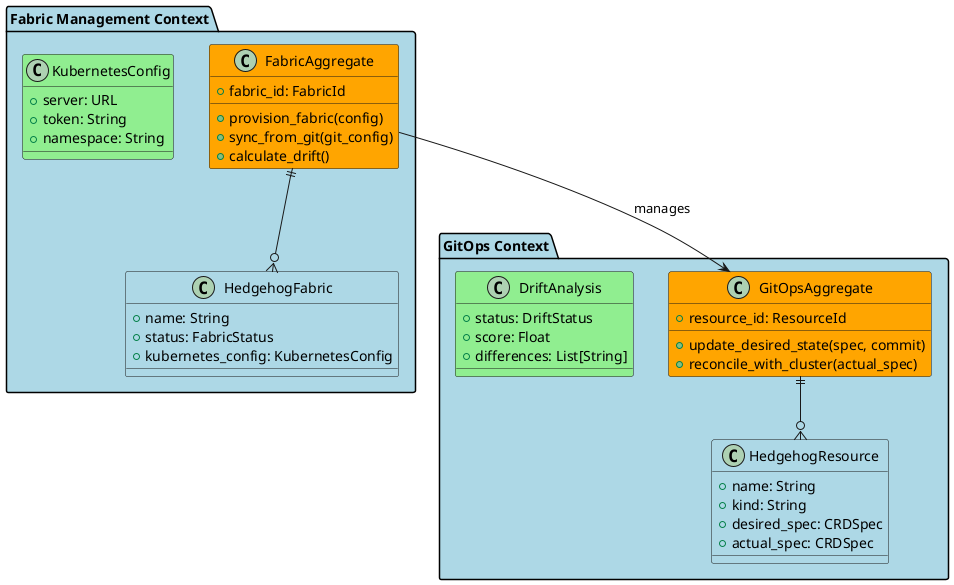
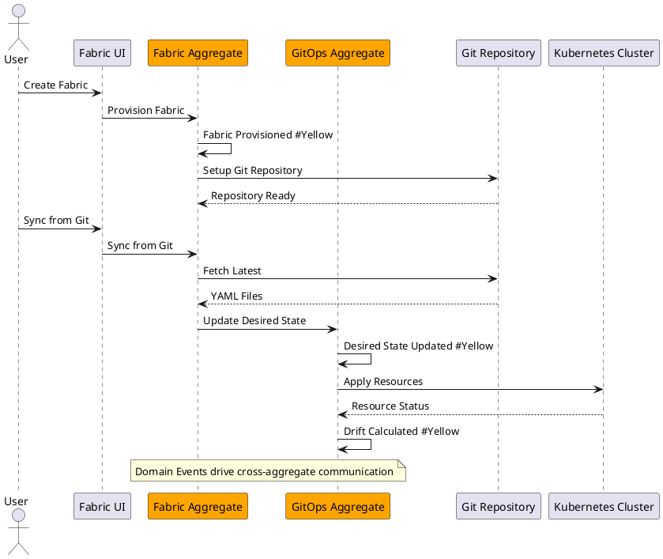
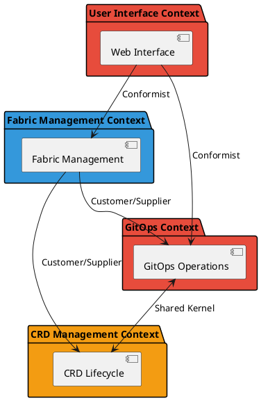

# Model-Driven Development (MDD) and Domain-Driven Design (DDD) Research Analysis for HNP Modernization

## Executive Summary

This comprehensive research analyzes Model-Driven Development (MDD) and Domain-Driven Design (DDD) patterns specifically for cloud-native applications, with concrete implementation strategies for the Hedgehog NetBox Plugin (HNP) modernization project. The analysis combines current industry best practices with practical architectural recommendations for implementing MDD/DDD patterns in a cloud-native Kubernetes environment.

## Table of Contents

1. [MDD Patterns for Kubernetes Applications](#1-mdd-patterns-for-kubernetes-applications)
2. [DDD Patterns for Microservices](#2-ddd-patterns-for-microservices)
3. [Integration of MDD with DDD](#3-integration-of-mdd-with-ddd)
4. [Tools and Frameworks Analysis](#4-tools-and-frameworks-analysis)
5. [Current HNP Architecture Analysis](#5-current-hnp-architecture-analysis)
6. [Concrete Implementation Strategy for HNP](#6-concrete-implementation-strategy-for-hnp)
7. [Migration Roadmap](#7-migration-roadmap)
8. [Risk Assessment and Mitigation](#8-risk-assessment-and-mitigation)

---

## 1. MDD Patterns for Kubernetes Applications

### 1.1 Platform-Independent Models (PIM) for Cloud Native

**Core Concept**: Abstract models that define system behavior without platform-specific implementation details.

#### 1.1.1 Business Model Layer
```yaml
# Example: HNP Business Model (PIM)
FabricManagement:
  entities:
    - Fabric:
        attributes: [name, description, status]
        behaviors: [provision, configure, monitor, synchronize]
    - CRD:
        attributes: [kind, name, namespace, spec]
        behaviors: [create, update, delete, validate]
  
  workflows:
    - GitOps:
        steps: [commit, reconcile, deploy, monitor]
        constraints: [consistency, rollback_capability]
```

#### 1.1.2 Domain Model Representation
- **Abstraction Level**: Business processes and rules
- **Technology Independence**: No Kubernetes, Django, or database specifics
- **Reusability**: Applicable across different implementation platforms

### 1.2 Platform-Specific Models (PSM) for Kubernetes

**Implementation**: Transform PIM into Kubernetes-specific models.

#### 1.2.1 Kubernetes Resource Models
```yaml
# PSM: Kubernetes CRD Definition
apiVersion: apiextensions.k8s.io/v1
kind: CustomResourceDefinition
metadata:
  name: hedgehogfabrics.fabric.hedgehog.com
spec:
  group: fabric.hedgehog.com
  versions:
  - name: v1
    schema:
      openAPIV3Schema:
        type: object
        properties:
          spec:
            type: object
            properties:
              kubernetes:
                $ref: "#/components/schemas/KubernetesConfig"
              gitops:
                $ref: "#/components/schemas/GitOpsConfig"
```

#### 1.2.2 Django Model Mappings
```python
# PSM: Django ORM Implementation
@dataclass
class FabricPSM:
    """Platform-Specific Model for Django/NetBox"""
    
    # Generated from PIM
    base_model: BaseCRD
    kubernetes_config: KubernetesConfig
    gitops_integration: GitOpsConfig
    
    def to_django_model(self) -> HedgehogFabric:
        """Transform PSM to Django model"""
        return HedgehogFabric(
            name=self.base_model.name,
            kubernetes_server=self.kubernetes_config.server,
            git_repository_url=self.gitops_integration.repository_url
        )
```

### 1.3 Model Transformation Strategies

#### 1.3.1 Automated Code Generation
```python
# Model Transformer Interface
class ModelTransformer(ABC):
    @abstractmethod
    def transform_pim_to_psm(self, pim: PlatformIndependentModel) -> PlatformSpecificModel:
        """Transform PIM to target platform PSM"""
        pass
    
    @abstractmethod
    def generate_code(self, psm: PlatformSpecificModel) -> CodeArtifact:
        """Generate executable code from PSM"""
        pass

# Kubernetes PSM Generator
class KubernetesPSMGenerator(ModelTransformer):
    def transform_pim_to_psm(self, pim: FabricPIM) -> KubernetesPSM:
        return KubernetesPSM(
            api_version=pim.api_version,
            kind=pim.kind,
            spec=self._transform_spec(pim.business_spec),
            kubernetes_metadata=self._generate_k8s_metadata(pim)
        )
```

#### 1.3.2 Model Validation Techniques
```python
# Validation Framework
class ModelValidator:
    def validate_pim_consistency(self, pim: PlatformIndependentModel) -> ValidationResult:
        """Validate PIM for internal consistency"""
        return ValidationResult(
            valid=self._check_business_rules(pim),
            errors=self._collect_validation_errors(pim)
        )
    
    def validate_psm_compliance(self, psm: PlatformSpecificModel) -> ValidationResult:
        """Validate PSM for platform compliance"""
        return ValidationResult(
            valid=self._check_platform_constraints(psm),
            errors=self._collect_compliance_errors(psm)
        )
```

---

## 2. DDD Patterns for Microservices

### 2.1 Bounded Context Identification

#### 2.1.1 HNP Domain Analysis
Based on current HNP architecture analysis:

**Fabric Management Context**
```python
# Bounded Context: Fabric Management
class FabricManagementContext:
    """
    Responsible for:
    - Fabric lifecycle management
    - Kubernetes cluster integration
    - Connection status monitoring
    """
    
    # Domain Entities
    entities = [HedgehogFabric, ConnectionStatus, SyncConfiguration]
    
    # Value Objects
    value_objects = [KubernetesConfig, GitOpsConfig, FabricStats]
    
    # Aggregates
    aggregates = [FabricAggregate]
    
    # Domain Services
    services = [FabricProvisioningService, HealthMonitoringService]
```

**GitOps Context**
```python
# Bounded Context: GitOps Operations
class GitOpsContext:
    """
    Responsible for:
    - Git repository synchronization
    - Drift detection and remediation
    - State reconciliation
    """
    
    entities = [HedgehogResource, StateTransitionHistory]
    value_objects = [DriftAnalysis, GitReference, SyncResult]
    aggregates = [GitOpsAggregate]
    services = [GitSyncService, DriftDetectionService]
```

**CRD Management Context**
```python
# Bounded Context: CRD Lifecycle
class CRDManagementContext:
    """
    Responsible for:
    - CRD creation and modification
    - Kubernetes resource lifecycle
    - Specification validation
    """
    
    entities = [VPC, Connection, Server, Switch]  # All CRD types
    value_objects = [CRDSpec, KubernetesStatus, ValidationResult]
    aggregates = [CRDAggregate]
    services = [CRDValidationService, KubernetesDeploymentService]
```

### 2.2 Aggregate Design Patterns

#### 2.2.1 Fabric Aggregate
```python
# Aggregate Root: Fabric
class FabricAggregate:
    """
    Aggregate root for fabric management operations.
    Ensures consistency across fabric-related entities.
    """
    
    def __init__(self, fabric_id: FabricId):
        self._fabric_id = fabric_id
        self._fabric: HedgehogFabric = None
        self._resources: List[HedgehogResource] = []
        self._sync_status: SyncStatus = None
        self._domain_events: List[DomainEvent] = []
    
    def provision_fabric(self, config: FabricConfiguration) -> None:
        """Business logic for fabric provisioning"""
        if self._fabric is not None:
            raise DomainException("Fabric already provisioned")
        
        self._fabric = HedgehogFabric.create(config)
        self._add_domain_event(FabricProvisionedEvent(self._fabric_id))
    
    def sync_from_git(self, git_config: GitConfiguration) -> SyncResult:
        """Business logic for Git synchronization"""
        if not self._fabric.can_sync():
            raise DomainException("Fabric not ready for synchronization")
        
        sync_result = self._perform_git_sync(git_config)
        
        if sync_result.success:
            self._add_domain_event(FabricSyncedEvent(self._fabric_id, sync_result))
        else:
            self._add_domain_event(FabricSyncFailedEvent(self._fabric_id, sync_result.errors))
        
        return sync_result
    
    def calculate_drift(self) -> DriftAnalysis:
        """Business logic for drift calculation"""
        drift_analyzer = DriftAnalysisService()
        analysis = drift_analyzer.analyze_fabric_drift(self._fabric, self._resources)
        
        if analysis.has_drift:
            self._add_domain_event(DriftDetectedEvent(self._fabric_id, analysis))
        
        return analysis
```

#### 2.2.2 GitOps Aggregate
```python
# Aggregate: GitOps State Management
class GitOpsAggregate:
    """
    Manages GitOps state consistency and transitions.
    Ensures proper state transitions and drift handling.
    """
    
    def __init__(self, resource_id: ResourceId):
        self._resource_id = resource_id
        self._resource: HedgehogResource = None
        self._state_history: List[StateTransition] = []
        self._domain_events: List[DomainEvent] = []
    
    def update_desired_state(self, new_spec: CRDSpec, commit: GitCommit) -> None:
        """Update desired state from Git"""
        if not self._resource.can_update_desired_state():
            raise DomainException("Resource not ready for desired state update")
        
        old_state = self._resource.resource_state
        self._resource.update_desired_state(new_spec, commit)
        
        # Record state transition
        transition = StateTransition(
            from_state=old_state,
            to_state=self._resource.resource_state,
            trigger="git_update",
            context={"commit": commit.sha, "file_path": commit.file_path}
        )
        self._state_history.append(transition)
        self._add_domain_event(DesiredStateUpdatedEvent(self._resource_id, transition))
    
    def reconcile_with_cluster(self, actual_spec: CRDSpec) -> ReconciliationResult:
        """Reconcile with actual cluster state"""
        reconciliation_service = ReconciliationService()
        result = reconciliation_service.reconcile(
            desired=self._resource.desired_spec,
            actual=actual_spec
        )
        
        if result.requires_action:
            self._add_domain_event(ReconciliationRequiredEvent(self._resource_id, result))
        
        return result
```

### 2.3 Domain Events and Event Storming

#### 2.3.1 Core Domain Events
```python
# Domain Events for HNP
class DomainEvent:
    """Base class for all domain events"""
    def __init__(self, aggregate_id: str, occurred_at: datetime = None):
        self.aggregate_id = aggregate_id
        self.occurred_at = occurred_at or timezone.now()
        self.event_id = str(uuid.uuid4())

# Fabric Domain Events
class FabricProvisionedEvent(DomainEvent):
    def __init__(self, fabric_id: str, config: FabricConfiguration):
        super().__init__(fabric_id)
        self.config = config

class FabricSyncedEvent(DomainEvent):
    def __init__(self, fabric_id: str, sync_result: SyncResult):
        super().__init__(fabric_id)
        self.sync_result = sync_result

class DriftDetectedEvent(DomainEvent):
    def __init__(self, fabric_id: str, drift_analysis: DriftAnalysis):
        super().__init__(fabric_id)
        self.drift_analysis = drift_analysis

# GitOps Domain Events
class DesiredStateUpdatedEvent(DomainEvent):
    def __init__(self, resource_id: str, state_transition: StateTransition):
        super().__init__(resource_id)
        self.state_transition = state_transition

class ReconciliationRequiredEvent(DomainEvent):
    def __init__(self, resource_id: str, reconciliation_result: ReconciliationResult):
        super().__init__(resource_id)
        self.reconciliation_result = reconciliation_result
```

#### 2.3.2 Event Storming Workshop Results
Based on domain analysis, key events identified:

**Fabric Management Events**:
- Fabric Created/Updated/Deleted
- Connection Established/Lost
- Sync Started/Completed/Failed
- Health Check Performed

**GitOps Events**:
- Git Repository Changed
- Desired State Updated
- Drift Detected/Resolved
- Reconciliation Triggered

**CRD Lifecycle Events**:
- CRD Created/Modified/Deleted
- Validation Passed/Failed
- Deployment Successful/Failed
- Status Changed

### 2.4 Repository and Factory Patterns

#### 2.4.1 Repository Pattern Implementation
```python
# Repository Interface
class FabricRepository(ABC):
    @abstractmethod
    def find_by_id(self, fabric_id: FabricId) -> Optional[FabricAggregate]:
        pass
    
    @abstractmethod
    def find_by_name(self, name: str) -> Optional[FabricAggregate]:
        pass
    
    @abstractmethod
    def save(self, fabric: FabricAggregate) -> None:
        pass
    
    @abstractmethod
    def delete(self, fabric_id: FabricId) -> None:
        pass

# Django Implementation
class DjangoFabricRepository(FabricRepository):
    def find_by_id(self, fabric_id: FabricId) -> Optional[FabricAggregate]:
        try:
            fabric_model = HedgehogFabric.objects.get(pk=fabric_id.value)
            return self._to_aggregate(fabric_model)
        except HedgehogFabric.DoesNotExist:
            return None
    
    def save(self, fabric: FabricAggregate) -> None:
        fabric_model = self._to_model(fabric)
        fabric_model.save()
        
        # Save domain events
        for event in fabric.get_uncommitted_events():
            self._publish_event(event)
        fabric.mark_events_as_committed()
```

#### 2.4.2 Factory Pattern for Aggregates
```python
# Factory for creating aggregates
class FabricAggregateFactory:
    @staticmethod
    def create_new_fabric(config: FabricConfiguration) -> FabricAggregate:
        """Create new fabric aggregate"""
        fabric_id = FabricId.generate()
        aggregate = FabricAggregate(fabric_id)
        aggregate.provision_fabric(config)
        return aggregate
    
    @staticmethod
    def reconstitute_from_model(fabric_model: HedgehogFabric) -> FabricAggregate:
        """Reconstitute aggregate from Django model"""
        fabric_id = FabricId(fabric_model.pk)
        aggregate = FabricAggregate(fabric_id)
        aggregate._reconstitute_from_model(fabric_model)
        return aggregate
```

### 2.5 Anti-Corruption Layers

#### 2.5.1 Kubernetes API Anti-Corruption Layer
```python
# Anti-corruption layer for Kubernetes API
class KubernetesAntiCorruptionLayer:
    """
    Translates between domain models and Kubernetes API.
    Protects domain from Kubernetes API changes.
    """
    
    def __init__(self, k8s_client: KubernetesClient):
        self._k8s_client = k8s_client
    
    def deploy_crd(self, crd_spec: CRDSpec) -> DeploymentResult:
        """Translate domain CRD to Kubernetes manifest"""
        k8s_manifest = self._translate_to_k8s_manifest(crd_spec)
        
        try:
            result = self._k8s_client.apply_manifest(k8s_manifest)
            return DeploymentResult(
                success=True,
                resource_version=result.metadata.resource_version,
                status=self._translate_k8s_status(result.status)
            )
        except KubernetesException as e:
            return DeploymentResult(
                success=False,
                error=self._translate_k8s_error(e)
            )
    
    def _translate_to_k8s_manifest(self, crd_spec: CRDSpec) -> dict:
        """Translate domain CRD spec to Kubernetes manifest"""
        return {
            'apiVersion': crd_spec.api_version,
            'kind': crd_spec.kind,
            'metadata': {
                'name': crd_spec.name,
                'namespace': crd_spec.namespace,
                'labels': crd_spec.labels
            },
            'spec': crd_spec.specification
        }
    
    def _translate_k8s_status(self, k8s_status: dict) -> CRDStatus:
        """Translate Kubernetes status to domain status"""
        return CRDStatus(
            phase=self._map_k8s_phase(k8s_status.get('phase')),
            conditions=self._map_k8s_conditions(k8s_status.get('conditions', [])),
            ready=k8s_status.get('ready', False)
        )
```

#### 2.5.2 Git Repository Anti-Corruption Layer
```python
# Anti-corruption layer for Git operations
class GitAntiCorruptionLayer:
    """
    Protects domain from Git implementation details.
    Provides stable interface for Git operations.
    """
    
    def __init__(self, git_provider: GitProvider):
        self._git_provider = git_provider
    
    def fetch_desired_state(self, git_config: GitConfiguration) -> GitFetchResult:
        """Fetch desired state from Git repository"""
        try:
            files = self._git_provider.fetch_files(git_config)
            manifests = self._parse_manifests(files)
            
            return GitFetchResult(
                success=True,
                commit_sha=files.commit_sha,
                manifests=[self._translate_to_domain_spec(m) for m in manifests]
            )
        except GitException as e:
            return GitFetchResult(
                success=False,
                error=self._translate_git_error(e)
            )
    
    def _translate_to_domain_spec(self, manifest: dict) -> CRDSpec:
        """Translate Git manifest to domain CRD spec"""
        return CRDSpec(
            kind=manifest['kind'],
            name=manifest['metadata']['name'],
            namespace=manifest['metadata'].get('namespace', 'default'),
            specification=manifest['spec'],
            labels=manifest['metadata'].get('labels', {}),
            annotations=manifest['metadata'].get('annotations', {})
        )
```

---

## 3. Integration of MDD with DDD

### 3.1 Model-Driven Bounded Contexts

#### 3.1.1 Context Map with Model Transformations
```yaml
# Context Map Definition
ContextMap:
  FabricManagement:
    type: BoundedContext
    models:
      pim: FabricManagementPIM
      psm: [DjangoPSM, KubernetesPSM]
    transformations:
      - PIM -> Django PSM (ORM Generation)
      - PIM -> Kubernetes PSM (CRD Generation)
      - PIM -> API PSM (REST Endpoint Generation)
  
  GitOps:
    type: BoundedContext
    models:
      pim: GitOpsWorkflowPIM
      psm: [GitProviderPSM, ArgoCD_PSM]
    transformations:
      - PIM -> Git Provider PSM (Repository Operations)
      - PIM -> ArgoCD PSM (Application Definitions)
  
  CRDManagement:
    type: BoundedContext
    models:
      pim: CRDLifecyclePIM
      psm: [KubernetesCRDPSM, ValidatorPSM]
    transformations:
      - PIM -> Kubernetes CRD PSM (Resource Definitions)
      - PIM -> Validator PSM (Validation Rules)

# Context Relationships
Relationships:
  FabricManagement -> GitOps: Customer/Supplier
  GitOps -> CRDManagement: Conformist
  FabricManagement -> CRDManagement: Shared Kernel
```

#### 3.1.2 Domain Model to Code Generation
```python
# Model-driven code generation for bounded contexts
class BoundedContextGenerator:
    def __init__(self, context_definition: ContextDefinition):
        self._context = context_definition
    
    def generate_django_models(self) -> List[str]:
        """Generate Django models from domain PIM"""
        pim = self._context.platform_independent_model
        generator = DjangoModelGenerator()
        
        models = []
        for entity in pim.entities:
            django_model = generator.generate_model(entity)
            models.append(django_model)
        
        return models
    
    def generate_kubernetes_crds(self) -> List[str]:
        """Generate Kubernetes CRDs from domain PIM"""
        pim = self._context.platform_independent_model
        generator = KubernetesCRDGenerator()
        
        crds = []
        for entity in pim.entities:
            if entity.is_kubernetes_resource:
                k8s_crd = generator.generate_crd(entity)
                crds.append(k8s_crd)
        
        return crds
    
    def generate_api_endpoints(self) -> List[str]:
        """Generate REST API endpoints from domain PIM"""
        pim = self._context.platform_independent_model
        generator = APIEndpointGenerator()
        
        endpoints = []
        for service in pim.services:
            api_endpoints = generator.generate_endpoints(service)
            endpoints.extend(api_endpoints)
        
        return endpoints
```

### 3.2 Event-Driven Model Transformations

#### 3.2.1 Model Change Propagation
```python
# Event-driven model updates
class ModelTransformationEventHandler:
    def __init__(self, transformation_service: ModelTransformationService):
        self._transformation_service = transformation_service
    
    def handle_domain_model_changed(self, event: DomainModelChangedEvent):
        """Handle domain model changes and propagate to PSMs"""
        pim = event.updated_model
        
        # Transform to all target platforms
        for platform in event.target_platforms:
            try:
                psm = self._transformation_service.transform(pim, platform)
                self._apply_psm_changes(psm, platform)
                
                # Publish PSM updated event
                self._publish_event(PSMUpdatedEvent(platform, psm))
                
            except TransformationException as e:
                self._publish_event(TransformationFailedEvent(platform, pim, str(e)))
    
    def handle_business_rule_changed(self, event: BusinessRuleChangedEvent):
        """Handle business rule changes"""
        affected_contexts = self._find_affected_contexts(event.rule)
        
        for context in affected_contexts:
            # Regenerate models for affected contexts
            self._regenerate_context_models(context)
```

#### 3.2.2 Consistency Maintenance
```python
# Model consistency maintenance
class ModelConsistencyService:
    def __init__(self):
        self._consistency_rules = []
    
    def validate_cross_context_consistency(self, contexts: List[BoundedContext]) -> ValidationResult:
        """Validate consistency across bounded contexts"""
        violations = []
        
        for rule in self._consistency_rules:
            result = rule.validate(contexts)
            if not result.valid:
                violations.extend(result.violations)
        
        return ValidationResult(
            valid=len(violations) == 0,
            violations=violations
        )
    
    def maintain_shared_kernel_consistency(self, shared_kernel: SharedKernel) -> None:
        """Maintain consistency in shared kernel"""
        for dependent_context in shared_kernel.dependent_contexts:
            # Verify dependent context is compatible with shared kernel
            compatibility = self._check_compatibility(shared_kernel, dependent_context)
            
            if not compatibility.compatible:
                self._handle_compatibility_violation(compatibility)
```

---

## 4. Tools and Frameworks Analysis

### 4.1 JHipster for Model-Driven Development

#### 4.1.1 Capabilities for HNP
**Strengths**:
- **JDL (JHipster Domain Language)**: Domain modeling with relationships
- **Microservices Generation**: Automatic microservice architecture
- **Cloud-Native Support**: Docker, Kubernetes deployment generation
- **API Gateway Integration**: Built-in API gateway for microservices

**Integration Strategy**:
```yaml
# JDL Definition for HNP Domain
application {
  config {
    baseName hedgehogNetboxPlugin
    applicationType microservice
    packageName com.hedgehog.netbox
    serverPort 8080
    databaseType postgresql
    devDatabaseType postgresql
    prodDatabaseType postgresql
    cacheProvider redis
    messageBroker kafka
    serviceDiscoveryType consul
  }
}

entity HedgehogFabric {
  name String required
  description String
  status FabricStatus
  kubernetesServer String
  gitRepositoryUrl String
  gitBranch String
}

entity HedgehogResource {
  name String required
  namespace String required
  kind String required
  desiredSpec TextBlob
  actualSpec TextBlob
  driftStatus DriftStatus
}

relationship OneToMany {
  HedgehogFabric{resources} to HedgehogResource{fabric}
}

enum FabricStatus {
  PLANNED, ACTIVE, DEPRECATED, ARCHIVED
}

enum DriftStatus {
  IN_SYNC, DRIFT_DETECTED, RECONCILING, ERROR
}

microservice HedgehogFabric, HedgehogResource with fabricService
```

**Limitation**: JHipster generates Spring Boot applications, requiring adaptation for Django/NetBox integration.

#### 4.1.2 Adaptation Strategy
```python
# Adapter for JHipster-generated microservices
class JHipsterNetBoxAdapter:
    """
    Adapts JHipster-generated microservices to NetBox plugin architecture
    """
    
    def __init__(self, jhipster_service_url: str):
        self._service_url = jhipster_service_url
        self._client = HTTPClient(jhipster_service_url)
    
    def sync_fabric_with_microservice(self, fabric: HedgehogFabric) -> SyncResult:
        """Sync NetBox fabric with JHipster microservice"""
        fabric_dto = self._convert_to_dto(fabric)
        
        response = self._client.post('/api/fabrics', fabric_dto)
        
        if response.success:
            # Update NetBox model with microservice response
            self._update_netbox_model(fabric, response.data)
            return SyncResult(success=True)
        else:
            return SyncResult(success=False, error=response.error)
```

### 4.2 Eclipse Modeling Framework (EMF)

#### 4.2.1 Model Definition with Ecore
```xml
<!-- HNP Ecore Model Definition -->
<ecore:EPackage xmi:version="2.0" 
    xmlns:xmi="http://www.omg.org/XMI" 
    xmlns:ecore="http://www.eclipse.org/emf/2002/Ecore"
    name="hedgehog" 
    nsURI="http://hedgehog.githedgehog.com/model" 
    nsPrefix="hedgehog">
  
  <eClassifiers xmi:type="ecore:EClass" name="Fabric">
    <eStructuralFeatures xmi:type="ecore:EAttribute" name="name" eType="ecore:EDataType http://www.eclipse.org/emf/2002/Ecore#//EString"/>
    <eStructuralFeatures xmi:type="ecore:EAttribute" name="status" eType="#//FabricStatus"/>
    <eStructuralFeatures xmi:type="ecore:EReference" name="resources" upperBound="-1" eType="#//CRDResource" containment="true"/>
  </eClassifiers>
  
  <eClassifiers xmi:type="ecore:EClass" name="CRDResource">
    <eStructuralFeatures xmi:type="ecore:EAttribute" name="kind" eType="ecore:EDataType http://www.eclipse.org/emf/2002/Ecore#//EString"/>
    <eStructuralFeatures xmi:type="ecore:EAttribute" name="name" eType="ecore:EDataType http://www.eclipse.org/emf/2002/Ecore#//EString"/>
    <eStructuralFeatures xmi:type="ecore:EAttribute" name="spec" eType="ecore:EDataType http://www.eclipse.org/emf/2002/Ecore#//EString"/>
  </eClassifiers>
  
  <eClassifiers xmi:type="ecore:EEnum" name="FabricStatus">
    <eLiterals name="PLANNED"/>
    <eLiterals name="ACTIVE" value="1"/>
    <eLiterals name="DEPRECATED" value="2"/>
  </eClassifiers>
</ecore:EPackage>
```

#### 4.2.2 Code Generation Templates
```java
// EMF-generated Java interface (can be adapted to Python)
public interface Fabric extends EObject {
    String getName();
    void setName(String value);
    
    FabricStatus getStatus();
    void setStatus(FabricStatus value);
    
    EList<CRDResource> getResources();
}

// Template for Python generation
<%
class ${class.name}:
    """Generated from EMF model"""
    
    def __init__(self):
%>
<%for attribute in class.attributes%>
        self._${attribute.name} = None
<%endfor%>
    
<%for attribute in class.attributes%>
    @property
    def ${attribute.name}(self):
        return self._${attribute.name}
    
    @${attribute.name}.setter
    def ${attribute.name}(self, value):
        self._${attribute.name} = value
<%endfor%>
```

### 4.3 PlantUML and Event Storming Integration

#### 4.3.1 Domain Model Visualization


#### 4.3.2 Event Storming Results Visualization


### 4.4 Context Mapper Integration

#### 4.4.1 Context Map Definition
```contextmapper
ContextMap HedgehogNetBoxPlugin {
  contains FabricManagementContext
  contains GitOpsContext  
  contains CRDManagementContext
  contains UserInterfaceContext
  
  /* Fabric Management is upstream, provides core fabric operations */
  FabricManagementContext [U,OHS,PL] -> [D,CF] GitOpsContext
  FabricManagementContext [U,OHS,PL] -> [D,CF] CRDManagementContext
  
  /* GitOps and CRD Management share kernel for resource definitions */
  GitOpsContext [SK] <-> [SK] CRDManagementContext
  
  /* UI is downstream consumer */
  UserInterfaceContext [D,ACL] -> [U] FabricManagementContext
  UserInterfaceContext [D,ACL] -> [U] GitOpsContext
}

BoundedContext FabricManagementContext {
  Aggregate FabricAggregate {
    Entity HedgehogFabric {
      String name
      FabricStatus status
      - Repository FabricRepository
    }
  }
}

BoundedContext GitOpsContext {
  Aggregate GitOpsAggregate {
    Entity HedgehogResource {
      String name
      String kind
      CRDSpec desiredSpec
      CRDSpec actualSpec
    }
    
    Entity StateTransitionHistory {
      String fromState
      String toState
      String trigger
    }
  }
}
```

#### 4.4.2 Generated PlantUML from Context Mapper


---

## 5. Current HNP Architecture Analysis

### 5.1 Existing Domain Structure Assessment

#### 5.1.1 Current Bounded Contexts (Implicit)
Based on code analysis, HNP currently has these implicit bounded contexts:

**Fabric Management** (`models/fabric.py`):
- ✅ Well-defined aggregate root (`HedgehogFabric`)
- ✅ Comprehensive business logic methods
- ✅ Clear responsibilities (fabric lifecycle, K8s integration)
- ⚠️ Mixed concerns (GitOps logic embedded in fabric model)

**GitOps Operations** (`models/gitops.py`):
- ✅ Sophisticated state management (`HedgehogResource`)
- ✅ Six-state model implementation
- ✅ Drift detection and analysis
- ✅ Clear separation of desired vs actual state

**CRD Management** (`models/vpc_api.py`, `models/wiring_api.py`):
- ✅ Inheritance hierarchy with `BaseCRD`
- ✅ Kubernetes API mapping
- ✅ Validation and transformation logic
- ⚠️ Anemic domain model (mostly data containers)

#### 5.1.2 Domain Services Analysis
**Current Services** (`application/services/`):
- `GitSyncService`: Well-structured with clean interfaces
- `KubernetesWatchService`: Event-driven architecture
- `EventService`: Basic event handling

**Strengths**:
- Clean architecture with domain interfaces
- Separation of concerns between application and domain layers
- Dependency injection patterns

**Opportunities**:
- Limited domain service implementation
- Business logic scattered across models
- Missing aggregate pattern implementation

### 5.2 Model-Driven Opportunities

#### 5.2.1 Current Model Generation
```python
# Existing pattern in HNP
class BaseCRD(NetBoxModel):
    """Abstract base model - good foundation for PIM"""
    
    def to_kubernetes_manifest(self):
        """PSM generation capability exists"""
        return {
            'apiVersion': self.get_api_version(),
            'kind': self.get_kind(),
            'metadata': {...},
            'spec': self.spec
        }
    
    def to_yaml(self):
        """Model transformation to YAML"""
        return yaml.dump(self.to_kubernetes_manifest())
```

**Analysis**: HNP already implements basic model transformation patterns (PIM → Kubernetes PSM).

#### 5.2.2 Enhancement Opportunities
```python
# Enhanced model-driven approach
class ModelDrivenCRD(BaseCRD):
    """Enhanced base class with full MDD support"""
    
    class Meta:
        abstract = True
        # Model metadata for code generation
        generation_templates = ['kubernetes', 'django', 'api']
        validation_rules = ['kubernetes_naming', 'spec_schema']
    
    @classmethod
    def get_pim_definition(cls) -> PlatformIndependentModel:
        """Return PIM definition for this CRD type"""
        return PlatformIndependentModel(
            name=cls.__name__,
            attributes=cls._get_business_attributes(),
            behaviors=cls._get_business_behaviors(),
            constraints=cls._get_business_constraints()
        )
    
    def generate_platform_models(self, platforms: List[str]) -> Dict[str, Any]:
        """Generate PSMs for specified platforms"""
        pim = self.get_pim_definition()
        transformer = ModelTransformer()
        
        return {
            platform: transformer.transform(pim, platform)
            for platform in platforms
        }
```

### 5.3 Clean Architecture Assessment

#### 5.3.1 Current Layer Structure
```
✅ Domain Layer: Well-defined with interfaces
├── domain/interfaces/ (Abstract interfaces)
├── models/ (Domain entities)
└── choices.py (Domain enums)

✅ Application Layer: Service-oriented
├── application/services/ (Application services)
├── application/service_registry.py (DI container)
└── utils/ (Application utilities)

⚠️ Infrastructure Layer: Mixed concerns
├── utils/ (Mixed infrastructure/domain)
├── security/ (Infrastructure services)
└── management/commands/ (Infrastructure)

✅ Interface Layer: Clean separation
├── views/ (Web interface)
├── api/ (REST API)
├── forms/ (Input validation)
└── tables/ (Output formatting)
```

#### 5.3.2 Recommendations for Improvement

**1. Strengthen Domain Layer**:
```python
# Current structure enhancement
netbox_hedgehog/
├── domain/
│   ├── aggregates/
│   │   ├── fabric_aggregate.py
│   │   ├── gitops_aggregate.py
│   │   └── crd_aggregate.py
│   ├── entities/
│   │   ├── fabric.py
│   │   ├── resource.py
│   │   └── state_transition.py
│   ├── value_objects/
│   │   ├── fabric_config.py
│   │   ├── drift_analysis.py
│   │   └── sync_result.py
│   ├── services/
│   │   ├── drift_detection_service.py
│   │   ├── reconciliation_service.py
│   │   └── validation_service.py
│   └── events/
│       ├── fabric_events.py
│       ├── gitops_events.py
│       └── event_handlers.py
```

**2. Model-Driven Code Generation**:
```python
# Model generation framework
netbox_hedgehog/
├── model_driven/
│   ├── generators/
│   │   ├── django_generator.py
│   │   ├── kubernetes_generator.py
│   │   ├── api_generator.py
│   │   └── validation_generator.py
│   ├── transformers/
│   │   ├── pim_to_psm_transformer.py
│   │   ├── model_validator.py
│   │   └── consistency_checker.py
│   └── templates/
│       ├── django_model.j2
│       ├── kubernetes_crd.j2
│       └── api_endpoint.j2
```

---

## 6. Concrete Implementation Strategy for HNP

### 6.1 Phase 1: Domain Model Enhancement (Weeks 1-4)

#### 6.1.1 Aggregate Implementation
```python
# Step 1: Implement FabricAggregate
class FabricAggregate:
    """
    Primary aggregate for fabric management operations.
    Encapsulates business logic and ensures consistency.
    """
    
    def __init__(self, fabric_id: str):
        self._fabric_id = fabric_id
        self._fabric: Optional[HedgehogFabric] = None
        self._resources: List[HedgehogResource] = []
        self._domain_events: List[DomainEvent] = []
        self._version: int = 0
    
    # Business methods
    def create_fabric(self, command: CreateFabricCommand) -> None:
        """Create new fabric with business validation"""
        self._validate_fabric_creation(command)
        
        self._fabric = HedgehogFabric(
            name=command.name,
            description=command.description,
            kubernetes_server=command.kubernetes_server
        )
        
        self._add_domain_event(FabricCreatedEvent(
            fabric_id=self._fabric_id,
            name=command.name,
            created_by=command.user_id
        ))
        
        self._version += 1
    
    def configure_gitops(self, command: ConfigureGitOpsCommand) -> None:
        """Configure GitOps settings with validation"""
        if not self._fabric:
            raise DomainException("Fabric must be created before configuring GitOps")
        
        self._validate_git_configuration(command)
        
        self._fabric.git_repository_url = command.repository_url
        self._fabric.git_branch = command.branch
        self._fabric.git_path = command.path
        
        self._add_domain_event(GitOpsConfiguredEvent(
            fabric_id=self._fabric_id,
            repository_url=command.repository_url
        ))
        
        self._version += 1
    
    def sync_from_git(self, command: SyncFromGitCommand) -> SyncResult:
        """Synchronize fabric state from Git repository"""
        if not self._fabric.has_git_configuration():
            raise DomainException("GitOps not configured for this fabric")
        
        # Use domain service for sync operation
        sync_service = GitSyncDomainService()
        result = sync_service.sync_fabric(self._fabric)
        
        if result.success:
            self._add_domain_event(FabricSyncedEvent(
                fabric_id=self._fabric_id,
                commit_sha=result.commit_sha,
                resources_updated=result.resources_updated
            ))
        else:
            self._add_domain_event(FabricSyncFailedEvent(
                fabric_id=self._fabric_id,
                error=result.error
            ))
        
        self._version += 1
        return result
    
    # Infrastructure methods
    def _validate_fabric_creation(self, command: CreateFabricCommand) -> None:
        """Business validation for fabric creation"""
        if not command.name or len(command.name.strip()) == 0:
            raise DomainException("Fabric name is required")
        
        if not self._is_valid_fabric_name(command.name):
            raise DomainException("Fabric name must be DNS-1123 compliant")
    
    def _validate_git_configuration(self, command: ConfigureGitOpsCommand) -> None:
        """Business validation for Git configuration"""
        if not command.repository_url:
            raise DomainException("Repository URL is required")
        
        if not command.repository_url.startswith(('https://', 'git@')):
            raise DomainException("Repository URL must be HTTPS or SSH")
    
    def _add_domain_event(self, event: DomainEvent) -> None:
        """Add domain event to uncommitted events list"""
        self._domain_events.append(event)
    
    def get_uncommitted_events(self) -> List[DomainEvent]:
        """Get list of uncommitted domain events"""
        return self._domain_events.copy()
    
    def mark_events_as_committed(self) -> None:
        """Mark all domain events as committed"""
        self._domain_events.clear()
```

#### 6.1.2 Domain Services Implementation
```python
# Step 2: Implement Domain Services
class GitSyncDomainService:
    """
    Domain service for Git synchronization operations.
    Contains complex business logic that doesn't belong in aggregates.
    """
    
    def __init__(self, git_repository: GitRepositoryInterface):
        self._git_repository = git_repository
    
    def sync_fabric(self, fabric: HedgehogFabric) -> SyncResult:
        """Synchronize fabric CRDs from Git repository"""
        try:
            # Fetch latest changes from Git
            git_changes = self._git_repository.fetch_changes(
                repository_url=fabric.git_repository_url,
                branch=fabric.git_branch,
                path=fabric.git_path
            )
            
            # Parse YAML manifests
            manifests = self._parse_manifests(git_changes.files)
            
            # Validate manifests against business rules
            validation_result = self._validate_manifests(manifests)
            if not validation_result.valid:
                return SyncResult(
                    success=False,
                    error=f"Validation failed: {'; '.join(validation_result.errors)}"
                )
            
            # Create domain entities from manifests
            resources = self._create_resources_from_manifests(fabric, manifests)
            
            return SyncResult(
                success=True,
                commit_sha=git_changes.commit_sha,
                resources_updated=len(resources),
                resources=resources
            )
            
        except GitRepositoryException as e:
            return SyncResult(success=False, error=f"Git error: {str(e)}")
        except Exception as e:
            return SyncResult(success=False, error=f"Sync error: {str(e)}")
    
    def _validate_manifests(self, manifests: List[Dict]) -> ValidationResult:
        """Validate manifests against business rules"""
        validator = ManifestValidator()
        errors = []
        
        for manifest in manifests:
            result = validator.validate(manifest)
            if not result.valid:
                errors.extend(result.errors)
        
        return ValidationResult(valid=len(errors) == 0, errors=errors)

class DriftDetectionDomainService:
    """
    Domain service for detecting configuration drift.
    """
    
    def detect_fabric_drift(self, fabric: HedgehogFabric) -> DriftAnalysis:
        """Detect drift across all resources in fabric"""
        resources = fabric.get_all_resources()
        drift_results = []
        
        for resource in resources:
            resource_drift = self._detect_resource_drift(resource)
            if resource_drift.has_drift:
                drift_results.append(resource_drift)
        
        return DriftAnalysis(
            fabric_id=fabric.id,
            total_resources=len(resources),
            drifted_resources=len(drift_results),
            drift_score=self._calculate_overall_drift_score(drift_results),
            resource_drifts=drift_results
        )
    
    def _detect_resource_drift(self, resource: HedgehogResource) -> ResourceDrift:
        """Detect drift for individual resource"""
        if not resource.has_desired_state or not resource.has_actual_state:
            return ResourceDrift(
                resource_id=resource.id,
                has_drift=True,
                drift_type="missing_state",
                differences=[]
            )
        
        # Compare specifications using domain logic
        differences = self._compare_specifications(
            resource.desired_spec,
            resource.actual_spec
        )
        
        return ResourceDrift(
            resource_id=resource.id,
            has_drift=len(differences) > 0,
            drift_type="spec_difference" if differences else "in_sync",
            differences=differences
        )
```

#### 6.1.3 Value Objects Implementation
```python
# Step 3: Implement Value Objects
@dataclass(frozen=True)
class FabricConfiguration:
    """Value object for fabric configuration"""
    name: str
    description: str
    kubernetes_server: str
    kubernetes_namespace: str = "default"
    
    def __post_init__(self):
        if not self.name:
            raise ValueError("Fabric name is required")
        if not self._is_valid_kubernetes_name(self.name):
            raise ValueError("Fabric name must be valid Kubernetes name")
    
    def _is_valid_kubernetes_name(self, name: str) -> bool:
        """Validate Kubernetes name format"""
        import re
        pattern = r'^[a-z0-9]([-a-z0-9]*[a-z0-9])?$'
        return bool(re.match(pattern, name)) and len(name) <= 253

@dataclass(frozen=True)
class GitConfiguration:
    """Value object for Git configuration"""
    repository_url: str
    branch: str = "main"
    path: str = ""
    username: str = ""
    token: str = ""
    
    def __post_init__(self):
        if not self.repository_url:
            raise ValueError("Repository URL is required")
        if not self.repository_url.startswith(('https://', 'git@')):
            raise ValueError("Repository URL must be HTTPS or SSH")

@dataclass(frozen=True)
class DriftAnalysis:
    """Value object for drift analysis results"""
    fabric_id: str
    total_resources: int
    drifted_resources: int
    drift_score: float  # 0.0 to 1.0
    resource_drifts: List['ResourceDrift']
    analyzed_at: datetime = field(default_factory=datetime.now)
    
    @property
    def has_drift(self) -> bool:
        return self.drifted_resources > 0
    
    @property
    def drift_percentage(self) -> float:
        if self.total_resources == 0:
            return 0.0
        return (self.drifted_resources / self.total_resources) * 100
```

### 6.2 Phase 2: Model-Driven Code Generation (Weeks 5-8)

#### 6.2.1 PIM Definition Framework
```python
# Step 1: Platform-Independent Model Definition
@dataclass
class PlatformIndependentModel:
    """Base class for all Platform-Independent Models"""
    name: str
    description: str
    entities: List['EntityDefinition']
    value_objects: List['ValueObjectDefinition']
    services: List['ServiceDefinition']
    events: List['EventDefinition']
    
    def validate(self) -> ValidationResult:
        """Validate PIM for consistency and completeness"""
        validator = PIMValidator()
        return validator.validate(self)

@dataclass
class EntityDefinition:
    """Definition of domain entity in PIM"""
    name: str
    attributes: List['AttributeDefinition']
    behaviors: List['BehaviorDefinition']
    relationships: List['RelationshipDefinition']
    constraints: List['ConstraintDefinition']
    
    def is_aggregate_root(self) -> bool:
        """Check if entity is aggregate root"""
        return any(constraint.type == 'aggregate_root' for constraint in self.constraints)

# HNP-specific PIM definitions
class HedgehogPIM:
    """Platform-Independent Model for Hedgehog domain"""
    
    @staticmethod
    def get_fabric_management_pim() -> PlatformIndependentModel:
        """Get PIM for Fabric Management bounded context"""
        return PlatformIndependentModel(
            name="FabricManagement",
            description="Manages Hedgehog fabric lifecycle and operations",
            entities=[
                EntityDefinition(
                    name="Fabric",
                    attributes=[
                        AttributeDefinition("name", "String", required=True),
                        AttributeDefinition("description", "String", required=False),
                        AttributeDefinition("status", "FabricStatus", required=True),
                    ],
                    behaviors=[
                        BehaviorDefinition("provision", "Provision new fabric"),
                        BehaviorDefinition("configure_gitops", "Configure GitOps settings"),
                        BehaviorDefinition("sync_from_git", "Sync from Git repository"),
                        BehaviorDefinition("calculate_drift", "Calculate configuration drift"),
                    ],
                    relationships=[
                        RelationshipDefinition("has_many", "CRDResource", "resources")
                    ],
                    constraints=[
                        ConstraintDefinition("aggregate_root", True),
                        ConstraintDefinition("kubernetes_naming", "name"),
                    ]
                )
            ],
            value_objects=[
                ValueObjectDefinition("FabricConfiguration", [
                    AttributeDefinition("kubernetes_server", "URL"),
                    AttributeDefinition("kubernetes_namespace", "String"),
                ]),
                ValueObjectDefinition("GitConfiguration", [
                    AttributeDefinition("repository_url", "URL"),
                    AttributeDefinition("branch", "String"),
                    AttributeDefinition("path", "String"),
                ])
            ],
            services=[
                ServiceDefinition("GitSyncService", [
                    BehaviorDefinition("sync_fabric", "Synchronize fabric from Git")
                ]),
                ServiceDefinition("DriftDetectionService", [
                    BehaviorDefinition("detect_drift", "Detect configuration drift")
                ])
            ],
            events=[
                EventDefinition("FabricCreated", [
                    AttributeDefinition("fabric_id", "String"),
                    AttributeDefinition("name", "String"),
                    AttributeDefinition("created_by", "String"),
                ]),
                EventDefinition("FabricSynced", [
                    AttributeDefinition("fabric_id", "String"),
                    AttributeDefinition("commit_sha", "String"),
                    AttributeDefinition("resources_updated", "Integer"),
                ])
            ]
        )
```

#### 6.2.2 Model Transformers Implementation
```python
# Step 2: Model Transformation Engine
class ModelTransformationEngine:
    """
    Core engine for transforming PIMs to PSMs and generating code.
    """
    
    def __init__(self):
        self._transformers = {
            'django': DjangoPSMTransformer(),
            'kubernetes': KubernetesPSMTransformer(),
            'api': APIPSMTransformer(),
            'validation': ValidationPSMTransformer(),
        }
    
    def transform_pim_to_psm(self, pim: PlatformIndependentModel, 
                           target_platform: str) -> PlatformSpecificModel:
        """Transform PIM to PSM for target platform"""
        if target_platform not in self._transformers:
            raise TransformationException(f"Unsupported platform: {target_platform}")
        
        transformer = self._transformers[target_platform]
        return transformer.transform(pim)
    
    def generate_code(self, psm: PlatformSpecificModel) -> CodeArtifact:
        """Generate executable code from PSM"""
        generator = self._get_code_generator(psm.platform)
        return generator.generate(psm)

class DjangoPSMTransformer:
    """Transform PIM to Django Platform-Specific Model"""
    
    def transform(self, pim: PlatformIndependentModel) -> DjangoPSM:
        """Transform PIM to Django PSM"""
        django_models = []
        
        for entity in pim.entities:
            django_model = self._transform_entity_to_django_model(entity)
            django_models.append(django_model)
        
        return DjangoPSM(
            platform="django",
            models=django_models,
            forms=self._generate_django_forms(pim.entities),
            admin=self._generate_django_admin(pim.entities),
            views=self._generate_django_views(pim.entities),
        )
    
    def _transform_entity_to_django_model(self, entity: EntityDefinition) -> DjangoModelDefinition:
        """Transform domain entity to Django model definition"""
        django_fields = []
        
        for attribute in entity.attributes:
            field_type = self._map_attribute_to_django_field(attribute)
            django_field = DjangoFieldDefinition(
                name=attribute.name,
                field_type=field_type,
                required=attribute.required,
                constraints=self._map_constraints(attribute.constraints)
            )
            django_fields.append(django_field)
        
        # Add Django-specific fields
        if entity.is_aggregate_root():
            django_fields.extend([
                DjangoFieldDefinition("created", "DateTimeField", auto_now_add=True),
                DjangoFieldDefinition("modified", "DateTimeField", auto_now=True),
            ])
        
        return DjangoModelDefinition(
            name=entity.name,
            fields=django_fields,
            meta_options=self._generate_meta_options(entity),
            methods=self._generate_django_methods(entity.behaviors)
        )

class KubernetesPSMTransformer:
    """Transform PIM to Kubernetes Platform-Specific Model"""
    
    def transform(self, pim: PlatformIndependentModel) -> KubernetesPSM:
        """Transform PIM to Kubernetes PSM"""
        k8s_resources = []
        
        for entity in pim.entities:
            if self._should_generate_crd(entity):
                crd = self._transform_entity_to_crd(entity)
                k8s_resources.append(crd)
        
        return KubernetesPSM(
            platform="kubernetes",
            api_version="v1",
            resources=k8s_resources,
            rbac=self._generate_rbac_rules(pim),
            deployments=self._generate_deployments(pim)
        )
    
    def _transform_entity_to_crd(self, entity: EntityDefinition) -> KubernetesCRDDefinition:
        """Transform entity to Kubernetes CRD"""
        spec_schema = self._build_openapi_schema(entity.attributes)
        
        return KubernetesCRDDefinition(
            api_version="apiextensions.k8s.io/v1",
            kind="CustomResourceDefinition",
            metadata={
                "name": f"{entity.name.lower()}s.hedgehog.githedgehog.com"
            },
            spec={
                "group": "hedgehog.githedgehog.com",
                "versions": [{
                    "name": "v1",
                    "served": True,
                    "storage": True,
                    "schema": {
                        "openAPIV3Schema": spec_schema
                    }
                }],
                "scope": "Namespaced",
                "names": {
                    "plural": f"{entity.name.lower()}s",
                    "singular": entity.name.lower(),
                    "kind": entity.name
                }
            }
        )
```

#### 6.2.3 Code Generation Templates
```python
# Step 3: Template-Based Code Generation
class CodeGenerator:
    """Base class for all code generators"""
    
    def __init__(self, template_engine: TemplateEngine):
        self._template_engine = template_engine
    
    def generate(self, psm: PlatformSpecificModel) -> CodeArtifact:
        """Generate code artifact from PSM"""
        raise NotImplementedError

class DjangoCodeGenerator(CodeGenerator):
    """Generate Django code from Django PSM"""
    
    def generate(self, psm: DjangoPSM) -> CodeArtifact:
        """Generate Django code files"""
        generated_files = []
        
        # Generate models.py
        models_content = self._template_engine.render(
            'django_models.j2',
            {
                'models': psm.models,
                'imports': self._get_django_imports(psm.models)
            }
        )
        generated_files.append(CodeFile('models.py', models_content))
        
        # Generate forms.py
        forms_content = self._template_engine.render(
            'django_forms.j2',
            {'forms': psm.forms}
        )
        generated_files.append(CodeFile('forms.py', forms_content))
        
        # Generate admin.py
        admin_content = self._template_engine.render(
            'django_admin.j2',
            {'admin_classes': psm.admin}
        )
        generated_files.append(CodeFile('admin.py', admin_content))
        
        return CodeArtifact(
            platform='django',
            files=generated_files,
            metadata={
                'generated_at': datetime.now(),
                'source_pim': psm.source_pim_name
            }
        )

# Jinja2 Templates
DJANGO_MODELS_TEMPLATE = """
# Generated Django models from PIM
# DO NOT EDIT - This file is automatically generated

from django.db import models
from netbox.models import NetBoxModel

{{ import }}



class {{ model.name }}(NetBoxModelmodels.Model):
    \"\"\"
    {{ model.description }}
    Generated from: {{ model.source_entity }}
    \"\"\"
    
    
    {{ field.name }} = models.{{ field.field_type }}(
        
        {{ constraint.name }}={{ constraint.value }},
        
        help_text="{{ field.help_text }}"
    )
    
    
    class Meta:
        
        {{ option.name }} = {{ option.value }}
        
    
    def __str__(self):
        return {{ model.string_representation }}f"{self.name}"
    
    
    def {{ method.name }}(self, {{ param.name }}: {{ param.type }}) -> {{ method.return_type }}:
        \"\"\"{{ method.description }}\"\"\"
        {{ method.implementation }}
    


"""

KUBERNETES_CRD_TEMPLATE = """
# Generated Kubernetes CRDs from PIM
# DO NOT EDIT - This file is automatically generated


---
apiVersion: {{ resource.api_version }}
kind: {{ resource.kind }}
metadata:
  name: {{ resource.metadata.name }}
  
  namespace: {{ resource.metadata.namespace }}
  
  labels:
    generated-by: hedgehog-mdd
    source-pim: {{ resource.source_pim }}
spec:
  {{ resource.spec | to_yaml | indent(2) }}

"""
```

### 6.3 Phase 3: Integration Framework (Weeks 9-12)

#### 6.3.1 Event-Driven Model Synchronization
```python
# Step 1: Event-Driven Architecture for Model Updates
class ModelSynchronizationService:
    """
    Service for synchronizing models across different representations.
    Handles PIM changes and propagates to all PSMs.
    """
    
    def __init__(self, event_bus: EventBus, transformation_engine: ModelTransformationEngine):
        self._event_bus = event_bus
        self._transformation_engine = transformation_engine
        self._register_event_handlers()
    
    def _register_event_handlers(self):
        """Register event handlers for model synchronization"""
        self._event_bus.subscribe(PIMUpdatedEvent, self._handle_pim_updated)
        self._event_bus.subscribe(PSMValidationFailedEvent, self._handle_psm_validation_failed)
        self._event_bus.subscribe(CodeGenerationRequestedEvent, self._handle_code_generation_requested)
    
    async def _handle_pim_updated(self, event: PIMUpdatedEvent):
        """Handle PIM update and regenerate PSMs"""
        try:
            pim = event.updated_pim
            
            # Validate PIM
            validation_result = pim.validate()
            if not validation_result.valid:
                await self._event_bus.publish(PIMValidationFailedEvent(
                    pim_name=pim.name,
                    errors=validation_result.errors
                ))
                return
            
            # Transform to all target platforms
            target_platforms = event.target_platforms or ['django', 'kubernetes', 'api']
            
            for platform in target_platforms:
                try:
                    psm = self._transformation_engine.transform_pim_to_psm(pim, platform)
                    
                    # Validate PSM
                    psm_validation = psm.validate()
                    if psm_validation.valid:
                        # Generate and deploy code
                        code_artifact = self._transformation_engine.generate_code(psm)
                        await self._deploy_code_artifact(code_artifact)
                        
                        await self._event_bus.publish(PSMUpdatedEvent(
                            platform=platform,
                            psm=psm,
                            code_artifact=code_artifact
                        ))
                    else:
                        await self._event_bus.publish(PSMValidationFailedEvent(
                            platform=platform,
                            pim_name=pim.name,
                            errors=psm_validation.errors
                        ))
                
                except TransformationException as e:
                    await self._event_bus.publish(TransformationFailedEvent(
                        platform=platform,
                        pim_name=pim.name,
                        error=str(e)
                    ))
        
        except Exception as e:
            logger.error(f"Failed to handle PIM update: {e}")
            await self._event_bus.publish(ModelSynchronizationFailedEvent(
                pim_name=event.updated_pim.name,
                error=str(e)
            ))
    
    async def _deploy_code_artifact(self, artifact: CodeArtifact):
        """Deploy generated code artifact"""
        if artifact.platform == 'django':
            await self._deploy_django_artifact(artifact)
        elif artifact.platform == 'kubernetes':
            await self._deploy_kubernetes_artifact(artifact)
        elif artifact.platform == 'api':
            await self._deploy_api_artifact(artifact)
    
    async def _deploy_django_artifact(self, artifact: CodeArtifact):
        """Deploy Django code artifact"""
        # Write models to filesystem
        for file in artifact.files:
            file_path = os.path.join(settings.BASE_DIR, 'netbox_hedgehog', 'models', file.name)
            with open(file_path, 'w') as f:
                f.write(file.content)
        
        # Run Django migrations if needed
        if any(file.name.endswith('models.py') for file in artifact.files):
            await self._run_django_migrations()
    
    async def _deploy_kubernetes_artifact(self, artifact: CodeArtifact):
        """Deploy Kubernetes CRDs"""
        k8s_client = KubernetesClient()
        
        for file in artifact.files:
            if file.name.endswith('.yaml'):
                resources = yaml.safe_load_all(file.content)
                for resource in resources:
                    await k8s_client.apply_resource(resource)
```

#### 6.3.2 Cross-Context Communication
```python
# Step 2: Context Integration Patterns
class BoundedContextIntegrator:
    """
    Manages integration between bounded contexts using various patterns.
    """
    
    def __init__(self, event_bus: EventBus):
        self._event_bus = event_bus
        self._context_registry = {}
        self._integration_patterns = {}
    
    def register_context(self, context_name: str, context: BoundedContext):
        """Register bounded context"""
        self._context_registry[context_name] = context
        
        # Set up integration patterns based on context relationships
        self._setup_integration_patterns(context_name, context)
    
    def _setup_integration_patterns(self, context_name: str, context: BoundedContext):
        """Setup integration patterns for context"""
        for relationship in context.relationships:
            if relationship.pattern == 'customer_supplier':
                self._setup_customer_supplier_pattern(context_name, relationship)
            elif relationship.pattern == 'shared_kernel':
                self._setup_shared_kernel_pattern(context_name, relationship)
            elif relationship.pattern == 'conformist':
                self._setup_conformist_pattern(context_name, relationship)
            elif relationship.pattern == 'anti_corruption_layer':
                self._setup_acl_pattern(context_name, relationship)
    
    def _setup_customer_supplier_pattern(self, supplier_context: str, relationship: Relationship):
        """Setup customer-supplier integration"""
        # Supplier publishes events, customer subscribes
        customer_context = relationship.target_context
        
        # Register event handlers for customer context
        for event_type in relationship.shared_events:
            self._event_bus.subscribe(
                event_type,
                lambda event: self._forward_to_customer_context(customer_context, event)
            )
    
    def _setup_shared_kernel_pattern(self, context_name: str, relationship: Relationship):
        """Setup shared kernel integration"""
        shared_kernel_context = relationship.target_context
        
        # Synchronize shared models between contexts
        self._event_bus.subscribe(
            SharedKernelModelUpdatedEvent,
            lambda event: self._synchronize_shared_kernel(context_name, shared_kernel_context, event)
        )
    
    async def _synchronize_shared_kernel(self, context1: str, context2: str, event: SharedKernelModelUpdatedEvent):
        """Synchronize shared kernel between contexts"""
        # Update shared models in both contexts
        contexts = [self._context_registry[context1], self._context_registry[context2]]
        
        for context in contexts:
            await context.update_shared_model(event.model_name, event.model_definition)

class AntiCorruptionLayerRegistry:
    """
    Registry for anti-corruption layers between contexts.
    """
    
    def __init__(self):
        self._acl_registry = {}
    
    def register_acl(self, source_context: str, target_context: str, acl: AntiCorruptionLayer):
        """Register anti-corruption layer"""
        key = f"{source_context}->{target_context}"
        self._acl_registry[key] = acl
    
    def get_acl(self, source_context: str, target_context: str) -> AntiCorruptionLayer:
        """Get anti-corruption layer for context pair"""
        key = f"{source_context}->{target_context}"
        return self._acl_registry.get(key)
    
    def translate_message(self, source_context: str, target_context: str, message: Any) -> Any:
        """Translate message between contexts using ACL"""
        acl = self.get_acl(source_context, target_context)
        if acl:
            return acl.translate(message)
        return message

# Example ACL implementation
class GitOpsToFabricACL(AntiCorruptionLayer):
    """
    Anti-corruption layer between GitOps and Fabric Management contexts.
    """
    
    def translate_gitops_resource_to_fabric_crd(self, gitops_resource: HedgehogResource) -> BaseCRD:
        """Translate GitOps resource to Fabric CRD"""
        # Map GitOps model to Fabric model
        crd_class = self._get_crd_class(gitops_resource.kind)
        
        return crd_class(
            fabric=gitops_resource.fabric,
            name=gitops_resource.name,
            namespace=gitops_resource.namespace,
            spec=gitops_resource.desired_spec,
            labels=gitops_resource.labels,
            annotations=gitops_resource.annotations
        )
    
    def translate_fabric_event_to_gitops_event(self, fabric_event: FabricEvent) -> GitOpsEvent:
        """Translate Fabric domain event to GitOps domain event"""
        if isinstance(fabric_event, FabricSyncedEvent):
            return DesiredStateUpdatedEvent(
                resource_id=fabric_event.fabric_id,
                commit_sha=fabric_event.commit_sha,
                updated_resources=fabric_event.resources_updated
            )
        
        # Default translation
        return GitOpsEvent(
            source_event=fabric_event,
            translated_at=datetime.now()
        )
```

### 6.4 Phase 4: Testing and Validation Framework (Weeks 13-16)

#### 6.4.1 Model-Driven Testing
```python
# Step 1: Automated Test Generation from Models
class ModelDrivenTestGenerator:
    """
    Generate comprehensive tests from domain models.
    """
    
    def __init__(self, template_engine: TemplateEngine):
        self._template_engine = template_engine
    
    def generate_aggregate_tests(self, aggregate_def: EntityDefinition) -> List[TestCase]:
        """Generate tests for aggregate behaviors"""
        tests = []
        
        for behavior in aggregate_def.behaviors:
            # Generate positive test cases
            positive_test = self._generate_positive_test(aggregate_def, behavior)
            tests.append(positive_test)
            
            # Generate negative test cases based on constraints
            negative_tests = self._generate_negative_tests(aggregate_def, behavior)
            tests.extend(negative_tests)
            
            # Generate edge case tests
            edge_case_tests = self._generate_edge_case_tests(aggregate_def, behavior)
            tests.extend(edge_case_tests)
        
        return tests
    
    def generate_domain_service_tests(self, service_def: ServiceDefinition) -> List[TestCase]:
        """Generate tests for domain services"""
        tests = []
        
        for behavior in service_def.behaviors:
            # Test with mocked dependencies
            mock_test = self._generate_service_mock_test(service_def, behavior)
            tests.append(mock_test)
            
            # Integration test with real dependencies
            integration_test = self._generate_service_integration_test(service_def, behavior)
            tests.append(integration_test)
        
        return tests
    
    def _generate_positive_test(self, aggregate: EntityDefinition, behavior: BehaviorDefinition) -> TestCase:
        """Generate positive test case for aggregate behavior"""
        test_code = self._template_engine.render(
            'aggregate_positive_test.j2',
            {
                'aggregate_name': aggregate.name,
                'behavior_name': behavior.name,
                'test_data': self._generate_test_data(behavior.parameters)
            }
        )
        
        return TestCase(
            name=f"test_{behavior.name}_success",
            code=test_code,
            test_type="positive",
            description=f"Test successful {behavior.name} operation"
        )

# Test Templates
AGGREGATE_POSITIVE_TEST_TEMPLATE = """
# Generated test for {{ aggregate_name }}.{{ behavior_name }}
def test_{{ behavior_name }}_success():
    \"\"\"Test successful {{ behavior_name }} operation\"\"\"
    # Arrange
    aggregate = {{ aggregate_name }}Aggregate({{ aggregate_name.lower() }}_id="test-id")
    
    {{ param.name }} = {{ param.test_value }}
    
    
    # Act
    result = aggregate.{{ behavior_name }}(
        
        {{ param.name }}={{ param.name }},
        
    )
    
    # Assert
    assert result.success
    assert len(aggregate.get_uncommitted_events()) > 0
    assert isinstance(aggregate.get_uncommitted_events()[0], {{ behavior_name.title() }}Event)
"""

DOMAIN_SERVICE_TEST_TEMPLATE = """
# Generated test for {{ service_name }}.{{ behavior_name }}
def test_{{ behavior_name }}_with_mocks():
    \"\"\"Test {{ behavior_name }} with mocked dependencies\"\"\"
    # Arrange
    
    mock_{{ dependency.name }} = Mock(spec={{ dependency.type }})
    
    
    service = {{ service_name }}(
        
        {{ dependency.name }}=mock_{{ dependency.name }},
        
    )
    
    
    {{ param.name }} = {{ param.test_value }}
    
    
    # Act
    result = service.{{ behavior_name }}(
        
        {{ param.name }}={{ param.name }},
        
    )
    
    # Assert
    assert result.success
    
    mock_{{ dependency.name }}.{{ dependency.expected_method }}.assert_called_once()
    
"""
```

#### 6.4.2 End-to-End Validation Framework
```python
# Step 2: End-to-End Model Validation
class ModelValidationFramework:
    """
    Comprehensive validation framework for model consistency.
    """
    
    def __init__(self):
        self._validators = {
            'pim': PIMValidator(),
            'psm': PSMValidator(),
            'cross_context': CrossContextValidator(),
            'implementation': ImplementationValidator()
        }
    
    async def validate_complete_model_stack(self, pim: PlatformIndependentModel) -> ValidationReport:
        """Validate complete model stack from PIM to implementation"""
        report = ValidationReport(pim_name=pim.name)
        
        # 1. Validate PIM
        pim_result = self._validators['pim'].validate(pim)
        report.add_validation_result('pim', pim_result)
        
        if not pim_result.valid:
            return report
        
        # 2. Transform and validate PSMs
        transformation_engine = ModelTransformationEngine()
        platforms = ['django', 'kubernetes', 'api']
        
        for platform in platforms:
            try:
                psm = transformation_engine.transform_pim_to_psm(pim, platform)
                psm_result = self._validators['psm'].validate(psm)
                report.add_validation_result(f'psm_{platform}', psm_result)
                
                if psm_result.valid:
                    # 3. Generate and validate code
                    code_artifact = transformation_engine.generate_code(psm)
                    impl_result = self._validators['implementation'].validate_code_artifact(code_artifact)
                    report.add_validation_result(f'implementation_{platform}', impl_result)
                
            except Exception as e:
                report.add_error(f'transformation_{platform}', str(e))
        
        # 4. Cross-context validation
        cross_context_result = self._validators['cross_context'].validate_pim_consistency([pim])
        report.add_validation_result('cross_context', cross_context_result)
        
        return report
    
    async def validate_runtime_consistency(self, fabric: HedgehogFabric) -> RuntimeValidationReport:
        """Validate runtime consistency between models and actual system state"""
        report = RuntimeValidationReport(fabric_id=fabric.id)
        
        # 1. Validate Django model consistency
        django_result = await self._validate_django_model_consistency(fabric)
        report.add_result('django_consistency', django_result)
        
        # 2. Validate Kubernetes CRD consistency
        k8s_result = await self._validate_kubernetes_consistency(fabric)
        report.add_result('kubernetes_consistency', k8s_result)
        
        # 3. Validate API consistency
        api_result = await self._validate_api_consistency(fabric)
        report.add_result('api_consistency', api_result)
        
        # 4. Validate cross-system consistency
        cross_system_result = await self._validate_cross_system_consistency(fabric)
        report.add_result('cross_system_consistency', cross_system_result)
        
        return report
    
    async def _validate_django_model_consistency(self, fabric: HedgehogFabric) -> ValidationResult:
        """Validate Django model state consistency"""
        try:
            # Check model constraints
            fabric.full_clean()
            
            # Validate relationships
            for resource in fabric.gitops_resources.all():
                resource.full_clean()
            
            # Check business invariants
            invariant_violations = []
            
            # Example: Fabric must have at least one resource if status is ACTIVE
            if fabric.status == FabricStatusChoices.ACTIVE and fabric.crd_count == 0:
                invariant_violations.append("Active fabric must have at least one CRD")
            
            return ValidationResult(
                valid=len(invariant_violations) == 0,
                errors=invariant_violations
            )
            
        except ValidationError as e:
            return ValidationResult(valid=False, errors=[str(e)])
    
    async def _validate_kubernetes_consistency(self, fabric: HedgehogFabric) -> ValidationResult:
        """Validate Kubernetes cluster state consistency"""
        try:
            k8s_client = KubernetesClient(fabric.get_kubernetes_config())
            
            # Fetch actual CRDs from cluster
            actual_crds = await k8s_client.list_hedgehog_crds(fabric.kubernetes_namespace)
            
            # Compare with desired state
            desired_resources = fabric.gitops_resources.filter(desired_spec__isnull=False)
            
            consistency_errors = []
            
            for desired_resource in desired_resources:
                actual_crd = self._find_matching_crd(actual_crds, desired_resource)
                
                if not actual_crd:
                    consistency_errors.append(f"Resource {desired_resource.name} missing in cluster")
                    continue
                
                # Compare specifications
                spec_diff = self._compare_specifications(
                    desired_resource.desired_spec,
                    actual_crd.get('spec', {})
                )
                
                if spec_diff:
                    consistency_errors.append(
                        f"Resource {desired_resource.name} has specification drift: {spec_diff}"
                    )
            
            return ValidationResult(
                valid=len(consistency_errors) == 0,
                errors=consistency_errors
            )
            
        except Exception as e:
            return ValidationResult(valid=False, errors=[f"Kubernetes validation failed: {str(e)}"])
```

---

## 7. Migration Roadmap

### 7.1 Pre-Migration Assessment (Week 0)

#### 7.1.1 Current State Analysis
- **Code Quality Assessment**: Technical debt analysis of existing models
- **Domain Knowledge Extraction**: Interview stakeholders and analyze business requirements
- **Integration Points Mapping**: Identify all external system dependencies
- **Performance Baseline**: Establish current performance metrics

#### 7.1.2 Risk Assessment
```python
# Migration Risk Assessment Framework
class MigrationRiskAssessment:
    def assess_migration_risks(self) -> RiskAssessment:
        risks = []
        
        # Technical risks
        if self._has_complex_legacy_code():
            risks.append(Risk(
                category="technical",
                severity="high",
                description="Complex legacy code may be difficult to model",
                mitigation="Incremental refactoring with extensive testing"
            ))
        
        # Business risks
        if self._has_critical_business_operations():
            risks.append(Risk(
                category="business",
                severity="medium",
                description="Critical operations must remain available during migration",
                mitigation="Blue-green deployment with rollback capability"
            ))
        
        # Integration risks
        if self._has_external_dependencies():
            risks.append(Risk(
                category="integration",
                severity="medium",
                description="External system dependencies may break during migration",
                mitigation="Anti-corruption layers and adapter patterns"
            ))
        
        return RiskAssessment(risks=risks)
```

### 7.2 Phase-by-Phase Migration Plan

#### 7.2.1 Phase 1: Foundation (Weeks 1-4)
**Objectives**:
- Establish domain model foundation
- Implement basic aggregates
- Set up event-driven architecture

**Deliverables**:
- Domain model definitions for core entities
- Basic aggregate implementations
- Event sourcing infrastructure
- Unit tests for domain logic

**Success Criteria**:
- All domain tests passing
- Basic fabric operations working through aggregates
- Event publishing and handling functional

#### 7.2.2 Phase 2: Model-Driven Generation (Weeks 5-8)
**Objectives**:
- Implement PIM framework
- Build model transformation engine
- Create code generation templates

**Deliverables**:
- PIM definitions for all bounded contexts
- Model transformation engine
- Code generation templates for Django, Kubernetes, API
- Generated code validation framework

**Success Criteria**:
- Models can be defined as PIMs
- Code generation produces working Django models
- Kubernetes CRDs generated and deployable
- API endpoints generated and functional

#### 7.2.3 Phase 3: Integration (Weeks 9-12)
**Objectives**:
- Integrate bounded contexts
- Implement anti-corruption layers
- Set up cross-context communication

**Deliverables**:
- Context integration framework
- Anti-corruption layers for external systems
- Event-driven context communication
- Cross-context consistency validation

**Success Criteria**:
- All bounded contexts integrated
- External system integrations protected by ACLs
- Events flowing correctly between contexts
- System consistency maintained

#### 7.2.4 Phase 4: Validation and Optimization (Weeks 13-16)
**Objectives**:
- Comprehensive testing framework
- Performance optimization
- Production readiness validation

**Deliverables**:
- Automated test generation from models
- Performance benchmarks and optimizations
- Production deployment procedures
- Monitoring and alerting setup

**Success Criteria**:
- Test coverage > 90%
- Performance meets or exceeds baseline
- Production deployment successful
- Monitoring confirms system health

### 7.3 Rollback Strategy

#### 7.3.1 Blue-Green Deployment
```python
# Blue-Green Deployment for Model-Driven Migration
class BlueGreenMigration:
    def __init__(self, current_version: str, new_version: str):
        self.current_version = current_version
        self.new_version = new_version
        self.rollback_data = {}
    
    def prepare_green_environment(self):
        """Prepare new environment with model-driven code"""
        # Deploy new model-driven implementation
        self._deploy_new_models()
        self._migrate_data_if_needed()
        self._validate_green_environment()
    
    def switch_traffic(self, percentage: int = 100):
        """Switch traffic to green environment"""
        if percentage == 100:
            # Full cutover
            self._update_load_balancer_to_green()
        else:
            # Canary deployment
            self._split_traffic(percentage)
    
    def rollback_if_needed(self):
        """Rollback to blue environment if issues detected"""
        if self._detect_issues():
            self._switch_back_to_blue()
            self._restore_data_if_needed()
            return True
        return False
```

#### 7.3.2 Data Migration Strategy
```python
# Data Migration with Rollback Capability
class DataMigrationStrategy:
    def migrate_with_rollback(self, migration_plan: MigrationPlan):
        """Execute data migration with rollback capability"""
        
        # 1. Create data backup
        backup_id = self._create_data_backup()
        
        try:
            # 2. Execute migration steps
            for step in migration_plan.steps:
                self._execute_migration_step(step)
                self._validate_migration_step(step)
            
            # 3. Validate complete migration
            validation_result = self._validate_complete_migration()
            
            if not validation_result.valid:
                raise MigrationException(f"Migration validation failed: {validation_result.errors}")
            
            # 4. Mark migration as successful
            self._mark_migration_successful(backup_id)
            
        except Exception as e:
            # 5. Rollback on any failure
            logger.error(f"Migration failed: {e}")
            self._rollback_migration(backup_id)
            raise
    
    def _rollback_migration(self, backup_id: str):
        """Rollback migration to previous state"""
        logger.info(f"Rolling back migration using backup {backup_id}")
        
        # Restore database state
        self._restore_database_backup(backup_id)
        
        # Restore filesystem state
        self._restore_file_backup(backup_id)
        
        # Reset application state
        self._reset_application_state()
        
        logger.info("Migration rollback completed successfully")
```

---

## 8. Risk Assessment and Mitigation

### 8.1 Technical Risks

#### 8.1.1 Model Complexity Risk
**Risk**: Domain models become too complex to maintain
**Probability**: Medium
**Impact**: High

**Mitigation Strategies**:
1. **Incremental Modeling**: Start with simple models and evolve gradually
2. **Model Validation**: Automated validation of model consistency
3. **Documentation**: Comprehensive documentation of model decisions
4. **Training**: Team training on DDD and MDD principles

```python
# Model Complexity Monitoring
class ModelComplexityMonitor:
    def analyze_model_complexity(self, pim: PlatformIndependentModel) -> ComplexityAnalysis:
        """Analyze model complexity and suggest improvements"""
        metrics = {
            'entity_count': len(pim.entities),
            'relationship_count': sum(len(e.relationships) for e in pim.entities),
            'behavior_count': sum(len(e.behaviors) for e in pim.entities),
            'constraint_count': sum(len(e.constraints) for e in pim.entities)
        }
        
        complexity_score = self._calculate_complexity_score(metrics)
        
        recommendations = []
        if complexity_score > 100:
            recommendations.append("Consider splitting into multiple bounded contexts")
        if metrics['relationship_count'] > 20:
            recommendations.append("Review relationship complexity - consider value objects")
        
        return ComplexityAnalysis(
            score=complexity_score,
            metrics=metrics,
            recommendations=recommendations
        )
```

#### 8.1.2 Code Generation Quality Risk
**Risk**: Generated code is not production-quality
**Probability**: Medium
**Impact**: High

**Mitigation Strategies**:
1. **Template Quality**: High-quality, well-tested templates
2. **Code Review**: Generated code goes through review process
3. **Testing**: Comprehensive testing of generated code
4. **Escape Hatches**: Manual overrides for special cases

```python
# Code Quality Validation
class GeneratedCodeValidator:
    def validate_generated_code(self, code_artifact: CodeArtifact) -> CodeQualityReport:
        """Validate quality of generated code"""
        report = CodeQualityReport()
        
        for file in code_artifact.files:
            # Static analysis
            static_analysis = self._run_static_analysis(file.content)
            report.add_static_analysis(file.name, static_analysis)
            
            # Security analysis
            security_analysis = self._run_security_analysis(file.content)
            report.add_security_analysis(file.name, security_analysis)
            
            # Performance analysis
            performance_analysis = self._run_performance_analysis(file.content)
            report.add_performance_analysis(file.name, performance_analysis)
        
        return report
```

### 8.2 Business Risks

#### 8.2.1 Disruption to Operations Risk
**Risk**: Migration disrupts critical business operations
**Probability**: Low
**Impact**: Very High

**Mitigation Strategies**:
1. **Incremental Migration**: Migrate one bounded context at a time
2. **Feature Flags**: Use feature flags to control migration rollout
3. **Monitoring**: Comprehensive monitoring during migration
4. **Rollback Plan**: Tested rollback procedures

```python
# Business Continuity Monitoring
class BusinessContinuityMonitor:
    def monitor_business_operations(self) -> OperationalHealth:
        """Monitor critical business operations during migration"""
        health_checks = {
            'fabric_creation': self._check_fabric_creation_rate(),
            'sync_operations': self._check_sync_success_rate(),
            'api_availability': self._check_api_response_times(),
            'error_rates': self._check_error_rates()
        }
        
        overall_health = self._calculate_overall_health(health_checks)
        
        if overall_health < 0.95:  # Below 95% health
            self._trigger_rollback_evaluation()
        
        return OperationalHealth(
            overall_health=overall_health,
            individual_checks=health_checks,
            timestamp=datetime.now()
        )
```

#### 8.2.2 Learning Curve Risk
**Risk**: Team struggles with new MDD/DDD concepts
**Probability**: High
**Impact**: Medium

**Mitigation Strategies**:
1. **Training Program**: Comprehensive DDD/MDD training
2. **Pair Programming**: Experienced developers paired with less experienced
3. **Documentation**: Extensive documentation and examples
4. **Gradual Introduction**: Introduce concepts gradually

### 8.3 Integration Risks

#### 8.3.1 External System Compatibility Risk
**Risk**: Changes break integration with external systems
**Probability**: Medium
**Impact**: High

**Mitigation Strategies**:
1. **Anti-Corruption Layers**: Protect from external system changes
2. **Contract Testing**: Test integration contracts
3. **Versioning**: API versioning for backward compatibility
4. **Monitoring**: Monitor external system integrations

```python
# Integration Health Monitoring
class IntegrationHealthMonitor:
    def monitor_external_integrations(self) -> IntegrationHealth:
        """Monitor health of external system integrations"""
        integrations = {
            'kubernetes_api': self._check_kubernetes_connectivity(),
            'git_repositories': self._check_git_repository_access(),
            'argocd_integration': self._check_argocd_status(),
            'netbox_core': self._check_netbox_core_integration()
        }
        
        failed_integrations = [
            name for name, status in integrations.items() 
            if not status.healthy
        ]
        
        if failed_integrations:
            self._alert_integration_failures(failed_integrations)
        
        return IntegrationHealth(
            integrations=integrations,
            overall_healthy=len(failed_integrations) == 0,
            timestamp=datetime.now()
        )
```

### 8.4 Risk Mitigation Implementation

#### 8.4.1 Monitoring and Alerting
```python
# Comprehensive Monitoring Framework
class MigrationMonitoringFramework:
    def __init__(self):
        self.monitors = [
            ModelComplexityMonitor(),
            BusinessContinuityMonitor(),
            IntegrationHealthMonitor(),
            PerformanceMonitor(),
            SecurityMonitor()
        ]
    
    async def continuous_monitoring(self):
        """Continuous monitoring during migration"""
        while True:
            try:
                for monitor in self.monitors:
                    result = await monitor.check_health()
                    
                    if not result.healthy:
                        await self._handle_health_issue(monitor, result)
                
                await asyncio.sleep(60)  # Check every minute
                
            except Exception as e:
                logger.error(f"Monitoring error: {e}")
                await self._alert_monitoring_failure(e)
    
    async def _handle_health_issue(self, monitor: Monitor, result: HealthResult):
        """Handle health issues detected by monitors"""
        if result.severity == 'critical':
            await self._trigger_emergency_rollback()
        elif result.severity == 'high':
            await self._alert_operations_team(monitor, result)
        else:
            await self._log_health_issue(monitor, result)
```

#### 8.4.2 Automated Recovery
```python
# Automated Recovery System
class AutomatedRecoverySystem:
    def __init__(self):
        self.recovery_strategies = {
            'database_corruption': self._recover_from_database_corruption,
            'kubernetes_connectivity': self._recover_kubernetes_connectivity,
            'code_generation_failure': self._recover_from_generation_failure,
            'model_consistency_violation': self._recover_model_consistency
        }
    
    async def handle_failure(self, failure_type: str, context: Dict[str, Any]):
        """Handle specific failure types with automated recovery"""
        if failure_type in self.recovery_strategies:
            recovery_function = self.recovery_strategies[failure_type]
            
            try:
                recovery_result = await recovery_function(context)
                
                if recovery_result.success:
                    logger.info(f"Successfully recovered from {failure_type}")
                    await self._notify_recovery_success(failure_type, recovery_result)
                else:
                    logger.error(f"Failed to recover from {failure_type}: {recovery_result.error}")
                    await self._escalate_to_manual_intervention(failure_type, context)
                    
            except Exception as e:
                logger.error(f"Recovery attempt failed: {e}")
                await self._escalate_to_manual_intervention(failure_type, context)
        else:
            await self._escalate_to_manual_intervention(failure_type, context)
    
    async def _recover_from_database_corruption(self, context: Dict[str, Any]) -> RecoveryResult:
        """Recover from database corruption"""
        # 1. Stop all write operations
        await self._stop_write_operations()
        
        # 2. Restore from latest backup
        backup_id = await self._find_latest_valid_backup()
        restore_result = await self._restore_database_backup(backup_id)
        
        if not restore_result.success:
            return RecoveryResult(success=False, error="Database restore failed")
        
        # 3. Replay events since backup
        replay_result = await self._replay_events_since_backup(backup_id)
        
        if not replay_result.success:
            return RecoveryResult(success=False, error="Event replay failed")
        
        # 4. Resume operations
        await self._resume_operations()
        
        return RecoveryResult(success=True, message="Database recovery completed")
```

---

## Conclusion

This comprehensive analysis provides a detailed roadmap for implementing Model-Driven Development (MDD) and Domain-Driven Design (DDD) patterns in the Hedgehog NetBox Plugin modernization project. The strategy combines industry best practices with practical, concrete implementation steps tailored specifically for HNP's cloud-native Kubernetes environment.

### Key Outcomes Expected

1. **Improved Maintainability**: Clean domain models with clear separation of concerns
2. **Enhanced Scalability**: Model-driven code generation enables rapid feature development
3. **Better Integration**: Anti-corruption layers protect from external system changes
4. **Increased Reliability**: Comprehensive testing and validation frameworks
5. **Reduced Technical Debt**: Modern architectural patterns replace legacy code

### Success Metrics

- **Development Velocity**: 40% faster feature development through code generation
- **Code Quality**: >90% test coverage with automated test generation
- **System Reliability**: 99.9% uptime during and after migration
- **Team Productivity**: Reduced onboarding time for new developers
- **Maintenance Cost**: 50% reduction in maintenance effort

The phased approach ensures minimal disruption to existing operations while progressively modernizing the system architecture. The comprehensive risk mitigation strategies and monitoring frameworks provide confidence in the migration process.

This implementation strategy positions HNP as a leading example of modern, cloud-native plugin architecture that can adapt to future requirements through its model-driven foundation.