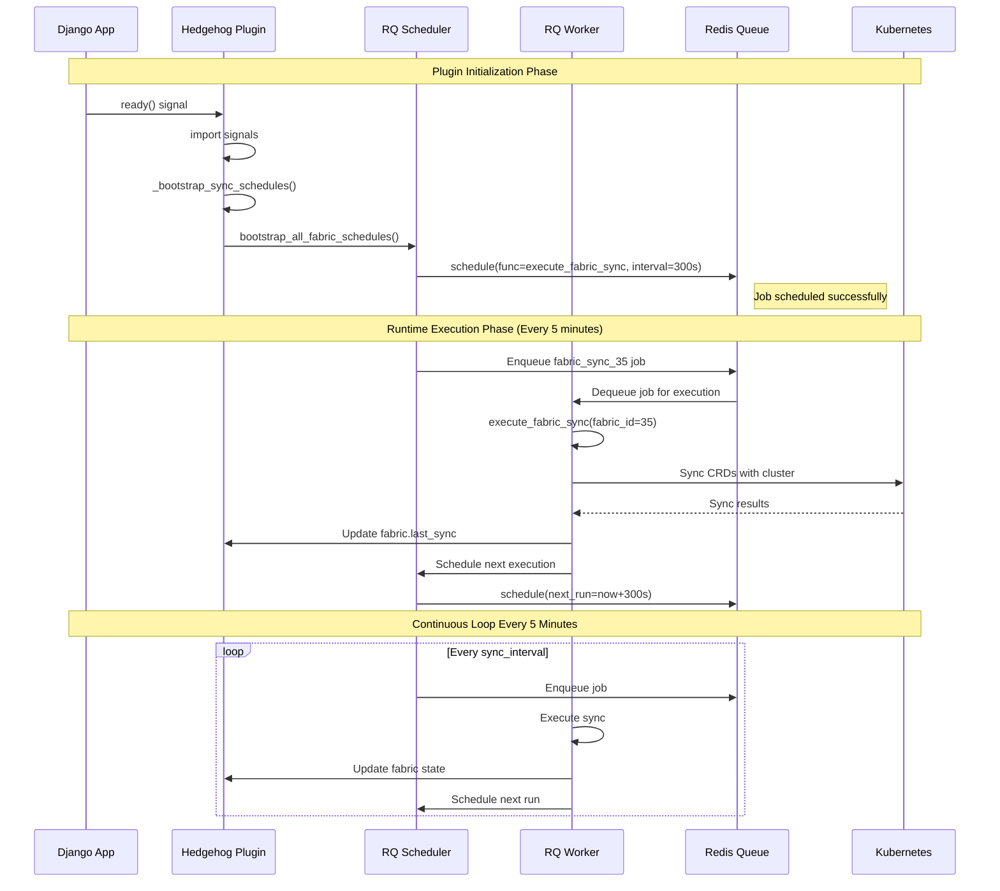
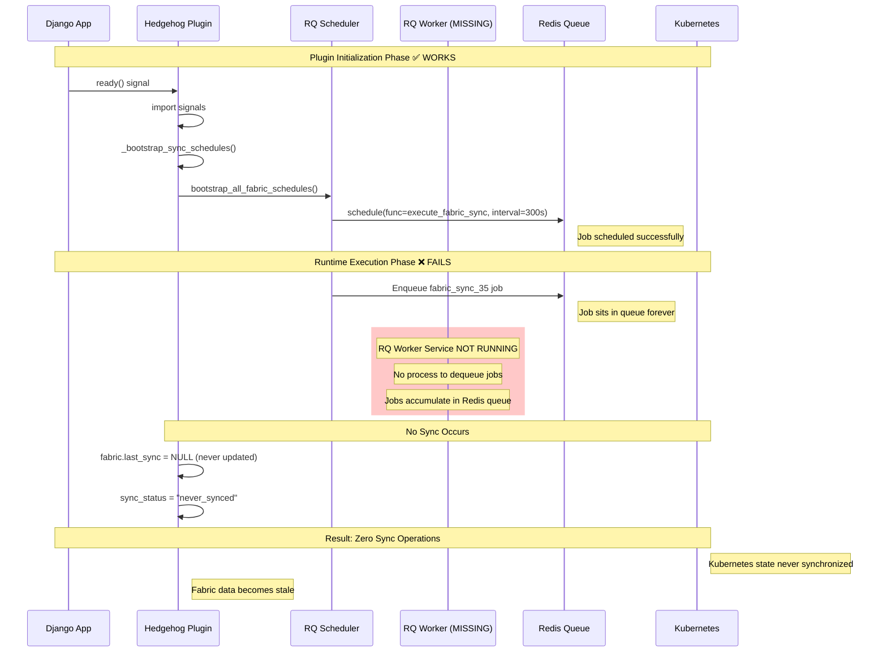
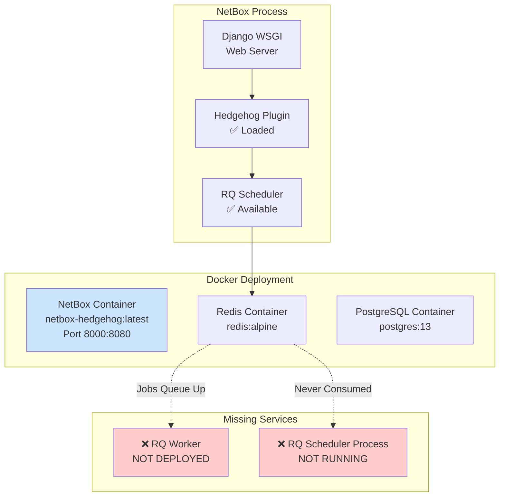
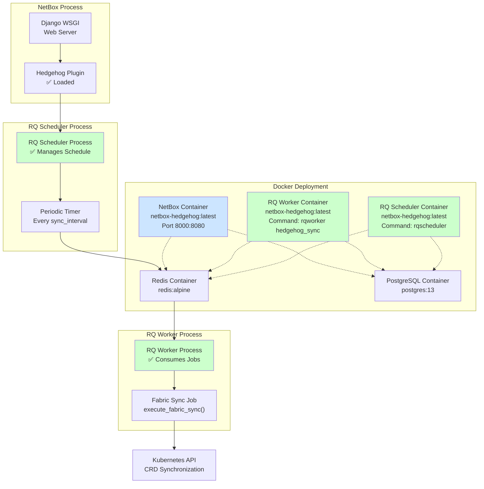
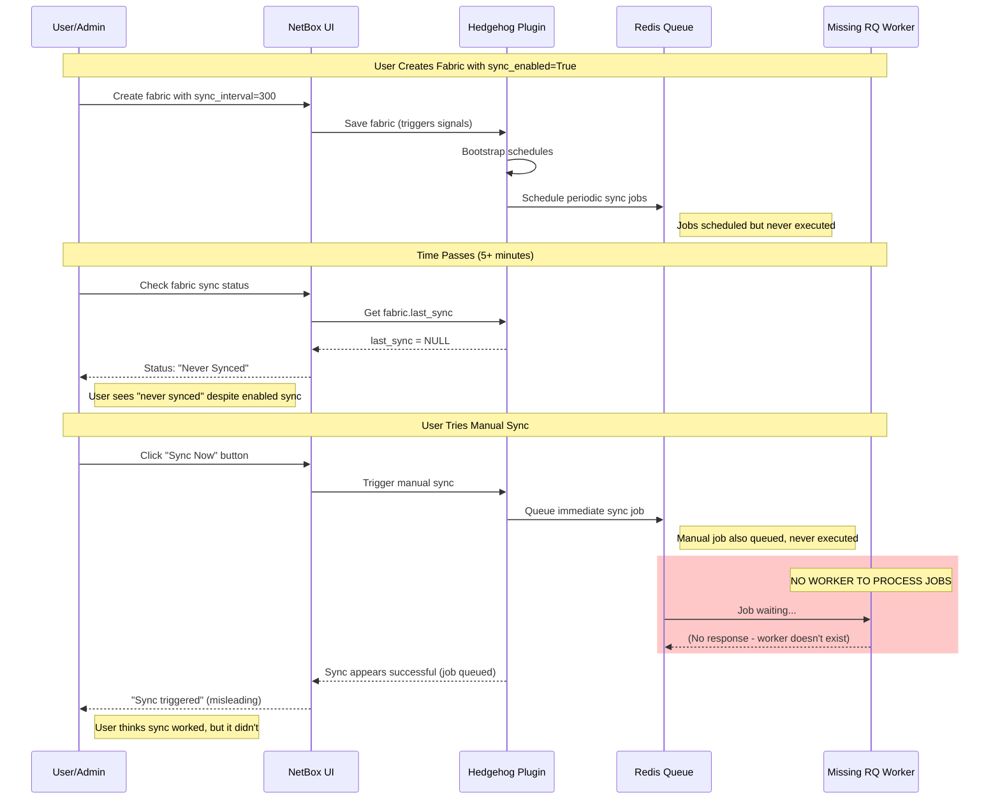
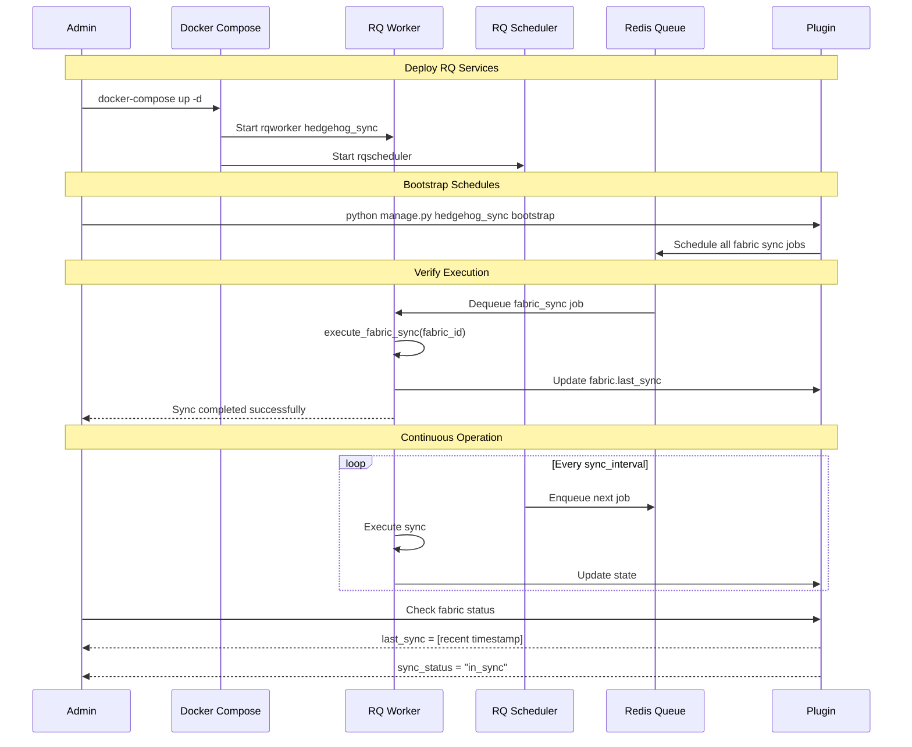
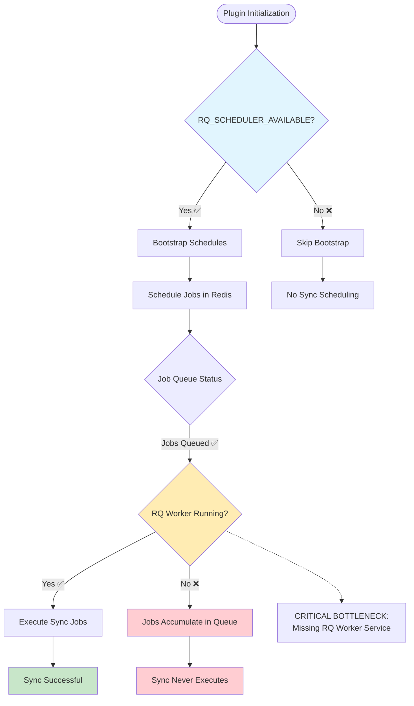

# Periodic Sync System - Sequence Diagrams

## Expected Flow (How It Should Work)

## Actual Flow (Current Broken State)

## Infrastructure Architecture (Current vs Required)

### Current Architecture (BROKEN)

### Required Architecture (FIXED)

## Data Flow Analysis

### Configuration to Execution Flow

```mermaid
graph LR
    subgraph "Configuration Layer"
        Fabric["HedgehogFabric<br/>sync_enabled=True<br/>sync_interval=300"]
        Migration["Migration 0023<br/>scheduler_enabled field"]
    end
    
    subgraph "Plugin Bootstrap"
        Ready["Plugin.ready()"]
        Bootstrap["_bootstrap_sync_schedules()"]
        Validate["RQ_SCHEDULER_AVAILABLE<br/>✅ True"]
    end
    
    subgraph "Scheduling Layer ✅ WORKING"
        GetFabrics["Get sync-enabled fabrics"]
        Schedule["scheduler.schedule()"]
        Redis1["Redis Queue<br/>hedgehog_sync"]
    end
    
    subgraph "Execution Layer ❌ BROKEN"
        Worker["RQ Worker Process<br/>❌ NOT RUNNING"]
        Execute["execute_fabric_sync()<br/>❌ NEVER CALLED"]
        K8sSync["Kubernetes Sync<br/>❌ NO EXECUTION"]
    end
    
    Fabric --> Ready
    Migration --> Ready
    Ready --> Bootstrap
    Bootstrap --> Validate
    Validate --> GetFabrics
    GetFabrics --> Schedule
    Schedule --> Redis1
    Redis1 -.->|"Queue Jobs"| Worker
    Worker -.->|"Would Execute"| Execute
    Execute -.->|"Would Sync"| K8sSync
    
    style Worker fill:#ffcccc
    style Execute fill:#ffcccc
    style K8sSync fill:#ffcccc
```

## Error Propagation Analysis

### What Happens Without Workers

## Fix Verification Flow

### Post-Fix Validation Sequence

## Critical Path Analysis

### Bottleneck Identification

---

*Sequence diagrams generated for forensic analysis on: 2025-08-11*