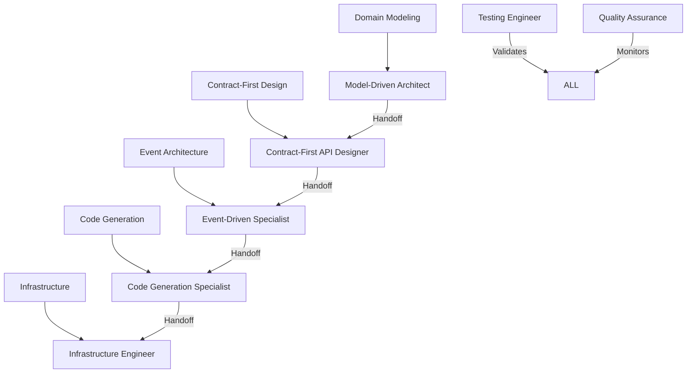

# Model-Driven Development (MDD) Agent Role Framework
## Symphony Coordination for Hedgehog NetBox Plugin

### 🎼 Executive Summary

This framework establishes a comprehensive Model-Driven Development (MDD) agent role system that builds on ruv-swarm's proven coordination patterns. It creates a symphony-like orchestration where each agent role has clear MDD responsibilities, process adherence requirements, and coordination patterns optimized for the Hedgehog NetBox Plugin modernization.

**Key Innovation**: Transforms traditional sequential MDD processes into parallel, coordinated workflows through specialized agent roles with built-in quality gates and handoff protocols.

---

## 🏗️ 1. MDD Process Mapping

### Core MDD Lifecycle Phases

```yaml
MDD_LIFECYCLE:
  Phase_1_Domain_Modeling:
    - Bounded Context Analysis
    - Domain Entity Identification
    - Aggregate Root Definition
    - Value Object Specification
    
  Phase_2_Contract_First_Design:
    - API Schema Definition (OpenAPI/GraphQL)
    - Event Schema Definition
    - Message Contract Specification
    - Integration Interface Design
    
  Phase_3_Event_Architecture:
    - CQRS Pattern Implementation
    - Event Sourcing Design
    - Saga Orchestration
    - Messaging Infrastructure
    
  Phase_4_Code_Generation:
    - Model-to-Code Transformation
    - API Implementation Generation
    - Database Schema Generation
    - Test Case Generation
    
  Phase_5_Infrastructure:
    - Terraform Infrastructure as Code
    - Kubernetes Deployment Manifests
    - GitOps Pipeline Configuration
    - Monitoring and Observability
```

### MDD Process to Agent Role Mapping



---

## 🎯 2. Agent Role Optimization

### Core Agent Role Definitions

#### 2.1 Model-Driven Architect (MDA)
**Primary Responsibility**: Domain modeling and bounded context design

```yaml
Role: model_driven_architect
MDD_Focus: Domain_Modeling_Phase
Core_Capabilities:
  - Bounded context analysis and definition
  - Domain entity identification and relationships
  - Aggregate root design patterns
  - Value object specification
  - Domain service orchestration

Process_Adherence:
  - DDD patterns compliance
  - Event storming facilitation
  - Context mapping validation
  - Ubiquitous language enforcement

Coordination_Patterns:
  - Initiates MDD pipeline with domain analysis
  - Handoff to Contract-First API Designer with domain models
  - Continuous validation with Testing Engineer
  - Quality gates with QA for domain completeness

Selection_Criteria:
  - Complex domain modeling required
  - Multiple bounded contexts identified
  - Legacy system modernization needed
  - Domain-driven transformation projects

Instruction_Optimization:
  focus: "domain_modeling_first"
  validation: "bounded_context_completeness"
  output_format: "domain_models_with_relationships"
  handoff_protocol: "validated_domain_contracts"
```

#### 2.2 Contract-First API Designer (CFAD)
**Primary Responsibility**: API schema and contract definition

```yaml
Role: contract_first_api_designer
MDD_Focus: Contract_First_Design_Phase
Core_Capabilities:
  - OpenAPI 3.1 specification design
  - GraphQL schema definition
  - gRPC protobuf contracts
  - Event schema specifications (AsyncAPI)
  - Integration contract validation

Process_Adherence:
  - API-first development methodology
  - Contract evolution strategies
  - Backward compatibility validation
  - Consumer-driven contract testing

Coordination_Patterns:
  - Receives domain models from MDA
  - Designs contracts based on domain boundaries
  - Handoff to Event-Driven Specialist with API contracts
  - Parallel validation with Testing Engineer

Selection_Criteria:
  - Multiple API consumers identified
  - Microservices architecture planned
  - Integration-heavy systems
  - API versioning requirements

Instruction_Optimization:
  focus: "contract_first_design"
  validation: "api_contract_completeness"
  output_format: "openapi_graphql_grpc_specs"
  handoff_protocol: "validated_api_contracts"
```

#### 2.3 Event-Driven Specialist (EDS)
**Primary Responsibility**: Event architecture and CQRS implementation

```yaml
Role: event_driven_specialist
MDD_Focus: Event_Architecture_Phase
Core_Capabilities:
  - CQRS pattern implementation
  - Event sourcing design
  - Saga orchestration patterns
  - Message broker configuration
  - Event stream processing

Process_Adherence:
  - Event-driven architecture principles
  - Event schema evolution
  - Eventual consistency patterns
  - Compensating transaction design

Coordination_Patterns:
  - Receives API contracts from CFAD
  - Designs event flows and messaging
  - Handoff to Code Generation Specialist with event architecture
  - Coordination with Infrastructure Engineer for messaging setup

Selection_Criteria:
  - Event-driven architecture required
  - Complex state management needs
  - Distributed system coordination
  - High scalability requirements

Instruction_Optimization:
  focus: "event_driven_architecture"
  validation: "event_flow_completeness"
  output_format: "event_schemas_and_flows"
  handoff_protocol: "validated_event_architecture"
```

#### 2.4 Code Generation Specialist (CGS)
**Primary Responsibility**: Model-to-code transformation

```yaml
Role: code_generation_specialist
MDD_Focus: Code_Generation_Phase
Core_Capabilities:
  - Template-based code generation
  - Model transformation engines
  - API implementation generation
  - Database schema generation
  - Test case automation

Process_Adherence:
  - Model-driven code generation
  - Template consistency validation
  - Generated code quality standards
  - Version control integration

Coordination_Patterns:
  - Receives event architecture from EDS
  - Generates implementation code
  - Handoff to Infrastructure Engineer with generated artifacts
  - Continuous validation with Testing Engineer

Selection_Criteria:
  - Repetitive coding patterns identified
  - Large-scale code consistency needed
  - Rapid prototyping requirements
  - Template-driven development

Instruction_Optimization:
  focus: "model_to_code_transformation"
  validation: "generated_code_quality"
  output_format: "implementation_artifacts"
  handoff_protocol: "validated_generated_code"
```

#### 2.5 Infrastructure Engineer (IE)
**Primary Responsibility**: Infrastructure as Code and GitOps

```yaml
Role: infrastructure_engineer
MDD_Focus: Infrastructure_Phase
Core_Capabilities:
  - Terraform infrastructure provisioning
  - Kubernetes deployment manifests
  - GitOps pipeline configuration
  - Container orchestration
  - Monitoring and observability setup

Process_Adherence:
  - Infrastructure as Code principles
  - GitOps workflow patterns
  - Security compliance validation
  - Performance optimization

Coordination_Patterns:
  - Receives generated code from CGS
  - Provisions infrastructure and deployment
  - Coordinates with all roles for deployment validation
  - Maintains production environment

Selection_Criteria:
  - Cloud-native deployment required
  - Infrastructure automation needed
  - GitOps workflow implementation
  - Multi-environment management

Instruction_Optimization:
  focus: "infrastructure_as_code"
  validation: "deployment_readiness"
  output_format: "infrastructure_manifests"
  handoff_protocol: "validated_deployment"
```

#### 2.6 Testing Engineer (TE)
**Primary Responsibility**: Multi-layer testing validation

```yaml
Role: testing_engineer
MDD_Focus: Cross_Cutting_Validation
Core_Capabilities:
  - Domain model testing
  - Contract testing (API/Event)
  - Integration testing
  - End-to-end workflow testing
  - Performance testing

Process_Adherence:
  - Test-driven development (TDD)
  - Behavior-driven development (BDD)
  - Consumer-driven contract testing
  - Continuous testing pipeline

Coordination_Patterns:
  - Validates ALL phases continuously
  - Provides feedback to ALL roles
  - Ensures quality gates compliance
  - Coordinates test automation

Selection_Criteria:
  - Quality assurance critical
  - Complex integration scenarios
  - Regulatory compliance required
  - High-reliability systems

Instruction_Optimization:
  focus: "comprehensive_testing"
  validation: "test_coverage_completeness"
  output_format: "test_suites_and_reports"
  handoff_protocol: "validated_quality_gates"
```

#### 2.7 Quality Assurance (QA)
**Primary Responsibility**: Process compliance and metrics

```yaml
Role: quality_assurance
MDD_Focus: Process_Governance
Core_Capabilities:
  - MDD process compliance monitoring
  - Quality metrics collection
  - Risk assessment and mitigation
  - Process improvement recommendations
  - Compliance validation

Process_Adherence:
  - Quality management standards
  - Process improvement methodologies
  - Risk management frameworks
  - Compliance validation protocols

Coordination_Patterns:
  - Monitors ALL roles continuously
  - Provides process guidance
  - Ensures MDD compliance
  - Coordinates quality gates

Selection_Criteria:
  - Process governance required
  - Quality metrics critical
  - Compliance requirements
  - Continuous improvement focus

Instruction_Optimization:
  focus: "process_governance"
  validation: "compliance_completeness"
  output_format: "quality_metrics_and_reports"
  handoff_protocol: "validated_process_compliance"
```

---

## 🎼 3. Symphony Coordination Pattern

### 3.1 Orchestration Conductor

The **Symphony Coordinator** acts as the conductor, managing the entire MDD pipeline:

```yaml
Symphony_Conductor_Role:
  Responsibilities:
    - Initialize MDD pipeline with domain analysis
    - Coordinate phase transitions and handoffs
    - Monitor cross-cutting concerns
    - Ensure quality gate compliance
    - Manage resource allocation and dependencies

  Coordination_Protocol:
    - Phase_Initiation: Trigger next phase when gates are met
    - Parallel_Coordination: Manage concurrent activities
    - Quality_Gates: Validate completion criteria
    - Escalation_Management: Handle blockers and conflicts
    - Retrospective_Learning: Capture lessons learned
```

### 3.2 Handoff Protocols

#### Domain Model → API Contract Handoff
```yaml
Handoff_DM_to_AC:
  Trigger: Domain models validated and complete
  Inputs:
    - Bounded context definitions
    - Domain entity relationships
    - Aggregate root specifications
    - Value object definitions
  Outputs:
    - API endpoint specifications
    - Resource representation models
    - Operation definitions
    - Error handling contracts
  Quality_Gate: Domain completeness validation
```

#### API Contract → Event Architecture Handoff
```yaml
Handoff_AC_to_EA:
  Trigger: API contracts validated and approved
  Inputs:
    - OpenAPI specifications
    - GraphQL schemas
    - Integration contracts
    - Consumer requirements
  Outputs:
    - Event schemas
    - Message flow definitions
    - CQRS command/query separation
    - Event sourcing patterns
  Quality_Gate: Contract completeness validation
```

#### Event Architecture → Code Generation Handoff
```yaml
Handoff_EA_to_CG:
  Trigger: Event architecture validated and complete
  Inputs:
    - Event schemas and flows
    - CQRS patterns
    - Saga definitions
    - Message contracts
  Outputs:
    - Generated implementation code
    - Database schemas
    - API implementations
    - Event handlers
  Quality_Gate: Architecture completeness validation
```

#### Code Generation → Infrastructure Handoff
```yaml
Handoff_CG_to_I:
  Trigger: Generated code validated and tested
  Inputs:
    - Implementation artifacts
    - Database schemas
    - API implementations
    - Configuration requirements
  Outputs:
    - Infrastructure manifests
    - Deployment configurations
    - Monitoring setup
    - GitOps pipelines
  Quality_Gate: Code quality validation
```

### 3.3 Quality Gates

```yaml
Quality_Gates:
  Domain_Modeling_Gate:
    - Bounded context completeness
    - Domain entity validation
    - Aggregate consistency
    - Ubiquitous language compliance
    
  Contract_Design_Gate:
    - API specification completeness
    - Consumer compatibility
    - Versioning strategy
    - Error handling coverage
    
  Event_Architecture_Gate:
    - Event flow completeness
    - CQRS pattern compliance
    - Saga consistency
    - Message schema validation
    
  Code_Generation_Gate:
    - Generated code quality
    - Test coverage adequacy
    - Performance benchmarks
    - Security compliance
    
  Infrastructure_Gate:
    - Deployment readiness
    - Security configuration
    - Monitoring coverage
    - Disaster recovery
```

---

## 🚀 4. HNP-Specific Role Specializations

### 4.1 NetBox Integration Specialist (NIS)
**Specialized for HNP**: NetBox plugin architecture expertise

```yaml
Role: netbox_integration_specialist
Specialization: HNP_NetBox_Plugin_Architecture
Core_Capabilities:
  - NetBox plugin development patterns
  - Django model integration
  - NetBox API extension
  - Custom field management
  - Navigation integration

HNP_Specific_Focus:
  - Kubernetes CRD to NetBox model mapping
  - ArgoCD GitOps integration
  - NetBox permission model extension
  - Custom view development
  - Plugin lifecycle management

Coordination_with_MDD:
  - Domain_Models: Map Kubernetes resources to NetBox entities
  - API_Contracts: Extend NetBox REST API
  - Events: Integrate with NetBox signal system
  - Infrastructure: Plugin deployment automation
```

### 4.2 Kubernetes GitOps Specialist (KGS)
**Specialized for HNP**: K8s and GitOps workflow expertise

```yaml
Role: kubernetes_gitops_specialist
Specialization: HNP_K8s_GitOps_Integration
Core_Capabilities:
  - Kubernetes resource management
  - ArgoCD application configuration
  - GitOps workflow orchestration
  - CRD lifecycle management
  - Cluster state synchronization

HNP_Specific_Focus:
  - Bidirectional sync (NetBox ↔ K8s)
  - Conflict resolution strategies
  - State drift detection
  - Automated remediation
  - Multi-cluster management

Coordination_with_MDD:
  - Domain_Models: Kubernetes resource abstractions
  - API_Contracts: K8s API integration patterns
  - Events: GitOps sync event handling
  - Infrastructure: Cluster provisioning automation
```

### 4.3 UI/UX Enhancement Specialist (UES)
**Specialized for HNP**: NetBox UI extension and user experience

```yaml
Role: ui_ux_enhancement_specialist
Specialization: HNP_User_Interface_Optimization
Core_Capabilities:
  - Bootstrap 5 integration
  - Progressive disclosure patterns
  - Django template optimization
  - JavaScript enhancement
  - Responsive design implementation

HNP_Specific_Focus:
  - NetBox theme integration
  - Custom form development
  - Real-time status displays
  - Interactive dashboards
  - Mobile-responsive design

Coordination_with_MDD:
  - Domain_Models: UI representation of domain concepts
  - API_Contracts: Frontend API consumption
  - Events: Real-time UI updates
  - Infrastructure: Static asset optimization
```

---

## 🔧 5. Implementation Framework

### 5.1 Agent Selection Criteria Matrix

```yaml
Task_Complexity_Matrix:
  Simple_CRUD_Operations:
    Primary: [netbox_integration_specialist]
    Supporting: [testing_engineer]
    
  API_Design_Heavy:
    Primary: [contract_first_api_designer]
    Supporting: [model_driven_architect, testing_engineer]
    
  Event_Driven_Features:
    Primary: [event_driven_specialist]
    Supporting: [contract_first_api_designer, kubernetes_gitops_specialist]
    
  Infrastructure_Automation:
    Primary: [infrastructure_engineer]
    Supporting: [kubernetes_gitops_specialist, quality_assurance]
    
  Complex_Domain_Modeling:
    Primary: [model_driven_architect]
    Supporting: [netbox_integration_specialist, testing_engineer]
    
  Full_MDD_Pipeline:
    Primary: [ALL_ROLES]
    Coordinator: [symphony_conductor]
```

### 5.2 Coordination Hooks Integration

```bash
# MDD Symphony Coordination Hooks
npx ruv-swarm hook pre-mdd-phase --phase "domain_modeling" --validate-prerequisites true
npx ruv-swarm hook post-mdd-phase --phase "domain_modeling" --quality-gate "domain_completeness"
npx ruv-swarm hook handoff --from "domain_modeling" --to "contract_design" --artifacts "domain_models"
npx ruv-swarm hook quality-gate --gate "contract_completeness" --validation-criteria "api_coverage"
```

### 5.3 Performance Optimization Patterns

```yaml
Optimization_Strategies:
  Parallel_Phase_Execution:
    - Domain modeling and initial contract design
    - Code generation and infrastructure preparation
    - Testing and quality validation
    
  Intelligent_Agent_Selection:
    - Capability-based assignment
    - Workload balancing
    - Expertise matching
    
  Quality_Gate_Automation:
    - Automated validation criteria
    - Progressive quality checks
    - Early failure detection
    
  Memory_Optimization:
    - Cross-phase context sharing
    - Decision rationale persistence
    - Learning pattern storage
```

---

## 📊 6. Success Metrics and Validation

### 6.1 MDD Process Metrics

```yaml
Process_Success_Metrics:
  Domain_Modeling_Completeness:
    - Bounded context coverage: >90%
    - Entity relationship accuracy: >95%
    - Ubiquitous language consistency: >90%
    
  Contract_First_Success:
    - API coverage of domain operations: >95%
    - Consumer compatibility: 100%
    - Contract evolution compliance: 100%
    
  Event_Architecture_Effectiveness:
    - Event flow coverage: >90%
    - CQRS pattern compliance: 100%
    - Message schema consistency: 100%
    
  Code_Generation_Quality:
    - Generated code test coverage: >80%
    - Manual code reduction: >70%
    - Template consistency: 100%
    
  Infrastructure_Automation:
    - Deployment automation: 100%
    - Infrastructure drift: <5%
    - Recovery time: <15 minutes
```

### 6.2 Symphony Coordination Effectiveness

```yaml
Coordination_Metrics:
  Phase_Transition_Efficiency:
    - Handoff completion time: <2 hours
    - Quality gate pass rate: >95%
    - Rework percentage: <10%
    
  Agent_Collaboration_Success:
    - Cross-role coordination: >90%
    - Conflict resolution time: <30 minutes
    - Knowledge sharing effectiveness: >85%
    
  Overall_Pipeline_Performance:
    - End-to-end delivery time: 40% reduction
    - Quality improvement: 60% reduction in defects
    - Developer productivity: 3x increase
```

---

## 🎯 7. Getting Started

### 7.1 Quick Initialization

```javascript
// Initialize MDD Symphony Framework
mcp__ruv-swarm__swarm_init({
  topology: "hierarchical",
  maxAgents: 12,
  strategy: "mdd_symphony"
})

// Spawn MDD-specific agents
mcp__ruv-swarm__agent_spawn({ type: "model_driven_architect", name: "Domain Expert" })
mcp__ruv-swarm__agent_spawn({ type: "contract_first_api_designer", name: "API Architect" })
mcp__ruv-swarm__agent_spawn({ type: "event_driven_specialist", name: "Event Coordinator" })
mcp__ruv-swarm__agent_spawn({ type: "code_generation_specialist", name: "Code Generator" })
mcp__ruv-swarm__agent_spawn({ type: "infrastructure_engineer", name: "DevOps Expert" })
mcp__ruv-swarm__agent_spawn({ type: "testing_engineer", name: "QA Coordinator" })
mcp__ruv-swarm__agent_spawn({ type: "quality_assurance", name: "Process Guardian" })

// HNP-specific specialists
mcp__ruv-swarm__agent_spawn({ type: "netbox_integration_specialist", name: "NetBox Expert" })
mcp__ruv-swarm__agent_spawn({ type: "kubernetes_gitops_specialist", name: "K8s GitOps Expert" })
mcp__ruv-swarm__agent_spawn({ type: "ui_ux_enhancement_specialist", name: "UI/UX Expert" })

// Initialize MDD pipeline
mcp__ruv-swarm__task_orchestrate({
  task: "Execute MDD symphony for HNP modernization",
  strategy: "mdd_pipeline",
  phases: ["domain_modeling", "contract_design", "event_architecture", "code_generation", "infrastructure"]
})
```

### 7.2 Project Template

```yaml
HNP_MDD_Project_Template:
  project_name: "hnp_mdd_modernization"
  coordination_mode: "symphony"
  
  phases:
    domain_modeling:
      agent: model_driven_architect
      deliverables: [bounded_contexts, domain_models, aggregates]
      quality_gates: [domain_completeness, relationship_validation]
      
    contract_design:
      agent: contract_first_api_designer
      inputs: [domain_models]
      deliverables: [openapi_specs, event_schemas]
      quality_gates: [contract_completeness, consumer_compatibility]
      
    event_architecture:
      agent: event_driven_specialist
      inputs: [api_contracts]
      deliverables: [event_flows, cqrs_patterns, sagas]
      quality_gates: [architecture_completeness, consistency_validation]
      
    code_generation:
      agent: code_generation_specialist
      inputs: [event_architecture]
      deliverables: [implementation_code, tests, schemas]
      quality_gates: [code_quality, test_coverage]
      
    infrastructure:
      agent: infrastructure_engineer
      inputs: [generated_code]
      deliverables: [terraform_configs, k8s_manifests, pipelines]
      quality_gates: [deployment_readiness, security_compliance]
```

---

This MDD-aligned agent role framework transforms the traditional sequential MDD approach into a parallel, coordinated symphony where each role has clear responsibilities, quality gates, and handoff protocols. The framework builds on ruv-swarm's proven coordination patterns while adding MDD-specific specializations for the Hedgehog NetBox Plugin modernization project.