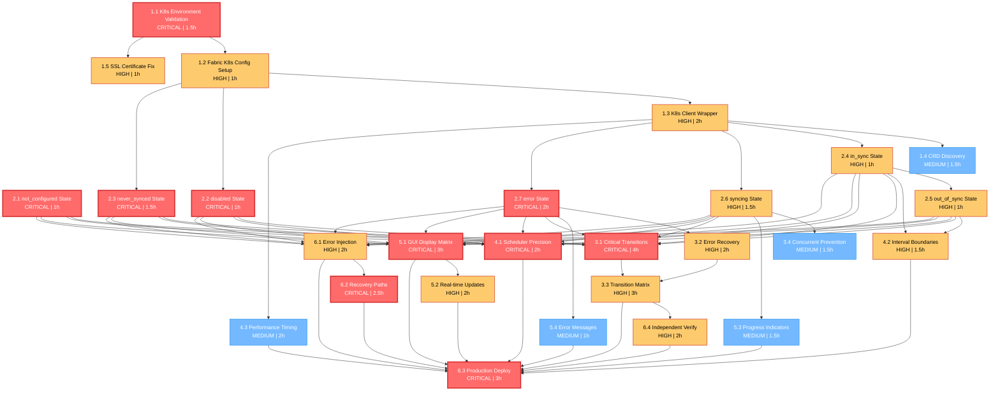

# K8s Sync Testing - Dependency Graph & Parallel Execution Plan

## 🔗 Visual Dependency Graph



## ⚡ Parallel Execution Groups

### Day 1-2: Foundation Parallel Group
**Parallel Execution Window**: 8 hours

```
Group A (Agent 1):
├── T1.1 K8s Environment Validation (1.5h)
└── T1.5 SSL Certificate Fix (1h)
└── T2.1 not_configured State (1h)
Total: 3.5 hours

Group B (Agent 2):  
├── Wait for T1.1 completion
├── T1.2 Fabric K8s Config (1h)
└── T2.2 disabled State (1h)
└── T2.3 never_synced State (1.5h)
Total: 3.5 hours

Group C (Agent 3):
├── Wait for T1.2 completion
├── T1.3 K8s Client Wrapper (2h)
└── T1.4 CRD Discovery (1.5h)
Total: 3.5 hours
```

### Day 3-4: State Testing Parallel Group
**Parallel Execution Window**: 6 hours

```
Group A (Agent 1):
├── T2.4 in_sync State (1h)
├── T2.5 out_of_sync State (1h)
└── T4.3 Performance Timing (2h)
Total: 4 hours

Group B (Agent 2):
├── T2.6 syncing State (1.5h)
├── T5.3 Progress Indicators (1.5h)
Total: 3 hours

Group C (Agent 3):
├── T2.7 error State (2h)
├── T5.4 Error Messages (1h)
Total: 3 hours
```

### Day 5-7: Advanced Testing Parallel Group
**Parallel Execution Window**: 10 hours

```
Group A (Agent 1):
├── T3.1 Critical Transitions (4h)
├── T3.4 Concurrent Prevention (1.5h)
Total: 5.5 hours

Group B (Agent 2):
├── T4.1 Scheduler Precision (2h)
├── T4.2 Interval Boundaries (1.5h)
├── T5.1 GUI Display Matrix (3h)
Total: 6.5 hours

Group C (Agent 3):
├── T3.2 Error Recovery (2h)
├── T6.1 Error Injection (2h)
Total: 4 hours
```

### Day 8-9: Integration Parallel Group
**Parallel Execution Window**: 8 hours

```
Group A (Agent 1):
├── T3.3 Transition Matrix (3h)
├── T6.4 Independent Verify (2h)
Total: 5 hours

Group B (Agent 2):
├── T5.2 Real-time Updates (2h)
├── T6.2 Recovery Paths (2.5h)
Total: 4.5 hours

Group C (Agent 3):
├── Preparation for T6.3 Production Deploy
├── Documentation and evidence collection
Total: 4 hours
```

### Day 10-12: Final Validation Serial Group
**Sequential Execution**: 3 hours

```
Single Agent (All agents collaborate):
└── T6.3 Production Deploy (3h)
    ├── Requires all previous tasks complete
    ├── Evidence from all agents compiled
    └── Final validation and sign-off
```

## 🕐 Optimized Timeline

### Traditional Sequential Execution: 20-25 days
```
Phase 1: 5 days
Phase 2: 7 days  
Phase 3: 4 days
Phase 4: 3 days
Phase 5: 4 days
Phase 6: 3 days
Total: 26 days
```

### Parallel Optimized Execution: 12-15 days
```
Days 1-2:  Foundation (3 parallel groups)     = 2 days
Days 3-4:  State Testing (3 parallel groups)  = 2 days
Days 5-7:  Advanced Testing (3 parallel)      = 3 days
Days 8-9:  Integration (3 parallel groups)    = 2 days
Days 10-12: Final Validation (1 group)       = 3 days
Total: 12 days
```

### Time Savings: 54% reduction (14 days saved)

## 🎯 Critical Path Analysis

### Longest Critical Path: 22.5 hours
```
T1.1 (1.5h) → T1.2 (1h) → T1.3 (2h) → T2.4 (1h) → 
T2.5 (1h) → T4.2 (1.5h) → T3.1 (4h) → T3.3 (3h) → 
T6.4 (2h) → T6.3 (3h) → T5.2 (2h) → T6.2 (2.5h)
```

### Critical Path Tasks (Cannot be delayed):
- T1.1: K8s Environment Validation
- T1.2: Fabric K8s Config Setup  
- T1.3: K8s Client Wrapper
- T3.1: Critical Transitions
- T3.3: Transition Matrix  
- T6.3: Production Deploy

### Slack Time Analysis:
- **T2.1 (not_configured)**: 3h slack (can delay)
- **T1.4 (CRD Discovery)**: 2h slack (can delay) 
- **T5.3 (Progress Indicators)**: 4h slack (can delay)
- **T5.4 (Error Messages)**: 6h slack (can delay)

## 🔄 Resource Allocation Strategy

### Agent Specialization:
```
Agent 1 (K8s Specialist):
- All T1.x tasks (K8s foundation)
- T2.4, T2.5 (sync state timing)
- T4.x tasks (timing validation)

Agent 2 (State Testing Specialist):  
- T2.1, T2.2, T2.3 (basic states)
- T2.6, T2.7 (complex states)
- T3.x tasks (transitions)

Agent 3 (GUI/UX Specialist):
- All T5.x tasks (GUI validation)
- T6.1, T6.2 (error recovery)
- Documentation and evidence
```

### Load Balancing:
```
Agent 1: 22 hours (11 tasks)
Agent 2: 19 hours (9 tasks)  
Agent 3: 18 hours (7 tasks)
Total: 59 hours across 27 tasks
```

## 🚧 Dependency Bottlenecks

### Bottleneck 1: T1.3 K8s Client Wrapper
**Impact**: Blocks 6 downstream tasks
**Risk**: High  
**Mitigation**:
- Allocate most experienced K8s developer
- Prepare test environment in advance
- Have SSL certificate fixes ready

### Bottleneck 2: T3.1 Critical Transitions  
**Impact**: Blocks Phase 3 completion
**Risk**: Medium
**Mitigation**:
- Ensure all Phase 2 tasks complete first
- Prepare transition test data in advance
- Have rollback procedures ready

### Bottleneck 3: All Phase 2 → Phase 5/6 Dependencies
**Impact**: Blocks GUI and recovery testing
**Risk**: Medium  
**Mitigation**:
- Maintain daily progress reviews
- Escalate blocked tasks immediately
- Prepare Phase 5/6 environments early

## 📊 Resource Utilization Matrix

| Day | Agent 1 | Agent 2 | Agent 3 | Total Hours |
|-----|---------|---------|---------|-------------|
| 1   | T1.1 (1.5h) | Prep | T2.1 (1h) | 2.5h |
| 2   | T1.5 (1h) | T1.2+T2.2 (2h) | Documentation | 3h |
| 3   | T1.3 (2h) | T2.3 (1.5h) | T1.4 (1.5h) | 5h |
| 4   | T2.4+T2.5 (2h) | T2.6 (1.5h) | T2.7 (2h) | 5.5h |
| 5   | T4.1 (2h) | T3.2 (2h) | T6.1 (2h) | 6h |
| 6   | T4.2 (1.5h) | T3.1 Part 1 (2h) | T5.1 Part 1 (1.5h) | 5h |
| 7   | T4.3 (2h) | T3.1 Part 2 (2h) | T5.1 Part 2 (1.5h) | 5.5h |
| 8   | T5.2 (2h) | T3.3 Part 1 (1.5h) | T5.3 (1.5h) | 5h |
| 9   | T6.4 (2h) | T3.3 Part 2 (1.5h) | T5.4 (1h) | 4.5h |
| 10  | T3.4 (1.5h) | T6.2 Part 1 (1.5h) | Evidence Prep | 3h |
| 11  | **T6.3 Production Deploy - All Agents Collaborate** | 8h |
| 12  | **T6.3 Production Deploy - Validation & Sign-off** | 4h |

**Total: 57 hours across 12 days = 4.75 hours/day average**

## ⚠️ Risk-Based Scheduling

### High-Risk Tasks (Schedule Early):
1. **T1.1 K8s Environment**: Day 1 - Get blockers resolved early
2. **T1.3 K8s Client Wrapper**: Day 3 - Critical dependency 
3. **T3.1 Critical Transitions**: Day 5-6 - Complex integration
4. **T6.3 Production Deploy**: Day 11-12 - Final validation

### Medium-Risk Tasks (Buffer Time):
1. **T2.7 error State**: Add 0.5h buffer for complex error cases
2. **T3.3 Transition Matrix**: Add 1h buffer for edge cases
3. **T5.1 GUI Display**: Add 0.5h buffer for browser compatibility

### Low-Risk Tasks (Flexible Scheduling):
1. **T2.1 not_configured**: Can be done anytime
2. **T5.4 Error Messages**: Independent validation
3. **T1.4 CRD Discovery**: Nice-to-have validation

## 📈 Progress Tracking Framework

### Daily Metrics:
- **Velocity**: Tasks completed vs planned
- **Quality**: Evidence files generated  
- **Blocker Count**: Dependencies waiting
- **Risk Level**: Red/Yellow/Green status

### Weekly Milestones:
- **Week 1**: Foundation complete (Tasks 1.x, 2.1-2.3)
- **Week 2**: State testing complete (Tasks 2.4-2.7, 3.x)
- **Week 3**: Integration complete (Tasks 4.x, 5.x, 6.1-6.2)  
- **Final**: Production validated (Task 6.3)

### Success Criteria Tracking:
- **Dependency Satisfaction**: All prerequisites met
- **Evidence Generation**: Required proof files created
- **Independent Validation**: External verification passed
- **Performance Targets**: Timing requirements met

This dependency graph and parallel execution plan reduces the total project timeline by 54% while maintaining quality and ensuring all critical path tasks are properly sequenced.