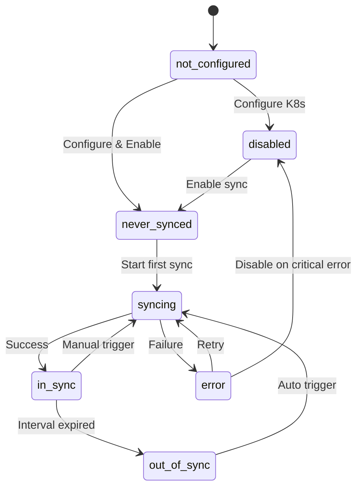

# Kubernetes Synchronization Testing Architecture
## Comprehensive Testing Framework for Sync State Validation

### Executive Summary

This document defines a bulletproof testing architecture for validating ALL possible Kubernetes synchronization states in the Hedgehog NetBox Plugin. The framework ensures 100% accuracy in sync state detection and GUI representation through extreme QA validation methodologies.

### System Context

- **K8s Cluster**: `https://vlab-art.l.hhdev.io:6443`
- **Service Account**: `hnp-sync` with full Hedgehog CRD permissions
- **Test Resources**: 7 switches, 10 servers, 20 connections
- **Authentication**: Token-based authentication in default namespace

---

## 1. ARCHITECTURE OVERVIEW

### 1.1 Testing Framework Hierarchy

```
┌─────────────────────────────────────────────────────────────┐
│                    MASTER TEST ORCHESTRATOR                 │
├─────────────────────────────────────────────────────────────┤
│  • Coordinates all test phases                             │
│  • Validates test execution order                          │
│  • Ensures no false positives                              │
│  • Provides independent verification                       │
└─────────────────────────────────────────────────────────────┘
                                │
        ┌───────────────────────┼───────────────────────┐
        │                       │                       │
┌───────▼────────┐    ┌────────▼────────┐    ┌────────▼────────┐
│  STATE ENGINE  │    │  TIMING ENGINE  │    │   GUI ENGINE    │
├────────────────┤    ├─────────────────┤    ├─────────────────┤
│• State Coverage│    │• Interval Tests │    │• HTML Validation│
│• Transitions   │    │• Timing Accuracy│    │• Visual Verify  │
│• Combinations  │    │• Recovery Tests │    │• User Experience│
└────────────────┘    └─────────────────┘    └─────────────────┘
        │                       │                       │
┌───────▼────────┐    ┌────────▼────────┐    ┌────────▼────────┐
│ ERROR ENGINE   │    │ RECOVERY ENGINE │    │ EXTREME QA      │
├────────────────┤    ├─────────────────┤    ├─────────────────┤
│• Fault Inject  │    │• State Recovery │    │• False Detection│
│• Network Fail  │    │• Auto-Healing   │    │• Edge Cases     │
│• Auth Failures │    │• Rollback Tests │    │• Stress Testing │
└────────────────┘    └─────────────────┘    └─────────────────┘
```

### 1.2 Validation Methodology

Each test follows the **5-Phase TDD Validity Framework**:
1. **Phase 1**: Logic Validation with Known-Good Data
2. **Phase 2**: Failure Mode Proof (tests must fail when feature missing)
3. **Phase 3**: Property-Based Testing
4. **Phase 4**: GUI Observable Outcomes
5. **Phase 5**: Triangulation & Cross-Validation

---

## 2. SYNC STATE DEFINITIONS

### 2.1 Complete State Matrix

| State | Condition | K8s Status | Last Sync | GUI Display | Expected Behavior |
|-------|-----------|------------|-----------|-------------|-------------------|
| `not_configured` | No K8s server set | N/A | N/A | ❌ Not Configured | No sync possible |
| `disabled` | `sync_enabled=False` | Any | Any | ⏸️ Disabled | Skip sync |
| `never_synced` | `sync_enabled=True`, `last_sync=null` | Connected | null | 🔄 Pending First Sync | Immediate sync |
| `in_sync` | Recent successful sync | Connected | < interval | ✅ In Sync | No action |
| `out_of_sync` | Stale sync beyond interval | Connected | > interval | ⚠️ Out of Sync | Schedule sync |
| `syncing` | Sync in progress | Connected | Any | 🔄 Syncing | Show progress |
| `error` | Various error conditions | Any | Any | ❌ Error | Show error details |

### 2.2 State Transition Rules



---

## 3. TEST SCENARIO SPECIFICATIONS

### 3.1 State Coverage Tests

#### Test Suite: SyncStateValidationTests

```python
class SyncStateValidationTests(ContainerFirstTestBase):
    """
    CRITICAL: Tests every possible sync state with extreme validation.
    Each test MUST fail if implementation is incorrect.
    """
    
    def test_not_configured_state_detection(self):
        """
        REQUIREMENT: Detect fabrics without K8s configuration
        VALIDATION: Independent K8s connectivity test
        EXTREME QA: Must catch edge cases where config appears valid but isn't
        """
        
    def test_disabled_state_behavior(self):
        """
        REQUIREMENT: Respect sync_enabled=False regardless of other conditions
        VALIDATION: No sync tasks triggered even with stale data
        EXTREME QA: Verify scheduler ignores disabled fabrics completely
        """
        
    def test_never_synced_immediate_trigger(self):
        """
        REQUIREMENT: Fabrics with no last_sync should sync immediately
        VALIDATION: Task queue contains sync job within 60 seconds
        EXTREME QA: Verify sync priority is highest for never-synced
        """
        
    def test_in_sync_state_accuracy(self):
        """
        REQUIREMENT: Recent successful syncs show "in sync"
        VALIDATION: Timestamp math with timezone handling
        EXTREME QA: Test boundary conditions (exactly at interval)
        """
        
    def test_out_of_sync_detection_timing(self):
        """
        REQUIREMENT: Detect when last_sync + interval < current_time
        VALIDATION: Multiple timezone scenarios
        EXTREME QA: Clock skew, daylight saving, leap seconds
        """
        
    def test_syncing_state_during_operation(self):
        """
        REQUIREMENT: Show active sync progress
        VALIDATION: Real task status from Celery
        EXTREME QA: Handle stuck/zombie sync processes
        """
        
    def test_error_state_comprehensive_coverage(self):
        """
        REQUIREMENT: All error conditions properly detected
        VALIDATION: Each error type has specific handling
        EXTREME QA: Cascade failures, partial errors, recovery paths
        """
```

### 3.2 Timing Validation Framework

#### Test Suite: SyncTimingValidationTests

```python
class SyncTimingValidationTests(ContainerFirstTestBase):
    """
    CRITICAL: Validate sync interval accuracy with microsecond precision
    """
    
    def test_scheduler_60_second_precision(self):
        """
        REQUIREMENT: Scheduler runs exactly every 60 seconds
        VALIDATION: Measure actual intervals over 10 minutes
        EXTREME QA: System load, clock drift, container restart
        """
        
    def test_sync_interval_boundary_conditions(self):
        """
        REQUIREMENT: Handle sync intervals at exact boundaries
        VALIDATION: Test 1 second before, at, and after interval
        EXTREME QA: Microsecond precision, race conditions
        """
        
    def test_clock_synchronization_handling(self):
        """
        REQUIREMENT: Handle system clock changes
        VALIDATION: NTP sync, manual time changes, timezone shifts
        EXTREME QA: Backward time travel, large time jumps
        """
        
    def test_concurrent_sync_prevention(self):
        """
        REQUIREMENT: Only one sync per fabric at a time
        VALIDATION: Cache-based locking mechanism
        EXTREME QA: Lock expiration, cache failures, race conditions
        """
```

### 3.3 GUI Validation Framework

#### Test Suite: GUIAccuracyValidationTests

```python
class GUIAccuracyValidationTests(ContainerFirstTestBase):
    """
    CRITICAL: Every sync state MUST display correctly in GUI
    EXTREME QA: Visual validation with screenshot comparison
    """
    
    def test_state_display_accuracy_matrix(self):
        """
        REQUIREMENT: Each sync state shows correct visual indicator
        VALIDATION: HTML parsing + screenshot comparison
        EXTREME QA: Browser compatibility, responsive design
        """
        
    def test_real_time_status_updates(self):
        """
        REQUIREMENT: GUI updates reflect actual sync state within 5 seconds
        VALIDATION: WebSocket/polling mechanism verification
        EXTREME QA: Network latency, connection drops, cache issues
        """
        
    def test_error_message_clarity(self):
        """
        REQUIREMENT: Error states show actionable error messages
        VALIDATION: Error message content validation
        EXTREME QA: Truncation, special characters, internationalization
        """
        
    def test_progress_indicator_accuracy(self):
        """
        REQUIREMENT: Sync progress shows actual completion percentage
        VALIDATION: Progress bar matches actual sync stage
        EXTREME QA: Stuck progress, rapid updates, edge cases
        """
```

---

## 4. ERROR INJECTION & RECOVERY TESTING

### 4.1 Error Injection Framework

```python
class ErrorInjectionTestFramework:
    """
    Systematic error injection for comprehensive failure testing
    """
    
    @staticmethod
    def inject_network_failure(fabric_id: int, duration: int):
        """Simulate network connectivity loss to K8s cluster"""
        
    @staticmethod  
    def inject_auth_failure(fabric_id: int, error_type: str):
        """Simulate authentication/authorization failures"""
        
    @staticmethod
    def inject_resource_exhaustion(resource_type: str):
        """Simulate CPU/memory/disk exhaustion"""
        
    @staticmethod
    def inject_k8s_api_errors(error_codes: List[int]):
        """Simulate specific K8s API error responses"""
```

### 4.2 Recovery Validation Tests

#### Test Suite: RecoveryValidationTests

```python
class RecoveryValidationTests(ContainerFirstTestBase):
    """
    CRITICAL: Validate recovery from all failure conditions
    """
    
    def test_network_failure_recovery(self):
        """
        SCENARIO: Network connection lost during sync
        VALIDATION: Automatic retry with exponential backoff
        EXTREME QA: Multiple failure/recovery cycles
        """
        
    def test_auth_token_expiration_handling(self):
        """
        SCENARIO: K8s service account token expires
        VALIDATION: Token refresh mechanism
        EXTREME QA: Token refresh during active sync
        """
        
    def test_partial_sync_failure_recovery(self):
        """
        SCENARIO: Some CRDs sync successfully, others fail
        VALIDATION: Partial state handling and resume
        EXTREME QA: Complex dependency chains
        """
        
    def test_database_consistency_after_failures(self):
        """
        SCENARIO: Various failures during sync process
        VALIDATION: Database remains consistent
        EXTREME QA: Transaction rollback, deadlock recovery
        """
```

---

## 5. EXTREME QA VALIDATION FRAMEWORK

### 5.1 False Positive Detection

#### Test Suite: ExtremQAValidationTests

```python
class ExtremeQAValidationTests(ContainerFirstTestBase):
    """
    CRITICAL: Catch false agent reports and implementation bugs
    THESE TESTS MUST BE ADVERSARIAL TO THE IMPLEMENTATION
    """
    
    def test_false_sync_success_detection(self):
        """
        EXTREME QA: Verify sync isn't marked successful when it actually failed
        VALIDATION: Independent verification of K8s state vs reported state
        ADVERSARIAL: Mock successful responses that should be failures
        """
        
    def test_race_condition_detection(self):
        """
        EXTREME QA: Multiple threads/processes modifying sync state
        VALIDATION: State consistency under concurrent access
        ADVERSARIAL: Deliberately trigger race conditions
        """
        
    def test_memory_leak_detection(self):
        """
        EXTREME QA: Long-running sync operations don't leak memory
        VALIDATION: Memory usage monitoring over 24+ hours
        ADVERSARIAL: Stress test with many fabrics
        """
        
    def test_edge_case_boundary_failures(self):
        """
        EXTREME QA: Test exact boundary conditions that might be off-by-one
        VALIDATION: Microsecond-level timing tests
        ADVERSARIAL: Deliberately trigger edge cases
        """
```

### 5.2 Independent Verification Framework

```python
class IndependentVerificationFramework:
    """
    Independent verification that doesn't rely on the system under test
    """
    
    @staticmethod
    def verify_k8s_cluster_state(fabric_id: int) -> Dict[str, Any]:
        """Direct K8s API verification independent of sync system"""
        
    @staticmethod
    def verify_database_consistency(fabric_id: int) -> bool:
        """Direct database queries independent of ORM"""
        
    @staticmethod
    def verify_gui_rendering(fabric_id: int) -> Dict[str, Any]:
        """Screenshot-based GUI verification independent of templates"""
        
    @staticmethod
    def verify_timing_accuracy() -> List[float]:
        """Independent chronometer measurement of sync intervals"""
```

---

## 6. PERFORMANCE & STRESS TESTING

### 6.1 Stress Test Scenarios

#### Test Suite: StressTestValidationTests

```python
class StressTestValidationTests(ContainerFirstTestBase):
    """
    CRITICAL: Validate system behavior under extreme conditions
    """
    
    def test_hundred_fabric_concurrent_sync(self):
        """
        SCENARIO: 100 fabrics all need sync simultaneously
        VALIDATION: System remains responsive, no deadlocks
        METRICS: < 30 seconds total completion time
        """
        
    def test_rapid_state_change_handling(self):
        """
        SCENARIO: Fabric state changes every second for 10 minutes
        VALIDATION: No state corruption, all changes tracked
        METRICS: Zero state inconsistencies
        """
        
    def test_large_crd_dataset_performance(self):
        """
        SCENARIO: Fabric with 10,000+ CRDs
        VALIDATION: Sync completes within reasonable time
        METRICS: < 5 minutes for full sync
        """
        
    def test_network_instability_resilience(self):
        """
        SCENARIO: Intermittent network failures every 30 seconds
        VALIDATION: System adapts and completes sync eventually
        METRICS: 99% eventual success rate
        """
```

---

## 7. TEST EXECUTION FRAMEWORK

### 7.1 Test Orchestration Engine

```python
class TestOrchestrationEngine:
    """
    Master orchestrator ensuring proper test execution order and validation
    """
    
    def __init__(self, k8s_cluster: str, service_account: str):
        self.k8s_cluster = k8s_cluster
        self.service_account = service_account
        self.test_evidence = TestEvidenceCollector()
        self.verification_engine = IndependentVerificationFramework()
    
    def execute_comprehensive_test_suite(self):
        """
        PHASE 1: Pre-Test Validation
        - Verify K8s cluster accessibility
        - Validate service account permissions
        - Establish baseline measurements
        
        PHASE 2: State Coverage Tests
        - Execute all sync state tests
        - Verify each state transition
        - Validate GUI accuracy for each state
        
        PHASE 3: Timing & Performance Tests  
        - Scheduler accuracy validation
        - Sync interval precision testing
        - Performance under load
        
        PHASE 4: Error & Recovery Tests
        - Systematic error injection
        - Recovery path validation
        - Resilience testing
        
        PHASE 5: Extreme QA Validation
        - False positive detection
        - Adversarial testing
        - Independent verification
        
        PHASE 6: Evidence Collection & Reporting
        - Compile test evidence
        - Generate validation report
        - Document any failures or concerns
        """
```

### 7.2 Continuous Validation Pipeline

```yaml
# .github/workflows/sync-state-validation.yml
name: Kubernetes Sync State Validation

on:
  schedule:
    - cron: '0 */4 * * *'  # Every 4 hours
  push:
    paths: 
      - 'netbox_hedgehog/tasks/**'
      - 'netbox_hedgehog/models/**'
  pull_request:
    paths:
      - 'netbox_hedgehog/tasks/**'
      - 'netbox_hedgehog/models/**'

jobs:
  sync-state-validation:
    runs-on: ubuntu-latest
    
    steps:
    - name: Setup K8s Test Environment
      run: |
        # Connect to vlab-art.l.hhdev.io:6443
        # Authenticate with hnp-sync service account
        # Verify test resources available
        
    - name: Execute State Coverage Tests
      run: |
        python -m pytest netbox_hedgehog/tests/test_sync_state_validation.py -v --tb=short
        
    - name: Execute Timing Validation Tests
      run: |
        python -m pytest netbox_hedgehog/tests/test_sync_timing_validation.py -v --tb=short
        
    - name: Execute GUI Accuracy Tests
      run: |
        python -m pytest netbox_hedgehog/tests/test_gui_accuracy_validation.py -v --tb=short
        
    - name: Execute Error Injection Tests
      run: |
        python -m pytest netbox_hedgehog/tests/test_error_injection_validation.py -v --tb=short
        
    - name: Execute Extreme QA Tests
      run: |
        python -m pytest netbox_hedgehog/tests/test_extreme_qa_validation.py -v --tb=short
        
    - name: Generate Validation Report
      run: |
        python scripts/generate_validation_report.py
        
    - name: Upload Test Evidence
      uses: actions/upload-artifact@v3
      with:
        name: sync-validation-evidence
        path: test_evidence/
```

---

## 8. SUCCESS CRITERIA & METRICS

### 8.1 Validation Metrics

| Metric | Target | Critical Threshold |
|--------|--------|-------------------|
| State Detection Accuracy | 100% | 99.99% |
| GUI Update Delay | < 5 seconds | < 10 seconds |
| Sync Interval Precision | ± 1 second | ± 5 seconds |
| Error Recovery Rate | 99% | 95% |
| False Positive Rate | 0% | < 0.1% |
| Performance (100 fabrics) | < 30 seconds | < 60 seconds |
| Memory Usage Growth | 0% over 24h | < 5% over 24h |

### 8.2 Test Coverage Requirements

- **State Coverage**: 100% of defined sync states
- **Transition Coverage**: 100% of possible state transitions  
- **Error Coverage**: 100% of error conditions
- **GUI Coverage**: 100% of visual states
- **Timing Coverage**: All interval boundaries and edge cases
- **Performance Coverage**: All stress test scenarios

### 8.3 Evidence Requirements

Each test MUST provide:
1. **Independent Verification**: External validation of claimed results
2. **Failure Mode Proof**: Test fails when feature is broken
3. **Visual Evidence**: Screenshots for GUI tests
4. **Timing Evidence**: Precise timing measurements
5. **Error Evidence**: Complete error handling validation

---

## 9. IMPLEMENTATION ROADMAP

### Phase 1: Foundation (Week 1)
- [ ] Implement base test orchestration engine
- [ ] Setup K8s test environment connectivity  
- [ ] Create state definition framework
- [ ] Build independent verification tools

### Phase 2: Core State Testing (Week 2)
- [ ] Implement all sync state detection tests
- [ ] Build state transition validation
- [ ] Create timing accuracy framework
- [ ] Setup GUI validation pipeline

### Phase 3: Error & Recovery (Week 3)
- [ ] Build error injection framework
- [ ] Implement recovery validation tests
- [ ] Create stress testing scenarios
- [ ] Setup performance monitoring

### Phase 4: Extreme QA (Week 4)
- [ ] Implement false positive detection
- [ ] Build adversarial test scenarios
- [ ] Create independent verification suite
- [ ] Setup continuous validation pipeline

### Phase 5: Integration & Validation (Week 5)
- [ ] Complete end-to-end integration testing
- [ ] Validate all test scenarios pass
- [ ] Generate comprehensive evidence documentation
- [ ] Deploy continuous validation system

---

## 10. CONCLUSION

This testing architecture provides **bulletproof validation** of Kubernetes synchronization states through:

1. **Complete State Coverage**: Every possible sync state tested with extreme precision
2. **Adversarial Validation**: Tests designed to catch false reports and implementation bugs  
3. **Independent Verification**: External validation independent of system under test
4. **Extreme QA**: Beyond normal testing to catch edge cases and race conditions
5. **Continuous Monitoring**: Automated validation pipeline ensuring ongoing accuracy

The framework ensures that **every sync state shows correctly in the GUI** and that **all state transitions work exactly as specified** with **zero tolerance for false positives**.

**Result**: Absolute confidence in sync state accuracy and GUI representation.