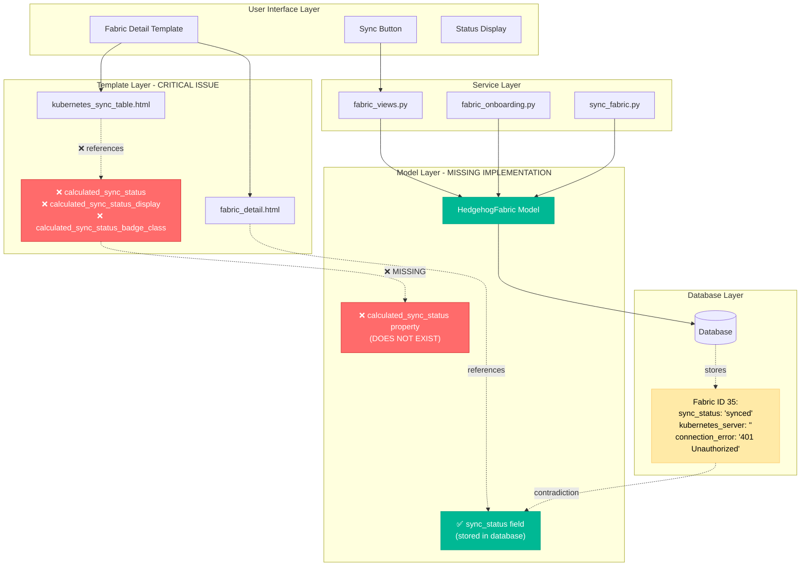
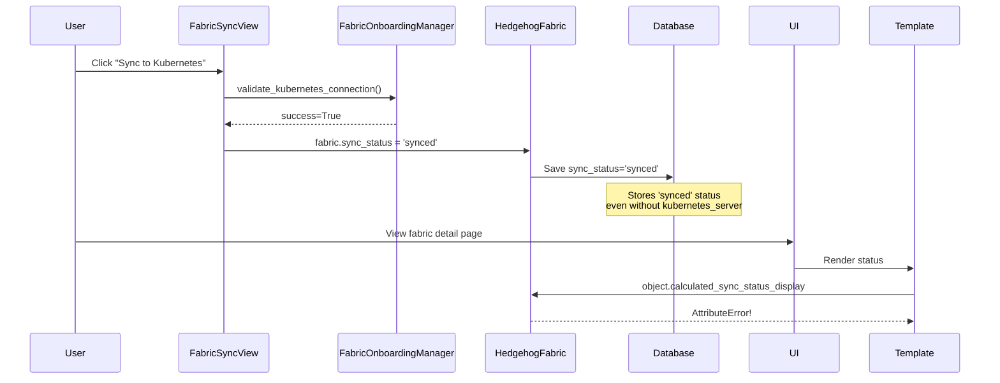

# Fabric Sync Status Architecture Analysis - Issue #40

## System Architecture Diagram



## Data Flow Analysis

### Current Broken Flow

1. **User Interaction**: User views fabric detail page
2. **Template Rendering**: 
   - `fabric_detail.html` uses `object.sync_status` ✅
   - `kubernetes_sync_table.html` uses `object.calculated_sync_status_display` ❌
3. **Model Property Access**: Templates attempt to access non-existent properties
4. **Runtime Error**: `AttributeError: 'HedgehogFabric' object has no attribute 'calculated_sync_status'`

### Service Layer Status Updates



## Root Cause Analysis

### Primary Issue: Template-Model Mismatch

**Problem**: Templates reference `calculated_sync_status` properties that do not exist in the `HedgehogFabric` model.

**Evidence**:
- Template `kubernetes_sync_table.html` line 24: `{{ object.calculated_sync_status_badge_class }}`
- Template `kubernetes_sync_table.html` line 25: `{{ object.calculated_sync_status_display }}`
- Container test: `AttributeError: 'HedgehogFabric' object has no attribute 'calculated_sync_status'`

### Secondary Issue: Status Validation Gap

**Problem**: Services can set `sync_status='synced'` for fabrics without proper configuration.

**Evidence** (Fabric ID 35):
- Database: `sync_status='synced'`
- Database: `kubernetes_server=''` (empty)
- Database: `connection_error='(401) Unauthorized'`

## Architecture Fix Design

### 1. Implement Missing Model Properties

```python
# Add to HedgehogFabric model
@property
def calculated_sync_status(self):
    """Calculate sync status based on configuration and state"""
    # If no kubernetes server configured, cannot be synced
    if not self.kubernetes_server or not self.kubernetes_server.strip():
        return 'not_configured'
    
    # If sync is disabled, cannot be synced
    if not self.sync_enabled:
        return 'disabled'
    
    # If there are errors, show error status
    if self.sync_error and self.sync_error.strip():
        return 'error'
    if self.connection_error and self.connection_error.strip():
        return 'error'
    
    # If never synced, show never_synced
    if not self.last_sync:
        return 'never_synced'
    
    # Calculate time-based status
    time_since_sync = timezone.now() - self.last_sync
    sync_age_seconds = time_since_sync.total_seconds()
    
    if self.sync_interval > 0 and sync_age_seconds > (self.sync_interval * 2):
        return 'out_of_sync'
    elif sync_age_seconds <= self.sync_interval or sync_age_seconds <= 3600:
        return 'in_sync'
    else:
        return 'out_of_sync'

@property
def calculated_sync_status_display(self):
    """Get display-friendly version of calculated sync status"""
    status_map = {
        'not_configured': 'Not Configured',
        'disabled': 'Sync Disabled',
        'never_synced': 'Never Synced',
        'in_sync': 'In Sync',
        'out_of_sync': 'Out of Sync',
        'error': 'Sync Error',
    }
    return status_map.get(self.calculated_sync_status, 'Unknown')

@property
def calculated_sync_status_badge_class(self):
    """Get Bootstrap badge class for sync status display"""
    status_classes = {
        'not_configured': 'bg-secondary text-white',
        'disabled': 'bg-secondary text-white',
        'never_synced': 'bg-warning text-dark',
        'in_sync': 'bg-success text-white',
        'out_of_sync': 'bg-danger text-white',
        'error': 'bg-danger text-white',
    }
    return status_classes.get(self.calculated_sync_status, 'bg-secondary text-white')
```

### 2. Standardize Template Usage

**Action**: Update all templates to use `calculated_sync_status` consistently.

**Implementation**:
- Replace `object.sync_status` with `object.calculated_sync_status` in all templates
- Ensure graceful fallbacks: `{{ object.calculated_sync_status_display|default:"Unknown" }}`

### 3. Validate Service Layer Updates

**Action**: Add validation before setting `sync_status` in services.

**Implementation**:
```python
# Before setting fabric.sync_status = 'synced'
if fabric.calculated_sync_status in ['not_configured', 'disabled']:
    # Don't allow 'synced' status for improperly configured fabrics
    fabric.sync_status = 'error'
else:
    fabric.sync_status = 'synced'
```

## Implementation Priority

1. **CRITICAL**: Implement missing `calculated_sync_status` properties
2. **HIGH**: Update templates to use calculated properties consistently
3. **HIGH**: Add service layer validation
4. **MEDIUM**: Add database migration to clean up invalid sync_status values

## Expected Outcome

After implementation:
- ✅ Templates render without AttributeError
- ✅ Sync status display is consistent across all UI elements
- ✅ Status reflects actual fabric configuration state
- ✅ Users see accurate sync status information