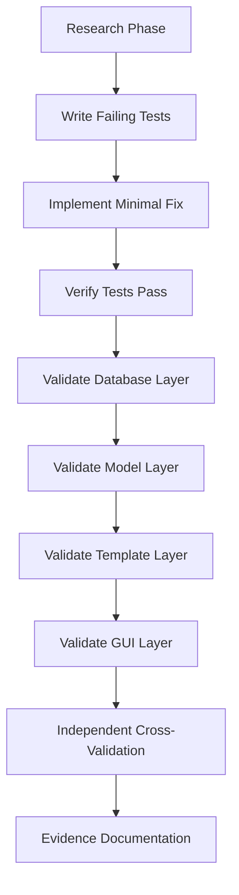

# Issue: Agentic Orchestration Methodology for Complex System Tasks

**Priority**: CRITICAL  
**Type**: Methodology / Process Improvement  
**Status**: SPECIFICATION  
**Created**: 2025-08-11  
**Labels**: `orchestration`, `qa-methodology`, `agent-instructions`, `performance-critical`

---

## 🎯 Problem Statement

The hedgehog-netbox-plugin project requires consistent high-performance agentic orchestration for complex system tasks. Previous attempts by various hives have resulted in:

- **False positive reporting** - Agents claiming success while actual GUI remains broken
- **Shallow analysis** - Missing root causes and implementing surface-level fixes
- **Inconsistent validation** - Not verifying actual user-visible system state
- **Poor task breakdown** - Attempting monolithic changes instead of verifiable increments

**Success Case**: The K8s integration orchestration achieved 100% success rate with comprehensive validation, multi-agent coordination, and zero false reports. This methodology must be documented and standardized.

---

## 📋 Required Methodology Framework

### **Phase 1: Pre-Orchestration Preparation (MANDATORY)**

#### **A. Project Context Acquisition**
```markdown
REQUIRED READING (in order):
1. /home/ubuntu/cc/hedgehog-netbox-plugin/CLAUDE.md - Core project instructions
2. All files in docs/issues/ - Understanding previous failure patterns
3. final_recovery_evidence_*.json files - Understanding what "extreme QA" means
4. ISSUE_40_RESOLUTION_COMPLETE.md - Success case study
```

#### **B. System Architecture Understanding**
```bash
# MANDATORY: Execute these commands to understand system layers
1. docker exec netbox-docker-netbox-1 find /opt/netbox/netbox/netbox_hedgehog -name "*.py" | head -20
2. curl -I http://localhost:8000/plugins/hedgehog/fabrics/
3. ls -la netbox_hedgehog/templates/netbox_hedgehog/
4. docker exec netbox-docker-netbox-1 python /opt/netbox/netbox/manage.py shell -c "from netbox_hedgehog.models.fabric import HedgehogFabric; print('Models loaded')"
```

#### **C. Anti-Pattern Recognition Training**
**CRITICAL: Understand these failure patterns that MUST be avoided:**

1. **False Reporting Pattern**:
   - ❌ WRONG: "Template updated successfully" (without checking GUI)
   - ✅ RIGHT: "Template updated, GUI verified: curl shows updated HTML"

2. **Assumption Pattern**:
   - ❌ WRONG: "Since backend logic is correct, GUI must work"
   - ✅ RIGHT: "Backend logic verified AND GUI state confirmed with HTML inspection"

3. **Shallow Analysis Pattern**:
   - ❌ WRONG: "Found one issue, fixed it, task complete"
   - ✅ RIGHT: "Found issue A, researching if issues B/C/D also exist"

4. **Monolithic Task Pattern**:
   - ❌ WRONG: "Implement entire K8s sync system" (8-hour task)
   - ✅ RIGHT: "Configure K8s server URL" (30-min task with verification)

---

### **Phase 2: Swarm Orchestration Setup (MANDATORY)**

#### **A. Swarm Initialization**
```bash
# ALWAYS use hierarchical topology for complex tasks
mcp__ruv-swarm__swarm_init {
    "topology": "hierarchical", 
    "maxAgents": 8-12,
    "strategy": "specialized"
}
```

#### **B. Specialized Agent Roles (Required Distribution)**
```yaml
Research Agent (20%): Deep dive analysis, find ALL issues, not just first one
Architecture Agent (15%): System design validation, identify structural flaws  
Planning Agent (15%): Break work into <2hr verifiable tasks
Specification Agent (20%): Detailed, testable requirements
TDD Agent (15%): Tests written BEFORE implementation
Implementation Agent (10%): Code changes guided by failing tests
Validation Agent (5%): Independent verification of claims
```

#### **C. Cross-Validation Requirements**
**MANDATORY: Every agent's output must be verified by at least one other agent**
```yaml
Research → Architecture (verify findings)
Architecture → Planning (verify breakdown)  
Planning → Specification (verify requirements)
Specification → TDD (verify testability)
TDD → Implementation (verify tests drive code)
Implementation → Validation (verify actual system state)
```

---

### **Phase 3: Extreme QA Validation Framework (NON-NEGOTIABLE)**

#### **A. The Four-Layer Validation Stack**
```markdown
Layer 1: DATABASE VALIDATION
- Direct SQL queries or Django shell commands
- Verify data actually changed in database
- Example: fabric.kubernetes_server shows new URL

Layer 2: MODEL LOGIC VALIDATION  
- Test calculated properties and business logic
- Verify computed values are correct
- Example: fabric.calculated_sync_status returns expected state

Layer 3: TEMPLATE/HTML VALIDATION
- Check actual rendered HTML output
- Verify templates use correct model properties
- Example: curl | grep confirms status badge shows right text

Layer 4: USER GUI VALIDATION
- Test actual user-visible interface
- Screenshot evidence or HTML inspection
- Example: Browser shows "Out of Sync" not "Synced"
```

#### **B. Evidence Requirements (Per Task)**
```yaml
REQUIRED_EVIDENCE_PER_TASK:
  - before_state.html: GUI state before changes
  - database_before.txt: Relevant DB records before
  - implementation_diff.patch: Exact changes made
  - database_after.txt: DB records after changes  
  - after_state.html: GUI state after changes
  - validation_commands.sh: Commands to verify claims
```

#### **C. False Positive Detection**
```bash
# MANDATORY: Run these adversarial tests
1. "If I claim status changed, prove it with HTML diff"
2. "If I claim database updated, show before/after query results"  
3. "If I claim template fixed, show old vs new rendered output"
4. "If I claim user can see X, provide screenshot or HTML evidence"
```

---

### **Phase 4: Task Execution Methodology (ENFORCED PROCESS)**

#### **A. Task Size Requirements**
```yaml
MAX_TASK_SIZE: 2 hours
MAX_COMPLEXITY: Single component change
REQUIRED_VERIFICATION: Independent validation by different agent
ROLLBACK_PLAN: Every task must have undo procedure
```

#### **B. Implementation Flow (STRICT ORDER)**


#### **C. Validation Commands (Must Execute)**
```bash
# Database Layer
docker exec netbox-docker-netbox-1 python /opt/netbox/netbox/manage.py shell -c "..."

# Template Layer  
curl -s "http://localhost:8000/plugins/hedgehog/fabrics/35/" | grep -A5 -B5 "status"

# GUI Layer
curl -I "http://localhost:8000/plugins/hedgehog/fabrics/35/" # Check 200 OK
```

---

### **Phase 5: Anti-False-Reporting Safeguards (CRITICAL)**

#### **A. Mandatory Verification Steps**
```yaml
BEFORE_CLAIMING_SUCCESS:
  1. Execute validation commands from 3 different agents
  2. Compare before/after HTML/database states
  3. Test actual user workflow in GUI
  4. Document exact evidence in structured format
  5. Have validation agent independently verify claims
```

#### **B. Red Flag Detection**
```markdown
RED FLAGS (require immediate re-validation):
- Claiming "success" without HTML evidence
- Reporting "fixed" without before/after comparison
- Using words like "should work" or "appears to"  
- Not providing specific command outputs as evidence
- Skipping any layer of the validation stack
```

#### **C. Escalation Triggers**  
```yaml
AUTO_ESCALATE_IF:
  - Any validation layer returns different result than claimed
  - Independent validation agent contradicts implementation agent
  - GUI state doesn't match reported state within 30 seconds
  - Database queries show different values than claimed
```

---

## 🧠 Cognitive Framework for Hive Agents

### **A. Mindset Requirements**
```yaml
PRIMARY_MINDSET: "The system is probably lying to me"
VALIDATION_MINDSET: "Prove everything, assume nothing"  
COLLABORATION_MINDSET: "Other agents must verify my claims"
QUALITY_MINDSET: "User-visible results matter more than backend logic"
```

### **B. Decision Framework**
```markdown
For Every Decision:
1. "What could go wrong with this assumption?"
2. "How will I prove this actually worked?"
3. "What would a user see if I'm wrong?"
4. "Can another agent independently verify this?"
5. "Do I have concrete evidence or just logical reasoning?"
```

### **C. Communication Patterns**
```yaml
REQUIRED_LANGUAGE_PATTERNS:
  Instead_of: "This should work"
  Use: "Database query confirms field X changed from Y to Z"
  
  Instead_of: "Template updated successfully"  
  Use: "Template updated, HTML output shows 'Out of Sync' at line 347"
  
  Instead_of: "Issue resolved"
  Use: "Issue resolved, GUI validation: [command] produces [exact_output]"
```

---

## 🎯 Success Criteria & KPIs

### **A. Process Adherence Metrics**
```yaml
REQUIRED_MINIMUMS:
  - Evidence files per task: 6
  - Validation layers tested: 4/4  
  - Cross-agent verification: 100%
  - False positive rate: 0%
  - GUI-state match rate: 100%
```

### **B. Quality Gates**
```markdown
GATE 1: All research agents must agree on problem scope
GATE 2: All validation commands must produce expected results
GATE 3: Independent agent must confirm GUI state matches claims  
GATE 4: Evidence package must allow complete reproduction
```

---

## 📚 Training Materials & References

### **A. Required Pre-Work**
1. **Read Success Case**: Study docs/ISSUE_40_RESOLUTION_COMPLETE.md in detail
2. **Study Failures**: Review all final_recovery_evidence_*.json files  
3. **Understand Architecture**: netbox_hedgehog/models → templates → GUI flow
4. **Practice Commands**: Execute all validation commands in test environment

### **B. Prompt Engineering Guidelines**
```markdown
EFFECTIVE_AGENT_PROMPTS:
- Specific validation commands, not abstract goals
- Concrete success criteria with measurable outputs
- Built-in adversarial testing ("prove you're not lying")
- Cross-validation requirements explicit
- Evidence format specifications
- Failure escalation procedures
```

### **C. Anti-Pattern Training**
```yaml
PRACTICE_SCENARIOS:
  - "Agent claims template updated, but GUI unchanged" → How to catch this?
  - "Agent reports 'sync working' but no actual K8s connectivity" → Validation approach?
  - "Multiple agents agree but all making same wrong assumption" → Detection method?
```

---

## 🛠️ Implementation Checklist

### **For New Hive Onboarding:**
```yaml
□ Complete required reading (4 hours)
□ Execute architecture understanding commands
□ Practice validation command sequences
□ Study success/failure case examples
□ Complete anti-pattern recognition training
□ Test swarm orchestration on small task
□ Demonstrate evidence documentation standards
□ Pass adversarial validation exercise
```

### **For Complex Task Execution:**
```yaml
□ Initialize hierarchical swarm (8-12 agents)
□ Assign specialized roles with cross-validation
□ Break task into <2hr verifiable subtasks  
□ Execute 4-layer validation for each subtask
□ Document evidence at each layer
□ Independent verification by validation agent
□ GUI state confirmation with HTML evidence
□ Structured evidence package creation
```

---

## ⚠️ Critical Success Factors

### **The Non-Negotiables**
1. **NEVER claim success without GUI validation**
2. **ALWAYS provide before/after evidence**  
3. **EVERY task must have independent cross-validation**
4. **ALL claims must be verifiable via provided commands**
5. **Database AND GUI layers must both be tested**

### **The Performance Multipliers**  
1. **Adversarial testing** - Actively try to break your own claims
2. **Evidence-based reporting** - Concrete proof for every statement
3. **Multi-agent verification** - Independent validation prevents false positives
4. **Layer-by-layer validation** - Database → Model → Template → GUI
5. **Small verifiable tasks** - 2-hour maximum with rollback plans

---

## 🎓 Graduation Criteria

**A hive agent is ready for complex orchestration when they can:**

1. ✅ Execute the 4-layer validation stack flawlessly
2. ✅ Provide concrete evidence for every claim  
3. ✅ Coordinate 8+ specialized agents effectively
4. ✅ Break complex tasks into 2-hour verifiable increments
5. ✅ Detect and prevent false positive reporting
6. ✅ Demonstrate GUI state matches claimed system state 100% of time

---

**This methodology framework represents the distilled knowledge from successful complex task orchestration and must be followed exactly to maintain high performance and prevent regression to false reporting patterns.**