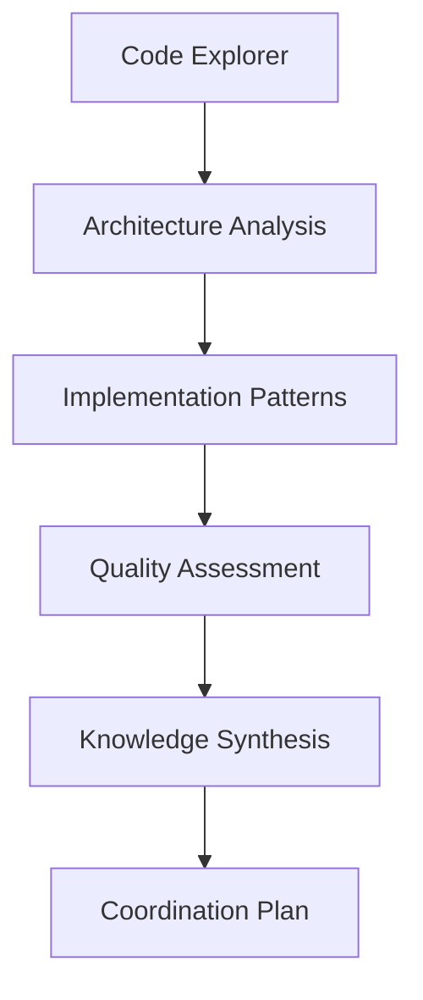
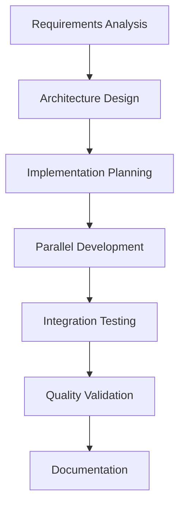
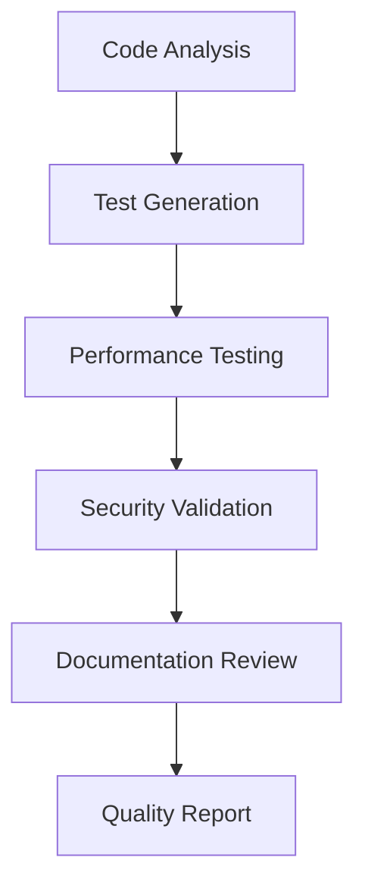

# Hive Mind Coordination Patterns
*Advanced coordination strategies for swarm development*

## 🧠 Hive Mind Architecture

### Core Coordination Principles
1. **Collective Intelligence**: Shared knowledge across all agents
2. **Distributed Decision Making**: Consensus-based task coordination
3. **Memory Persistence**: Cross-session learning and context
4. **Adaptive Workflows**: Self-optimizing development processes

### Agent Specialization Matrix
```
Agent Type          | Primary Focus           | Secondary Skills
--------------------|-------------------------|------------------
Code Explorer      | Structure Analysis      | Pattern Recognition
Implementation      | Feature Development     | Architecture Design
Quality Guardian    | Testing & Validation    | Performance Analysis
Architecture        | System Design          | Integration Planning
Frontend Specialist | UI/UX Implementation   | Accessibility
Backend Specialist  | API & Database Design  | Performance Optimization
Knowledge Synthesis | Documentation          | Pattern Extraction
```

## 🔄 Coordination Workflows

### 1. Project Discovery Workflow


**Implementation:**
```bash
# Phase 1: Discovery (Parallel)
Task("Code Explorer: Analyze repository structure and patterns")
Task("Architecture Specialist: Evaluate system design and integration points")
Task("Quality Guardian: Assess test coverage and validation patterns")

# Phase 2: Analysis (Sequential)
# Wait for discovery completion, then synthesize findings
```

### 2. Feature Development Workflow


**Coordination Pattern:**
```python
# Hive coordination for feature development
coordination_plan = {
    "phase_1_analysis": {
        "agents": ["architect", "implementation", "quality"],
        "execution": "parallel",
        "memory_key": "feature/analysis"
    },
    "phase_2_development": {
        "agents": ["implementation", "frontend", "backend"],
        "execution": "parallel",
        "dependencies": ["phase_1_analysis"],
        "memory_key": "feature/development"
    },
    "phase_3_validation": {
        "agents": ["quality", "architecture"],
        "execution": "sequential",
        "dependencies": ["phase_2_development"],
        "memory_key": "feature/validation"
    }
}
```

### 3. Quality Assurance Workflow


## 🧩 Memory Coordination Patterns

### Shared Memory Structure
```json
{
  "hive": {
    "session_id": "unique-session-identifier",
    "agents": {
      "code_explorer": {
        "findings": "repository analysis results",
        "patterns": "identified code patterns",
        "recommendations": "improvement suggestions"
      },
      "implementation": {
        "completed_tasks": "list of implemented features",
        "current_context": "active development context",
        "next_priorities": "upcoming development tasks"
      },
      "quality_guardian": {
        "test_coverage": "current test metrics",
        "quality_issues": "identified problems",
        "validation_status": "test results"
      }
    },
    "shared_context": {
      "project_state": "current project status",
      "decisions": "architectural and implementation decisions",
      "lessons_learned": "accumulated knowledge"
    }
  }
}
```

### Memory Coordination Commands
```bash
# Store agent findings
npx claude-flow@alpha hooks notify --message "Agent findings" --memory-key "hive/agent-name/findings"

# Retrieve shared context
npx claude-flow@alpha memory retrieve --key "hive/shared_context"

# Update project state
npx claude-flow@alpha memory store --key "hive/project_state" --value "current status"

# Cross-agent communication
npx claude-flow@alpha hooks coordinate --from "agent1" --to "agent2" --message "coordination message"
```

## 🎯 Task Orchestration Patterns

### Priority-Based Task Assignment
```python
def assign_tasks_by_priority(tasks, agents):
    """Assign tasks based on agent specialization and priority"""
    
    priority_matrix = {
        "architecture": ["system_design", "integration", "performance"],
        "implementation": ["coding", "feature_dev", "bug_fixes"],
        "frontend": ["ui_components", "styling", "accessibility"],
        "backend": ["api_development", "database", "services"],
        "quality": ["testing", "validation", "security"],
        "knowledge": ["documentation", "patterns", "synthesis"]
    }
    
    assignments = {}
    for task in sorted(tasks, key=lambda x: x.priority, reverse=True):
        best_agent = find_best_agent(task, agents, priority_matrix)
        assignments[best_agent] = assignments.get(best_agent, []) + [task]
    
    return assignments
```

### Load Balancing Strategy
```python
def balance_agent_workload(assignments, max_concurrent_tasks=3):
    """Balance workload across agents"""
    
    balanced_assignments = {}
    for agent, tasks in assignments.items():
        if len(tasks) > max_concurrent_tasks:
            # Split tasks across multiple cycles
            cycles = [tasks[i:i+max_concurrent_tasks] 
                     for i in range(0, len(tasks), max_concurrent_tasks)]
            balanced_assignments[agent] = cycles
        else:
            balanced_assignments[agent] = [tasks]
    
    return balanced_assignments
```

### Dependency Resolution
```python
def resolve_task_dependencies(tasks):
    """Resolve task dependencies for optimal execution order"""
    
    dependency_graph = build_dependency_graph(tasks)
    execution_order = topological_sort(dependency_graph)
    
    parallel_batches = []
    current_batch = []
    
    for task in execution_order:
        if all(dep in completed_tasks for dep in task.dependencies):
            current_batch.append(task)
        else:
            if current_batch:
                parallel_batches.append(current_batch)
                current_batch = [task]
    
    if current_batch:
        parallel_batches.append(current_batch)
    
    return parallel_batches
```

## 📊 Performance Optimization Patterns

### Parallel Execution Strategy
```bash
# Optimal parallel task execution
# Group related tasks by agent specialization
Task("Code Explorer: Analyze codebase structure")
Task("Architecture: Design system improvements") 
Task("Quality: Assess test coverage and performance")
Task("Implementation: Identify development priorities")

# Execute in parallel with coordination hooks
npx claude-flow@alpha hooks coordinate --mode "parallel" --sync-interval 30
```

### Resource Management
```python
class HiveResourceManager:
    """Manage computational resources across agents"""
    
    def __init__(self, max_concurrent_agents=6):
        self.max_concurrent_agents = max_concurrent_agents
        self.active_agents = {}
        self.task_queue = []
    
    def allocate_agent(self, agent_type, task):
        """Allocate agent for task execution"""
        if len(self.active_agents) < self.max_concurrent_agents:
            agent_id = f"{agent_type}_{len(self.active_agents)}"
            self.active_agents[agent_id] = {
                "type": agent_type,
                "task": task,
                "started": datetime.now()
            }
            return agent_id
        else:
            self.task_queue.append((agent_type, task))
            return None
    
    def release_agent(self, agent_id):
        """Release agent and process queue"""
        if agent_id in self.active_agents:
            del self.active_agents[agent_id]
            
            # Process queue
            if self.task_queue:
                agent_type, task = self.task_queue.pop(0)
                return self.allocate_agent(agent_type, task)
        
        return None
```

## 🔧 Error Handling & Recovery

### Fault Tolerance Patterns
```python
class HiveFaultTolerance:
    """Handle failures and coordinate recovery"""
    
    def handle_agent_failure(self, failed_agent, task):
        """Handle individual agent failures"""
        
        # Store failure context
        failure_context = {
            "agent": failed_agent,
            "task": task,
            "timestamp": datetime.now(),
            "error": self.get_error_details()
        }
        
        # Reassign task to backup agent
        backup_agent = self.find_backup_agent(failed_agent)
        if backup_agent:
            return self.reassign_task(task, backup_agent, failure_context)
        
        # Escalate to swarm coordinator
        return self.escalate_failure(failure_context)
    
    def coordinate_recovery(self, failure_context):
        """Coordinate swarm-wide recovery"""
        
        # Analyze failure pattern
        failure_pattern = self.analyze_failure(failure_context)
        
        # Implement recovery strategy
        if failure_pattern == "resource_exhaustion":
            return self.scale_down_operations()
        elif failure_pattern == "coordination_failure":
            return self.reset_coordination_state()
        else:
            return self.standard_recovery_procedure()
```

### Circuit Breaker Pattern
```python
class HiveCircuitBreaker:
    """Prevent cascade failures in hive coordination"""
    
    def __init__(self, failure_threshold=5, recovery_timeout=60):
        self.failure_threshold = failure_threshold
        self.recovery_timeout = recovery_timeout
        self.failure_count = 0
        self.last_failure_time = None
        self.state = "CLOSED"  # CLOSED, OPEN, HALF_OPEN
    
    def call(self, agent_function, *args, **kwargs):
        """Execute agent function with circuit breaker protection"""
        
        if self.state == "OPEN":
            if self.should_attempt_reset():
                self.state = "HALF_OPEN"
            else:
                raise CircuitBreakerOpenException()
        
        try:
            result = agent_function(*args, **kwargs)
            self.on_success()
            return result
        except Exception as e:
            self.on_failure()
            raise e
    
    def on_success(self):
        """Handle successful execution"""
        self.failure_count = 0
        self.state = "CLOSED"
    
    def on_failure(self):
        """Handle failed execution"""
        self.failure_count += 1
        self.last_failure_time = datetime.now()
        
        if self.failure_count >= self.failure_threshold:
            self.state = "OPEN"
```

## 🎨 Advanced Coordination Techniques

### Consensus Decision Making
```python
class HiveConsensus:
    """Implement consensus mechanisms for agent coordination"""
    
    def __init__(self, agents, threshold=0.6):
        self.agents = agents
        self.threshold = threshold
    
    def reach_consensus(self, proposal):
        """Reach consensus on proposal across agents"""
        
        votes = {}
        for agent in self.agents:
            vote = agent.evaluate_proposal(proposal)
            votes[agent.id] = vote
        
        approval_rate = sum(1 for v in votes.values() if v.approved) / len(votes)
        
        if approval_rate >= self.threshold:
            return ConsensuResult(approved=True, votes=votes, confidence=approval_rate)
        else:
            return self.negotiate_compromise(proposal, votes)
    
    def negotiate_compromise(self, proposal, votes):
        """Negotiate compromise when consensus fails"""
        
        objections = [v.objections for v in votes.values() if not v.approved]
        common_concerns = self.find_common_concerns(objections)
        
        modified_proposal = self.modify_proposal(proposal, common_concerns)
        return self.reach_consensus(modified_proposal)
```

### Emergent Behavior Patterns
```python
class HiveEmergentBehavior:
    """Enable emergent coordination behaviors"""
    
    def __init__(self):
        self.interaction_history = []
        self.behavior_patterns = {}
    
    def observe_interaction(self, agent1, agent2, interaction_type, outcome):
        """Observe agent interactions"""
        
        interaction = {
            "timestamp": datetime.now(),
            "agents": (agent1, agent2),
            "type": interaction_type,
            "outcome": outcome
        }
        
        self.interaction_history.append(interaction)
        self.update_behavior_patterns(interaction)
    
    def identify_emergent_patterns(self):
        """Identify emerging coordination patterns"""
        
        patterns = []
        
        # Analyze interaction frequency
        interaction_pairs = self.analyze_interaction_frequency()
        
        # Identify successful collaboration patterns
        successful_patterns = self.identify_successful_patterns()
        
        # Detect coordination bottlenecks
        bottlenecks = self.detect_coordination_bottlenecks()
        
        return {
            "collaboration_patterns": successful_patterns,
            "interaction_pairs": interaction_pairs,
            "bottlenecks": bottlenecks
        }
```

## 📈 Metrics and Monitoring

### Coordination Effectiveness Metrics
```python
class HiveMetrics:
    """Track hive coordination effectiveness"""
    
    def calculate_coordination_efficiency(self):
        """Calculate overall coordination efficiency"""
        
        metrics = {
            "task_completion_rate": self.get_task_completion_rate(),
            "resource_utilization": self.get_resource_utilization(),
            "communication_overhead": self.get_communication_overhead(),
            "decision_latency": self.get_average_decision_latency(),
            "quality_score": self.get_overall_quality_score()
        }
        
        # Weighted efficiency score
        weights = {
            "task_completion_rate": 0.3,
            "resource_utilization": 0.2,
            "communication_overhead": -0.1,  # Negative weight (overhead is bad)
            "decision_latency": -0.2,        # Negative weight (latency is bad)
            "quality_score": 0.4
        }
        
        efficiency = sum(metrics[key] * weights[key] for key in metrics)
        return efficiency, metrics
```

### Real-time Monitoring Dashboard
```bash
# Monitor hive coordination in real-time
npx claude-flow@alpha monitor --mode "hive" --agents all --metrics detailed --interval 10

# View coordination graph
npx claude-flow@alpha visualize --type "coordination-graph" --export svg

# Generate performance report
npx claude-flow@alpha report --type "coordination-efficiency" --timeframe "24h"
```

---

*This coordination pattern guide synthesizes advanced techniques for managing complex multi-agent development workflows in the Hive Mind architecture.*