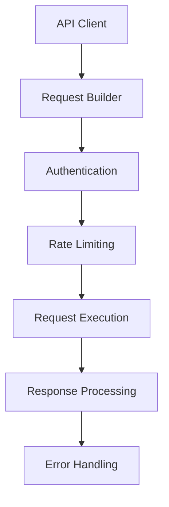

# API Integration Patterns

## Overview

API integration patterns provide consistent, reliable communication between services with proper error handling, rate limiting, and data serialization.

## Architecture Pattern



## Core Components

### 1. REST API Client Pattern

**File**: `api/client.py`

```python
"""
Generic REST API client for external service integration.
Provides consistent patterns for API communication.
"""

import time
import logging
from typing import Dict, Any, Optional, Union, List
import requests
from requests.adapters import HTTPAdapter
from urllib3.util.retry import Retry
from django.core.cache import cache

logger = logging.getLogger(__name__)

class APIError(Exception):
    """Base API error"""
    pass

class APIClient:
    """Generic REST API client with common patterns"""
    
    def __init__(self, base_url: str, auth_token: Optional[str] = None,
                 timeout: int = 30, rate_limit: int = 100):
        """
        Initialize API client.
        
        Args:
            base_url: Base URL for API
            auth_token: Authentication token
            timeout: Request timeout in seconds
            rate_limit: Maximum requests per minute
        """
        self.base_url = base_url.rstrip('/')
        self.auth_token = auth_token
        self.timeout = timeout
        self.rate_limit = rate_limit
        self.session = self._create_session()
        
        # Rate limiting
        self.request_times = []
    
    def _create_session(self) -> requests.Session:
        """Create configured requests session"""
        session = requests.Session()
        
        # Configure retries
        retry_strategy = Retry(
            total=3,
            backoff_factor=1,
            status_forcelist=[429, 500, 502, 503, 504],
            allowed_methods=["HEAD", "GET", "OPTIONS", "POST", "PUT", "PATCH", "DELETE"]
        )
        
        adapter = HTTPAdapter(max_retries=retry_strategy)
        session.mount("http://", adapter)
        session.mount("https://", adapter)
        
        # Set default headers
        session.headers.update({
            'Content-Type': 'application/json',
            'User-Agent': 'Hedgehog-NetBox-Plugin/1.0.0'
        })
        
        if self.auth_token:
            session.headers.update({
                'Authorization': f'Bearer {self.auth_token}'
            })
        
        return session
    
    def _check_rate_limit(self):
        """Check and enforce rate limiting"""
        now = time.time()
        
        # Remove old requests (older than 1 minute)
        self.request_times = [t for t in self.request_times if now - t < 60]
        
        # Check if we're at the rate limit
        if len(self.request_times) >= self.rate_limit:
            sleep_time = 60 - (now - self.request_times[0])
            if sleep_time > 0:
                logger.warning(f"Rate limit reached, sleeping for {sleep_time:.2f} seconds")
                time.sleep(sleep_time)
        
        # Record this request
        self.request_times.append(now)
    
    def request(self, method: str, endpoint: str, **kwargs) -> Dict[str, Any]:
        """
        Make API request with error handling and rate limiting.
        
        Args:
            method: HTTP method
            endpoint: API endpoint (relative to base_url)
            **kwargs: Additional request parameters
            
        Returns:
            Response data
        """
        self._check_rate_limit()
        
        url = f"{self.base_url}/{endpoint.lstrip('/')}"
        
        try:
            response = self.session.request(
                method=method,
                url=url,
                timeout=self.timeout,
                **kwargs
            )
            
            response.raise_for_status()
            
            # Handle different content types
            content_type = response.headers.get('content-type', '')
            
            if 'application/json' in content_type:
                return response.json()
            elif 'text/' in content_type:
                return {'content': response.text}
            else:
                return {'content': response.content}
        
        except requests.exceptions.RequestException as e:
            logger.error(f"API request failed: {method} {url} - {e}")
            raise APIError(f"Request failed: {e}")
    
    def get(self, endpoint: str, params: Optional[Dict] = None) -> Dict[str, Any]:
        """GET request"""
        return self.request('GET', endpoint, params=params)
    
    def post(self, endpoint: str, data: Optional[Dict] = None, 
             json: Optional[Dict] = None) -> Dict[str, Any]:
        """POST request"""
        return self.request('POST', endpoint, data=data, json=json)
    
    def put(self, endpoint: str, data: Optional[Dict] = None,
            json: Optional[Dict] = None) -> Dict[str, Any]:
        """PUT request"""
        return self.request('PUT', endpoint, data=data, json=json)
    
    def delete(self, endpoint: str) -> Dict[str, Any]:
        """DELETE request"""
        return self.request('DELETE', endpoint)
```

### 2. Django REST Framework Integration

**File**: `api/views.py`

```python
"""
REST API views using Django REST Framework.
Provides consistent API endpoints for Hedgehog resources.
"""

from rest_framework import viewsets, status, permissions
from rest_framework.decorators import action
from rest_framework.response import Response
from rest_framework.authentication import TokenAuthentication, SessionAuthentication
from django_filters.rest_framework import DjangoFilterBackend
from django.db.models import Q
from netbox_hedgehog.models import HedgehogFabric, GitRepository
from netbox_hedgehog.api.serializers import HedgehogFabricSerializer, GitRepositorySerializer

class HedgehogFabricViewSet(viewsets.ModelViewSet):
    """API viewset for HedgehogFabric"""
    
    queryset = HedgehogFabric.objects.all()
    serializer_class = HedgehogFabricSerializer
    authentication_classes = [TokenAuthentication, SessionAuthentication]
    permission_classes = [permissions.IsAuthenticated]
    filter_backends = [DjangoFilterBackend]
    filterset_fields = ['sync_status', 'git_sync_enabled', 'enable_k8s_sync']
    search_fields = ['name', 'description']
    ordering_fields = ['name', 'created', 'last_updated']
    
    @action(detail=True, methods=['post'])
    def sync_to_git(self, request, pk=None):
        """Trigger Git sync for fabric"""
        fabric = self.get_object()
        
        # Check permissions
        if not request.user.has_perm('netbox_hedgehog.sync_fabric_git'):
            return Response(
                {'error': 'Permission denied'},
                status=status.HTTP_403_FORBIDDEN
            )
        
        # Trigger async sync task
        from netbox_hedgehog.tasks.git_sync_tasks import sync_fabric_to_git
        task_result = sync_fabric_to_git.delay(fabric.id, force=True)
        
        return Response({
            'message': 'Git sync triggered',
            'task_id': task_result.id,
            'fabric_id': fabric.id
        })
    
    @action(detail=True, methods=['post'])
    def sync_to_k8s(self, request, pk=None):
        """Trigger Kubernetes sync for fabric"""
        fabric = self.get_object()
        
        if not request.user.has_perm('netbox_hedgehog.sync_fabric_k8s'):
            return Response(
                {'error': 'Permission denied'},
                status=status.HTTP_403_FORBIDDEN
            )
        
        from netbox_hedgehog.tasks.k8s_tasks import sync_fabric_to_k8s
        task_result = sync_fabric_to_k8s.delay(fabric.id, force=True)
        
        return Response({
            'message': 'Kubernetes sync triggered',
            'task_id': task_result.id,
            'fabric_id': fabric.id
        })
    
    @action(detail=False, methods=['get'])
    def sync_status(self, request):
        """Get sync status for all fabrics"""
        fabrics = self.get_queryset()
        
        status_data = []
        for fabric in fabrics:
            status_data.append({
                'id': fabric.id,
                'name': fabric.name,
                'sync_status': fabric.sync_status,
                'last_sync_time': fabric.last_sync_time,
                'git_sync_enabled': fabric.git_sync_enabled,
                'k8s_sync_enabled': fabric.enable_k8s_sync,
            })
        
        return Response(status_data)
```

### 3. API Response Serialization

**File**: `api/serializers.py`

```python
"""
API serializers for consistent data formatting.
"""

from rest_framework import serializers
from netbox_hedgehog.models import HedgehogFabric, GitRepository, HedgehogResource

class GitRepositorySerializer(serializers.ModelSerializer):
    """Serializer for GitRepository"""
    
    class Meta:
        model = GitRepository
        fields = [
            'id', 'name', 'url', 'branch', 'auth_type',
            'created', 'last_updated'
        ]
        read_only_fields = ['id', 'created', 'last_updated']

class HedgehogResourceSerializer(serializers.ModelSerializer):
    """Serializer for HedgehogResource"""
    
    class Meta:
        model = HedgehogResource
        fields = [
            'id', 'name', 'resource_type', 'configuration',
            'status', 'created', 'last_updated'
        ]

class HedgehogFabricSerializer(serializers.ModelSerializer):
    """Serializer for HedgehogFabric"""
    
    git_repository = GitRepositorySerializer(read_only=True)
    git_repository_id = serializers.PrimaryKeyRelatedField(
        queryset=GitRepository.objects.all(),
        source='git_repository',
        write_only=True,
        required=False
    )
    resources = HedgehogResourceSerializer(
        source='hedgehogresource_set',
        many=True,
        read_only=True
    )
    resource_count = serializers.SerializerMethodField()
    
    class Meta:
        model = HedgehogFabric
        fields = [
            'id', 'name', 'description', 'asn',
            'spine_count', 'leaf_count',
            'spine_leaf_links', 'vpc_peering_config', 'switch_config',
            'git_repository', 'git_repository_id',
            'git_sync_enabled', 'enable_k8s_sync',
            'sync_status', 'last_sync_time', 'sync_error',
            'resources', 'resource_count',
            'created', 'last_updated'
        ]
        read_only_fields = [
            'id', 'sync_status', 'last_sync_time', 'sync_error',
            'resource_count', 'created', 'last_updated'
        ]
    
    def get_resource_count(self, obj):
        """Get count of associated resources"""
        return obj.hedgehogresource_set.count()
    
    def validate(self, attrs):
        """Validate fabric data"""
        if attrs.get('git_sync_enabled') and not attrs.get('git_repository'):
            raise serializers.ValidationError(
                "Git repository is required when Git sync is enabled"
            )
        
        return attrs
```

### 4. Error Handling and Response Patterns

**File**: `api/error_handlers.py`

```python
"""
API error handling patterns.
"""

import logging
from rest_framework.views import exception_handler
from rest_framework.response import Response
from rest_framework import status
from django.core.exceptions import ValidationError
from django.http import Http404

logger = logging.getLogger(__name__)

def custom_exception_handler(exc, context):
    """Custom exception handler for API errors"""
    
    # Call REST framework's default exception handler
    response = exception_handler(exc, context)
    
    # Handle specific exceptions
    if response is None:
        if isinstance(exc, ValidationError):
            return Response({
                'error': 'Validation failed',
                'details': exc.message_dict if hasattr(exc, 'message_dict') else str(exc),
                'code': 'validation_error'
            }, status=status.HTTP_400_BAD_REQUEST)
        
        elif isinstance(exc, Http404):
            return Response({
                'error': 'Resource not found',
                'details': str(exc),
                'code': 'not_found'
            }, status=status.HTTP_404_NOT_FOUND)
        
        else:
            # Log unexpected errors
            logger.error(f"Unexpected API error: {exc}", exc_info=True)
            return Response({
                'error': 'Internal server error',
                'code': 'internal_error'
            }, status=status.HTTP_500_INTERNAL_SERVER_ERROR)
    
    # Customize standard DRF error responses
    custom_response_data = {
        'error': response.data.get('detail', 'An error occurred'),
        'code': getattr(exc, 'default_code', 'unknown_error'),
        'status_code': response.status_code
    }
    
    # Include field errors for validation errors
    if hasattr(exc, 'detail') and isinstance(exc.detail, dict):
        custom_response_data['field_errors'] = exc.detail
    
    response.data = custom_response_data
    return response
```

## Integration Testing

```python
# tests/test_api_integration.py
from django.test import TestCase
from rest_framework.test import APIClient
from rest_framework.authtoken.models import Token
from django.contrib.auth.models import User
from netbox_hedgehog.models import HedgehogFabric

class TestAPIIntegration(TestCase):
    """Test API integration patterns"""
    
    def setUp(self):
        self.user = User.objects.create_user(
            username='testuser',
            password='testpass'
        )
        self.token = Token.objects.create(user=self.user)
        self.client = APIClient()
        self.client.credentials(HTTP_AUTHORIZATION=f'Token {self.token.key}')
    
    def test_fabric_crud_operations(self):
        """Test CRUD operations via API"""
        # Create
        fabric_data = {
            'name': 'test-api-fabric',
            'description': 'Test fabric via API',
            'asn': 65001
        }
        
        response = self.client.post('/plugins/hedgehog/api/fabrics/', fabric_data)
        self.assertEqual(response.status_code, 201)
        
        fabric_id = response.data['id']
        
        # Read
        response = self.client.get(f'/plugins/hedgehog/api/fabrics/{fabric_id}/')
        self.assertEqual(response.status_code, 200)
        self.assertEqual(response.data['name'], 'test-api-fabric')
        
        # Update
        update_data = {'description': 'Updated description'}
        response = self.client.patch(f'/plugins/hedgehog/api/fabrics/{fabric_id}/', update_data)
        self.assertEqual(response.status_code, 200)
        
        # Delete
        response = self.client.delete(f'/plugins/hedgehog/api/fabrics/{fabric_id}/')
        self.assertEqual(response.status_code, 204)
```

## Configuration and Best Practices

### 1. API Rate Limiting
- Implement proper rate limiting
- Use different limits for different endpoints
- Provide clear error messages for rate limit violations
- Cache rate limit counters efficiently

### 2. Authentication and Security
- Use token-based authentication for APIs
- Implement proper CORS policies
- Validate all input data thoroughly
- Use HTTPS for all API communication

### 3. Response Consistency
- Standardize error response formats
- Include relevant metadata in responses
- Use proper HTTP status codes
- Implement consistent pagination

### 4. Performance Optimization
- Implement response caching where appropriate
- Use database query optimization
- Implement request/response compression
- Monitor API performance metrics

This API integration pattern ensures consistent, secure, and reliable communication between all system components.