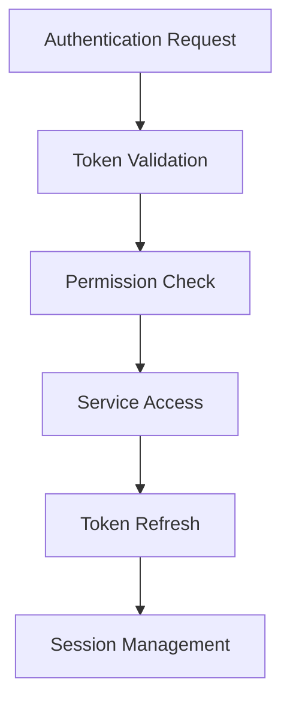

# Authentication Flows Patterns

## Overview

Authentication flow patterns provide secure access control, token management, and credential handling for the Hedgehog NetBox Plugin. This ensures proper authentication across all integrated services.

## Architecture Pattern



## Core Components

### 1. Django Authentication Integration

**File**: `security/decorators.py`

```python
"""
Authentication decorators for Hedgehog NetBox Plugin.
Provides secure authentication and authorization patterns.
"""

import logging
from functools import wraps
from typing import Any, Callable, Optional, List
from django.contrib.auth.decorators import login_required, permission_required
from django.contrib.auth.models import User, Permission
from django.http import HttpRequest, HttpResponse, JsonResponse
from django.core.exceptions import PermissionDenied
from django.views.decorators.csrf import csrf_exempt
from django.utils.decorators import method_decorator
from rest_framework.decorators import api_view, permission_classes
from rest_framework.permissions import IsAuthenticated
from rest_framework.authtoken.models import Token

logger = logging.getLogger(__name__)

def require_hedgehog_permission(permission_name: str):
    """
    Decorator to require specific Hedgehog permission.
    
    Args:
        permission_name: Permission codename (e.g., 'add_hedgehogfabric')
    """
    def decorator(view_func: Callable) -> Callable:
        @wraps(view_func)
        def wrapper(request: HttpRequest, *args, **kwargs) -> HttpResponse:
            if not request.user.is_authenticated:
                raise PermissionDenied("Authentication required")
            
            if not request.user.has_perm(f'netbox_hedgehog.{permission_name}'):
                raise PermissionDenied(f"Missing permission: {permission_name}")
            
            return view_func(request, *args, **kwargs)
        
        return wrapper
    return decorator

def api_authentication_required(view_func: Callable) -> Callable:
    """Decorator for API authentication using token or session"""
    @wraps(view_func)
    def wrapper(request: HttpRequest, *args, **kwargs) -> HttpResponse:
        # Check for API token in header
        auth_header = request.META.get('HTTP_AUTHORIZATION')
        if auth_header and auth_header.startswith('Token '):
            token = auth_header.split(' ')[1]
            try:
                token_obj = Token.objects.get(key=token)
                request.user = token_obj.user
            except Token.DoesNotExist:
                return JsonResponse({'error': 'Invalid token'}, status=401)
        
        # Fall back to session authentication
        elif not request.user.is_authenticated:
            return JsonResponse({'error': 'Authentication required'}, status=401)
        
        return view_func(request, *args, **kwargs)
    
    return wrapper

class HedgehogPermissionMixin:
    """Mixin for view-level permission checking"""
    
    required_permissions = []
    
    def dispatch(self, request, *args, **kwargs):
        if not request.user.is_authenticated:
            raise PermissionDenied("Authentication required")
        
        for permission in self.required_permissions:
            if not request.user.has_perm(f'netbox_hedgehog.{permission}'):
                raise PermissionDenied(f"Missing permission: {permission}")
        
        return super().dispatch(request, *args, **kwargs)
```

### 2. External Service Authentication

**File**: `security/credential_manager.py`

```python
"""
Credential management for external services.
Secure storage and retrieval of API tokens and credentials.
"""

import os
import base64
import logging
from typing import Optional, Dict, Any
from cryptography.fernet import Fernet
from django.conf import settings
from django.core.cache import cache
from django.db import models
from django.contrib.auth.models import User

logger = logging.getLogger(__name__)

class CredentialManager:
    """Secure credential management for external services"""
    
    def __init__(self):
        self.encryption_key = self._get_encryption_key()
        self.fernet = Fernet(self.encryption_key)
    
    def _get_encryption_key(self) -> bytes:
        """Get or generate encryption key"""
        key = getattr(settings, 'HEDGEHOG_ENCRYPTION_KEY', None)
        if not key:
            key = os.environ.get('HEDGEHOG_ENCRYPTION_KEY')
        
        if not key:
            # Generate new key for development (not secure for production)
            key = Fernet.generate_key()
            logger.warning("Using generated encryption key - not suitable for production")
        
        if isinstance(key, str):
            key = key.encode()
        
        return key
    
    def encrypt_credential(self, credential: str) -> str:
        """Encrypt a credential string"""
        try:
            encrypted = self.fernet.encrypt(credential.encode())
            return base64.urlsafe_b64encode(encrypted).decode()
        except Exception as e:
            logger.error(f"Failed to encrypt credential: {e}")
            raise
    
    def decrypt_credential(self, encrypted_credential: str) -> str:
        """Decrypt a credential string"""
        try:
            encrypted_bytes = base64.urlsafe_b64decode(encrypted_credential.encode())
            decrypted = self.fernet.decrypt(encrypted_bytes)
            return decrypted.decode()
        except Exception as e:
            logger.error(f"Failed to decrypt credential: {e}")
            raise
    
    def store_github_token(self, user: User, token: str) -> bool:
        """Store GitHub API token for user"""
        try:
            encrypted_token = self.encrypt_credential(token)
            
            # Store in secure model or cache with expiration
            cache_key = f"github_token:{user.id}"
            cache.set(cache_key, encrypted_token, timeout=86400)  # 24 hours
            
            logger.info(f"Stored GitHub token for user {user.username}")
            return True
        except Exception as e:
            logger.error(f"Failed to store GitHub token: {e}")
            return False
    
    def get_github_token(self, user: Optional[User] = None) -> Optional[str]:
        """Get GitHub API token"""
        try:
            # Try user-specific token first
            if user:
                cache_key = f"github_token:{user.id}"
                encrypted_token = cache.get(cache_key)
                if encrypted_token:
                    return self.decrypt_credential(encrypted_token)
            
            # Fall back to system token
            plugin_config = getattr(settings, 'PLUGINS_CONFIG', {}).get('netbox_hedgehog', {})
            system_token = plugin_config.get('github_api_token')
            if system_token:
                return system_token
            
            # Try environment variable
            return os.environ.get('GITHUB_API_TOKEN')
            
        except Exception as e:
            logger.error(f"Failed to get GitHub token: {e}")
            return None
    
    def store_kubernetes_config(self, user: User, config_data: Dict[str, Any]) -> bool:
        """Store Kubernetes configuration for user"""
        try:
            import json
            config_json = json.dumps(config_data)
            encrypted_config = self.encrypt_credential(config_json)
            
            cache_key = f"k8s_config:{user.id}"
            cache.set(cache_key, encrypted_config, timeout=3600)  # 1 hour
            
            logger.info(f"Stored Kubernetes config for user {user.username}")
            return True
        except Exception as e:
            logger.error(f"Failed to store Kubernetes config: {e}")
            return False
    
    def get_kubernetes_config(self, user: Optional[User] = None) -> Optional[Dict[str, Any]]:
        """Get Kubernetes configuration"""
        try:
            if user:
                cache_key = f"k8s_config:{user.id}"
                encrypted_config = cache.get(cache_key)
                if encrypted_config:
                    import json
                    config_json = self.decrypt_credential(encrypted_config)
                    return json.loads(config_json)
            
            # Fall back to system config
            plugin_config = getattr(settings, 'PLUGINS_CONFIG', {}).get('netbox_hedgehog', {})
            return {
                'config_path': plugin_config.get('kubernetes_config_path'),
                'context': plugin_config.get('kubernetes_context'),
            }
            
        except Exception as e:
            logger.error(f"Failed to get Kubernetes config: {e}")
            return None

# Global credential manager instance
_credential_manager = None

def get_credential_manager() -> CredentialManager:
    """Get global credential manager instance"""
    global _credential_manager
    if _credential_manager is None:
        _credential_manager = CredentialManager()
    return _credential_manager
```

### 3. Role-Based Access Control (RBAC)

**File**: `security/rbac.py`

```python
"""
Role-Based Access Control for Hedgehog NetBox Plugin.
Defines roles and permissions for different user types.
"""

from django.contrib.auth.models import Group, Permission
from django.contrib.contenttypes.models import ContentType
from django.db import transaction
import logging

logger = logging.getLogger(__name__)

class HedgehogRBACManager:
    """RBAC management for Hedgehog plugin"""
    
    ROLES = {
        'hedgehog_admin': {
            'name': 'Hedgehog Administrator',
            'permissions': [
                'add_hedgehogfabric', 'change_hedgehogfabric', 'delete_hedgehogfabric', 'view_hedgehogfabric',
                'add_gitrepository', 'change_gitrepository', 'delete_gitrepository', 'view_gitrepository',
                'add_hedgehogresource', 'change_hedgehogresource', 'delete_hedgehogresource', 'view_hedgehogresource',
                'sync_fabric_git', 'sync_fabric_k8s', 'manage_gitops',
            ]
        },
        'hedgehog_operator': {
            'name': 'Hedgehog Operator',
            'permissions': [
                'view_hedgehogfabric', 'change_hedgehogfabric',
                'view_gitrepository', 'view_hedgehogresource',
                'sync_fabric_git', 'sync_fabric_k8s',
            ]
        },
        'hedgehog_viewer': {
            'name': 'Hedgehog Viewer',
            'permissions': [
                'view_hedgehogfabric', 'view_gitrepository', 'view_hedgehogresource',
            ]
        }
    }
    
    @classmethod
    @transaction.atomic
    def setup_rbac(cls) -> Dict[str, Any]:
        """Set up RBAC roles and permissions"""
        results = {
            'roles_created': 0,
            'permissions_created': 0,
            'errors': []
        }
        
        try:
            # Get content type for Hedgehog models
            from netbox_hedgehog.models import HedgehogFabric, GitRepository, HedgehogResource
            
            content_types = {
                'hedgehogfabric': ContentType.objects.get_for_model(HedgehogFabric),
                'gitrepository': ContentType.objects.get_for_model(GitRepository),
                'hedgehogresource': ContentType.objects.get_for_model(HedgehogResource),
            }
            
            # Create custom permissions
            custom_permissions = [
                ('sync_fabric_git', 'Can sync fabric to Git'),
                ('sync_fabric_k8s', 'Can sync fabric to Kubernetes'),
                ('manage_gitops', 'Can manage GitOps workflows'),
            ]
            
            for codename, name in custom_permissions:
                permission, created = Permission.objects.get_or_create(
                    codename=codename,
                    name=name,
                    content_type=content_types['hedgehogfabric']
                )
                if created:
                    results['permissions_created'] += 1
            
            # Create roles (groups)
            for role_key, role_data in cls.ROLES.items():
                group, created = Group.objects.get_or_create(
                    name=role_data['name']
                )
                
                if created:
                    results['roles_created'] += 1
                
                # Assign permissions to role
                for permission_codename in role_data['permissions']:
                    try:
                        # Find permission
                        permission = Permission.objects.filter(
                            codename=permission_codename
                        ).first()
                        
                        if permission:
                            group.permissions.add(permission)
                        else:
                            logger.warning(f"Permission not found: {permission_codename}")
                    
                    except Exception as e:
                        logger.error(f"Failed to assign permission {permission_codename}: {e}")
                        results['errors'].append(str(e))
            
            logger.info(f"RBAC setup completed: {results}")
            return results
            
        except Exception as e:
            logger.error(f"RBAC setup failed: {e}")
            results['errors'].append(str(e))
            return results
    
    @classmethod
    def assign_role_to_user(cls, user, role_name: str) -> bool:
        """Assign role to user"""
        try:
            group = Group.objects.get(name=role_name)
            user.groups.add(group)
            logger.info(f"Assigned role {role_name} to user {user.username}")
            return True
        except Group.DoesNotExist:
            logger.error(f"Role {role_name} does not exist")
            return False
        except Exception as e:
            logger.error(f"Failed to assign role: {e}")
            return False
```

## Integration Testing Patterns

```python
# tests/test_authentication.py
from django.test import TestCase, Client
from django.contrib.auth.models import User
from rest_framework.authtoken.models import Token
from netbox_hedgehog.security.rbac import HedgehogRBACManager

class TestAuthenticationFlows(TestCase):
    """Test authentication and authorization"""
    
    def setUp(self):
        self.user = User.objects.create_user(
            username='testuser',
            password='testpass'
        )
        self.token = Token.objects.create(user=self.user)
        self.client = Client()
    
    def test_session_authentication(self):
        """Test session-based authentication"""
        self.client.login(username='testuser', password='testpass')
        
        response = self.client.get('/plugins/hedgehog/fabrics/')
        self.assertEqual(response.status_code, 200)
    
    def test_token_authentication(self):
        """Test API token authentication"""
        headers = {'HTTP_AUTHORIZATION': f'Token {self.token.key}'}
        
        response = self.client.get('/plugins/hedgehog/api/fabrics/', **headers)
        self.assertEqual(response.status_code, 200)
    
    def test_rbac_setup(self):
        """Test RBAC role creation"""
        results = HedgehogRBACManager.setup_rbac()
        
        self.assertGreater(results['roles_created'], 0)
        self.assertEqual(len(results['errors']), 0)
```

## Security Best Practices

### 1. Token Management
- Rotate API tokens regularly
- Use short-lived tokens where possible
- Store tokens encrypted
- Implement token revocation

### 2. Permission Control
- Follow principle of least privilege
- Implement role-based access control
- Audit permission changes
- Use resource-level permissions

### 3. Secure Communication
- Use HTTPS for all external communication
- Validate SSL certificates
- Implement proper CORS policies
- Use secure cookie settings

This authentication pattern ensures secure access control across all Hedgehog NetBox Plugin integrations.