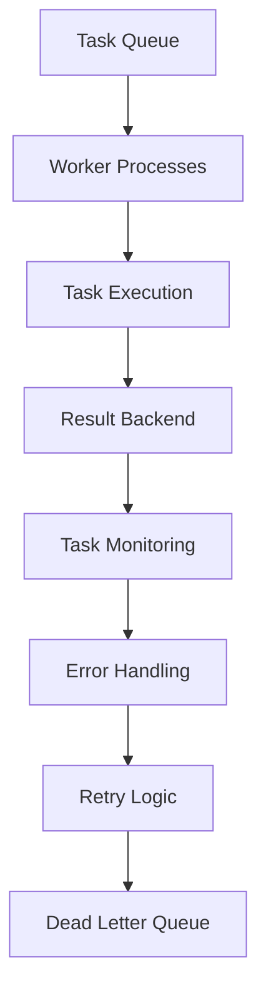

# Celery Async Task Integration Patterns

## Overview

Celery integration enables asynchronous processing for long-running operations, background synchronization, and task orchestration. This document provides patterns for implementing reliable Celery integrations with proper error handling, monitoring, and coordination.

## Architecture Pattern



## Core Integration Components

### 1. Celery Configuration and Setup

**File**: `celery.py` (Already exists, enhanced version below)

```python
"""
Enhanced Celery configuration for HNP background processing.
High-performance async task processing with proper error handling and monitoring.
"""

import os
import logging
from celery import Celery
from celery.signals import (
    task_prerun, task_postrun, task_failure, task_retry,
    worker_ready, worker_shutdown, setup_logging
)
from django.conf import settings
from django.core.cache import cache

# Set default Django settings
os.environ.setdefault('DJANGO_SETTINGS_MODULE', 'netbox.settings')

app = Celery('hedgehog_netbox_plugin')

# Load configuration from Django settings with 'CELERY_' prefix
app.config_from_object('django.conf:settings', namespace='CELERY')

# Auto-discover tasks from all Django apps
app.autodiscover_tasks()

# Enhanced configuration for production use
app.conf.update(
    # Task routing for queue specialization
    task_routes={
        # Git/GitHub operations
        'netbox_hedgehog.tasks.git_sync_tasks.sync_fabric_to_git': {'queue': 'git_sync', 'priority': 7},
        'netbox_hedgehog.tasks.git_sync_tasks.sync_repository_changes': {'queue': 'git_sync', 'priority': 8},
        'netbox_hedgehog.tasks.git_sync_tasks.validate_pull_request': {'queue': 'git_sync', 'priority': 6},
        
        # Kubernetes operations
        'netbox_hedgehog.tasks.k8s_tasks.sync_fabric_to_k8s': {'queue': 'kubernetes', 'priority': 8},
        'netbox_hedgehog.tasks.k8s_tasks.watch_fabric_resources': {'queue': 'kubernetes', 'priority': 7},
        'netbox_hedgehog.tasks.k8s_tasks.update_crd_status': {'queue': 'kubernetes', 'priority': 6},
        
        # Cache operations
        'netbox_hedgehog.tasks.cache_tasks.refresh_fabric_cache': {'queue': 'cache_refresh', 'priority': 4},
        'netbox_hedgehog.tasks.cache_tasks.invalidate_cache': {'queue': 'cache_refresh', 'priority': 5},
        
        # Monitoring and metrics
        'netbox_hedgehog.tasks.monitoring_tasks.collect_metrics': {'queue': 'monitoring', 'priority': 3},
        'netbox_hedgehog.tasks.monitoring_tasks.health_check': {'queue': 'monitoring', 'priority': 5},
        
        # Background maintenance
        'netbox_hedgehog.tasks.maintenance_tasks.cleanup_old_data': {'queue': 'maintenance', 'priority': 2},
        'netbox_hedgehog.tasks.maintenance_tasks.backup_configurations': {'queue': 'maintenance', 'priority': 3},
    },
    
    # Worker optimization
    worker_prefetch_multiplier=2,
    task_acks_late=True,
    worker_disable_rate_limits=False,
    worker_max_tasks_per_child=1000,  # Restart workers after 1000 tasks
    
    # Task execution settings
    task_always_eager=False,  # Never use eager mode in production
    task_eager_propagates=True,
    task_ignore_result=False,
    task_store_eager_result=True,
    
    # Task priority support
    task_inherit_parent_priority=True,
    task_default_priority=5,
    task_queue_max_priority=10,
    
    # Result backend optimization
    result_expires=3600,  # 1 hour
    result_compression='gzip',
    result_accept_content=['json', 'pickle'],
    result_serializer='json',
    
    # Task serialization
    task_serializer='json',
    accept_content=['json'],
    
    # Monitoring and visibility
    task_send_sent_event=True,
    task_track_started=True,
    task_publish_retry=True,
    task_publish_retry_policy={
        'max_retries': 3,
        'interval_start': 0.2,
        'interval_step': 0.5,
        'interval_max': 5.0,
    },
    
    # Error handling and retries
    task_reject_on_worker_lost=True,
    task_acks_on_failure_or_timeout=True,
    task_default_retry_delay=60,  # 1 minute
    task_max_retries=3,
    
    # Security
    worker_hijack_root_logger=False,
    
    # Timezone
    timezone='UTC',
    enable_utc=True,
)

# Queue configurations
app.conf.task_create_missing_queues = True

# Beat schedule for periodic tasks
app.conf.beat_schedule = {
    # Fabric synchronization tasks
    'sync-all-fabrics-to-git': {
        'task': 'netbox_hedgehog.tasks.git_sync_tasks.sync_all_fabrics_to_git',
        'schedule': 300.0,  # 5 minutes
        'options': {'queue': 'git_sync', 'priority': 6}
    },
    
    'sync-all-fabrics-to-k8s': {
        'task': 'netbox_hedgehog.tasks.k8s_tasks.sync_all_fabrics_to_k8s',
        'schedule': 180.0,  # 3 minutes
        'options': {'queue': 'kubernetes', 'priority': 7}
    },
    
    # Cache maintenance tasks
    'refresh-all-fabric-caches': {
        'task': 'netbox_hedgehog.tasks.cache_tasks.refresh_all_fabric_caches',
        'schedule': 300.0,  # 5 minutes
        'options': {'queue': 'cache_refresh', 'priority': 4}
    },
    
    'cleanup-expired-cache': {
        'task': 'netbox_hedgehog.tasks.cache_tasks.cleanup_expired_cache',
        'schedule': 1800.0,  # 30 minutes
        'options': {'queue': 'cache_refresh', 'priority': 2}
    },
    
    # Health monitoring tasks
    'check-kubernetes-health': {
        'task': 'netbox_hedgehog.tasks.monitoring_tasks.check_kubernetes_health',
        'schedule': 120.0,  # 2 minutes
        'options': {'queue': 'monitoring', 'priority': 6}
    },
    
    'check-github-api-health': {
        'task': 'netbox_hedgehog.tasks.monitoring_tasks.check_github_api_health',
        'schedule': 180.0,  # 3 minutes
        'options': {'queue': 'monitoring', 'priority': 5}
    },
    
    # Performance metrics collection
    'collect-task-performance-metrics': {
        'task': 'netbox_hedgehog.tasks.monitoring_tasks.collect_task_performance_metrics',
        'schedule': 60.0,  # 1 minute
        'options': {'queue': 'monitoring', 'priority': 4}
    },
    
    # Maintenance tasks
    'cleanup-old-task-results': {
        'task': 'netbox_hedgehog.tasks.maintenance_tasks.cleanup_old_task_results',
        'schedule': 3600.0,  # 1 hour
        'options': {'queue': 'maintenance', 'priority': 2}
    },
    
    'rotate-logs': {
        'task': 'netbox_hedgehog.tasks.maintenance_tasks.rotate_logs',
        'schedule': 86400.0,  # 24 hours
        'options': {'queue': 'maintenance', 'priority': 1}
    },
}

# Custom task logger setup
@setup_logging.connect
def setup_task_logging(logger, **kwargs):
    """Setup custom logging for Celery tasks"""
    # Add custom handlers and formatters
    pass

# Signal handlers for comprehensive monitoring
logger = logging.getLogger('netbox_hedgehog.celery')

@task_prerun.connect
def task_prerun_handler(sender=None, task_id=None, task=None, args=None, kwargs=None, **kwds):
    """Handle task start events"""
    # Update task start time in cache
    cache.set(f"task_start:{task_id}", {
        'task_name': task.name,
        'start_time': time.time(),
        'args': str(args)[:200],  # Truncate large args
        'kwargs': str(kwargs)[:200],
    }, timeout=3600)
    
    logger.info(f"Task started: {task.name} [{task_id}]")

@task_postrun.connect
def task_postrun_handler(sender=None, task_id=None, task=None, args=None, kwargs=None, 
                        retval=None, state=None, **kwds):
    """Handle task completion events"""
    start_info = cache.get(f"task_start:{task_id}")
    if start_info:
        duration = time.time() - start_info['start_time']
        
        # Store task metrics
        cache.set(f"task_metrics:{task_id}", {
            'task_name': task.name,
            'duration': duration,
            'state': state,
            'completed_at': time.time(),
        }, timeout=3600)
        
        logger.info(f"Task completed: {task.name} [{task_id}] in {duration:.2f}s with state: {state}")
        
        # Clean up start info
        cache.delete(f"task_start:{task_id}")

@task_failure.connect
def task_failure_handler(sender=None, task_id=None, exception=None, traceback=None, einfo=None, **kwds):
    """Handle task failure events"""
    logger.error(f"Task failed: {sender.name} [{task_id}] - {exception}")
    
    # Store failure information
    cache.set(f"task_failure:{task_id}", {
        'task_name': sender.name,
        'exception': str(exception),
        'failed_at': time.time(),
        'traceback': str(traceback)[:1000],  # Truncate long tracebacks
    }, timeout=3600)

@task_retry.connect
def task_retry_handler(sender=None, task_id=None, reason=None, einfo=None, **kwds):
    """Handle task retry events"""
    logger.warning(f"Task retry: {sender.name} [{task_id}] - {reason}")
    
    # Update retry count
    retry_key = f"task_retries:{task_id}"
    retry_count = cache.get(retry_key, 0) + 1
    cache.set(retry_key, retry_count, timeout=3600)

@worker_ready.connect
def worker_ready_handler(sender=None, **kwds):
    """Handle worker ready events"""
    logger.info(f"Celery worker ready: {sender.hostname}")

@worker_shutdown.connect
def worker_shutdown_handler(sender=None, **kwds):
    """Handle worker shutdown events"""
    logger.info(f"Celery worker shutting down: {sender.hostname}")

# Debug task for testing
@app.task(bind=True)
def debug_task(self):
    """Debug task for testing Celery configuration"""
    logger.info(f'Debug task request: {self.request!r}')
    return {'status': 'success', 'request': str(self.request)}

# Health check task
@app.task(bind=True)
def health_check_task(self):
    """Health check task for monitoring"""
    try:
        # Perform basic health checks
        from django.db import connection
        cursor = connection.cursor()
        cursor.execute("SELECT 1")
        
        return {
            'status': 'healthy',
            'timestamp': time.time(),
            'worker': self.request.hostname,
        }
    except Exception as e:
        return {
            'status': 'unhealthy',
            'error': str(e),
            'timestamp': time.time(),
            'worker': self.request.hostname,
        }
```

### 2. Git Synchronization Tasks

**File**: `tasks/git_sync_tasks.py` (Enhanced version)

```python
"""
Enhanced Git synchronization tasks for Celery processing.
Handles all Git/GitHub operations asynchronously with proper error handling.
"""

import logging
import time
from typing import Dict, Any, List, Optional
from celery import shared_task, group, chain
from celery.exceptions import Retry, MaxRetriesExceededError
from django.core.cache import cache
from django.db import transaction
from netbox_hedgehog.models import HedgehogFabric, GitRepository, HedgehogGitOpsSyncStatus
from netbox_hedgehog.services.github_sync_service import GitHubSyncService, GitHubAPIError
from netbox_hedgehog.services.gitops_integration import create_gitops_workflow, GitOpsError
from netbox_hedgehog.utils.git_providers import GitRepositoryManager, GitRepositoryError

logger = logging.getLogger(__name__)

class GitSyncError(Exception):
    """Git synchronization error"""
    pass

@shared_task(bind=True, autoretry_for=(GitHubAPIError, GitRepositoryError), 
             retry_kwargs={'max_retries': 3, 'countdown': 60})
def sync_fabric_to_git(self, fabric_id: int, force: bool = False) -> Dict[str, Any]:
    """
    Synchronize a fabric to its Git repository.
    
    Args:
        fabric_id: HedgehogFabric ID
        force: Force sync even if no changes detected
        
    Returns:
        Sync result dictionary
    """
    start_time = time.time()
    
    try:
        logger.info(f"Starting Git sync for fabric ID {fabric_id}")
        
        # Get fabric with related data
        with transaction.atomic():
            fabric = HedgehogFabric.objects.select_related('git_repository').get(id=fabric_id)
            
            if not fabric.git_repository:
                raise GitSyncError(f"No Git repository configured for fabric {fabric.name}")
            
            git_repo = fabric.git_repository
        
        # Check if sync is needed (unless forced)
        if not force and not _should_sync_fabric(fabric):
            logger.info(f"No sync needed for fabric {fabric.name}")
            return {
                'status': 'skipped',
                'fabric_name': fabric.name,
                'reason': 'no_changes',
                'duration': time.time() - start_time
            }
        
        # Create GitOps workflow
        workflow = create_gitops_workflow(
            fabric_name=fabric.name,
            repository_url=git_repo.url,
            branch=git_repo.branch or 'main'
        )
        
        try:
            # Initialize GitOps repository if needed
            init_result = workflow.initialize_gitops_repository()
            
            # Prepare fabric data for sync
            fabric_data = _prepare_fabric_data(fabric)
            
            # Sync to Git
            sync_result = workflow.sync_fabric_to_git(fabric_data)
            
            # Update sync status
            with transaction.atomic():
                _update_sync_status(fabric, git_repo, sync_result, success=True)
            
            duration = time.time() - start_time
            logger.info(f"Successfully synced fabric {fabric.name} to Git in {duration:.2f}s")
            
            # Trigger downstream sync to Kubernetes if enabled
            if fabric.enable_k8s_sync:
                sync_fabric_to_k8s.apply_async(args=[fabric_id], countdown=30)
            
            return {
                'status': 'success',
                'fabric_name': fabric.name,
                'repository': git_repo.url,
                'commit_sha': sync_result.get('commit_sha'),
                'files_updated': sync_result.get('files_updated', 0),
                'duration': duration,
                'init_result': init_result,
                'sync_result': sync_result
            }
            
        finally:
            workflow.cleanup()
    
    except (GitHubAPIError, GitRepositoryError, GitOpsError) as e:
        logger.error(f"Retryable error syncing fabric {fabric_id} to Git: {e}")
        
        # Update failure status
        try:
            with transaction.atomic():
                fabric = HedgehogFabric.objects.get(id=fabric_id)
                _update_sync_status(fabric, fabric.git_repository, None, 
                                  success=False, error=str(e))
        except Exception:
            pass  # Don't fail the retry due to status update issues
        
        # Retry with exponential backoff
        raise self.retry(exc=e, countdown=min(2 ** self.request.retries * 60, 3600))
        
    except Exception as e:
        logger.error(f"Non-retryable error syncing fabric {fabric_id} to Git: {e}")
        
        # Update failure status
        try:
            with transaction.atomic():
                fabric = HedgehogFabric.objects.get(id=fabric_id)
                _update_sync_status(fabric, fabric.git_repository, None, 
                                  success=False, error=str(e))
        except Exception:
            pass
        
        return {
            'status': 'error',
            'fabric_id': fabric_id,
            'error': str(e),
            'duration': time.time() - start_time
        }

@shared_task(bind=True)
def sync_all_fabrics_to_git(self) -> Dict[str, Any]:
    """
    Synchronize all fabrics to their Git repositories.
    
    Returns:
        Bulk sync result
    """
    try:
        logger.info("Starting bulk Git sync for all fabrics")
        
        # Get all fabrics with Git repositories
        fabrics = HedgehogFabric.objects.filter(
            git_repository__isnull=False,
            git_sync_enabled=True
        ).select_related('git_repository')
        
        if not fabrics:
            logger.info("No fabrics configured for Git sync")
            return {
                'status': 'success',
                'message': 'No fabrics to sync',
                'fabric_count': 0
            }
        
        # Create group of sync tasks
        sync_jobs = group([
            sync_fabric_to_git.s(fabric.id) 
            for fabric in fabrics
        ])
        
        # Execute all sync tasks
        job_result = sync_jobs.apply_async()
        
        # Wait for completion (with timeout)
        results = job_result.get(timeout=1800, propagate=False)  # 30 minutes
        
        # Analyze results
        success_count = sum(1 for result in results if result.get('status') == 'success')
        error_count = sum(1 for result in results if result.get('status') == 'error')
        skipped_count = sum(1 for result in results if result.get('status') == 'skipped')
        
        logger.info(f"Bulk Git sync completed: {success_count} success, {error_count} errors, {skipped_count} skipped")
        
        return {
            'status': 'completed',
            'total_fabrics': len(fabrics),
            'success_count': success_count,
            'error_count': error_count,
            'skipped_count': skipped_count,
            'results': results
        }
        
    except Exception as e:
        logger.error(f"Bulk Git sync failed: {e}")
        return {
            'status': 'error',
            'error': str(e)
        }

@shared_task(bind=True, autoretry_for=(GitHubAPIError,), 
             retry_kwargs={'max_retries': 3, 'countdown': 120})
def sync_repository_changes(self, repo_full_name: str, branch: str, commits: List[Dict[str, Any]]):
    """
    Process repository changes from webhook events.
    
    Args:
        repo_full_name: Repository full name (owner/repo)
        branch: Branch that was updated
        commits: List of commit information
    """
    try:
        logger.info(f"Processing repository changes: {repo_full_name}:{branch}")
        
        # Find fabrics using this repository
        git_repos = GitRepository.objects.filter(
            url__contains=repo_full_name,
            branch=branch
        ).select_related('fabric')
        
        if not git_repos:
            logger.info(f"No fabrics found for repository {repo_full_name}:{branch}")
            return {
                'status': 'success',
                'message': 'No matching fabrics found'
            }
        
        # Process each affected fabric
        results = []
        for git_repo in git_repos:
            try:
                # Trigger sync from Git to Kubernetes
                result = sync_git_to_kubernetes.apply_async(
                    args=[git_repo.fabric.id],
                    countdown=60  # Wait 1 minute for changes to propagate
                )
                
                results.append({
                    'fabric_name': git_repo.fabric.name,
                    'task_id': result.id,
                    'status': 'triggered'
                })
                
            except Exception as e:
                logger.error(f"Failed to trigger sync for fabric {git_repo.fabric.name}: {e}")
                results.append({
                    'fabric_name': git_repo.fabric.name,
                    'status': 'error',
                    'error': str(e)
                })
        
        return {
            'status': 'success',
            'repository': repo_full_name,
            'branch': branch,
            'commit_count': len(commits),
            'affected_fabrics': len(results),
            'results': results
        }
        
    except Exception as e:
        logger.error(f"Failed to process repository changes: {e}")
        raise self.retry(exc=e)

@shared_task(bind=True)
def validate_pull_request(self, repo_full_name: str, pr_number: int) -> Dict[str, Any]:
    """
    Validate pull request changes for GitOps compliance.
    
    Args:
        repo_full_name: Repository full name
        pr_number: Pull request number
        
    Returns:
        Validation result
    """
    try:
        logger.info(f"Validating pull request {repo_full_name}#{pr_number}")
        
        # Get GitHub service
        github_service = GitHubSyncService()
        owner, repo = repo_full_name.split('/')
        
        # Get PR information
        pr_info = github_service.get_pull_request(owner, repo, pr_number)
        
        # Get changed files
        changed_files = github_service.get_pull_request_files(owner, repo, pr_number)
        
        validation_results = []
        
        # Validate each changed file
        for file_info in changed_files:
            file_path = file_info['filename']
            
            # Skip non-YAML files
            if not file_path.endswith(('.yaml', '.yml')):
                continue
            
            try:
                # Get file content
                file_content = github_service.get_file_content(
                    owner, repo, file_path, ref=pr_info['head']['sha']
                )
                
                # Validate YAML syntax
                yaml_validation = _validate_yaml_content(file_content['content'])
                
                # Validate Hedgehog-specific schemas
                schema_validation = _validate_hedgehog_schemas(file_content['content'], file_path)
                
                validation_results.append({
                    'file': file_path,
                    'yaml_valid': yaml_validation['valid'],
                    'schema_valid': schema_validation['valid'],
                    'errors': yaml_validation.get('errors', []) + schema_validation.get('errors', [])
                })
                
            except Exception as e:
                validation_results.append({
                    'file': file_path,
                    'yaml_valid': False,
                    'schema_valid': False,
                    'errors': [f"Validation error: {e}"]
                })
        
        # Create validation status
        all_valid = all(
            result['yaml_valid'] and result['schema_valid'] 
            for result in validation_results
        )
        
        # Post comment on PR with validation results
        if validation_results:
            comment_body = _generate_validation_comment(validation_results, all_valid)
            github_service.create_pull_request_comment(owner, repo, pr_number, comment_body)
        
        return {
            'status': 'success',
            'repository': repo_full_name,
            'pr_number': pr_number,
            'all_valid': all_valid,
            'files_validated': len(validation_results),
            'validation_results': validation_results
        }
        
    except Exception as e:
        logger.error(f"Failed to validate pull request: {e}")
        return {
            'status': 'error',
            'error': str(e)
        }

def _should_sync_fabric(fabric: HedgehogFabric) -> bool:
    """Check if fabric needs to be synced"""
    # Check last sync time
    last_sync_key = f"fabric_last_sync:{fabric.id}"
    last_sync = cache.get(last_sync_key)
    
    if not last_sync:
        return True
    
    # Check if fabric was modified since last sync
    if fabric.last_updated and fabric.last_updated.timestamp() > last_sync:
        return True
    
    # Check if related resources were modified
    # This is a simplified check - in production, you might want more granular tracking
    return False

def _prepare_fabric_data(fabric: HedgehogFabric) -> Dict[str, Any]:
    """Prepare fabric data for Git sync"""
    return {
        'name': fabric.name,
        'description': fabric.description or '',
        'asn': fabric.asn or 65000,
        'spine_count': fabric.spine_count or 0,
        'leaf_count': fabric.leaf_count or 0,
        'spine_leaf_links': fabric.spine_leaf_links or {},
        'vpc_peering_config': fabric.vpc_peering_config or {},
        'switch_config': fabric.switch_config or {},
        # Add more fields as needed
    }

def _update_sync_status(fabric: HedgehogFabric, git_repo: GitRepository, 
                       sync_result: Optional[Dict[str, Any]], success: bool, 
                       error: Optional[str] = None):
    """Update fabric sync status"""
    try:
        sync_status, created = HedgehogGitOpsSyncStatus.objects.get_or_create(
            fabric=fabric,
            defaults={
                'last_sync_time': timezone.now(),
                'sync_status': 'success' if success else 'failed',
                'last_commit_sha': sync_result.get('commit_sha') if sync_result else None,
                'error_message': error,
                'files_synced': sync_result.get('files_updated', 0) if sync_result else 0,
            }
        )
        
        if not created:
            sync_status.last_sync_time = timezone.now()
            sync_status.sync_status = 'success' if success else 'failed'
            sync_status.error_message = error
            if sync_result:
                sync_status.last_commit_sha = sync_result.get('commit_sha')
                sync_status.files_synced = sync_result.get('files_updated', 0)
            sync_status.save()
        
        # Update cache
        cache.set(f"fabric_last_sync:{fabric.id}", time.time(), timeout=3600)
        
    except Exception as e:
        logger.error(f"Failed to update sync status: {e}")

def _validate_yaml_content(content: str) -> Dict[str, Any]:
    """Validate YAML syntax"""
    try:
        import yaml
        yaml.safe_load(content)
        return {'valid': True}
    except yaml.YAMLError as e:
        return {
            'valid': False,
            'errors': [f"YAML syntax error: {e}"]
        }

def _validate_hedgehog_schemas(content: str, file_path: str) -> Dict[str, Any]:
    """Validate Hedgehog-specific schemas"""
    try:
        import yaml
        data = yaml.safe_load(content)
        
        # Basic validation for Hedgehog resources
        if not isinstance(data, dict):
            return {
                'valid': False,
                'errors': ['Invalid YAML: expected object at root']
            }
        
        # Check required fields for different resource types
        api_version = data.get('apiVersion')
        kind = data.get('kind')
        
        if api_version and 'githedgehog.com' in api_version:
            if not kind:
                return {
                    'valid': False,
                    'errors': ['Missing required field: kind']
                }
            
            if not data.get('metadata', {}).get('name'):
                return {
                    'valid': False,
                    'errors': ['Missing required field: metadata.name']
                }
        
        return {'valid': True}
        
    except Exception as e:
        return {
            'valid': False,
            'errors': [f"Schema validation error: {e}"]
        }

def _generate_validation_comment(validation_results: List[Dict[str, Any]], all_valid: bool) -> str:
    """Generate validation comment for PR"""
    if all_valid:
        return """✅ **GitOps Validation Passed**

All YAML files in this pull request are valid and conform to Hedgehog schemas.

*Validation performed by Hedgehog NetBox Plugin*"""
    
    comment = """❌ **GitOps Validation Failed**

The following issues were found in this pull request:

"""
    
    for result in validation_results:
        if not (result['yaml_valid'] and result['schema_valid']):
            comment += f"\n**{result['file']}:**\n"
            for error in result['errors']:
                comment += f"- {error}\n"
    
    comment += "\n*Please fix these issues before merging. Validation performed by Hedgehog NetBox Plugin*"
    
    return comment
```

### 3. Kubernetes Synchronization Tasks

**File**: `tasks/k8s_tasks.py`

```python
"""
Kubernetes synchronization tasks for Celery processing.
Handles Kubernetes CRD operations and resource watching.
"""

import logging
import time
from typing import Dict, Any, List, Optional
from celery import shared_task, group
from celery.exceptions import Retry
from django.core.cache import cache
from django.db import transaction
from kubernetes.client.rest import ApiException
from netbox_hedgehog.models import HedgehogFabric
from netbox_hedgehog.utils.kubernetes import get_kubernetes_client
from netbox_hedgehog.utils.crd_schemas import CRDManager, HedgehogFabricCRD, HedgehogFabricSpec
from netbox_hedgehog.utils.k8s_error_handler import retry_k8s_operation, KubernetesError

logger = logging.getLogger(__name__)

@shared_task(bind=True, autoretry_for=(KubernetesError, ApiException),
             retry_kwargs={'max_retries': 3, 'countdown': 120})
def sync_fabric_to_k8s(self, fabric_id: int, force: bool = False) -> Dict[str, Any]:
    """
    Synchronize fabric to Kubernetes CRD.
    
    Args:
        fabric_id: HedgehogFabric ID
        force: Force sync even if no changes detected
        
    Returns:
        Sync result dictionary
    """
    start_time = time.time()
    
    try:
        logger.info(f"Starting Kubernetes sync for fabric ID {fabric_id}")
        
        # Get fabric
        with transaction.atomic():
            fabric = HedgehogFabric.objects.get(id=fabric_id)
        
        # Check if sync is needed
        if not force and not _should_sync_fabric_to_k8s(fabric):
            logger.info(f"No K8s sync needed for fabric {fabric.name}")
            return {
                'status': 'skipped',
                'fabric_name': fabric.name,
                'reason': 'no_changes',
                'duration': time.time() - start_time
            }
        
        # Get Kubernetes client and CRD manager
        k8s_client = get_kubernetes_client()
        crd_manager = CRDManager(k8s_client)
        
        # Prepare fabric CRD
        fabric_spec = _prepare_fabric_spec(fabric)
        fabric_crd = HedgehogFabricCRD(
            metadata={
                'name': fabric.name.lower(),
                'namespace': 'hedgehog-system',
                'labels': {
                    'managed-by': 'hedgehog-netbox-plugin',
                    'fabric-id': str(fabric.id)
                }
            },
            spec=fabric_spec
        )
        
        # Check if CRD already exists
        existing_crd = crd_manager.get_fabric(fabric.name.lower())
        
        if existing_crd:
            # Update existing CRD
            result = crd_manager.update_fabric(fabric.name.lower(), fabric_crd)
            action = 'updated'
        else:
            # Create new CRD
            result = crd_manager.create_fabric(fabric_crd)
            action = 'created'
        
        # Update fabric with Kubernetes info
        with transaction.atomic():
            fabric = HedgehogFabric.objects.get(id=fabric_id)
            fabric.k8s_resource_name = fabric.name.lower()
            fabric.k8s_sync_status = 'synced'
            fabric.last_k8s_sync = timezone.now()
            fabric.save(update_fields=['k8s_resource_name', 'k8s_sync_status', 'last_k8s_sync'])
        
        duration = time.time() - start_time
        logger.info(f"Successfully {action} fabric {fabric.name} in Kubernetes in {duration:.2f}s")
        
        # Update cache
        cache.set(f"fabric_k8s_sync:{fabric.id}", time.time(), timeout=3600)
        
        return {
            'status': 'success',
            'fabric_name': fabric.name,
            'action': action,
            'k8s_resource_name': fabric.name.lower(),
            'duration': duration,
            'result': result
        }
        
    except (KubernetesError, ApiException) as e:
        logger.error(f"Retryable error syncing fabric {fabric_id} to Kubernetes: {e}")
        
        # Update fabric status
        try:
            with transaction.atomic():
                fabric = HedgehogFabric.objects.get(id=fabric_id)
                fabric.k8s_sync_status = 'error'
                fabric.k8s_sync_error = str(e)
                fabric.save(update_fields=['k8s_sync_status', 'k8s_sync_error'])
        except Exception:
            pass
        
        # Retry with exponential backoff
        raise self.retry(exc=e, countdown=min(2 ** self.request.retries * 120, 3600))
        
    except Exception as e:
        logger.error(f"Non-retryable error syncing fabric {fabric_id} to Kubernetes: {e}")
        
        # Update fabric status
        try:
            with transaction.atomic():
                fabric = HedgehogFabric.objects.get(id=fabric_id)
                fabric.k8s_sync_status = 'error'
                fabric.k8s_sync_error = str(e)
                fabric.save(update_fields=['k8s_sync_status', 'k8s_sync_error'])
        except Exception:
            pass
        
        return {
            'status': 'error',
            'fabric_id': fabric_id,
            'error': str(e),
            'duration': time.time() - start_time
        }

@shared_task(bind=True)
def sync_all_fabrics_to_k8s(self) -> Dict[str, Any]:
    """Synchronize all fabrics to Kubernetes"""
    try:
        logger.info("Starting bulk Kubernetes sync for all fabrics")
        
        fabrics = HedgehogFabric.objects.filter(
            enable_k8s_sync=True
        ).values_list('id', flat=True)
        
        if not fabrics:
            return {
                'status': 'success',
                'message': 'No fabrics to sync',
                'fabric_count': 0
            }
        
        # Create group of sync tasks
        sync_jobs = group([
            sync_fabric_to_k8s.s(fabric_id) 
            for fabric_id in fabrics
        ])
        
        # Execute all sync tasks
        job_result = sync_jobs.apply_async()
        results = job_result.get(timeout=1800, propagate=False)
        
        # Analyze results
        success_count = sum(1 for result in results if result.get('status') == 'success')
        error_count = sum(1 for result in results if result.get('status') == 'error')
        skipped_count = sum(1 for result in results if result.get('status') == 'skipped')
        
        logger.info(f"Bulk Kubernetes sync completed: {success_count} success, {error_count} errors, {skipped_count} skipped")
        
        return {
            'status': 'completed',
            'total_fabrics': len(fabrics),
            'success_count': success_count,
            'error_count': error_count,
            'skipped_count': skipped_count,
            'results': results
        }
        
    except Exception as e:
        logger.error(f"Bulk Kubernetes sync failed: {e}")
        return {
            'status': 'error',
            'error': str(e)
        }

@shared_task(bind=True)
def watch_fabric_resources(self) -> Dict[str, Any]:
    """Watch Kubernetes fabric resources for changes"""
    try:
        from netbox_hedgehog.utils.k8s_watcher import ResourceWatcher, EventHandlers
        
        # Get Kubernetes client and setup watcher
        k8s_client = get_kubernetes_client()
        crd_manager = CRDManager(k8s_client)
        watcher = ResourceWatcher(k8s_client, crd_manager)
        
        # Register event handlers
        watcher.register_event_handler('fabric', 'ADDED', EventHandlers.fabric_added_handler)
        watcher.register_event_handler('fabric', 'MODIFIED', EventHandlers.fabric_modified_handler)
        watcher.register_event_handler('fabric', 'DELETED', EventHandlers.fabric_deleted_handler)
        
        # Start watching (this runs indefinitely)
        watcher.start_watching()
        
        return {
            'status': 'started',
            'message': 'Fabric resource watcher started'
        }
        
    except Exception as e:
        logger.error(f"Failed to start fabric resource watcher: {e}")
        return {
            'status': 'error',
            'error': str(e)
        }

def _should_sync_fabric_to_k8s(fabric: HedgehogFabric) -> bool:
    """Check if fabric needs Kubernetes sync"""
    # Check if explicitly enabled
    if not fabric.enable_k8s_sync:
        return False
    
    # Check last sync time
    last_sync_key = f"fabric_k8s_sync:{fabric.id}"
    last_sync = cache.get(last_sync_key)
    
    if not last_sync:
        return True
    
    # Check if fabric was modified since last sync
    if fabric.last_updated and fabric.last_updated.timestamp() > last_sync:
        return True
    
    return False

def _prepare_fabric_spec(fabric: HedgehogFabric) -> HedgehogFabricSpec:
    """Prepare fabric specification for Kubernetes CRD"""
    return HedgehogFabricSpec(
        name=fabric.name,
        description=fabric.description or '',
        asn=fabric.asn or 65000,
        spine_count=fabric.spine_count or 0,
        leaf_count=fabric.leaf_count or 0,
        spine_leaf_links=fabric.spine_leaf_links or {},
        vpc_peering_config=fabric.vpc_peering_config or {},
        switch_config=fabric.switch_config or {}
    )
```

### 4. Task Monitoring and Health Checks

**File**: `tasks/monitoring_tasks.py`

```python
"""
Monitoring and health check tasks for Celery processing.
Provides system health monitoring and performance metrics collection.
"""

import logging
import time
import psutil
from typing import Dict, Any, List
from celery import shared_task
from django.core.cache import cache
from django.db import connection
from netbox_hedgehog.utils.kubernetes import get_kubernetes_client
from netbox_hedgehog.services.github_sync_service import GitHubSyncService

logger = logging.getLogger(__name__)

@shared_task
def check_kubernetes_health() -> Dict[str, Any]:
    """Check Kubernetes cluster health"""
    try:
        k8s_client = get_kubernetes_client()
        health_status = k8s_client.test_connection()
        
        # Cache health status
        cache.set('k8s_health_status', health_status, timeout=300)
        
        if health_status.get('status') != 'connected':
            logger.warning(f"Kubernetes health check failed: {health_status}")
        
        return health_status
        
    except Exception as e:
        logger.error(f"Kubernetes health check error: {e}")
        error_status = {
            'status': 'error',
            'error': str(e),
            'timestamp': time.time()
        }
        cache.set('k8s_health_status', error_status, timeout=300)
        return error_status

@shared_task
def check_github_api_health() -> Dict[str, Any]:
    """Check GitHub API health"""
    try:
        github_service = GitHubSyncService()
        
        # Simple API call to test connectivity
        # This is a lightweight operation
        health_status = {
            'status': 'healthy',
            'rate_limit_remaining': github_service.rate_limit_remaining,
            'timestamp': time.time()
        }
        
        # Cache health status
        cache.set('github_health_status', health_status, timeout=300)
        
        return health_status
        
    except Exception as e:
        logger.error(f"GitHub API health check error: {e}")
        error_status = {
            'status': 'error',
            'error': str(e),
            'timestamp': time.time()
        }
        cache.set('github_health_status', error_status, timeout=300)
        return error_status

@shared_task
def collect_task_performance_metrics() -> Dict[str, Any]:
    """Collect Celery task performance metrics"""
    try:
        metrics = {
            'timestamp': time.time(),
            'system': {
                'cpu_percent': psutil.cpu_percent(),
                'memory_percent': psutil.virtual_memory().percent,
                'disk_usage_percent': psutil.disk_usage('/').percent
            },
            'database': {},
            'celery': {}
        }
        
        # Database connection check
        try:
            cursor = connection.cursor()
            cursor.execute("SELECT 1")
            metrics['database']['status'] = 'healthy'
            metrics['database']['connection_count'] = len(connection.queries)
        except Exception as e:
            metrics['database']['status'] = 'error'
            metrics['database']['error'] = str(e)
        
        # Celery task metrics from cache
        task_metrics = []
        cache_keys = cache.keys('task_metrics:*')
        for key in cache_keys[:100]:  # Limit to last 100 tasks
            task_data = cache.get(key)
            if task_data:
                task_metrics.append(task_data)
        
        if task_metrics:
            metrics['celery'] = {
                'recent_task_count': len(task_metrics),
                'average_duration': sum(m.get('duration', 0) for m in task_metrics) / len(task_metrics),
                'success_rate': sum(1 for m in task_metrics if m.get('state') == 'SUCCESS') / len(task_metrics)
            }
        
        # Cache metrics
        cache.set('performance_metrics', metrics, timeout=300)
        
        return metrics
        
    except Exception as e:
        logger.error(f"Failed to collect performance metrics: {e}")
        return {
            'status': 'error',
            'error': str(e),
            'timestamp': time.time()
        }

@shared_task
def collect_fabric_sync_metrics() -> Dict[str, Any]:
    """Collect fabric synchronization metrics"""
    try:
        from netbox_hedgehog.models import HedgehogFabric, HedgehogGitOpsSyncStatus
        
        # Get fabric counts by sync status
        total_fabrics = HedgehogFabric.objects.count()
        git_enabled = HedgehogFabric.objects.filter(git_sync_enabled=True).count()
        k8s_enabled = HedgehogFabric.objects.filter(enable_k8s_sync=True).count()
        
        # Get sync status counts
        sync_statuses = HedgehogGitOpsSyncStatus.objects.values('sync_status').annotate(
            count=Count('id')
        )
        
        status_counts = {status['sync_status']: status['count'] for status in sync_statuses}
        
        metrics = {
            'timestamp': time.time(),
            'fabric_counts': {
                'total': total_fabrics,
                'git_enabled': git_enabled,
                'k8s_enabled': k8s_enabled
            },
            'sync_status_counts': status_counts,
            'sync_health': {
                'success_rate': status_counts.get('success', 0) / max(total_fabrics, 1),
                'error_count': status_counts.get('failed', 0)
            }
        }
        
        # Cache metrics
        cache.set('fabric_sync_metrics', metrics, timeout=300)
        
        return metrics
        
    except Exception as e:
        logger.error(f"Failed to collect fabric sync metrics: {e}")
        return {
            'status': 'error',
            'error': str(e),
            'timestamp': time.time()
        }
```

## Integration Testing Patterns

### 1. Celery Task Testing

```python
# tests/test_celery_tasks.py
import unittest
from unittest.mock import Mock, patch, MagicMock
from celery import current_app
from django.test import TestCase, override_settings
from netbox_hedgehog.tasks.git_sync_tasks import sync_fabric_to_git
from netbox_hedgehog.models import HedgehogFabric, GitRepository

# Test with eager task execution
@override_settings(CELERY_TASK_ALWAYS_EAGER=True)
class TestCeleryTasks(TestCase):
    """Test Celery task execution"""
    
    def setUp(self):
        """Set up test environment"""
        self.fabric = HedgehogFabric.objects.create(
            name='test-fabric',
            description='Test fabric for Celery testing'
        )
        
        self.git_repo = GitRepository.objects.create(
            name='test-repo',
            url='https://github.com/test/test-repo.git',
            branch='main',
            fabric=self.fabric
        )
    
    @patch('netbox_hedgehog.services.gitops_integration.create_gitops_workflow')
    def test_sync_fabric_to_git_success(self, mock_create_workflow):
        """Test successful fabric Git sync"""
        # Mock workflow
        mock_workflow = Mock()
        mock_workflow.initialize_gitops_repository.return_value = {
            'status': 'exists',
            'path': 'fabrics/test-fabric'
        }
        mock_workflow.sync_fabric_to_git.return_value = {
            'commit_sha': 'abc123',
            'files_updated': 3
        }
        mock_create_workflow.return_value = mock_workflow
        
        # Execute task
        result = sync_fabric_to_git.delay(self.fabric.id)
        
        # Assertions
        self.assertEqual(result.status, 'SUCCESS')
        self.assertEqual(result.result['status'], 'success')
        self.assertEqual(result.result['fabric_name'], 'test-fabric')
        
        # Verify workflow was called
        mock_create_workflow.assert_called_once()
        mock_workflow.initialize_gitops_repository.assert_called_once()
        mock_workflow.sync_fabric_to_git.assert_called_once()
        mock_workflow.cleanup.assert_called_once()
    
    @patch('netbox_hedgehog.services.gitops_integration.create_gitops_workflow')
    def test_sync_fabric_to_git_failure(self, mock_create_workflow):
        """Test fabric Git sync failure handling"""
        # Mock workflow to raise exception
        mock_workflow = Mock()
        mock_workflow.initialize_gitops_repository.side_effect = Exception("Git error")
        mock_create_workflow.return_value = mock_workflow
        
        # Execute task
        result = sync_fabric_to_git.delay(self.fabric.id)
        
        # Assertions
        self.assertEqual(result.status, 'SUCCESS')  # Task completes but returns error
        self.assertEqual(result.result['status'], 'error')
        self.assertIn('error', result.result)
    
    def test_task_routing(self):
        """Test task routing configuration"""
        # Check that tasks are routed to correct queues
        git_task_route = current_app.conf.task_routes.get(
            'netbox_hedgehog.tasks.git_sync_tasks.sync_fabric_to_git'
        )
        
        self.assertIsNotNone(git_task_route)
        self.assertEqual(git_task_route['queue'], 'git_sync')
        self.assertEqual(git_task_route['priority'], 7)
```

### 2. Task Performance Testing

```python
# tests/test_task_performance.py
import unittest
import time
from unittest.mock import Mock, patch
from django.test import TestCase
from netbox_hedgehog.tasks.monitoring_tasks import collect_task_performance_metrics

class TestTaskPerformance(TestCase):
    """Test task performance and monitoring"""
    
    def test_performance_metrics_collection(self):
        """Test performance metrics collection"""
        result = collect_task_performance_metrics.delay()
        
        self.assertEqual(result.status, 'SUCCESS')
        
        metrics = result.result
        self.assertIn('timestamp', metrics)
        self.assertIn('system', metrics)
        self.assertIn('database', metrics)
        self.assertIn('celery', metrics)
        
        # Check system metrics
        self.assertIn('cpu_percent', metrics['system'])
        self.assertIn('memory_percent', metrics['system'])
        self.assertIn('disk_usage_percent', metrics['system'])
    
    @patch('time.time')
    def test_task_timing(self, mock_time):
        """Test task execution timing"""
        start_time = 1234567890
        end_time = 1234567900
        
        mock_time.side_effect = [start_time, end_time]
        
        # This would be integrated into actual task execution
        duration = end_time - start_time
        self.assertEqual(duration, 10)
```

## Configuration and Best Practices

### Production Configuration

```python
# production_settings.py
CELERY_BROKER_URL = 'redis://redis:6379/0'
CELERY_RESULT_BACKEND = 'redis://redis:6379/0'

CELERY_WORKER_CONCURRENCY = 4
CELERY_WORKER_PREFETCH_MULTIPLIER = 1
CELERY_TASK_ACKS_LATE = True

# Task time limits
CELERY_TASK_SOFT_TIME_LIMIT = 300  # 5 minutes
CELERY_TASK_TIME_LIMIT = 600  # 10 minutes

# Result backend settings
CELERY_RESULT_EXPIRES = 3600  # 1 hour
CELERY_RESULT_COMPRESSION = 'gzip'

# Monitoring
CELERY_SEND_TASK_EVENTS = True
CELERY_TASK_SEND_SENT_EVENT = True
```

### Deployment Best Practices

1. **Queue Separation**
   - Use dedicated queues for different operation types
   - Separate critical and non-critical tasks
   - Implement priority-based task routing

2. **Error Handling**
   - Implement comprehensive retry logic
   - Use exponential backoff for retries
   - Set appropriate maximum retry limits
   - Implement dead letter queues

3. **Monitoring**
   - Use Flower for task monitoring
   - Implement custom metrics collection
   - Set up alerting for failed tasks
   - Monitor queue lengths and processing times

4. **Performance Optimization**
   - Optimize task serialization
   - Use connection pooling
   - Implement task result caching
   - Monitor and tune worker concurrency

This Celery integration pattern ensures reliable, scalable, and maintainable asynchronous task processing for the Hedgehog NetBox Plugin with comprehensive monitoring and error handling.