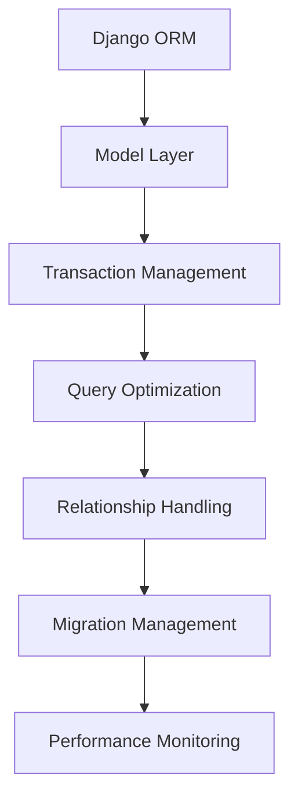

# Database Integration Patterns

## Overview

Database integration patterns ensure reliable data operations, transaction management, and optimal performance for the Hedgehog NetBox Plugin. This document provides patterns for Django ORM usage, transaction handling, and database optimization.

## Architecture Pattern



## Core Integration Components

### 1. Model Design Patterns

**File**: `models/base.py`

```python
"""
Base model patterns for Hedgehog NetBox Plugin.
Provides common functionality and patterns for all models.
"""

from django.db import models
from django.contrib.contenttypes.fields import GenericForeignKey
from django.contrib.contenttypes.models import ContentType
from django.utils import timezone
import uuid

class TimestampedModel(models.Model):
    """Abstract base model with timestamp fields"""
    created = models.DateTimeField(auto_now_add=True)
    last_updated = models.DateTimeField(auto_now=True)
    
    class Meta:
        abstract = True

class HedgehogBaseModel(TimestampedModel):
    """Base model for all Hedgehog resources"""
    id = models.UUIDField(primary_key=True, default=uuid.uuid4, editable=False)
    name = models.CharField(max_length=100, unique=True)
    description = models.TextField(blank=True, default='')
    
    # Metadata fields
    tags = models.JSONField(default=dict, blank=True)
    custom_fields = models.JSONField(default=dict, blank=True)
    
    # Sync tracking
    last_sync_time = models.DateTimeField(null=True, blank=True)
    sync_status = models.CharField(
        max_length=20,
        choices=[
            ('pending', 'Pending'),
            ('syncing', 'Syncing'),
            ('synced', 'Synced'),
            ('error', 'Error'),
        ],
        default='pending'
    )
    sync_error = models.TextField(blank=True, default='')
    
    class Meta:
        abstract = True
        indexes = [
            models.Index(fields=['name']),
            models.Index(fields=['sync_status']),
            models.Index(fields=['last_sync_time']),
        ]
    
    def __str__(self):
        return self.name

class SoftDeleteQuerySet(models.QuerySet):
    """QuerySet for soft delete functionality"""
    
    def delete(self):
        return super().update(deleted_at=timezone.now())
    
    def hard_delete(self):
        return super().delete()
    
    def alive(self):
        return self.filter(deleted_at=None)
    
    def dead(self):
        return self.exclude(deleted_at=None)

class SoftDeleteManager(models.Manager):
    """Manager for soft delete functionality"""
    
    def __init__(self, *args, **kwargs):
        self.alive_only = kwargs.pop('alive_only', True)
        super().__init__(*args, **kwargs)
    
    def get_queryset(self):
        if self.alive_only:
            return SoftDeleteQuerySet(self.model).filter(deleted_at=None)
        return SoftDeleteQuerySet(self.model)
    
    def hard_delete(self):
        return self.get_queryset().hard_delete()

class SoftDeleteModel(models.Model):
    """Abstract model with soft delete functionality"""
    deleted_at = models.DateTimeField(null=True, blank=True)
    
    objects = SoftDeleteManager()
    all_objects = SoftDeleteManager(alive_only=False)
    
    class Meta:
        abstract = True
    
    def delete(self):
        self.deleted_at = timezone.now()
        self.save()
    
    def hard_delete(self):
        super().delete()
```

### 2. Transaction Management Patterns

**File**: `utils/db_transactions.py`

```python
"""
Database transaction management utilities.
Provides patterns for safe transaction handling and atomic operations.
"""

import logging
from contextlib import contextmanager
from typing import Any, Callable, Optional, Dict
from django.db import transaction, connections
from django.db.utils import IntegrityError, OperationalError
from functools import wraps

logger = logging.getLogger(__name__)

class DatabaseError(Exception):
    """Base database operation error"""
    pass

class TransactionError(DatabaseError):
    """Transaction management error"""
    pass

def atomic_operation(using: Optional[str] = None, savepoint: bool = True):
    """
    Decorator for atomic database operations.
    
    Args:
        using: Database alias to use
        savepoint: Whether to use savepoint for nested transactions
    """
    def decorator(func: Callable) -> Callable:
        @wraps(func)
        def wrapper(*args, **kwargs):
            try:
                with transaction.atomic(using=using, savepoint=savepoint):
                    return func(*args, **kwargs)
            except IntegrityError as e:
                logger.error(f"Database integrity error in {func.__name__}: {e}")
                raise DatabaseError(f"Data integrity violation: {e}")
            except OperationalError as e:
                logger.error(f"Database operational error in {func.__name__}: {e}")
                raise DatabaseError(f"Database operation failed: {e}")
            except Exception as e:
                logger.error(f"Unexpected error in {func.__name__}: {e}")
                raise
        
        return wrapper
    return decorator

@contextmanager
def bulk_operation_transaction(batch_size: int = 1000, using: Optional[str] = None):
    """
    Context manager for bulk operations with batching.
    
    Args:
        batch_size: Number of operations per batch
        using: Database alias to use
    """
    try:
        with transaction.atomic(using=using):
            batch_count = 0
            
            def commit_batch():
                nonlocal batch_count
                if batch_count >= batch_size:
                    # Create savepoint and release to commit batch
                    sid = transaction.savepoint(using=using)
                    transaction.savepoint_commit(sid, using=using)
                    batch_count = 0
            
            def increment_batch():
                nonlocal batch_count
                batch_count += 1
                commit_batch()
            
            yield increment_batch
            
            # Final commit for remaining operations
            if batch_count > 0:
                commit_batch()
                
    except Exception as e:
        logger.error(f"Bulk operation transaction failed: {e}")
        raise TransactionError(f"Bulk operation failed: {e}")

class TransactionManager:
    """Advanced transaction management for complex operations"""
    
    def __init__(self, using: Optional[str] = None):
        self.using = using
        self.savepoints = []
    
    def begin_transaction(self) -> str:
        """Begin a new transaction with savepoint"""
        try:
            savepoint_id = transaction.savepoint(using=self.using)
            self.savepoints.append(savepoint_id)
            logger.debug(f"Created savepoint: {savepoint_id}")
            return savepoint_id
        except Exception as e:
            logger.error(f"Failed to create savepoint: {e}")
            raise TransactionError(f"Cannot begin transaction: {e}")
    
    def commit_transaction(self, savepoint_id: Optional[str] = None) -> bool:
        """Commit transaction or specific savepoint"""
        try:
            if savepoint_id:
                transaction.savepoint_commit(savepoint_id, using=self.using)
                if savepoint_id in self.savepoints:
                    self.savepoints.remove(savepoint_id)
            else:
                # Commit all savepoints
                for sp_id in self.savepoints[:]:
                    transaction.savepoint_commit(sp_id, using=self.using)
                    self.savepoints.remove(sp_id)
            
            logger.debug(f"Committed transaction: {savepoint_id or 'all'}")
            return True
        except Exception as e:
            logger.error(f"Failed to commit transaction: {e}")
            return False
    
    def rollback_transaction(self, savepoint_id: Optional[str] = None) -> bool:
        """Rollback transaction or specific savepoint"""
        try:
            if savepoint_id:
                transaction.savepoint_rollback(savepoint_id, using=self.using)
                if savepoint_id in self.savepoints:
                    self.savepoints.remove(savepoint_id)
            else:
                # Rollback all savepoints
                for sp_id in reversed(self.savepoints[:]):
                    transaction.savepoint_rollback(sp_id, using=self.using)
                    self.savepoints.remove(sp_id)
            
            logger.debug(f"Rolled back transaction: {savepoint_id or 'all'}")
            return True
        except Exception as e:
            logger.error(f"Failed to rollback transaction: {e}")
            return False
    
    def cleanup(self):
        """Clean up any remaining savepoints"""
        for sp_id in self.savepoints[:]:
            try:
                transaction.savepoint_rollback(sp_id, using=self.using)
                self.savepoints.remove(sp_id)
            except Exception as e:
                logger.warning(f"Failed to cleanup savepoint {sp_id}: {e}")

@contextmanager
def managed_transaction(using: Optional[str] = None):
    """Context manager for advanced transaction management"""
    manager = TransactionManager(using=using)
    try:
        with transaction.atomic(using=using):
            yield manager
    except Exception as e:
        logger.error(f"Managed transaction failed: {e}")
        manager.cleanup()
        raise
    finally:
        manager.cleanup()

# Example usage patterns
@atomic_operation()
def create_fabric_with_resources(fabric_data: Dict[str, Any], 
                                resources_data: list) -> 'HedgehogFabric':
    """Create fabric with associated resources atomically"""
    from netbox_hedgehog.models import HedgehogFabric, HedgehogResource
    
    # Create fabric
    fabric = HedgehogFabric.objects.create(**fabric_data)
    
    # Create associated resources
    resources = []
    for resource_data in resources_data:
        resource_data['fabric'] = fabric
        resource = HedgehogResource.objects.create(**resource_data)
        resources.append(resource)
    
    logger.info(f"Created fabric {fabric.name} with {len(resources)} resources")
    return fabric

def bulk_update_sync_status(fabric_ids: list, status: str, error: str = '') -> int:
    """Bulk update sync status for multiple fabrics"""
    from netbox_hedgehog.models import HedgehogFabric
    
    with bulk_operation_transaction(batch_size=100):
        updated_count = HedgehogFabric.objects.filter(
            id__in=fabric_ids
        ).update(
            sync_status=status,
            sync_error=error,
            last_sync_time=timezone.now()
        )
    
    logger.info(f"Updated sync status for {updated_count} fabrics")
    return updated_count
```

### 3. Query Optimization Patterns

**File**: `optimizations/query_optimizer.py`

```python
"""
Database query optimization utilities.
Provides patterns for efficient querying and performance optimization.
"""

import logging
from typing import Any, Dict, List, Optional, Union
from django.db import models
from django.db.models import Prefetch, Q, Count, Max, F
from django.core.cache import cache
from django.utils import timezone

logger = logging.getLogger(__name__)

class QueryOptimizer:
    """Database query optimization utilities"""
    
    @staticmethod
    def get_optimized_fabric_queryset(include_related: bool = True) -> models.QuerySet:
        """Get optimized queryset for HedgehogFabric with related data"""
        from netbox_hedgehog.models import HedgehogFabric
        
        queryset = HedgehogFabric.objects.all()
        
        if include_related:
            queryset = queryset.select_related(
                'git_repository',
            ).prefetch_related(
                'hedgehogresource_set',
                'hedgehoggitopssyncstatus_set',
                Prefetch(
                    'hedgehogvpc_set',
                    queryset=HedgehogVPC.objects.select_related('fabric')
                )
            )
        
        return queryset.annotate(
            resource_count=Count('hedgehogresource'),
            last_resource_update=Max('hedgehogresource__last_updated')
        )
    
    @staticmethod
    def get_fabric_with_sync_status(fabric_id: Union[int, str]) -> Optional[Dict[str, Any]]:
        """Get fabric with complete sync status information"""
        cache_key = f"fabric_sync_status:{fabric_id}"
        cached_data = cache.get(cache_key)
        
        if cached_data:
            return cached_data
        
        from netbox_hedgehog.models import HedgehogFabric
        
        try:
            fabric = HedgehogFabric.objects.select_related(
                'git_repository'
            ).prefetch_related(
                'hedgehoggitopssyncstatus_set'
            ).get(id=fabric_id)
            
            sync_statuses = fabric.hedgehoggitopssyncstatus_set.all()
            
            fabric_data = {
                'id': str(fabric.id),
                'name': fabric.name,
                'description': fabric.description,
                'sync_status': fabric.sync_status,
                'last_sync_time': fabric.last_sync_time.isoformat() if fabric.last_sync_time else None,
                'git_repository': {
                    'name': fabric.git_repository.name,
                    'url': fabric.git_repository.url,
                    'branch': fabric.git_repository.branch,
                } if fabric.git_repository else None,
                'sync_history': [
                    {
                        'status': status.sync_status,
                        'timestamp': status.last_sync_time.isoformat() if status.last_sync_time else None,
                        'error': status.error_message,
                        'files_synced': status.files_synced,
                    }
                    for status in sync_statuses.order_by('-last_sync_time')[:10]
                ]
            }
            
            # Cache for 5 minutes
            cache.set(cache_key, fabric_data, timeout=300)
            return fabric_data
            
        except HedgehogFabric.DoesNotExist:
            return None
    
    @staticmethod
    def get_fabric_statistics() -> Dict[str, Any]:
        """Get aggregated fabric statistics"""
        cache_key = "fabric_statistics"
        cached_stats = cache.get(cache_key)
        
        if cached_stats:
            return cached_stats
        
        from netbox_hedgehog.models import HedgehogFabric, HedgehogResource
        
        stats = HedgehogFabric.objects.aggregate(
            total_fabrics=Count('id'),
            git_enabled=Count('id', filter=Q(git_sync_enabled=True)),
            k8s_enabled=Count('id', filter=Q(enable_k8s_sync=True)),
            synced_count=Count('id', filter=Q(sync_status='synced')),
            pending_count=Count('id', filter=Q(sync_status='pending')),
            error_count=Count('id', filter=Q(sync_status='error')),
            last_sync_time=Max('last_sync_time')
        )
        
        # Add resource statistics
        resource_stats = HedgehogResource.objects.aggregate(
            total_resources=Count('id'),
            resources_by_fabric=Count('fabric', distinct=True)
        )
        
        stats.update(resource_stats)
        
        # Cache for 10 minutes
        cache.set(cache_key, stats, timeout=600)
        return stats
    
    @staticmethod
    def find_fabrics_needing_sync(max_age_hours: int = 1) -> models.QuerySet:
        """Find fabrics that need synchronization"""
        from netbox_hedgehog.models import HedgehogFabric
        
        cutoff_time = timezone.now() - timezone.timedelta(hours=max_age_hours)
        
        return HedgehogFabric.objects.filter(
            Q(git_sync_enabled=True) | Q(enable_k8s_sync=True)
        ).filter(
            Q(last_sync_time__lt=cutoff_time) | Q(last_sync_time__isnull=True)
        ).filter(
            ~Q(sync_status='syncing')  # Exclude currently syncing fabrics
        ).select_related('git_repository').order_by('last_sync_time')

class BulkOperationHelper:
    """Helper for efficient bulk database operations"""
    
    @staticmethod
    def bulk_create_resources(resources_data: List[Dict[str, Any]], 
                            batch_size: int = 1000) -> int:
        """Bulk create resources with batching"""
        from netbox_hedgehog.models import HedgehogResource
        
        total_created = 0
        
        for i in range(0, len(resources_data), batch_size):
            batch = resources_data[i:i + batch_size]
            
            resources = [
                HedgehogResource(**data) for data in batch
            ]
            
            created_resources = HedgehogResource.objects.bulk_create(
                resources, batch_size=batch_size, ignore_conflicts=True
            )
            
            total_created += len(created_resources)
        
        logger.info(f"Bulk created {total_created} resources")
        return total_created
    
    @staticmethod
    def bulk_update_status(model_class, object_ids: List[Union[int, str]], 
                          status_data: Dict[str, Any], batch_size: int = 1000) -> int:
        """Bulk update status for multiple objects"""
        total_updated = 0
        
        for i in range(0, len(object_ids), batch_size):
            batch_ids = object_ids[i:i + batch_size]
            
            updated_count = model_class.objects.filter(
                id__in=batch_ids
            ).update(**status_data)
            
            total_updated += updated_count
        
        logger.info(f"Bulk updated {total_updated} objects")
        return total_updated

class DatabasePerformanceMonitor:
    """Monitor database performance and query patterns"""
    
    @staticmethod
    def log_slow_queries(threshold_ms: int = 1000):
        """Log queries that exceed time threshold"""
        from django.db import connections
        
        for alias in connections:
            connection = connections[alias]
            
            for query in connection.queries:
                time_ms = float(query['time']) * 1000
                if time_ms > threshold_ms:
                    logger.warning(
                        f"Slow query detected ({time_ms:.2f}ms): {query['sql'][:200]}..."
                    )
    
    @staticmethod
    def analyze_query_patterns() -> Dict[str, Any]:
        """Analyze query patterns for optimization opportunities"""
        from django.db import connections
        
        analysis = {
            'total_queries': 0,
            'slow_queries': 0,
            'duplicate_queries': 0,
            'n_plus_one_candidates': [],
            'most_frequent_queries': {}
        }
        
        query_counts = {}
        
        for alias in connections:
            connection = connections[alias]
            
            for query in connection.queries:
                analysis['total_queries'] += 1
                
                # Check for slow queries
                time_ms = float(query['time']) * 1000
                if time_ms > 1000:  # > 1 second
                    analysis['slow_queries'] += 1
                
                # Count duplicate queries
                sql_normalized = query['sql'].split(' LIMIT')[0]  # Remove LIMIT for comparison
                query_counts[sql_normalized] = query_counts.get(sql_normalized, 0) + 1
        
        # Find duplicate queries
        analysis['duplicate_queries'] = sum(
            count - 1 for count in query_counts.values() if count > 1
        )
        
        # Most frequent queries
        analysis['most_frequent_queries'] = sorted(
            query_counts.items(), key=lambda x: x[1], reverse=True
        )[:10]
        
        return analysis
```

## Testing Patterns

### Database Integration Testing

```python
# tests/test_database_integration.py
from django.test import TestCase, TransactionTestCase
from django.db import transaction, IntegrityError
from netbox_hedgehog.models import HedgehogFabric, GitRepository, HedgehogResource
from netbox_hedgehog.utils.db_transactions import atomic_operation, managed_transaction

class TestDatabaseIntegration(TestCase):
    """Test database integration patterns"""
    
    def test_atomic_operation_success(self):
        """Test successful atomic operation"""
        @atomic_operation()
        def create_test_fabric():
            return HedgehogFabric.objects.create(
                name='test-fabric',
                description='Test fabric'
            )
        
        fabric = create_test_fabric()
        self.assertEqual(fabric.name, 'test-fabric')
        self.assertTrue(HedgehogFabric.objects.filter(name='test-fabric').exists())
    
    def test_atomic_operation_rollback(self):
        """Test atomic operation rollback on error"""
        @atomic_operation()
        def create_invalid_fabric():
            # Create valid fabric
            HedgehogFabric.objects.create(
                name='test-fabric-1',
                description='Test fabric 1'
            )
            
            # This should cause rollback
            raise IntegrityError("Test error")
        
        with self.assertRaises(Exception):
            create_invalid_fabric()
        
        # Verify rollback occurred
        self.assertFalse(HedgehogFabric.objects.filter(name='test-fabric-1').exists())
    
    def test_bulk_operations(self):
        """Test bulk operations performance"""
        from netbox_hedgehog.optimizations.query_optimizer import BulkOperationHelper
        
        # Create test fabric
        fabric = HedgehogFabric.objects.create(
            name='bulk-test-fabric',
            description='Bulk test fabric'
        )
        
        # Prepare bulk data
        resources_data = [
            {
                'name': f'resource-{i}',
                'fabric': fabric,
                'resource_type': 'switch',
                'configuration': {'port_count': i}
            }
            for i in range(100)
        ]
        
        # Execute bulk create
        created_count = BulkOperationHelper.bulk_create_resources(resources_data)
        
        self.assertEqual(created_count, 100)
        self.assertEqual(HedgehogResource.objects.filter(fabric=fabric).count(), 100)

class TestTransactionManagement(TransactionTestCase):
    """Test advanced transaction management"""
    
    def test_managed_transaction_with_savepoints(self):
        """Test managed transaction with multiple savepoints"""
        with managed_transaction() as tm:
            # Create first fabric
            sp1 = tm.begin_transaction()
            fabric1 = HedgehogFabric.objects.create(
                name='fabric-1',
                description='First fabric'
            )
            tm.commit_transaction(sp1)
            
            # Create second fabric
            sp2 = tm.begin_transaction()
            fabric2 = HedgehogFabric.objects.create(
                name='fabric-2',
                description='Second fabric'
            )
            
            # Rollback second fabric
            tm.rollback_transaction(sp2)
        
        # Verify results
        self.assertTrue(HedgehogFabric.objects.filter(name='fabric-1').exists())
        self.assertFalse(HedgehogFabric.objects.filter(name='fabric-2').exists())
```

## Configuration and Best Practices

### Database Configuration

```python
# settings.py
DATABASES = {
    'default': {
        'ENGINE': 'django.db.backends.postgresql',
        'NAME': 'netbox',
        'USER': 'netbox',
        'PASSWORD': 'netbox_password',
        'HOST': 'localhost',
        'PORT': '5432',
        'OPTIONS': {
            'sslmode': 'require',
        },
        'CONN_MAX_AGE': 300,  # 5 minutes
    }
}

# Connection pooling
DATABASE_ROUTERS = ['netbox_hedgehog.db_router.DatabaseRouter']

# Query optimization
DEBUG_TOOLBAR_CONFIG = {
    'SHOW_TOOLBAR_CALLBACK': lambda request: True,
    'ENABLE_STACKTRACES': True,
}
```

### Performance Best Practices

1. **Query Optimization**
   - Use `select_related()` for foreign key relationships
   - Use `prefetch_related()` for reverse relationships
   - Implement database indexes on commonly queried fields
   - Use `only()` and `defer()` for partial object loading

2. **Transaction Management**
   - Use atomic decorators for critical operations
   - Implement proper rollback strategies
   - Use savepoints for complex nested transactions
   - Monitor transaction duration and optimize

3. **Bulk Operations**
   - Use `bulk_create()` for multiple object creation
   - Use `bulk_update()` for multiple object updates
   - Implement batching for large datasets
   - Use database-level operations when possible

4. **Caching Strategy**
   - Cache frequently accessed data
   - Use appropriate cache timeouts
   - Implement cache invalidation strategies
   - Monitor cache hit rates

This database integration pattern ensures reliable, performant, and maintainable data operations for the Hedgehog NetBox Plugin.