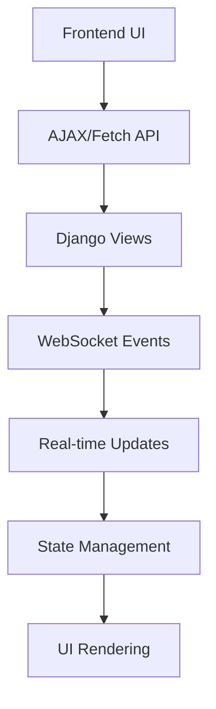

# Frontend-Backend Communication Patterns

## Overview

Frontend-backend communication patterns enable seamless UI interactions, real-time updates, and responsive user experiences for the Hedgehog NetBox Plugin.

## Architecture Pattern



## Core Components

### 1. AJAX Communication Patterns

**File**: `static/netbox_hedgehog/js/hedgehog.js`

```javascript
/**
 * Hedgehog NetBox Plugin Frontend Communication
 * Provides patterns for frontend-backend communication
 */

class HedgehogAPI {
    constructor() {
        this.baseUrl = '/plugins/hedgehog/api';
        this.csrfToken = this.getCSRFToken();
        this.defaultHeaders = {
            'Content-Type': 'application/json',
            'X-CSRFToken': this.csrfToken,
        };
    }

    getCSRFToken() {
        const token = document.querySelector('[name=csrfmiddlewaretoken]');
        return token ? token.value : '';
    }

    async request(method, endpoint, data = null, options = {}) {
        const url = `${this.baseUrl}${endpoint}`;
        
        const config = {
            method,
            headers: { ...this.defaultHeaders, ...options.headers },
            credentials: 'same-origin',
        };

        if (data && ['POST', 'PUT', 'PATCH'].includes(method)) {
            config.body = JSON.stringify(data);
        }

        try {
            const response = await fetch(url, config);
            
            if (!response.ok) {
                const errorData = await response.json().catch(() => ({}));
                throw new Error(errorData.error || `HTTP ${response.status}`);
            }

            const contentType = response.headers.get('content-type');
            if (contentType && contentType.includes('application/json')) {
                return await response.json();
            }

            return await response.text();
        } catch (error) {
            console.error('API request failed:', error);
            throw error;
        }
    }

    // CRUD operations
    async getFabrics(params = {}) {
        const queryString = new URLSearchParams(params).toString();
        const endpoint = `/fabrics/${queryString ? `?${queryString}` : ''}`;
        return this.request('GET', endpoint);
    }

    async getFabric(id) {
        return this.request('GET', `/fabrics/${id}/`);
    }

    async createFabric(fabricData) {
        return this.request('POST', '/fabrics/', fabricData);
    }

    async updateFabric(id, fabricData) {
        return this.request('PATCH', `/fabrics/${id}/`, fabricData);
    }

    async deleteFabric(id) {
        return this.request('DELETE', `/fabrics/${id}/`);
    }

    // Action operations
    async syncFabricToGit(id) {
        return this.request('POST', `/fabrics/${id}/sync_to_git/`);
    }

    async syncFabricToK8s(id) {
        return this.request('POST', `/fabrics/${id}/sync_to_k8s/`);
    }

    async getSyncStatus() {
        return this.request('GET', '/fabrics/sync_status/');
    }
}

// Status indicator management
class StatusIndicator {
    constructor(element) {
        this.element = element;
        this.statusClasses = {
            pending: 'status-pending',
            syncing: 'status-syncing',
            synced: 'status-synced',
            error: 'status-error'
        };
    }

    updateStatus(status, message = '') {
        // Remove all status classes
        Object.values(this.statusClasses).forEach(cls => {
            this.element.classList.remove(cls);
        });

        // Add new status class
        if (this.statusClasses[status]) {
            this.element.classList.add(this.statusClasses[status]);
        }

        // Update text content if provided
        if (message) {
            this.element.textContent = message;
        }

        // Update title attribute for accessibility
        this.element.title = `Status: ${status}${message ? ` - ${message}` : ''}`;
    }

    setLoading(isLoading = true) {
        if (isLoading) {
            this.element.classList.add('loading');
            this.element.innerHTML = '<i class="mdi mdi-loading mdi-spin"></i> Loading...';
        } else {
            this.element.classList.remove('loading');
        }
    }
}

// Fabric synchronization UI
class FabricSyncUI {
    constructor() {
        this.api = new HedgehogAPI();
        this.initializeEventListeners();
        this.pollInterval = null;
    }

    initializeEventListeners() {
        // Sync button handlers
        document.addEventListener('click', (e) => {
            if (e.target.matches('[data-sync-git]')) {
                e.preventDefault();
                const fabricId = e.target.dataset.syncGit;
                this.syncToGit(fabricId, e.target);
            }

            if (e.target.matches('[data-sync-k8s]')) {
                e.preventDefault();
                const fabricId = e.target.dataset.syncK8s;
                this.syncToK8s(fabricId, e.target);
            }

            if (e.target.matches('[data-refresh-status]')) {
                e.preventDefault();
                this.refreshSyncStatus();
            }
        });

        // Auto-refresh sync status
        this.startStatusPolling();
    }

    async syncToGit(fabricId, button) {
        const statusIndicator = this.findStatusIndicator(fabricId);
        
        try {
            button.disabled = true;
            statusIndicator?.setLoading(true);

            const result = await this.api.syncFabricToGit(fabricId);
            
            this.showNotification('success', 'Git sync initiated successfully');
            
            // Start polling for completion
            this.pollTaskStatus(result.task_id, fabricId);

        } catch (error) {
            this.showNotification('error', `Git sync failed: ${error.message}`);
            statusIndicator?.updateStatus('error', 'Sync failed');
        } finally {
            button.disabled = false;
            statusIndicator?.setLoading(false);
        }
    }

    async syncToK8s(fabricId, button) {
        const statusIndicator = this.findStatusIndicator(fabricId);
        
        try {
            button.disabled = true;
            statusIndicator?.setLoading(true);

            const result = await this.api.syncFabricToK8s(fabricId);
            
            this.showNotification('success', 'Kubernetes sync initiated successfully');
            this.pollTaskStatus(result.task_id, fabricId);

        } catch (error) {
            this.showNotification('error', `Kubernetes sync failed: ${error.message}`);
            statusIndicator?.updateStatus('error', 'Sync failed');
        } finally {
            button.disabled = false;
            statusIndicator?.setLoading(false);
        }
    }

    async refreshSyncStatus() {
        try {
            const syncData = await this.api.getSyncStatus();
            this.updateSyncStatusDisplay(syncData);
        } catch (error) {
            console.error('Failed to refresh sync status:', error);
        }
    }

    updateSyncStatusDisplay(syncData) {
        syncData.forEach(fabric => {
            const statusElement = document.querySelector(`[data-fabric-status="${fabric.id}"]`);
            if (statusElement) {
                const indicator = new StatusIndicator(statusElement);
                indicator.updateStatus(fabric.sync_status);
                
                // Update timestamp
                const timestampElement = document.querySelector(`[data-fabric-timestamp="${fabric.id}"]`);
                if (timestampElement && fabric.last_sync_time) {
                    timestampElement.textContent = new Date(fabric.last_sync_time).toLocaleString();
                }
            }
        });
    }

    findStatusIndicator(fabricId) {
        const element = document.querySelector(`[data-fabric-status="${fabricId}"]`);
        return element ? new StatusIndicator(element) : null;
    }

    pollTaskStatus(taskId, fabricId) {
        // Implementation would poll task status endpoint
        // For now, just refresh sync status after delay
        setTimeout(() => {
            this.refreshSyncStatus();
        }, 5000);
    }

    startStatusPolling() {
        // Poll sync status every 30 seconds
        this.pollInterval = setInterval(() => {
            this.refreshSyncStatus();
        }, 30000);
    }

    stopStatusPolling() {
        if (this.pollInterval) {
            clearInterval(this.pollInterval);
            this.pollInterval = null;
        }
    }

    showNotification(type, message) {
        // Create notification element
        const notification = document.createElement('div');
        notification.className = `alert alert-${type === 'success' ? 'success' : 'danger'} alert-dismissible fade show`;
        notification.innerHTML = `
            ${message}
            <button type="button" class="btn-close" data-bs-dismiss="alert"></button>
        `;

        // Add to page
        const container = document.querySelector('.messages') || document.body;
        container.appendChild(notification);

        // Auto-remove after 5 seconds
        setTimeout(() => {
            notification.remove();
        }, 5000);
    }
}

// Initialize when DOM is ready
document.addEventListener('DOMContentLoaded', () => {
    window.hedgehogAPI = new HedgehogAPI();
    window.fabricSyncUI = new FabricSyncUI();
});
```

### 2. WebSocket Real-time Communication

**File**: `websockets/fabric_consumer.py`

```python
"""
WebSocket consumer for real-time fabric updates.
Provides live status updates and notifications.
"""

import json
import logging
from channels.generic.websocket import AsyncWebsocketConsumer
from channels.db import database_sync_to_async
from django.contrib.auth.models import AnonymousUser

logger = logging.getLogger(__name__)

class FabricStatusConsumer(AsyncWebsocketConsumer):
    """WebSocket consumer for fabric status updates"""
    
    async def connect(self):
        """Handle WebSocket connection"""
        # Check authentication
        if isinstance(self.scope['user'], AnonymousUser):
            await self.close()
            return
        
        # Join fabric status group
        self.group_name = 'fabric_status'
        await self.channel_layer.group_add(
            self.group_name,
            self.channel_name
        )
        
        await self.accept()
        logger.info(f"WebSocket connected: {self.scope['user'].username}")
    
    async def disconnect(self, close_code):
        """Handle WebSocket disconnection"""
        # Leave fabric status group
        if hasattr(self, 'group_name'):
            await self.channel_layer.group_discard(
                self.group_name,
                self.channel_name
            )
        
        logger.info(f"WebSocket disconnected: {close_code}")
    
    async def receive(self, text_data):
        """Handle messages from WebSocket"""
        try:
            data = json.loads(text_data)
            message_type = data.get('type')
            
            if message_type == 'subscribe_fabric':
                fabric_id = data.get('fabric_id')
                await self.subscribe_to_fabric(fabric_id)
            
            elif message_type == 'unsubscribe_fabric':
                fabric_id = data.get('fabric_id')
                await self.unsubscribe_from_fabric(fabric_id)
                
        except json.JSONDecodeError:
            await self.send(text_data=json.dumps({
                'type': 'error',
                'message': 'Invalid JSON format'
            }))
    
    async def subscribe_to_fabric(self, fabric_id):
        """Subscribe to specific fabric updates"""
        fabric_group = f'fabric_{fabric_id}'
        await self.channel_layer.group_add(
            fabric_group,
            self.channel_name
        )
        
        # Send current fabric status
        fabric_status = await self.get_fabric_status(fabric_id)
        if fabric_status:
            await self.send(text_data=json.dumps({
                'type': 'fabric_status',
                'fabric_id': fabric_id,
                'status': fabric_status
            }))
    
    async def unsubscribe_from_fabric(self, fabric_id):
        """Unsubscribe from specific fabric updates"""
        fabric_group = f'fabric_{fabric_id}'
        await self.channel_layer.group_discard(
            fabric_group,
            self.channel_name
        )
    
    @database_sync_to_async
    def get_fabric_status(self, fabric_id):
        """Get current fabric status from database"""
        try:
            from netbox_hedgehog.models import HedgehogFabric
            fabric = HedgehogFabric.objects.get(id=fabric_id)
            
            return {
                'sync_status': fabric.sync_status,
                'last_sync_time': fabric.last_sync_time.isoformat() if fabric.last_sync_time else None,
                'sync_error': fabric.sync_error,
                'git_sync_enabled': fabric.git_sync_enabled,
                'k8s_sync_enabled': fabric.enable_k8s_sync,
            }
            
        except Exception as e:
            logger.error(f"Failed to get fabric status: {e}")
            return None
    
    # Event handlers for different message types
    async def fabric_status_update(self, event):
        """Handle fabric status update events"""
        await self.send(text_data=json.dumps({
            'type': 'fabric_status_update',
            'fabric_id': event['fabric_id'],
            'status': event['status'],
            'timestamp': event.get('timestamp')
        }))
    
    async def sync_started(self, event):
        """Handle sync started events"""
        await self.send(text_data=json.dumps({
            'type': 'sync_started',
            'fabric_id': event['fabric_id'],
            'sync_type': event['sync_type'],
            'task_id': event.get('task_id')
        }))
    
    async def sync_completed(self, event):
        """Handle sync completed events"""
        await self.send(text_data=json.dumps({
            'type': 'sync_completed',
            'fabric_id': event['fabric_id'],
            'sync_type': event['sync_type'],
            'success': event['success'],
            'message': event.get('message'),
            'duration': event.get('duration')
        }))

# Utility function to send WebSocket messages
async def send_fabric_status_update(fabric_id, status_data):
    """Send fabric status update to WebSocket clients"""
    from channels.layers import get_channel_layer
    
    channel_layer = get_channel_layer()
    if channel_layer:
        await channel_layer.group_send(
            f'fabric_{fabric_id}',
            {
                'type': 'fabric_status_update',
                'fabric_id': fabric_id,
                'status': status_data,
                'timestamp': time.time()
            }
        )
```

### 3. Dynamic Form Management

**File**: `static/netbox_hedgehog/js/fabric_forms.js`

```javascript
/**
 * Dynamic form management for fabric configuration
 */

class FabricFormManager {
    constructor(formElement) {
        this.form = formElement;
        this.api = new HedgehogAPI();
        this.initializeForm();
    }

    initializeForm() {
        // Initialize form validation
        this.setupValidation();
        
        // Initialize conditional fields
        this.setupConditionalFields();
        
        // Setup auto-save
        this.setupAutoSave();
        
        // Setup real-time preview
        this.setupPreview();
    }

    setupValidation() {
        // Custom validation rules
        const nameField = this.form.querySelector('[name="name"]');
        if (nameField) {
            nameField.addEventListener('blur', (e) => {
                this.validateFabricName(e.target.value);
            });
        }

        const asnField = this.form.querySelector('[name="asn"]');
        if (asnField) {
            asnField.addEventListener('input', (e) => {
                this.validateASN(e.target.value);
            });
        }
    }

    async validateFabricName(name) {
        if (!name) return;

        try {
            // Check if name is already taken
            const fabrics = await this.api.getFabrics({ search: name });
            const existingFabric = fabrics.results?.find(f => 
                f.name === name && f.id !== this.getCurrentFabricId()
            );

            const nameField = this.form.querySelector('[name="name"]');
            if (existingFabric) {
                this.showFieldError(nameField, 'A fabric with this name already exists');
            } else {
                this.clearFieldError(nameField);
            }
        } catch (error) {
            console.error('Name validation error:', error);
        }
    }

    validateASN(asn) {
        const asnField = this.form.querySelector('[name="asn"]');
        const asnValue = parseInt(asn);

        if (asn && (asnValue < 1 || asnValue > 4294967295)) {
            this.showFieldError(asnField, 'ASN must be between 1 and 4294967295');
        } else {
            this.clearFieldError(asnField);
        }
    }

    setupConditionalFields() {
        // Show/hide fields based on sync settings
        const gitSyncCheckbox = this.form.querySelector('[name="git_sync_enabled"]');
        const k8sSyncCheckbox = this.form.querySelector('[name="enable_k8s_sync"]');

        if (gitSyncCheckbox) {
            gitSyncCheckbox.addEventListener('change', (e) => {
                this.toggleGitFields(e.target.checked);
            });
            this.toggleGitFields(gitSyncCheckbox.checked);
        }

        if (k8sSyncCheckbox) {
            k8sSyncCheckbox.addEventListener('change', (e) => {
                this.toggleK8sFields(e.target.checked);
            });
            this.toggleK8sFields(k8sSyncCheckbox.checked);
        }
    }

    toggleGitFields(enabled) {
        const gitFields = this.form.querySelectorAll('[data-depends-on="git_sync"]');
        gitFields.forEach(field => {
            field.style.display = enabled ? 'block' : 'none';
            const input = field.querySelector('input, select, textarea');
            if (input) {
                input.required = enabled;
            }
        });
    }

    toggleK8sFields(enabled) {
        const k8sFields = this.form.querySelectorAll('[data-depends-on="k8s_sync"]');
        k8sFields.forEach(field => {
            field.style.display = enabled ? 'block' : 'none';
        });
    }

    setupAutoSave() {
        let saveTimeout;
        const inputs = this.form.querySelectorAll('input, textarea, select');
        
        inputs.forEach(input => {
            input.addEventListener('input', () => {
                clearTimeout(saveTimeout);
                saveTimeout = setTimeout(() => {
                    this.autoSave();
                }, 2000); // Save after 2 seconds of inactivity
            });
        });
    }

    async autoSave() {
        const fabricId = this.getCurrentFabricId();
        if (!fabricId) return; // Only auto-save existing fabrics

        try {
            const formData = new FormData(this.form);
            const data = Object.fromEntries(formData.entries());
            
            await this.api.updateFabric(fabricId, data);
            this.showSaveIndicator('saved');
        } catch (error) {
            console.error('Auto-save failed:', error);
            this.showSaveIndicator('error');
        }
    }

    setupPreview() {
        const previewButton = this.form.querySelector('[data-action="preview"]');
        if (previewButton) {
            previewButton.addEventListener('click', (e) => {
                e.preventDefault();
                this.showConfigPreview();
            });
        }
    }

    showConfigPreview() {
        const formData = new FormData(this.form);
        const data = Object.fromEntries(formData.entries());
        
        // Generate YAML preview
        const yamlPreview = this.generateYAMLPreview(data);
        
        // Show in modal
        this.showModal('Configuration Preview', `<pre>${yamlPreview}</pre>`);
    }

    generateYAMLPreview(data) {
        // Simple YAML generation for preview
        const yaml = `
apiVersion: wiring.githedgehog.com/v1alpha2
kind: Fabric
metadata:
  name: ${data.name || 'unnamed-fabric'}
  namespace: hedgehog-system
spec:
  name: ${data.name || ''}
  description: ${data.description || ''}
  asn: ${data.asn || 65000}
  spineCount: ${data.spine_count || 0}
  leafCount: ${data.leaf_count || 0}
        `.trim();
        
        return yaml;
    }

    // Utility methods
    getCurrentFabricId() {
        return this.form.dataset.fabricId || null;
    }

    showFieldError(field, message) {
        this.clearFieldError(field);
        
        const errorDiv = document.createElement('div');
        errorDiv.className = 'field-error text-danger small';
        errorDiv.textContent = message;
        
        field.classList.add('is-invalid');
        field.parentNode.appendChild(errorDiv);
    }

    clearFieldError(field) {
        field.classList.remove('is-invalid');
        const existingError = field.parentNode.querySelector('.field-error');
        if (existingError) {
            existingError.remove();
        }
    }

    showSaveIndicator(status) {
        let indicator = document.querySelector('.save-indicator');
        if (!indicator) {
            indicator = document.createElement('div');
            indicator.className = 'save-indicator';
            this.form.appendChild(indicator);
        }

        indicator.className = `save-indicator save-${status}`;
        indicator.textContent = status === 'saved' ? 'Saved' : status === 'saving' ? 'Saving...' : 'Error';
        
        setTimeout(() => {
            indicator.style.display = 'none';
        }, 2000);
    }

    showModal(title, content) {
        // Create modal HTML
        const modalHtml = `
            <div class="modal fade" tabindex="-1">
                <div class="modal-dialog modal-lg">
                    <div class="modal-content">
                        <div class="modal-header">
                            <h5 class="modal-title">${title}</h5>
                            <button type="button" class="btn-close" data-bs-dismiss="modal"></button>
                        </div>
                        <div class="modal-body">
                            ${content}
                        </div>
                    </div>
                </div>
            </div>
        `;
        
        const modalElement = document.createElement('div');
        modalElement.innerHTML = modalHtml;
        document.body.appendChild(modalElement);
        
        // Show modal using Bootstrap
        const modal = new bootstrap.Modal(modalElement.querySelector('.modal'));
        modal.show();
        
        // Clean up when hidden
        modalElement.querySelector('.modal').addEventListener('hidden.bs.modal', () => {
            modalElement.remove();
        });
    }
}

// Initialize form managers when DOM is ready
document.addEventListener('DOMContentLoaded', () => {
    const fabricForms = document.querySelectorAll('.hedgehog-fabric-form');
    fabricForms.forEach(form => {
        new FabricFormManager(form);
    });
});
```

## Integration Testing

```python
# tests/test_frontend_backend.py
from django.test import TestCase, Client
from django.contrib.auth.models import User
from django.urls import reverse
import json

class TestFrontendBackend(TestCase):
    """Test frontend-backend communication"""
    
    def setUp(self):
        self.user = User.objects.create_user(
            username='testuser',
            password='testpass'
        )
        self.client = Client()
        self.client.login(username='testuser', password='testpass')
    
    def test_ajax_fabric_creation(self):
        """Test AJAX fabric creation"""
        fabric_data = {
            'name': 'ajax-test-fabric',
            'description': 'Test fabric created via AJAX',
            'asn': 65001
        }
        
        response = self.client.post(
            reverse('plugins:netbox_hedgehog_api:hedgehogfabric-list'),
            data=json.dumps(fabric_data),
            content_type='application/json',
            HTTP_X_REQUESTED_WITH='XMLHttpRequest'
        )
        
        self.assertEqual(response.status_code, 201)
        
        data = response.json()
        self.assertEqual(data['name'], 'ajax-test-fabric')
    
    def test_sync_status_endpoint(self):
        """Test sync status API endpoint"""
        response = self.client.get(
            reverse('plugins:netbox_hedgehog_api:hedgehogfabric-sync-status')
        )
        
        self.assertEqual(response.status_code, 200)
        self.assertIsInstance(response.json(), list)
```

## Configuration and Best Practices

### 1. Performance Optimization
- Implement request debouncing for form inputs
- Use lazy loading for large datasets
- Implement client-side caching
- Optimize JavaScript bundle size

### 2. User Experience
- Provide immediate feedback for user actions
- Implement loading states and progress indicators
- Use real-time updates for status changes
- Implement proper error handling and user notifications

### 3. Security Considerations
- Always validate CSRF tokens
- Sanitize user inputs
- Implement proper authentication checks
- Use HTTPS for all communications

This frontend-backend communication pattern ensures responsive, secure, and maintainable user interfaces for the Hedgehog NetBox Plugin.