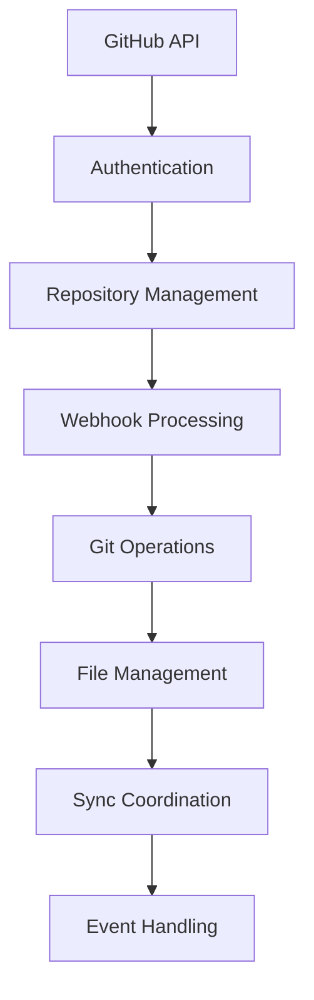

# Git/GitHub Integration Patterns

## Overview

Git and GitHub integration enables GitOps workflows, repository management, and webhook-driven synchronization. This document provides patterns for implementing reliable Git/GitHub integrations with proper authentication, error handling, and event processing.

## Architecture Pattern



## Core Integration Components

### 1. GitHub API Client Configuration

**File**: `services/github_sync_service.py`

```python
"""
GitHub API client and synchronization service.
Provides authenticated GitHub API access with rate limiting and error handling.
"""

import os
import json
import time
import base64
import logging
from typing import Dict, Any, List, Optional, Union
from datetime import datetime, timezone
import requests
from requests.adapters import HTTPAdapter
from urllib3.util.retry import Retry
from django.conf import settings
from django.core.cache import cache

logger = logging.getLogger(__name__)

class GitHubAPIError(Exception):
    """Base exception for GitHub API errors"""
    pass

class GitHubAuthenticationError(GitHubAPIError):
    """GitHub authentication error"""
    pass

class GitHubRateLimitError(GitHubAPIError):
    """GitHub rate limit error"""
    pass

class GitHubSyncService:
    """
    GitHub API client with authentication, rate limiting,
    and synchronization capabilities for Hedgehog NetBox Plugin.
    """
    
    def __init__(self, token: Optional[str] = None, repository: Optional[str] = None):
        """
        Initialize GitHub sync service.
        
        Args:
            token: GitHub API token (if not provided, will try to get from settings)
            repository: GitHub repository in format "owner/repo"
        """
        self.token = token or self._get_github_token()
        self.repository = repository
        self.base_url = "https://api.github.com"
        self.session = self._create_session()
        
        # Rate limiting
        self.rate_limit_remaining = None
        self.rate_limit_reset_time = None
        
        # Cache keys
        self.cache_prefix = f"github_sync:{self.repository}" if self.repository else "github_sync"
    
    def _get_github_token(self) -> str:
        """Get GitHub API token from configuration"""
        # Try plugin settings first
        plugin_config = getattr(settings, 'PLUGINS_CONFIG', {}).get('netbox_hedgehog', {})
        token = plugin_config.get('github_api_token')
        
        if token:
            return token
        
        # Try environment variable
        token = os.environ.get('GITHUB_API_TOKEN')
        if token:
            return token
        
        raise GitHubAuthenticationError("No GitHub API token found in configuration")
    
    def _create_session(self) -> requests.Session:
        """Create requests session with retry configuration"""
        session = requests.Session()
        
        # Configure retries
        retry_strategy = Retry(
            total=3,
            backoff_factor=1,
            status_forcelist=[429, 500, 502, 503, 504],
            allowed_methods=["HEAD", "GET", "OPTIONS", "POST", "PUT", "PATCH"]
        )
        
        adapter = HTTPAdapter(max_retries=retry_strategy)
        session.mount("http://", adapter)
        session.mount("https://", adapter)
        
        # Set headers
        session.headers.update({
            'Authorization': f'token {self.token}',
            'Accept': 'application/vnd.github.v3+json',
            'User-Agent': 'Hedgehog-NetBox-Plugin/1.0.0'
        })
        
        return session
    
    def _handle_rate_limiting(self, response: requests.Response):
        """Handle GitHub API rate limiting"""
        self.rate_limit_remaining = int(response.headers.get('X-RateLimit-Remaining', 0))
        self.rate_limit_reset_time = int(response.headers.get('X-RateLimit-Reset', 0))
        
        if response.status_code == 429:  # Rate limited
            reset_time = datetime.fromtimestamp(self.rate_limit_reset_time, tz=timezone.utc)
            wait_time = (reset_time - datetime.now(tz=timezone.utc)).total_seconds()
            
            logger.warning(f"GitHub rate limit exceeded. Reset at {reset_time}. Waiting {wait_time} seconds.")
            
            if wait_time > 0:
                time.sleep(min(wait_time, 3600))  # Max 1 hour wait
                return True  # Indicate retry needed
        
        return False
    
    def _make_request(self, method: str, endpoint: str, **kwargs) -> requests.Response:
        """
        Make authenticated request to GitHub API.
        
        Args:
            method: HTTP method
            endpoint: API endpoint (without base URL)
            **kwargs: Additional request arguments
            
        Returns:
            Response object
        """
        url = f"{self.base_url}/{endpoint.lstrip('/')}"
        
        for attempt in range(3):  # Maximum 3 attempts
            try:
                response = self.session.request(method, url, timeout=30, **kwargs)
                
                # Handle rate limiting
                if self._handle_rate_limiting(response):
                    continue  # Retry after rate limit wait
                
                # Raise for other HTTP errors
                response.raise_for_status()
                return response
                
            except requests.exceptions.RequestException as e:
                if attempt == 2:  # Last attempt
                    logger.error(f"GitHub API request failed: {e}")
                    raise GitHubAPIError(f"Request failed: {e}")
                
                # Wait before retry
                time.sleep(2 ** attempt)
        
        raise GitHubAPIError("Maximum retry attempts exceeded")
    
    def get_repository_info(self, owner: str, repo: str) -> Dict[str, Any]:
        """
        Get repository information.
        
        Args:
            owner: Repository owner
            repo: Repository name
            
        Returns:
            Repository information dictionary
        """
        cache_key = f"{self.cache_prefix}:repo_info:{owner}:{repo}"
        cached_info = cache.get(cache_key)
        
        if cached_info:
            return cached_info
        
        try:
            response = self._make_request('GET', f'/repos/{owner}/{repo}')
            repo_info = response.json()
            
            # Extract relevant information
            result = {
                'id': repo_info['id'],
                'name': repo_info['name'],
                'full_name': repo_info['full_name'],
                'description': repo_info.get('description'),
                'private': repo_info['private'],
                'default_branch': repo_info['default_branch'],
                'clone_url': repo_info['clone_url'],
                'ssh_url': repo_info['ssh_url'],
                'created_at': repo_info['created_at'],
                'updated_at': repo_info['updated_at'],
                'permissions': repo_info.get('permissions', {}),
            }
            
            # Cache for 5 minutes
            cache.set(cache_key, result, timeout=300)
            return result
            
        except requests.exceptions.RequestException as e:
            logger.error(f"Failed to get repository info for {owner}/{repo}: {e}")
            raise GitHubAPIError(f"Failed to get repository info: {e}")
    
    def list_repository_contents(self, owner: str, repo: str, path: str = "", 
                                ref: str = None) -> List[Dict[str, Any]]:
        """
        List repository contents at specified path.
        
        Args:
            owner: Repository owner
            repo: Repository name  
            path: Path within repository
            ref: Git reference (branch, tag, or commit)
            
        Returns:
            List of content items
        """
        endpoint = f'/repos/{owner}/{repo}/contents/{path}'
        params = {}
        if ref:
            params['ref'] = ref
        
        try:
            response = self._make_request('GET', endpoint, params=params)
            contents = response.json()
            
            # Normalize single file response to list
            if isinstance(contents, dict):
                contents = [contents]
            
            return contents
            
        except requests.exceptions.RequestException as e:
            logger.error(f"Failed to list contents for {owner}/{repo}:{path}: {e}")
            raise GitHubAPIError(f"Failed to list repository contents: {e}")
    
    def get_file_content(self, owner: str, repo: str, path: str, 
                        ref: str = None) -> Dict[str, Any]:
        """
        Get file content from repository.
        
        Args:
            owner: Repository owner
            repo: Repository name
            path: File path within repository
            ref: Git reference (branch, tag, or commit)
            
        Returns:
            File content information including decoded content
        """
        endpoint = f'/repos/{owner}/{repo}/contents/{path}'
        params = {}
        if ref:
            params['ref'] = ref
        
        try:
            response = self._make_request('GET', endpoint, params=params)
            file_info = response.json()
            
            # Decode base64 content
            if file_info.get('encoding') == 'base64':
                content = base64.b64decode(file_info['content']).decode('utf-8')
            else:
                content = file_info.get('content', '')
            
            return {
                'name': file_info['name'],
                'path': file_info['path'],
                'sha': file_info['sha'],
                'size': file_info['size'],
                'content': content,
                'encoding': file_info.get('encoding'),
                'download_url': file_info.get('download_url'),
            }
            
        except requests.exceptions.RequestException as e:
            logger.error(f"Failed to get file content for {owner}/{repo}:{path}: {e}")
            raise GitHubAPIError(f"Failed to get file content: {e}")
    
    def create_or_update_file(self, owner: str, repo: str, path: str, 
                             content: str, message: str, branch: str = None,
                             sha: str = None) -> Dict[str, Any]:
        """
        Create or update a file in repository.
        
        Args:
            owner: Repository owner
            repo: Repository name
            path: File path within repository
            content: File content
            message: Commit message
            branch: Target branch (defaults to default branch)
            sha: Current file SHA (required for updates)
            
        Returns:
            Commit information
        """
        endpoint = f'/repos/{owner}/{repo}/contents/{path}'
        
        # Encode content to base64
        encoded_content = base64.b64encode(content.encode('utf-8')).decode('utf-8')
        
        # Prepare request body
        body = {
            'message': message,
            'content': encoded_content,
        }
        
        if branch:
            body['branch'] = branch
        
        if sha:  # Update existing file
            body['sha'] = sha
        
        try:
            response = self._make_request('PUT', endpoint, json=body)
            result = response.json()
            
            logger.info(f"{'Updated' if sha else 'Created'} file {owner}/{repo}:{path}")
            return result
            
        except requests.exceptions.RequestException as e:
            logger.error(f"Failed to create/update file {owner}/{repo}:{path}: {e}")
            raise GitHubAPIError(f"Failed to create/update file: {e}")
    
    def create_pull_request(self, owner: str, repo: str, title: str, body: str,
                           head: str, base: str) -> Dict[str, Any]:
        """
        Create a pull request.
        
        Args:
            owner: Repository owner
            repo: Repository name
            title: PR title
            body: PR description
            head: Source branch
            base: Target branch
            
        Returns:
            Pull request information
        """
        endpoint = f'/repos/{owner}/{repo}/pulls'
        
        request_body = {
            'title': title,
            'body': body,
            'head': head,
            'base': base,
        }
        
        try:
            response = self._make_request('POST', endpoint, json=request_body)
            pr_info = response.json()
            
            logger.info(f"Created pull request #{pr_info['number']} in {owner}/{repo}")
            return pr_info
            
        except requests.exceptions.RequestException as e:
            logger.error(f"Failed to create pull request in {owner}/{repo}: {e}")
            raise GitHubAPIError(f"Failed to create pull request: {e}")
    
    def get_webhook_events(self, owner: str, repo: str) -> List[Dict[str, Any]]:
        """
        Get repository webhook events.
        
        Args:
            owner: Repository owner
            repo: Repository name
            
        Returns:
            List of webhook configurations
        """
        endpoint = f'/repos/{owner}/{repo}/hooks'
        
        try:
            response = self._make_request('GET', endpoint)
            hooks = response.json()
            return hooks
            
        except requests.exceptions.RequestException as e:
            logger.error(f"Failed to get webhooks for {owner}/{repo}: {e}")
            raise GitHubAPIError(f"Failed to get webhooks: {e}")
    
    def create_webhook(self, owner: str, repo: str, webhook_url: str, 
                      events: List[str] = None, secret: str = None) -> Dict[str, Any]:
        """
        Create a repository webhook.
        
        Args:
            owner: Repository owner
            repo: Repository name
            webhook_url: Webhook endpoint URL
            events: List of events to subscribe to
            secret: Webhook secret for validation
            
        Returns:
            Webhook configuration
        """
        endpoint = f'/repos/{owner}/{repo}/hooks'
        
        if events is None:
            events = ['push', 'pull_request', 'create', 'delete']
        
        config = {
            'url': webhook_url,
            'content_type': 'json',
            'insecure_ssl': '0',  # Always use SSL
        }
        
        if secret:
            config['secret'] = secret
        
        request_body = {
            'name': 'web',
            'active': True,
            'events': events,
            'config': config,
        }
        
        try:
            response = self._make_request('POST', endpoint, json=request_body)
            webhook_info = response.json()
            
            logger.info(f"Created webhook for {owner}/{repo}: {webhook_info['id']}")
            return webhook_info
            
        except requests.exceptions.RequestException as e:
            logger.error(f"Failed to create webhook for {owner}/{repo}: {e}")
            raise GitHubAPIError(f"Failed to create webhook: {e}")

def get_github_service(repository: str = None) -> GitHubSyncService:
    """Get or create GitHub sync service instance"""
    return GitHubSyncService(repository=repository)
```

### 2. Git Repository Management

**File**: `utils/git_providers.py`

```python
"""
Git repository management and operations.
Provides local Git operations, remote synchronization, and branch management.
"""

import os
import git
import shutil
import tempfile
import logging
from typing import Dict, Any, List, Optional, Union
from pathlib import Path
from git.exc import GitCommandError, InvalidGitRepositoryError
from django.conf import settings

logger = logging.getLogger(__name__)

class GitOperationError(Exception):
    """Base exception for Git operation errors"""
    pass

class GitRepositoryError(GitOperationError):
    """Git repository error"""
    pass

class GitAuthenticationError(GitOperationError):
    """Git authentication error"""
    pass

class GitRepositoryManager:
    """
    Git repository management with local operations and remote synchronization.
    Supports cloning, branching, committing, and push/pull operations.
    """
    
    def __init__(self, repository_url: str, local_path: Optional[str] = None,
                 credentials: Optional[Dict[str, str]] = None):
        """
        Initialize Git repository manager.
        
        Args:
            repository_url: Remote repository URL
            local_path: Local repository path (if None, creates temp directory)
            credentials: Git credentials (username, token/password)
        """
        self.repository_url = repository_url
        self.credentials = credentials or {}
        
        if local_path:
            self.local_path = Path(local_path)
        else:
            self.local_path = Path(tempfile.mkdtemp(prefix='hedgehog_git_'))
        
        self.repo = None
        self._ensure_repository()
    
    def _ensure_repository(self):
        """Ensure local repository exists and is initialized"""
        try:
            if self.local_path.exists() and (self.local_path / '.git').exists():
                # Open existing repository
                self.repo = git.Repo(self.local_path)
                logger.info(f"Opened existing repository at {self.local_path}")
            else:
                # Clone repository
                self._clone_repository()
                
        except (InvalidGitRepositoryError, GitCommandError) as e:
            logger.error(f"Failed to initialize repository: {e}")
            raise GitRepositoryError(f"Repository initialization failed: {e}")
    
    def _clone_repository(self):
        """Clone remote repository to local path"""
        try:
            # Ensure parent directory exists
            self.local_path.parent.mkdir(parents=True, exist_ok=True)
            
            # Remove existing directory if it exists but is not a git repo
            if self.local_path.exists():
                shutil.rmtree(self.local_path)
            
            # Configure authentication if provided
            clone_url = self._get_authenticated_url()
            
            # Clone repository
            self.repo = git.Repo.clone_from(
                clone_url,
                self.local_path,
                depth=1  # Shallow clone for performance
            )
            
            logger.info(f"Cloned repository to {self.local_path}")
            
        except GitCommandError as e:
            logger.error(f"Failed to clone repository {self.repository_url}: {e}")
            raise GitRepositoryError(f"Clone failed: {e}")
    
    def _get_authenticated_url(self) -> str:
        """Get repository URL with authentication credentials"""
        if not self.credentials:
            return self.repository_url
        
        # For GitHub, use token authentication
        if 'token' in self.credentials and 'github.com' in self.repository_url:
            # Convert to authenticated HTTPS URL
            if self.repository_url.startswith('https://'):
                return self.repository_url.replace(
                    'https://',
                    f"https://{self.credentials['token']}@"
                )
            elif self.repository_url.startswith('git@'):
                # Convert SSH to HTTPS with token
                ssh_part = self.repository_url.replace('git@github.com:', '')
                return f"https://{self.credentials['token']}@github.com/{ssh_part}"
        
        # For username/password authentication
        if 'username' in self.credentials and 'password' in self.credentials:
            if self.repository_url.startswith('https://'):
                return self.repository_url.replace(
                    'https://',
                    f"https://{self.credentials['username']}:{self.credentials['password']}@"
                )
        
        return self.repository_url
    
    def get_current_branch(self) -> str:
        """Get current active branch name"""
        try:
            return self.repo.active_branch.name
        except TypeError:
            # Detached HEAD state
            return str(self.repo.head.commit)
    
    def list_branches(self, remote: bool = False) -> List[str]:
        """
        List repository branches.
        
        Args:
            remote: Whether to list remote branches
            
        Returns:
            List of branch names
        """
        try:
            if remote:
                self.repo.remotes.origin.fetch()
                branches = [ref.name.replace('origin/', '') for ref in self.repo.remotes.origin.refs
                          if not ref.name.endswith('/HEAD')]
            else:
                branches = [branch.name for branch in self.repo.branches]
            
            return branches
            
        except GitCommandError as e:
            logger.error(f"Failed to list branches: {e}")
            raise GitRepositoryError(f"Failed to list branches: {e}")
    
    def create_branch(self, branch_name: str, checkout: bool = True) -> bool:
        """
        Create a new branch.
        
        Args:
            branch_name: Name of new branch
            checkout: Whether to checkout the new branch
            
        Returns:
            True if branch created successfully
        """
        try:
            # Check if branch already exists
            if branch_name in [branch.name for branch in self.repo.branches]:
                logger.warning(f"Branch {branch_name} already exists")
                if checkout:
                    self.checkout_branch(branch_name)
                return True
            
            # Create new branch
            new_branch = self.repo.create_head(branch_name)
            
            if checkout:
                new_branch.checkout()
            
            logger.info(f"Created branch {branch_name}")
            return True
            
        except GitCommandError as e:
            logger.error(f"Failed to create branch {branch_name}: {e}")
            raise GitRepositoryError(f"Failed to create branch: {e}")
    
    def checkout_branch(self, branch_name: str) -> bool:
        """
        Checkout specified branch.
        
        Args:
            branch_name: Branch name to checkout
            
        Returns:
            True if checkout successful
        """
        try:
            # Check if branch exists locally
            local_branches = [branch.name for branch in self.repo.branches]
            
            if branch_name not in local_branches:
                # Check if it exists remotely
                self.repo.remotes.origin.fetch()
                remote_branches = [ref.name.replace('origin/', '') 
                                 for ref in self.repo.remotes.origin.refs
                                 if not ref.name.endswith('/HEAD')]
                
                if branch_name in remote_branches:
                    # Create local branch from remote
                    self.repo.create_head(branch_name, f'origin/{branch_name}')
                else:
                    raise GitRepositoryError(f"Branch {branch_name} not found")
            
            # Checkout branch
            self.repo.heads[branch_name].checkout()
            logger.info(f"Checked out branch {branch_name}")
            return True
            
        except GitCommandError as e:
            logger.error(f"Failed to checkout branch {branch_name}: {e}")
            raise GitRepositoryError(f"Failed to checkout branch: {e}")
    
    def get_file_content(self, file_path: str, branch: str = None) -> Optional[str]:
        """
        Get content of a file from repository.
        
        Args:
            file_path: Path to file within repository
            branch: Branch to read from (current branch if None)
            
        Returns:
            File content as string or None if not found
        """
        try:
            current_branch = self.get_current_branch()
            
            # Checkout target branch if specified
            if branch and branch != current_branch:
                self.checkout_branch(branch)
            
            file_full_path = self.local_path / file_path
            
            if file_full_path.exists():
                content = file_full_path.read_text(encoding='utf-8')
                
                # Switch back to original branch
                if branch and branch != current_branch:
                    self.checkout_branch(current_branch)
                
                return content
            else:
                return None
                
        except Exception as e:
            logger.error(f"Failed to get file content {file_path}: {e}")
            # Ensure we're back on original branch
            if branch and branch != current_branch:
                try:
                    self.checkout_branch(current_branch)
                except:
                    pass
            return None
    
    def write_file(self, file_path: str, content: str, create_dirs: bool = True) -> bool:
        """
        Write content to a file in repository.
        
        Args:
            file_path: Path to file within repository
            content: Content to write
            create_dirs: Whether to create parent directories
            
        Returns:
            True if file written successfully
        """
        try:
            file_full_path = self.local_path / file_path
            
            # Create parent directories if needed
            if create_dirs:
                file_full_path.parent.mkdir(parents=True, exist_ok=True)
            
            # Write content
            file_full_path.write_text(content, encoding='utf-8')
            
            logger.info(f"Wrote file {file_path}")
            return True
            
        except Exception as e:
            logger.error(f"Failed to write file {file_path}: {e}")
            raise GitRepositoryError(f"Failed to write file: {e}")
    
    def commit_changes(self, message: str, files: Optional[List[str]] = None) -> str:
        """
        Commit changes to repository.
        
        Args:
            message: Commit message
            files: Specific files to commit (all changes if None)
            
        Returns:
            Commit SHA
        """
        try:
            # Stage files
            if files:
                for file_path in files:
                    self.repo.index.add([file_path])
            else:
                # Stage all changes
                self.repo.git.add(A=True)
            
            # Check if there are changes to commit
            if not self.repo.index.diff("HEAD"):
                logger.info("No changes to commit")
                return self.repo.head.commit.hexsha
            
            # Commit changes
            commit = self.repo.index.commit(message)
            
            logger.info(f"Committed changes: {commit.hexsha[:8]} - {message}")
            return commit.hexsha
            
        except GitCommandError as e:
            logger.error(f"Failed to commit changes: {e}")
            raise GitRepositoryError(f"Failed to commit changes: {e}")
    
    def push_changes(self, branch: str = None, force: bool = False) -> bool:
        """
        Push changes to remote repository.
        
        Args:
            branch: Branch to push (current branch if None)
            force: Whether to force push
            
        Returns:
            True if push successful
        """
        try:
            if not branch:
                branch = self.get_current_branch()
            
            # Configure remote URL with authentication
            origin = self.repo.remotes.origin
            origin.set_url(self._get_authenticated_url())
            
            # Push changes
            push_info = origin.push(branch, force=force)
            
            # Check push result
            for info in push_info:
                if info.flags & git.PushInfo.ERROR:
                    raise GitRepositoryError(f"Push failed: {info.summary}")
            
            logger.info(f"Pushed branch {branch} to remote")
            return True
            
        except GitCommandError as e:
            logger.error(f"Failed to push changes: {e}")
            raise GitRepositoryError(f"Failed to push changes: {e}")
    
    def pull_changes(self, branch: str = None) -> bool:
        """
        Pull changes from remote repository.
        
        Args:
            branch: Branch to pull (current branch if None)
            
        Returns:
            True if pull successful
        """
        try:
            if not branch:
                branch = self.get_current_branch()
            
            # Configure remote URL with authentication
            origin = self.repo.remotes.origin
            origin.set_url(self._get_authenticated_url())
            
            # Fetch and pull changes
            origin.fetch()
            origin.pull(branch)
            
            logger.info(f"Pulled changes for branch {branch}")
            return True
            
        except GitCommandError as e:
            logger.error(f"Failed to pull changes: {e}")
            raise GitRepositoryError(f"Failed to pull changes: {e}")
    
    def get_commit_history(self, max_count: int = 10) -> List[Dict[str, Any]]:
        """
        Get commit history.
        
        Args:
            max_count: Maximum number of commits to return
            
        Returns:
            List of commit information dictionaries
        """
        try:
            commits = []
            for commit in self.repo.iter_commits(max_count=max_count):
                commits.append({
                    'sha': commit.hexsha,
                    'short_sha': commit.hexsha[:8],
                    'message': commit.message.strip(),
                    'author': {
                        'name': commit.author.name,
                        'email': commit.author.email,
                    },
                    'committed_date': commit.committed_date,
                    'authored_date': commit.authored_date,
                })
            
            return commits
            
        except GitCommandError as e:
            logger.error(f"Failed to get commit history: {e}")
            raise GitRepositoryError(f"Failed to get commit history: {e}")
    
    def cleanup(self):
        """Clean up local repository"""
        try:
            if self.local_path.exists() and self.local_path.is_dir():
                # Only remove if it's a temporary directory
                if 'hedgehog_git_' in str(self.local_path):
                    shutil.rmtree(self.local_path)
                    logger.info(f"Cleaned up repository at {self.local_path}")
        except Exception as e:
            logger.warning(f"Failed to cleanup repository: {e}")

def create_git_manager(repository_url: str, credentials: Optional[Dict[str, str]] = None,
                      local_path: Optional[str] = None) -> GitRepositoryManager:
    """
    Create Git repository manager with default configuration.
    
    Args:
        repository_url: Remote repository URL
        credentials: Git credentials
        local_path: Local repository path
        
    Returns:
        GitRepositoryManager instance
    """
    return GitRepositoryManager(
        repository_url=repository_url,
        credentials=credentials,
        local_path=local_path
    )
```

### 3. Webhook Processing

**File**: `utils/webhook_handler.py`

```python
"""
GitHub webhook processing and event handling.
Processes GitHub webhook events and triggers appropriate actions.
"""

import json
import hmac
import hashlib
import logging
from typing import Dict, Any, Optional
from django.http import HttpRequest, HttpResponse, JsonResponse
from django.views.decorators.csrf import csrf_exempt
from django.views.decorators.http import require_http_methods
from django.utils.decorators import method_decorator
from django.conf import settings

logger = logging.getLogger(__name__)

class WebhookError(Exception):
    """Base webhook error"""
    pass

class WebhookValidationError(WebhookError):
    """Webhook validation error"""
    pass

class GitHubWebhookProcessor:
    """
    GitHub webhook event processor.
    Validates webhook signatures and processes events.
    """
    
    def __init__(self, secret: Optional[str] = None):
        """
        Initialize webhook processor.
        
        Args:
            secret: Webhook secret for signature validation
        """
        self.secret = secret or self._get_webhook_secret()
    
    def _get_webhook_secret(self) -> Optional[str]:
        """Get webhook secret from configuration"""
        plugin_config = getattr(settings, 'PLUGINS_CONFIG', {}).get('netbox_hedgehog', {})
        return plugin_config.get('github_webhook_secret')
    
    def validate_signature(self, request: HttpRequest) -> bool:
        """
        Validate GitHub webhook signature.
        
        Args:
            request: Django HTTP request
            
        Returns:
            True if signature is valid
        """
        if not self.secret:
            logger.warning("No webhook secret configured, skipping signature validation")
            return True
        
        signature_header = request.headers.get('X-Hub-Signature-256')
        if not signature_header:
            logger.error("Missing signature header")
            return False
        
        # Extract signature
        try:
            algorithm, signature = signature_header.split('=', 1)
            if algorithm != 'sha256':
                logger.error(f"Unsupported signature algorithm: {algorithm}")
                return False
        except ValueError:
            logger.error("Invalid signature format")
            return False
        
        # Calculate expected signature
        expected_signature = hmac.new(
            self.secret.encode('utf-8'),
            request.body,
            hashlib.sha256
        ).hexdigest()
        
        # Constant-time comparison
        if not hmac.compare_digest(signature, expected_signature):
            logger.error("Signature validation failed")
            return False
        
        return True
    
    def process_webhook(self, request: HttpRequest) -> Dict[str, Any]:
        """
        Process GitHub webhook request.
        
        Args:
            request: Django HTTP request
            
        Returns:
            Processing result dictionary
        """
        try:
            # Validate signature
            if not self.validate_signature(request):
                raise WebhookValidationError("Invalid webhook signature")
            
            # Get event type
            event_type = request.headers.get('X-GitHub-Event')
            if not event_type:
                raise WebhookValidationError("Missing event type header")
            
            # Parse payload
            try:
                payload = json.loads(request.body)
            except json.JSONDecodeError as e:
                raise WebhookValidationError(f"Invalid JSON payload: {e}")
            
            # Log webhook event
            logger.info(f"Processing GitHub webhook event: {event_type}")
            
            # Process event based on type
            result = self._process_event(event_type, payload)
            
            logger.info(f"Successfully processed webhook event: {event_type}")
            return result
            
        except WebhookValidationError:
            raise
        except Exception as e:
            logger.error(f"Error processing webhook: {e}")
            raise WebhookError(f"Webhook processing failed: {e}")
    
    def _process_event(self, event_type: str, payload: Dict[str, Any]) -> Dict[str, Any]:
        """
        Process specific webhook event.
        
        Args:
            event_type: GitHub event type
            payload: Event payload
            
        Returns:
            Processing result
        """
        processors = {
            'push': self._process_push_event,
            'pull_request': self._process_pull_request_event,
            'create': self._process_create_event,
            'delete': self._process_delete_event,
            'repository': self._process_repository_event,
        }
        
        processor = processors.get(event_type)
        if processor:
            return processor(payload)
        else:
            logger.warning(f"Unhandled webhook event type: {event_type}")
            return {
                'status': 'ignored',
                'message': f'Unhandled event type: {event_type}'
            }
    
    def _process_push_event(self, payload: Dict[str, Any]) -> Dict[str, Any]:
        """Process push event"""
        try:
            repository = payload['repository']
            ref = payload['ref']
            commits = payload['commits']
            
            repo_full_name = repository['full_name']
            branch = ref.replace('refs/heads/', '')
            
            logger.info(f"Push to {repo_full_name}:{branch} with {len(commits)} commits")
            
            # Trigger sync for affected fabrics
            from netbox_hedgehog.tasks.git_sync_tasks import sync_repository_changes
            sync_repository_changes.delay(repo_full_name, branch, commits)
            
            return {
                'status': 'processed',
                'repository': repo_full_name,
                'branch': branch,
                'commit_count': len(commits),
                'action': 'sync_triggered'
            }
            
        except KeyError as e:
            raise WebhookError(f"Missing required field in push event: {e}")
    
    def _process_pull_request_event(self, payload: Dict[str, Any]) -> Dict[str, Any]:
        """Process pull request event"""
        try:
            action = payload['action']
            pull_request = payload['pull_request']
            repository = payload['repository']
            
            repo_full_name = repository['full_name']
            pr_number = pull_request['number']
            pr_title = pull_request['title']
            
            logger.info(f"Pull request {action} in {repo_full_name}: #{pr_number} - {pr_title}")
            
            # Handle different PR actions
            if action in ['opened', 'synchronize']:
                # Trigger validation for PR changes
                from netbox_hedgehog.tasks.git_sync_tasks import validate_pull_request
                validate_pull_request.delay(repo_full_name, pr_number)
                action_taken = 'validation_triggered'
            elif action == 'closed' and pull_request.get('merged'):
                # Handle merged PR
                base_branch = pull_request['base']['ref']
                from netbox_hedgehog.tasks.git_sync_tasks import sync_repository_changes
                sync_repository_changes.delay(repo_full_name, base_branch, [])
                action_taken = 'merge_sync_triggered'
            else:
                action_taken = 'ignored'
            
            return {
                'status': 'processed',
                'repository': repo_full_name,
                'pr_number': pr_number,
                'action': action,
                'action_taken': action_taken
            }
            
        except KeyError as e:
            raise WebhookError(f"Missing required field in pull request event: {e}")
    
    def _process_create_event(self, payload: Dict[str, Any]) -> Dict[str, Any]:
        """Process create event (branch/tag creation)"""
        try:
            ref_type = payload['ref_type']
            ref = payload['ref']
            repository = payload['repository']
            
            repo_full_name = repository['full_name']
            
            logger.info(f"Created {ref_type} '{ref}' in {repo_full_name}")
            
            if ref_type == 'branch':
                # New branch created, may need to track it
                from netbox_hedgehog.tasks.git_sync_tasks import track_new_branch
                track_new_branch.delay(repo_full_name, ref)
                action_taken = 'branch_tracking_triggered'
            else:
                action_taken = 'ignored'
            
            return {
                'status': 'processed',
                'repository': repo_full_name,
                'ref_type': ref_type,
                'ref': ref,
                'action_taken': action_taken
            }
            
        except KeyError as e:
            raise WebhookError(f"Missing required field in create event: {e}")
    
    def _process_delete_event(self, payload: Dict[str, Any]) -> Dict[str, Any]:
        """Process delete event (branch/tag deletion)"""
        try:
            ref_type = payload['ref_type']
            ref = payload['ref']
            repository = payload['repository']
            
            repo_full_name = repository['full_name']
            
            logger.info(f"Deleted {ref_type} '{ref}' in {repo_full_name}")
            
            if ref_type == 'branch':
                # Branch deleted, clean up tracking
                from netbox_hedgehog.tasks.git_sync_tasks import cleanup_deleted_branch
                cleanup_deleted_branch.delay(repo_full_name, ref)
                action_taken = 'branch_cleanup_triggered'
            else:
                action_taken = 'ignored'
            
            return {
                'status': 'processed',
                'repository': repo_full_name,
                'ref_type': ref_type,
                'ref': ref,
                'action_taken': action_taken
            }
            
        except KeyError as e:
            raise WebhookError(f"Missing required field in delete event: {e}")
    
    def _process_repository_event(self, payload: Dict[str, Any]) -> Dict[str, Any]:
        """Process repository event"""
        try:
            action = payload['action']
            repository = payload['repository']
            
            repo_full_name = repository['full_name']
            
            logger.info(f"Repository {action}: {repo_full_name}")
            
            # Handle repository changes
            if action in ['created', 'publicized', 'privatized']:
                # Repository settings changed
                from netbox_hedgehog.tasks.git_sync_tasks import update_repository_config
                update_repository_config.delay(repo_full_name)
                action_taken = 'config_update_triggered'
            else:
                action_taken = 'ignored'
            
            return {
                'status': 'processed',
                'repository': repo_full_name,
                'action': action,
                'action_taken': action_taken
            }
            
        except KeyError as e:
            raise WebhookError(f"Missing required field in repository event: {e}")

# Global webhook processor instance
_webhook_processor = None

def get_webhook_processor() -> GitHubWebhookProcessor:
    """Get or create webhook processor instance"""
    global _webhook_processor
    if _webhook_processor is None:
        _webhook_processor = GitHubWebhookProcessor()
    return _webhook_processor

@csrf_exempt
@require_http_methods(["POST"])
def github_webhook_handler(request: HttpRequest) -> HttpResponse:
    """
    Django view for handling GitHub webhook requests.
    
    Args:
        request: Django HTTP request
        
    Returns:
        HTTP response
    """
    try:
        processor = get_webhook_processor()
        result = processor.process_webhook(request)
        
        return JsonResponse({
            'success': True,
            'result': result
        })
        
    except WebhookValidationError as e:
        logger.error(f"Webhook validation failed: {e}")
        return JsonResponse({
            'success': False,
            'error': 'Validation failed',
            'message': str(e)
        }, status=400)
        
    except WebhookError as e:
        logger.error(f"Webhook processing failed: {e}")
        return JsonResponse({
            'success': False,
            'error': 'Processing failed',
            'message': str(e)
        }, status=500)
        
    except Exception as e:
        logger.error(f"Unexpected webhook error: {e}")
        return JsonResponse({
            'success': False,
            'error': 'Internal error',
            'message': 'An unexpected error occurred'
        }, status=500)
```

### 4. GitOps Workflow Integration

**File**: `services/gitops_integration.py`

```python
"""
GitOps workflow integration and orchestration.
Coordinates Git operations with Kubernetes and NetBox synchronization.
"""

import os
import yaml
import logging
from typing import Dict, Any, List, Optional, Union
from pathlib import Path
from datetime import datetime
from django.conf import settings
from netbox_hedgehog.utils.git_providers import GitRepositoryManager
from netbox_hedgehog.services.github_sync_service import GitHubSyncService
from netbox_hedgehog.utils.kubernetes import get_kubernetes_client
from netbox_hedgehog.utils.crd_schemas import CRDManager

logger = logging.getLogger(__name__)

class GitOpsError(Exception):
    """Base GitOps error"""
    pass

class GitOpsWorkflow:
    """
    GitOps workflow orchestrator.
    Manages the complete GitOps lifecycle including Git operations,
    Kubernetes synchronization, and NetBox integration.
    """
    
    def __init__(self, fabric_name: str, repository_url: str, branch: str = 'main'):
        """
        Initialize GitOps workflow.
        
        Args:
            fabric_name: Hedgehog fabric name
            repository_url: Git repository URL
            branch: Git branch to use
        """
        self.fabric_name = fabric_name
        self.repository_url = repository_url
        self.branch = branch
        
        # Initialize components
        self.github_service = GitHubSyncService()
        self.k8s_client = get_kubernetes_client()
        self.crd_manager = CRDManager(self.k8s_client)
        
        # Parse repository info
        self.owner, self.repo_name = self._parse_repository_url()
        
        # GitOps configuration
        self.gitops_path = f"fabrics/{fabric_name}"
        self.temp_path = None
    
    def _parse_repository_url(self) -> tuple:
        """Parse GitHub repository URL to extract owner and repo name"""
        if 'github.com' in self.repository_url:
            # Extract from GitHub URL
            if self.repository_url.endswith('.git'):
                url = self.repository_url[:-4]
            else:
                url = self.repository_url
            
            parts = url.split('/')
            if len(parts) >= 2:
                return parts[-2], parts[-1]
        
        raise GitOpsError(f"Cannot parse repository URL: {self.repository_url}")
    
    def initialize_gitops_repository(self) -> Dict[str, Any]:
        """
        Initialize GitOps repository with basic structure.
        
        Returns:
            Initialization result
        """
        try:
            logger.info(f"Initializing GitOps repository for fabric {self.fabric_name}")
            
            # Get repository info
            repo_info = self.github_service.get_repository_info(self.owner, self.repo_name)
            
            # Check if GitOps structure exists
            contents = self.github_service.list_repository_contents(
                self.owner, self.repo_name, self.gitops_path, ref=self.branch
            )
            
            if contents:
                logger.info(f"GitOps structure already exists for {self.fabric_name}")
                return {
                    'status': 'exists',
                    'path': self.gitops_path,
                    'files': [item['name'] for item in contents]
                }
            
            # Create initial GitOps structure
            result = self._create_gitops_structure()
            
            logger.info(f"GitOps repository initialized for {self.fabric_name}")
            return result
            
        except Exception as e:
            logger.error(f"Failed to initialize GitOps repository: {e}")
            raise GitOpsError(f"GitOps initialization failed: {e}")
    
    def _create_gitops_structure(self) -> Dict[str, Any]:
        """Create initial GitOps directory structure"""
        files_created = []
        
        # Directory structure to create
        structure = {
            f"{self.gitops_path}/README.md": self._generate_readme(),
            f"{self.gitops_path}/fabric.yaml": self._generate_fabric_config(),
            f"{self.gitops_path}/switches/README.md": "# Switch Configurations\n\nSwitch-specific configurations will be stored here.\n",
            f"{self.gitops_path}/vpc/README.md": "# VPC Configurations\n\nVPC-related configurations will be stored here.\n",
            f"{self.gitops_path}/wiring/README.md": "# Wiring Configurations\n\nWiring diagrams and configurations will be stored here.\n",
        }
        
        # Create files
        for file_path, content in structure.items():
            try:
                result = self.github_service.create_or_update_file(
                    owner=self.owner,
                    repo=self.repo_name,
                    path=file_path,
                    content=content,
                    message=f"Initialize GitOps structure for fabric {self.fabric_name}",
                    branch=self.branch
                )
                files_created.append(file_path)
                
            except Exception as e:
                logger.error(f"Failed to create file {file_path}: {e}")
                # Continue with other files
        
        return {
            'status': 'created',
            'path': self.gitops_path,
            'files_created': files_created
        }
    
    def _generate_readme(self) -> str:
        """Generate README.md content for fabric"""
        return f"""# {self.fabric_name} Fabric Configuration

This directory contains GitOps configuration for the {self.fabric_name} Hedgehog fabric.

## Structure

- `fabric.yaml` - Main fabric configuration
- `switches/` - Switch-specific configurations
- `vpc/` - VPC configurations
- `wiring/` - Wiring diagrams and configurations

## Managed by

Hedgehog NetBox Plugin - GitOps Integration
Generated on: {datetime.now().isoformat()}
"""
    
    def _generate_fabric_config(self) -> str:
        """Generate initial fabric.yaml configuration"""
        config = {
            'apiVersion': 'wiring.githedgehog.com/v1alpha2',
            'kind': 'Fabric',
            'metadata': {
                'name': self.fabric_name,
                'namespace': 'hedgehog-system',
                'labels': {
                    'managed-by': 'hedgehog-netbox-plugin',
                    'gitops': 'enabled'
                }
            },
            'spec': {
                'name': self.fabric_name,
                'description': f'Fabric configuration for {self.fabric_name}',
                'asn': 65000,  # Default ASN
                'spine_count': 0,
                'leaf_count': 0,
                'spine_leaf_links': {},
                'vpc_peering_config': {},
                'switch_config': {}
            }
        }
        
        return yaml.dump(config, default_flow_style=False, sort_keys=False)
    
    def sync_fabric_to_git(self, fabric_data: Dict[str, Any]) -> Dict[str, Any]:
        """
        Synchronize fabric configuration to Git repository.
        
        Args:
            fabric_data: Fabric configuration data
            
        Returns:
            Sync result
        """
        try:
            logger.info(f"Syncing fabric {self.fabric_name} to Git")
            
            # Generate fabric YAML
            fabric_config = self._generate_fabric_yaml(fabric_data)
            fabric_file_path = f"{self.gitops_path}/fabric.yaml"
            
            # Get current file if exists
            current_file = None
            try:
                current_file = self.github_service.get_file_content(
                    self.owner, self.repo_name, fabric_file_path, ref=self.branch
                )
            except Exception:
                pass  # File doesn't exist yet
            
            # Update fabric configuration
            result = self.github_service.create_or_update_file(
                owner=self.owner,
                repo=self.repo_name,
                path=fabric_file_path,
                content=fabric_config,
                message=f"Update fabric configuration for {self.fabric_name}",
                branch=self.branch,
                sha=current_file['sha'] if current_file else None
            )
            
            # Sync additional configurations
            sync_results = [result]
            
            # Sync switch configurations
            if 'switches' in fabric_data:
                switch_results = self._sync_switch_configs(fabric_data['switches'])
                sync_results.extend(switch_results)
            
            # Sync VPC configurations
            if 'vpcs' in fabric_data:
                vpc_results = self._sync_vpc_configs(fabric_data['vpcs'])
                sync_results.extend(vpc_results)
            
            logger.info(f"Successfully synced fabric {self.fabric_name} to Git")
            
            return {
                'status': 'success',
                'fabric_name': self.fabric_name,
                'files_updated': len(sync_results),
                'commit_sha': result.get('commit', {}).get('sha'),
                'sync_results': sync_results
            }
            
        except Exception as e:
            logger.error(f"Failed to sync fabric to Git: {e}")
            raise GitOpsError(f"Git sync failed: {e}")
    
    def _generate_fabric_yaml(self, fabric_data: Dict[str, Any]) -> str:
        """Generate fabric YAML from data"""
        config = {
            'apiVersion': 'wiring.githedgehog.com/v1alpha2',
            'kind': 'Fabric',
            'metadata': {
                'name': self.fabric_name,
                'namespace': 'hedgehog-system',
                'labels': {
                    'managed-by': 'hedgehog-netbox-plugin',
                    'gitops': 'enabled'
                },
                'annotations': {
                    'last-sync': datetime.now().isoformat(),
                    'sync-source': 'netbox-hedgehog-plugin'
                }
            },
            'spec': fabric_data
        }
        
        return yaml.dump(config, default_flow_style=False, sort_keys=False)
    
    def _sync_switch_configs(self, switches: List[Dict[str, Any]]) -> List[Dict[str, Any]]:
        """Sync switch configurations to Git"""
        results = []
        
        for switch in switches:
            switch_name = switch.get('name')
            if not switch_name:
                continue
            
            try:
                # Generate switch configuration
                switch_config = yaml.dump({
                    'apiVersion': 'wiring.githedgehog.com/v1alpha2',
                    'kind': 'Switch',
                    'metadata': {
                        'name': switch_name,
                        'namespace': 'hedgehog-system',
                        'labels': {
                            'fabric': self.fabric_name
                        }
                    },
                    'spec': switch
                }, default_flow_style=False)
                
                switch_file_path = f"{self.gitops_path}/switches/{switch_name}.yaml"
                
                # Get current file if exists
                current_file = None
                try:
                    current_file = self.github_service.get_file_content(
                        self.owner, self.repo_name, switch_file_path, ref=self.branch
                    )
                except Exception:
                    pass
                
                # Update switch configuration
                result = self.github_service.create_or_update_file(
                    owner=self.owner,
                    repo=self.repo_name,
                    path=switch_file_path,
                    content=switch_config,
                    message=f"Update switch configuration for {switch_name}",
                    branch=self.branch,
                    sha=current_file['sha'] if current_file else None
                )
                
                results.append(result)
                
            except Exception as e:
                logger.error(f"Failed to sync switch {switch_name}: {e}")
                # Continue with other switches
        
        return results
    
    def _sync_vpc_configs(self, vpcs: List[Dict[str, Any]]) -> List[Dict[str, Any]]:
        """Sync VPC configurations to Git"""
        results = []
        
        for vpc in vpcs:
            vpc_name = vpc.get('name')
            if not vpc_name:
                continue
            
            try:
                # Generate VPC configuration
                vpc_config = yaml.dump({
                    'apiVersion': 'vpc.githedgehog.com/v1alpha2',
                    'kind': 'VPC',
                    'metadata': {
                        'name': vpc_name,
                        'namespace': 'hedgehog-system',
                        'labels': {
                            'fabric': self.fabric_name
                        }
                    },
                    'spec': vpc
                }, default_flow_style=False)
                
                vpc_file_path = f"{self.gitops_path}/vpc/{vpc_name}.yaml"
                
                # Get current file if exists
                current_file = None
                try:
                    current_file = self.github_service.get_file_content(
                        self.owner, self.repo_name, vpc_file_path, ref=self.branch
                    )
                except Exception:
                    pass
                
                # Update VPC configuration
                result = self.github_service.create_or_update_file(
                    owner=self.owner,
                    repo=self.repo_name,
                    path=vpc_file_path,
                    content=vpc_config,
                    message=f"Update VPC configuration for {vpc_name}",
                    branch=self.branch,
                    sha=current_file['sha'] if current_file else None
                )
                
                results.append(result)
                
            except Exception as e:
                logger.error(f"Failed to sync VPC {vpc_name}: {e}")
                # Continue with other VPCs
        
        return results
    
    def sync_git_to_kubernetes(self) -> Dict[str, Any]:
        """
        Synchronize Git repository changes to Kubernetes.
        
        Returns:
            Sync result
        """
        try:
            logger.info(f"Syncing Git changes to Kubernetes for fabric {self.fabric_name}")
            
            # Get fabric configuration from Git
            fabric_file_path = f"{self.gitops_path}/fabric.yaml"
            
            fabric_content = self.github_service.get_file_content(
                self.owner, self.repo_name, fabric_file_path, ref=self.branch
            )
            
            # Parse YAML configuration
            fabric_config = yaml.safe_load(fabric_content['content'])
            
            # Apply to Kubernetes
            result = self.crd_manager.create_fabric(fabric_config)
            
            logger.info(f"Successfully synced Git to Kubernetes for fabric {self.fabric_name}")
            
            return {
                'status': 'success',
                'fabric_name': self.fabric_name,
                'kubernetes_result': result,
                'git_sha': fabric_content['sha']
            }
            
        except Exception as e:
            logger.error(f"Failed to sync Git to Kubernetes: {e}")
            raise GitOpsError(f"Kubernetes sync failed: {e}")
    
    def cleanup(self):
        """Clean up temporary resources"""
        if hasattr(self, 'git_manager') and self.git_manager:
            self.git_manager.cleanup()

def create_gitops_workflow(fabric_name: str, repository_url: str, 
                          branch: str = 'main') -> GitOpsWorkflow:
    """
    Create GitOps workflow instance.
    
    Args:
        fabric_name: Hedgehog fabric name
        repository_url: Git repository URL
        branch: Git branch to use
        
    Returns:
        GitOpsWorkflow instance
    """
    return GitOpsWorkflow(fabric_name, repository_url, branch)
```

## Integration Testing Patterns

### 1. GitHub API Integration Testing

```python
# tests/test_github_integration.py
import unittest
from unittest.mock import Mock, patch, MagicMock
import requests
from netbox_hedgehog.services.github_sync_service import GitHubSyncService, GitHubAPIError

class TestGitHubIntegration(unittest.TestCase):
    """Test GitHub API integration"""
    
    def setUp(self):
        """Set up test environment"""
        self.github_service = GitHubSyncService(token='test-token', repository='test-owner/test-repo')
    
    @patch('requests.Session.request')
    def test_get_repository_info_success(self, mock_request):
        """Test successful repository info retrieval"""
        # Mock successful response
        mock_response = Mock()
        mock_response.status_code = 200
        mock_response.headers = {'X-RateLimit-Remaining': '5000', 'X-RateLimit-Reset': '1234567890'}
        mock_response.json.return_value = {
            'id': 123,
            'name': 'test-repo',
            'full_name': 'test-owner/test-repo',
            'description': 'Test repository',
            'private': False,
            'default_branch': 'main',
            'clone_url': 'https://github.com/test-owner/test-repo.git',
            'ssh_url': 'git@github.com:test-owner/test-repo.git',
            'created_at': '2021-01-01T00:00:00Z',
            'updated_at': '2021-01-01T00:00:00Z',
            'permissions': {'admin': True, 'push': True, 'pull': True}
        }
        mock_request.return_value = mock_response
        
        # Test method
        result = self.github_service.get_repository_info('test-owner', 'test-repo')
        
        # Assertions
        self.assertEqual(result['name'], 'test-repo')
        self.assertEqual(result['full_name'], 'test-owner/test-repo')
        self.assertEqual(result['default_branch'], 'main')
        mock_request.assert_called_once()
    
    @patch('requests.Session.request')
    def test_create_file_success(self, mock_request):
        """Test successful file creation"""
        # Mock successful response
        mock_response = Mock()
        mock_response.status_code = 201
        mock_response.headers = {'X-RateLimit-Remaining': '5000', 'X-RateLimit-Reset': '1234567890'}
        mock_response.json.return_value = {
            'commit': {
                'sha': 'abc123',
                'message': 'Create test file'
            },
            'content': {
                'name': 'test.txt',
                'path': 'test.txt',
                'sha': 'def456'
            }
        }
        mock_request.return_value = mock_response
        
        # Test method
        result = self.github_service.create_or_update_file(
            owner='test-owner',
            repo='test-repo',
            path='test.txt',
            content='Test content',
            message='Create test file'
        )
        
        # Assertions
        self.assertEqual(result['commit']['sha'], 'abc123')
        mock_request.assert_called_once()
    
    @patch('requests.Session.request')
    def test_rate_limiting_handling(self, mock_request):
        """Test rate limiting handling"""
        # Mock rate limited response
        mock_response = Mock()
        mock_response.status_code = 429
        mock_response.headers = {
            'X-RateLimit-Remaining': '0',
            'X-RateLimit-Reset': str(int(time.time()) + 60)  # Reset in 1 minute
        }
        mock_request.return_value = mock_response
        
        # Test should handle rate limiting
        with self.assertRaises(GitHubAPIError):
            self.github_service.get_repository_info('test-owner', 'test-repo')
```

### 2. Git Operations Testing

```python
# tests/test_git_operations.py
import unittest
import tempfile
import shutil
from pathlib import Path
from unittest.mock import Mock, patch
from netbox_hedgehog.utils.git_providers import GitRepositoryManager, GitRepositoryError

class TestGitOperations(unittest.TestCase):
    """Test Git repository operations"""
    
    def setUp(self):
        """Set up test environment"""
        self.temp_dir = Path(tempfile.mkdtemp())
        self.repo_url = 'https://github.com/test/test-repo.git'
    
    def tearDown(self):
        """Clean up test environment"""
        if self.temp_dir.exists():
            shutil.rmtree(self.temp_dir)
    
    @patch('git.Repo.clone_from')
    def test_repository_clone(self, mock_clone):
        """Test repository cloning"""
        # Mock git repository
        mock_repo = Mock()
        mock_clone.return_value = mock_repo
        
        # Create repository manager
        git_manager = GitRepositoryManager(
            repository_url=self.repo_url,
            local_path=str(self.temp_dir / 'repo')
        )
        
        # Assertions
        mock_clone.assert_called_once()
        self.assertEqual(git_manager.repository_url, self.repo_url)
    
    @patch('git.Repo')
    def test_file_operations(self, mock_repo_class):
        """Test file read/write operations"""
        # Mock git repository
        mock_repo = Mock()
        mock_repo_class.return_value = mock_repo
        
        # Create repository manager
        git_manager = GitRepositoryManager(
            repository_url=self.repo_url,
            local_path=str(self.temp_dir)
        )
        
        # Create test directory structure
        (self.temp_dir / '.git').mkdir()
        
        # Test writing file
        test_content = "Test file content"
        result = git_manager.write_file('test.txt', test_content)
        
        self.assertTrue(result)
        
        # Test reading file
        content = git_manager.get_file_content('test.txt')
        self.assertEqual(content, test_content)
    
    @patch('git.Repo')
    def test_commit_operations(self, mock_repo_class):
        """Test Git commit operations"""
        # Mock git repository and components
        mock_repo = Mock()
        mock_index = Mock()
        mock_commit = Mock()
        mock_commit.hexsha = 'abc123def456'
        mock_index.commit.return_value = mock_commit
        mock_index.diff.return_value = ['some_change']  # Mock changes
        mock_repo.index = mock_index
        mock_repo_class.return_value = mock_repo
        
        # Create repository manager
        git_manager = GitRepositoryManager(
            repository_url=self.repo_url,
            local_path=str(self.temp_dir)
        )
        
        # Test commit
        commit_sha = git_manager.commit_changes("Test commit message")
        
        # Assertions
        self.assertEqual(commit_sha, 'abc123def456')
        mock_index.commit.assert_called_once_with("Test commit message")
```

### 3. Webhook Processing Testing

```python
# tests/test_webhook_processing.py
import unittest
import json
import hmac
import hashlib
from unittest.mock import Mock, patch
from django.test import RequestFactory
from netbox_hedgehog.utils.webhook_handler import GitHubWebhookProcessor, WebhookValidationError

class TestWebhookProcessing(unittest.TestCase):
    """Test GitHub webhook processing"""
    
    def setUp(self):
        """Set up test environment"""
        self.factory = RequestFactory()
        self.webhook_secret = 'test-secret'
        self.processor = GitHubWebhookProcessor(secret=self.webhook_secret)
    
    def _create_signed_request(self, payload: dict, event_type: str = 'push') -> Mock:
        """Create a signed webhook request"""
        payload_json = json.dumps(payload)
        payload_bytes = payload_json.encode('utf-8')
        
        # Create signature
        signature = hmac.new(
            self.webhook_secret.encode('utf-8'),
            payload_bytes,
            hashlib.sha256
        ).hexdigest()
        
        # Create request
        request = self.factory.post(
            '/webhook',
            data=payload_bytes,
            content_type='application/json',
            HTTP_X_HUB_SIGNATURE_256=f'sha256={signature}',
            HTTP_X_GITHUB_EVENT=event_type
        )
        
        return request
    
    def test_signature_validation_success(self):
        """Test successful signature validation"""
        payload = {'test': 'data'}
        request = self._create_signed_request(payload)
        
        result = self.processor.validate_signature(request)
        self.assertTrue(result)
    
    def test_signature_validation_failure(self):
        """Test signature validation failure"""
        payload = {'test': 'data'}
        payload_json = json.dumps(payload)
        
        # Create request with invalid signature
        request = self.factory.post(
            '/webhook',
            data=payload_json.encode('utf-8'),
            content_type='application/json',
            HTTP_X_HUB_SIGNATURE_256='sha256=invalid_signature',
            HTTP_X_GITHUB_EVENT='push'
        )
        
        result = self.processor.validate_signature(request)
        self.assertFalse(result)
    
    @patch('netbox_hedgehog.tasks.git_sync_tasks.sync_repository_changes.delay')
    def test_push_event_processing(self, mock_sync_task):
        """Test push event processing"""
        payload = {
            'repository': {
                'full_name': 'test-owner/test-repo'
            },
            'ref': 'refs/heads/main',
            'commits': [
                {'id': 'abc123', 'message': 'Test commit'}
            ]
        }
        
        request = self._create_signed_request(payload, 'push')
        result = self.processor.process_webhook(request)
        
        self.assertEqual(result['status'], 'processed')
        self.assertEqual(result['repository'], 'test-owner/test-repo')
        self.assertEqual(result['branch'], 'main')
        self.assertEqual(result['commit_count'], 1)
        
        # Verify task was triggered
        mock_sync_task.assert_called_once()
```

## Configuration and Best Practices

### Environment Configuration

```python
# settings.py
PLUGINS_CONFIG = {
    'netbox_hedgehog': {
        # GitHub configuration
        'github_api_token': os.environ.get('GITHUB_API_TOKEN'),
        'github_webhook_secret': os.environ.get('GITHUB_WEBHOOK_SECRET'),
        'github_default_branch': 'main',
        
        # Git configuration
        'git_operations_timeout': 300,  # 5 minutes
        'git_clone_depth': 1,  # Shallow clones
        'git_temp_dir': '/tmp/hedgehog_git',
        
        # GitOps configuration
        'gitops_enabled': True,
        'gitops_sync_interval': 300,  # 5 minutes
        'gitops_auto_pr': False,  # Don't create PRs automatically
    }
}
```

### Security Best Practices

1. **API Token Management**
   - Use GitHub Apps for better security
   - Rotate tokens regularly
   - Store tokens securely (environment variables)
   - Use minimal required scopes

2. **Webhook Security**
   - Always validate webhook signatures
   - Use HTTPS endpoints only
   - Implement rate limiting
   - Log suspicious activities

3. **Git Operations Security**
   - Use token authentication over SSH when possible
   - Validate repository permissions
   - Sanitize file paths
   - Limit clone depths and sizes

### Performance Optimization

1. **API Rate Limiting**
   - Respect GitHub rate limits
   - Implement exponential backoff
   - Cache API responses when possible
   - Use conditional requests

2. **Git Operations**
   - Use shallow clones for better performance
   - Clean up temporary directories
   - Implement connection pooling
   - Use batch operations where possible

3. **Webhook Processing**
   - Process webhooks asynchronously
   - Implement idempotent operations
   - Use database transactions
   - Queue expensive operations

This Git/GitHub integration pattern ensures reliable, secure, and efficient integration with Git repositories and GitHub services while supporting complete GitOps workflows.