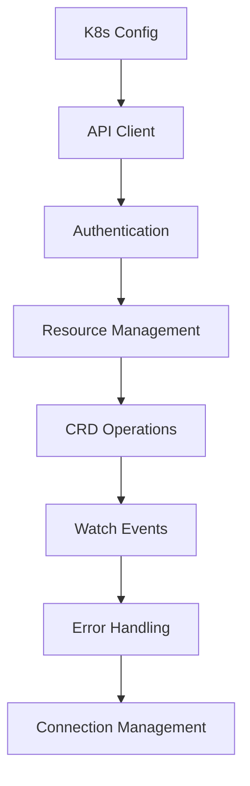

# Kubernetes API Integration Patterns

## Overview

Kubernetes API integration requires careful handling of authentication, resource management, and error scenarios. This document provides patterns for implementing reliable Kubernetes integrations with proper lifecycle management.

## Architecture Pattern



## Core Integration Components

### 1. Kubernetes Client Configuration

**File**: `utils/kubernetes.py`

```python
"""
Kubernetes API client configuration and management.
Provides authenticated client with connection pooling and error handling.
"""

import os
import logging
from typing import Optional, Dict, Any, List
from kubernetes import client, config, watch
from kubernetes.client.rest import ApiException
from django.conf import settings
from django.core.cache import cache

logger = logging.getLogger(__name__)

class KubernetesClient:
    """
    Kubernetes API client with authentication, connection management,
    and error handling for Hedgehog NetBox Plugin integration.
    """
    
    def __init__(self, config_path: Optional[str] = None, context: Optional[str] = None):
        """
        Initialize Kubernetes client with configuration.
        
        Args:
            config_path: Path to kubeconfig file
            context: Kubernetes context to use
        """
        self.config_path = config_path or self._get_config_path()
        self.context = context
        self._client = None
        self._custom_client = None
        self._apps_client = None
        self._init_clients()
    
    def _get_config_path(self) -> str:
        """Get Kubernetes config path from settings or environment"""
        # Try plugin settings first
        plugin_config = getattr(settings, 'PLUGINS_CONFIG', {}).get('netbox_hedgehog', {})
        config_path = plugin_config.get('kubernetes_config_path')
        
        if config_path and os.path.exists(config_path):
            return config_path
        
        # Try environment variable
        config_path = os.environ.get('KUBECONFIG')
        if config_path and os.path.exists(config_path):
            return config_path
        
        # Try default location
        default_path = os.path.expanduser('~/.kube/config')
        if os.path.exists(default_path):
            return default_path
        
        raise ValueError("No valid Kubernetes configuration found")
    
    def _init_clients(self):
        """Initialize Kubernetes API clients"""
        try:
            # Load configuration
            if self.config_path:
                config.load_kube_config(
                    config_file=self.config_path,
                    context=self.context
                )
            else:
                # Try in-cluster config for pod-based deployment
                config.load_incluster_config()
            
            # Initialize API clients
            self._client = client.CoreV1Api()
            self._custom_client = client.CustomObjectsApi()
            self._apps_client = client.AppsV1Api()
            
            logger.info("Kubernetes API clients initialized successfully")
            
        except Exception as e:
            logger.error(f"Failed to initialize Kubernetes clients: {e}")
            raise
    
    @property
    def core_v1(self) -> client.CoreV1Api:
        """Get Core V1 API client"""
        if not self._client:
            self._init_clients()
        return self._client
    
    @property
    def custom_objects(self) -> client.CustomObjectsApi:
        """Get Custom Objects API client"""
        if not self._custom_client:
            self._init_clients()
        return self._custom_client
    
    @property
    def apps_v1(self) -> client.AppsV1Api:
        """Get Apps V1 API client"""
        if not self._apps_client:
            self._init_clients()
        return self._apps_client
    
    def test_connection(self) -> Dict[str, Any]:
        """
        Test Kubernetes API connection and return cluster information.
        
        Returns:
            Dictionary with connection status and cluster info
        """
        try:
            # Get cluster version
            version_info = self.core_v1.get_code()
            
            # Get node information  
            nodes = self.core_v1.list_node()
            node_count = len(nodes.items)
            
            # Test custom resources access
            crd_access = self._test_crd_access()
            
            return {
                'status': 'connected',
                'kubernetes_version': version_info.git_version,
                'node_count': node_count,
                'crd_access': crd_access,
                'connection_time': time.time(),
            }
            
        except ApiException as e:
            logger.error(f"Kubernetes API connection test failed: {e}")
            return {
                'status': 'failed',
                'error': str(e),
                'error_code': e.status,
            }
        except Exception as e:
            logger.error(f"Kubernetes connection error: {e}")
            return {
                'status': 'error',
                'error': str(e),
            }
    
    def _test_crd_access(self) -> bool:
        """Test Custom Resource Definition access"""
        try:
            # Try to list Hedgehog CRDs
            crds = self.custom_objects.list_cluster_custom_object(
                group='wiring.githedgehog.com',
                version='v1alpha2',
                plural='fabrics',
                limit=1
            )
            return True
        except ApiException:
            return False
        except Exception:
            return False

# Global client instance
_k8s_client: Optional[KubernetesClient] = None

def get_kubernetes_client() -> KubernetesClient:
    """Get or create global Kubernetes client instance"""
    global _k8s_client
    
    if _k8s_client is None:
        _k8s_client = KubernetesClient()
    
    return _k8s_client

def reset_kubernetes_client():
    """Reset global Kubernetes client (useful for testing)"""
    global _k8s_client
    _k8s_client = None
```

### 2. Custom Resource Management

**File**: `utils/crd_schemas.py`

```python
"""
Kubernetes Custom Resource Definition schemas and operations.
Defines CRD structures and provides CRUD operations for Hedgehog resources.
"""

from typing import Dict, Any, List, Optional
from dataclasses import dataclass, asdict
from kubernetes.client.rest import ApiException
import logging

logger = logging.getLogger(__name__)

@dataclass
class HedgehogFabricSpec:
    """Hedgehog Fabric CRD specification"""
    name: str
    description: str
    asn: int
    spine_count: int
    leaf_count: int
    spine_leaf_links: Dict[str, Any]
    vpc_peering_config: Dict[str, Any]
    switch_config: Dict[str, Any]

@dataclass
class HedgehogFabricStatus:
    """Hedgehog Fabric CRD status"""
    phase: str = "Pending"
    conditions: List[Dict[str, Any]] = None
    spine_status: Dict[str, str] = None  
    leaf_status: Dict[str, str] = None
    last_sync_time: str = ""
    sync_error: str = ""

@dataclass
class HedgehogFabricCRD:
    """Complete Hedgehog Fabric Custom Resource"""
    apiVersion: str = "wiring.githedgehog.com/v1alpha2"
    kind: str = "Fabric"
    metadata: Dict[str, Any] = None
    spec: HedgehogFabricSpec = None
    status: HedgehogFabricStatus = None

class CRDManager:
    """Manager for Hedgehog Custom Resource operations"""
    
    def __init__(self, k8s_client):
        """
        Initialize CRD manager with Kubernetes client.
        
        Args:
            k8s_client: KubernetesClient instance
        """
        self.client = k8s_client
        self.group = "wiring.githedgehog.com"
        self.version = "v1alpha2"
        self.namespace = "hedgehog-system"
    
    def create_fabric(self, fabric_crd: HedgehogFabricCRD) -> Dict[str, Any]:
        """
        Create a new Fabric custom resource.
        
        Args:
            fabric_crd: Fabric CRD definition
            
        Returns:
            Created resource dictionary
        """
        try:
            # Convert dataclass to dictionary
            body = asdict(fabric_crd)
            
            # Ensure metadata
            if not body.get('metadata'):
                body['metadata'] = {}
            
            if not body['metadata'].get('name'):
                body['metadata']['name'] = fabric_crd.spec.name.lower()
            
            if not body['metadata'].get('namespace'):
                body['metadata']['namespace'] = self.namespace
            
            # Create the resource
            result = self.client.custom_objects.create_namespaced_custom_object(
                group=self.group,
                version=self.version,
                namespace=self.namespace,
                plural="fabrics",
                body=body
            )
            
            logger.info(f"Created Fabric CRD: {body['metadata']['name']}")
            return result
            
        except ApiException as e:
            logger.error(f"Failed to create Fabric CRD: {e}")
            raise
        except Exception as e:
            logger.error(f"Error creating Fabric CRD: {e}")
            raise
    
    def get_fabric(self, name: str) -> Optional[Dict[str, Any]]:
        """
        Get a Fabric custom resource by name.
        
        Args:
            name: Fabric resource name
            
        Returns:
            Fabric resource dictionary or None if not found
        """
        try:
            result = self.client.custom_objects.get_namespaced_custom_object(
                group=self.group,
                version=self.version,
                namespace=self.namespace,
                plural="fabrics",
                name=name
            )
            return result
            
        except ApiException as e:
            if e.status == 404:
                return None
            logger.error(f"Failed to get Fabric CRD {name}: {e}")
            raise
        except Exception as e:
            logger.error(f"Error getting Fabric CRD {name}: {e}")
            raise
    
    def list_fabrics(self, label_selector: Optional[str] = None) -> List[Dict[str, Any]]:
        """
        List all Fabric custom resources.
        
        Args:
            label_selector: Optional label selector for filtering
            
        Returns:
            List of Fabric resource dictionaries
        """
        try:
            result = self.client.custom_objects.list_namespaced_custom_object(
                group=self.group,
                version=self.version,
                namespace=self.namespace,
                plural="fabrics",
                label_selector=label_selector
            )
            
            return result.get('items', [])
            
        except ApiException as e:
            logger.error(f"Failed to list Fabric CRDs: {e}")
            raise
        except Exception as e:
            logger.error(f"Error listing Fabric CRDs: {e}")
            raise
    
    def update_fabric(self, name: str, fabric_crd: HedgehogFabricCRD) -> Dict[str, Any]:
        """
        Update an existing Fabric custom resource.
        
        Args:
            name: Fabric resource name
            fabric_crd: Updated Fabric CRD definition
            
        Returns:
            Updated resource dictionary
        """
        try:
            # Get current resource for resourceVersion
            current = self.get_fabric(name)
            if not current:
                raise ValueError(f"Fabric {name} not found")
            
            # Convert dataclass to dictionary
            body = asdict(fabric_crd)
            
            # Preserve metadata
            body['metadata'] = current['metadata']
            
            # Update the resource
            result = self.client.custom_objects.replace_namespaced_custom_object(
                group=self.group,
                version=self.version,
                namespace=self.namespace,
                plural="fabrics",
                name=name,
                body=body
            )
            
            logger.info(f"Updated Fabric CRD: {name}")
            return result
            
        except ApiException as e:
            logger.error(f"Failed to update Fabric CRD {name}: {e}")
            raise
        except Exception as e:
            logger.error(f"Error updating Fabric CRD {name}: {e}")
            raise
    
    def delete_fabric(self, name: str) -> bool:
        """
        Delete a Fabric custom resource.
        
        Args:
            name: Fabric resource name
            
        Returns:
            True if deleted successfully
        """
        try:
            self.client.custom_objects.delete_namespaced_custom_object(
                group=self.group,
                version=self.version,
                namespace=self.namespace,
                plural="fabrics",
                name=name
            )
            
            logger.info(f"Deleted Fabric CRD: {name}")
            return True
            
        except ApiException as e:
            if e.status == 404:
                logger.warning(f"Fabric CRD {name} not found for deletion")
                return True
            logger.error(f"Failed to delete Fabric CRD {name}: {e}")
            raise
        except Exception as e:
            logger.error(f"Error deleting Fabric CRD {name}: {e}")
            raise
    
    def patch_fabric_status(self, name: str, status: HedgehogFabricStatus) -> Dict[str, Any]:
        """
        Patch the status of a Fabric custom resource.
        
        Args:
            name: Fabric resource name
            status: New status object
            
        Returns:
            Updated resource dictionary
        """
        try:
            # Prepare patch body
            patch_body = {
                'status': asdict(status)
            }
            
            # Patch the resource status
            result = self.client.custom_objects.patch_namespaced_custom_object_status(
                group=self.group,
                version=self.version,
                namespace=self.namespace,
                plural="fabrics",
                name=name,
                body=patch_body
            )
            
            logger.info(f"Patched Fabric CRD status: {name}")
            return result
            
        except ApiException as e:
            logger.error(f"Failed to patch Fabric CRD status {name}: {e}")
            raise
        except Exception as e:
            logger.error(f"Error patching Fabric CRD status {name}: {e}")
            raise
```

### 3. Resource Watching and Events

**File**: `utils/k8s_watcher.py`

```python
"""
Kubernetes resource watching and event handling.
Monitors CRD changes and triggers appropriate actions.
"""

import json
import time
import logging
from typing import Dict, Any, Callable, Optional
from threading import Thread, Event
from kubernetes import watch
from kubernetes.client.rest import ApiException
from django.core.cache import cache

logger = logging.getLogger(__name__)

class ResourceWatcher:
    """
    Kubernetes resource watcher with event handling.
    Monitors custom resources and triggers callbacks on changes.
    """
    
    def __init__(self, k8s_client, crd_manager):
        """
        Initialize resource watcher.
        
        Args:
            k8s_client: KubernetesClient instance
            crd_manager: CRDManager instance
        """
        self.client = k8s_client
        self.crd_manager = crd_manager
        self._watching = False
        self._watch_thread = None
        self._stop_event = Event()
        self._event_handlers = {}
    
    def register_event_handler(self, resource_type: str, event_type: str, handler: Callable):
        """
        Register an event handler for resource changes.
        
        Args:
            resource_type: Type of resource (e.g., 'fabric')
            event_type: Type of event ('ADDED', 'MODIFIED', 'DELETED')
            handler: Callback function to handle the event
        """
        key = f"{resource_type}:{event_type}"
        if key not in self._event_handlers:
            self._event_handlers[key] = []
        
        self._event_handlers[key].append(handler)
        logger.info(f"Registered event handler for {key}")
    
    def start_watching(self):
        """Start watching Kubernetes resources"""
        if self._watching:
            logger.warning("Resource watcher already running")
            return
        
        self._watching = True
        self._stop_event.clear()
        
        # Start watch thread
        self._watch_thread = Thread(target=self._watch_loop, daemon=True)
        self._watch_thread.start()
        
        logger.info("Started Kubernetes resource watcher")
    
    def stop_watching(self):
        """Stop watching Kubernetes resources"""
        if not self._watching:
            return
        
        self._watching = False
        self._stop_event.set()
        
        if self._watch_thread and self._watch_thread.is_alive():
            self._watch_thread.join(timeout=5)
        
        logger.info("Stopped Kubernetes resource watcher")
    
    def _watch_loop(self):
        """Main watch loop for monitoring resources"""
        while self._watching and not self._stop_event.is_set():
            try:
                self._watch_fabrics()
            except Exception as e:
                logger.error(f"Error in watch loop: {e}")
                if self._watching:
                    # Wait before retrying
                    time.sleep(5)
    
    def _watch_fabrics(self):
        """Watch Fabric custom resources"""
        try:
            w = watch.Watch()
            
            # Watch fabric resources
            for event in w.stream(
                self.client.custom_objects.list_namespaced_custom_object,
                group=self.crd_manager.group,
                version=self.crd_manager.version,
                namespace=self.crd_manager.namespace,
                plural="fabrics",
                timeout_seconds=60  # Timeout to allow checking stop event
            ):
                if self._stop_event.is_set():
                    break
                
                self._handle_event('fabric', event)
                
        except ApiException as e:
            if e.status == 410:  # Resource version too old
                logger.warning("Watch resource version too old, restarting watch")
                return
            raise
        except Exception as e:
            logger.error(f"Error watching fabrics: {e}")
            raise
    
    def _handle_event(self, resource_type: str, event: Dict[str, Any]):
        """
        Handle a Kubernetes resource event.
        
        Args:
            resource_type: Type of resource
            event: Event dictionary from Kubernetes watch
        """
        try:
            event_type = event['type']
            resource = event['object']
            
            logger.debug(f"Received {event_type} event for {resource_type}: {resource['metadata']['name']}")
            
            # Update cache
            cache_key = f"k8s:{resource_type}:{resource['metadata']['name']}"
            if event_type == 'DELETED':
                cache.delete(cache_key)
            else:
                cache.set(cache_key, resource, timeout=300)  # 5 minutes
            
            # Call registered handlers
            handler_key = f"{resource_type}:{event_type}"
            handlers = self._event_handlers.get(handler_key, [])
            
            for handler in handlers:
                try:
                    handler(event_type, resource)
                except Exception as e:
                    logger.error(f"Error in event handler {handler}: {e}")
            
        except Exception as e:
            logger.error(f"Error handling event: {e}")

class EventHandlers:
    """Pre-defined event handlers for common operations"""
    
    @staticmethod
    def fabric_added_handler(event_type: str, resource: Dict[str, Any]):
        """Handle fabric added events"""
        try:
            fabric_name = resource['metadata']['name']
            logger.info(f"New fabric detected: {fabric_name}")
            
            # Trigger fabric sync to NetBox
            from netbox_hedgehog.tasks.git_sync_tasks import sync_fabric_from_k8s
            sync_fabric_from_k8s.delay(fabric_name)
            
        except Exception as e:
            logger.error(f"Error handling fabric added event: {e}")
    
    @staticmethod
    def fabric_modified_handler(event_type: str, resource: Dict[str, Any]):
        """Handle fabric modified events"""
        try:
            fabric_name = resource['metadata']['name']
            logger.info(f"Fabric modified: {fabric_name}")
            
            # Check if spec changed
            if 'spec' in resource:
                # Trigger configuration update
                from netbox_hedgehog.tasks.git_sync_tasks import update_fabric_config
                update_fabric_config.delay(fabric_name, resource['spec'])
            
        except Exception as e:
            logger.error(f"Error handling fabric modified event: {e}")
    
    @staticmethod
    def fabric_deleted_handler(event_type: str, resource: Dict[str, Any]):
        """Handle fabric deleted events"""
        try:
            fabric_name = resource['metadata']['name']
            logger.info(f"Fabric deleted: {fabric_name}")
            
            # Clean up associated resources
            from netbox_hedgehog.services.cleanup_service import cleanup_fabric_resources
            cleanup_fabric_resources.delay(fabric_name)
            
        except Exception as e:
            logger.error(f"Error handling fabric deleted event: {e}")
```

### 4. Authentication and RBAC

**File**: `security/k8s_auth.py`

```python
"""
Kubernetes authentication and RBAC management.
Handles service accounts, roles, and permissions for Hedgehog integration.
"""

import base64
import yaml
from typing import Dict, Any, List, Optional
from kubernetes.client.rest import ApiException
import logging

logger = logging.getLogger(__name__)

class KubernetesAuth:
    """Kubernetes authentication and RBAC manager"""
    
    def __init__(self, k8s_client):
        """
        Initialize Kubernetes authentication manager.
        
        Args:
            k8s_client: KubernetesClient instance
        """
        self.client = k8s_client
        self.namespace = "hedgehog-system"
        self.service_account_name = "hedgehog-netbox-plugin"
    
    def create_service_account(self) -> Dict[str, Any]:
        """
        Create service account for Hedgehog NetBox Plugin.
        
        Returns:
            Service account object
        """
        try:
            service_account = {
                'apiVersion': 'v1',
                'kind': 'ServiceAccount',
                'metadata': {
                    'name': self.service_account_name,
                    'namespace': self.namespace,
                    'labels': {
                        'app': 'hedgehog-netbox-plugin',
                        'component': 'service-account'
                    }
                }
            }
            
            result = self.client.core_v1.create_namespaced_service_account(
                namespace=self.namespace,
                body=service_account
            )
            
            logger.info(f"Created service account: {self.service_account_name}")
            return result
            
        except ApiException as e:
            if e.status == 409:  # Already exists
                logger.info(f"Service account {self.service_account_name} already exists")
                return self.get_service_account()
            logger.error(f"Failed to create service account: {e}")
            raise
        except Exception as e:
            logger.error(f"Error creating service account: {e}")
            raise
    
    def get_service_account(self) -> Optional[Dict[str, Any]]:
        """Get existing service account"""
        try:
            result = self.client.core_v1.read_namespaced_service_account(
                name=self.service_account_name,
                namespace=self.namespace
            )
            return result
        except ApiException as e:
            if e.status == 404:
                return None
            raise
    
    def create_cluster_role(self) -> Dict[str, Any]:
        """
        Create cluster role with required permissions.
        
        Returns:
            Cluster role object
        """
        try:
            cluster_role = {
                'apiVersion': 'rbac.authorization.k8s.io/v1',
                'kind': 'ClusterRole',
                'metadata': {
                    'name': 'hedgehog-netbox-plugin',
                    'labels': {
                        'app': 'hedgehog-netbox-plugin',
                        'component': 'rbac'
                    }
                },
                'rules': [
                    # Hedgehog CRD permissions
                    {
                        'apiGroups': ['wiring.githedgehog.com'],
                        'resources': ['*'],
                        'verbs': ['get', 'list', 'watch', 'create', 'update', 'patch', 'delete']
                    },
                    # Core resource permissions
                    {
                        'apiGroups': [''],
                        'resources': ['configmaps', 'secrets', 'services'],
                        'verbs': ['get', 'list', 'watch']
                    },
                    # Apps permissions
                    {
                        'apiGroups': ['apps'],
                        'resources': ['deployments', 'daemonsets'],
                        'verbs': ['get', 'list', 'watch']
                    },
                    # Events permissions
                    {
                        'apiGroups': [''],
                        'resources': ['events'],
                        'verbs': ['create']
                    }
                ]
            }
            
            from kubernetes.client import RbacAuthorizationV1Api
            rbac_client = RbacAuthorizationV1Api(self.client.core_v1.api_client)
            
            result = rbac_client.create_cluster_role(body=cluster_role)
            
            logger.info("Created cluster role: hedgehog-netbox-plugin")
            return result
            
        except ApiException as e:
            if e.status == 409:  # Already exists
                logger.info("Cluster role hedgehog-netbox-plugin already exists")
                return self.get_cluster_role()
            logger.error(f"Failed to create cluster role: {e}")
            raise
        except Exception as e:
            logger.error(f"Error creating cluster role: {e}")
            raise
    
    def get_cluster_role(self) -> Optional[Dict[str, Any]]:
        """Get existing cluster role"""
        try:
            from kubernetes.client import RbacAuthorizationV1Api
            rbac_client = RbacAuthorizationV1Api(self.client.core_v1.api_client)
            
            result = rbac_client.read_cluster_role(name='hedgehog-netbox-plugin')
            return result
        except ApiException as e:
            if e.status == 404:
                return None
            raise
    
    def create_cluster_role_binding(self) -> Dict[str, Any]:
        """
        Create cluster role binding for service account.
        
        Returns:
            Cluster role binding object
        """
        try:
            cluster_role_binding = {
                'apiVersion': 'rbac.authorization.k8s.io/v1',
                'kind': 'ClusterRoleBinding',
                'metadata': {
                    'name': 'hedgehog-netbox-plugin',
                    'labels': {
                        'app': 'hedgehog-netbox-plugin',
                        'component': 'rbac'
                    }
                },
                'roleRef': {
                    'apiGroup': 'rbac.authorization.k8s.io',
                    'kind': 'ClusterRole',
                    'name': 'hedgehog-netbox-plugin'
                },
                'subjects': [
                    {
                        'kind': 'ServiceAccount',
                        'name': self.service_account_name,
                        'namespace': self.namespace
                    }
                ]
            }
            
            from kubernetes.client import RbacAuthorizationV1Api
            rbac_client = RbacAuthorizationV1Api(self.client.core_v1.api_client)
            
            result = rbac_client.create_cluster_role_binding(body=cluster_role_binding)
            
            logger.info("Created cluster role binding: hedgehog-netbox-plugin")
            return result
            
        except ApiException as e:
            if e.status == 409:  # Already exists
                logger.info("Cluster role binding hedgehog-netbox-plugin already exists")
                return None
            logger.error(f"Failed to create cluster role binding: {e}")
            raise
        except Exception as e:
            logger.error(f"Error creating cluster role binding: {e}")
            raise
    
    def get_service_account_token(self) -> Optional[str]:
        """
        Get service account authentication token.
        
        Returns:
            Base64 decoded token string
        """
        try:
            # Get service account
            sa = self.get_service_account()
            if not sa:
                return None
            
            # Get secrets associated with service account
            secrets = sa.secrets or []
            
            for secret_ref in secrets:
                secret = self.client.core_v1.read_namespaced_secret(
                    name=secret_ref.name,
                    namespace=self.namespace
                )
                
                # Check if this is a service account token
                if secret.type == 'kubernetes.io/service-account-token':
                    token_data = secret.data.get('token')
                    if token_data:
                        return base64.b64decode(token_data).decode('utf-8')
            
            return None
            
        except Exception as e:
            logger.error(f"Error getting service account token: {e}")
            return None
    
    def setup_rbac(self) -> Dict[str, Any]:
        """
        Set up complete RBAC configuration.
        
        Returns:
            Dictionary with setup results
        """
        results = {}
        
        try:
            # Create namespace if it doesn't exist
            self._ensure_namespace()
            results['namespace'] = 'created'
            
            # Create service account
            sa = self.create_service_account()
            results['service_account'] = 'created' if sa else 'exists'
            
            # Create cluster role
            cr = self.create_cluster_role()
            results['cluster_role'] = 'created' if cr else 'exists'
            
            # Create cluster role binding
            crb = self.create_cluster_role_binding()
            results['cluster_role_binding'] = 'created' if crb else 'exists'
            
            # Get token
            token = self.get_service_account_token()
            results['token'] = 'retrieved' if token else 'not_available'
            
            logger.info("RBAC setup completed successfully")
            return results
            
        except Exception as e:
            logger.error(f"RBAC setup failed: {e}")
            results['error'] = str(e)
            return results
    
    def _ensure_namespace(self):
        """Ensure the hedgehog-system namespace exists"""
        try:
            self.client.core_v1.read_namespace(name=self.namespace)
        except ApiException as e:
            if e.status == 404:
                # Create namespace
                namespace = {
                    'apiVersion': 'v1',
                    'kind': 'Namespace',
                    'metadata': {
                        'name': self.namespace,
                        'labels': {
                            'app': 'hedgehog-netbox-plugin'
                        }
                    }
                }
                
                self.client.core_v1.create_namespace(body=namespace)
                logger.info(f"Created namespace: {self.namespace}")
            else:
                raise
```

### 5. Error Handling and Resilience

**File**: `utils/k8s_error_handler.py`

```python
"""
Kubernetes API error handling and resilience patterns.
Provides retry logic, circuit breakers, and error recovery.
"""

import time
import logging
from typing import Any, Callable, Optional, Dict
from functools import wraps
from kubernetes.client.rest import ApiException
from django.core.cache import cache

logger = logging.getLogger(__name__)

class KubernetesError(Exception):
    """Base exception for Kubernetes integration errors"""
    pass

class KubernetesConnectionError(KubernetesError):
    """Kubernetes connection error"""
    pass

class KubernetesPermissionError(KubernetesError):
    """Kubernetes permission error"""
    pass

class KubernetesResourceError(KubernetesError):
    """Kubernetes resource error"""
    pass

def retry_k8s_operation(max_retries: int = 3, delay: float = 1.0, backoff: float = 2.0):
    """
    Decorator for retrying Kubernetes operations with exponential backoff.
    
    Args:
        max_retries: Maximum number of retry attempts
        delay: Initial delay between retries (seconds)
        backoff: Backoff multiplier for delay
    """
    def decorator(func: Callable) -> Callable:
        @wraps(func)
        def wrapper(*args, **kwargs) -> Any:
            last_exception = None
            current_delay = delay
            
            for attempt in range(max_retries + 1):
                try:
                    return func(*args, **kwargs)
                except ApiException as e:
                    last_exception = e
                    
                    # Don't retry certain errors
                    if e.status in [401, 403, 404]:  # Unauthorized, Forbidden, Not Found
                        break
                    
                    if attempt < max_retries:
                        logger.warning(f"Kubernetes operation failed (attempt {attempt + 1}/{max_retries + 1}): {e}")
                        time.sleep(current_delay)
                        current_delay *= backoff
                    else:
                        logger.error(f"Kubernetes operation failed after {max_retries + 1} attempts: {e}")
                
                except Exception as e:
                    last_exception = e
                    
                    if attempt < max_retries:
                        logger.warning(f"Operation failed (attempt {attempt + 1}/{max_retries + 1}): {e}")
                        time.sleep(current_delay)
                        current_delay *= backoff
                    else:
                        logger.error(f"Operation failed after {max_retries + 1} attempts: {e}")
            
            # Convert to appropriate exception type
            if isinstance(last_exception, ApiException):
                raise _convert_api_exception(last_exception)
            else:
                raise KubernetesError(f"Operation failed: {last_exception}")
        
        return wrapper
    return decorator

def _convert_api_exception(api_exception: ApiException) -> KubernetesError:
    """Convert ApiException to appropriate KubernetesError subclass"""
    if api_exception.status in [401, 403]:
        return KubernetesPermissionError(f"Permission denied: {api_exception.reason}")
    elif api_exception.status == 404:
        return KubernetesResourceError(f"Resource not found: {api_exception.reason}")
    elif api_exception.status >= 500:
        return KubernetesConnectionError(f"Server error: {api_exception.reason}")
    else:
        return KubernetesError(f"API error ({api_exception.status}): {api_exception.reason}")

class CircuitBreaker:
    """Circuit breaker for Kubernetes operations"""
    
    def __init__(self, failure_threshold: int = 5, recovery_timeout: int = 60):
        """
        Initialize circuit breaker.
        
        Args:
            failure_threshold: Number of failures before opening circuit
            recovery_timeout: Seconds before attempting to close circuit
        """
        self.failure_threshold = failure_threshold
        self.recovery_timeout = recovery_timeout
        self.failure_count = 0
        self.last_failure_time = None
        self.state = 'closed'  # closed, open, half-open
    
    def call(self, func: Callable, *args, **kwargs) -> Any:
        """
        Call function through circuit breaker.
        
        Args:
            func: Function to call
            *args, **kwargs: Function arguments
            
        Returns:
            Function result
        """
        if self.state == 'open':
            if self._should_attempt_reset():
                self.state = 'half-open'
            else:
                raise KubernetesConnectionError("Circuit breaker is open")
        
        try:
            result = func(*args, **kwargs)
            self._on_success()
            return result
        
        except Exception as e:
            self._on_failure()
            raise
    
    def _should_attempt_reset(self) -> bool:
        """Check if circuit breaker should attempt reset"""
        return (
            self.last_failure_time and
            time.time() - self.last_failure_time >= self.recovery_timeout
        )
    
    def _on_success(self):
        """Handle successful operation"""
        self.failure_count = 0
        self.state = 'closed'
    
    def _on_failure(self):
        """Handle failed operation"""
        self.failure_count += 1
        self.last_failure_time = time.time()
        
        if self.failure_count >= self.failure_threshold:
            self.state = 'open'

class HealthChecker:
    """Kubernetes cluster health checker"""
    
    def __init__(self, k8s_client):
        """
        Initialize health checker.
        
        Args:
            k8s_client: KubernetesClient instance
        """
        self.client = k8s_client
        self.cache_key = 'k8s_health_status'
        self.cache_timeout = 30  # 30 seconds
    
    def check_health(self, use_cache: bool = True) -> Dict[str, Any]:
        """
        Check Kubernetes cluster health.
        
        Args:
            use_cache: Whether to use cached results
            
        Returns:
            Health status dictionary
        """
        if use_cache:
            cached_result = cache.get(self.cache_key)
            if cached_result:
                return cached_result
        
        health_status = {
            'timestamp': time.time(),
            'overall_status': 'unknown',
            'checks': {}
        }
        
        checks = [
            ('api_server', self._check_api_server),
            ('nodes', self._check_nodes),
            ('crds', self._check_crds),
            ('permissions', self._check_permissions),
        ]
        
        all_healthy = True
        
        for check_name, check_func in checks:
            try:
                result = check_func()
                health_status['checks'][check_name] = result
                if not result.get('healthy', False):
                    all_healthy = False
            except Exception as e:
                health_status['checks'][check_name] = {
                    'healthy': False,
                    'error': str(e)
                }
                all_healthy = False
        
        health_status['overall_status'] = 'healthy' if all_healthy else 'unhealthy'
        
        # Cache result
        cache.set(self.cache_key, health_status, timeout=self.cache_timeout)
        
        return health_status
    
    def _check_api_server(self) -> Dict[str, Any]:
        """Check API server connectivity"""
        try:
            version = self.client.core_v1.get_code()
            return {
                'healthy': True,
                'version': version.git_version,
                'response_time': 'normal'
            }
        except Exception as e:
            return {
                'healthy': False,
                'error': str(e)
            }
    
    def _check_nodes(self) -> Dict[str, Any]:
        """Check node status"""
        try:
            nodes = self.client.core_v1.list_node()
            healthy_nodes = 0
            total_nodes = len(nodes.items)
            
            for node in nodes.items:
                for condition in node.status.conditions:
                    if condition.type == 'Ready' and condition.status == 'True':
                        healthy_nodes += 1
                        break
            
            return {
                'healthy': healthy_nodes > 0,
                'total_nodes': total_nodes,
                'healthy_nodes': healthy_nodes
            }
        except Exception as e:
            return {
                'healthy': False,
                'error': str(e)
            }
    
    def _check_crds(self) -> Dict[str, Any]:
        """Check Hedgehog CRD availability"""
        try:
            # Try to list Fabric CRDs
            fabrics = self.client.custom_objects.list_cluster_custom_object(
                group='wiring.githedgehog.com',
                version='v1alpha2',
                plural='fabrics',
                limit=1
            )
            
            return {
                'healthy': True,
                'fabric_count': len(fabrics.get('items', []))
            }
        except Exception as e:
            return {
                'healthy': False,
                'error': str(e)
            }
    
    def _check_permissions(self) -> Dict[str, Any]:
        """Check required permissions"""
        try:
            # Try to create a simple resource to test permissions
            from kubernetes.client import AuthorizationV1Api
            
            auth_api = AuthorizationV1Api(self.client.core_v1.api_client)
            
            # Check if we can create fabrics
            can_create = auth_api.create_subject_access_review({
                'spec': {
                    'resourceAttributes': {
                        'group': 'wiring.githedgehog.com',
                        'resource': 'fabrics',
                        'verb': 'create'
                    }
                }
            })
            
            return {
                'healthy': can_create.status.allowed,
                'can_create_fabrics': can_create.status.allowed
            }
        except Exception as e:
            return {
                'healthy': False,
                'error': str(e)
            }
```

## Integration Testing Patterns

### 1. Kubernetes Client Testing

```python
# tests/test_kubernetes_integration.py
import unittest
from unittest.mock import Mock, patch
from kubernetes.client.rest import ApiException
from netbox_hedgehog.utils.kubernetes import KubernetesClient, get_kubernetes_client

class TestKubernetesClient(unittest.TestCase):
    """Test Kubernetes client integration"""
    
    def setUp(self):
        """Set up test environment"""
        self.mock_config_path = '/tmp/test-kubeconfig'
    
    @patch('kubernetes.config.load_kube_config')
    @patch('kubernetes.client.CoreV1Api')
    def test_client_initialization(self, mock_core_api, mock_load_config):
        """Test client initialization"""
        client = KubernetesClient(config_path=self.mock_config_path)
        
        mock_load_config.assert_called_once_with(
            config_file=self.mock_config_path,
            context=None
        )
        mock_core_api.assert_called_once()
    
    @patch('kubernetes.config.load_kube_config')
    @patch('kubernetes.client.CoreV1Api')
    def test_connection_test(self, mock_core_api, mock_load_config):
        """Test connection testing"""
        mock_api_instance = Mock()
        mock_core_api.return_value = mock_api_instance
        
        # Mock successful response
        mock_version = Mock()
        mock_version.git_version = 'v1.21.0'
        mock_api_instance.get_code.return_value = mock_version
        
        mock_nodes = Mock()
        mock_nodes.items = [Mock(), Mock()]  # 2 nodes
        mock_api_instance.list_node.return_value = mock_nodes
        
        client = KubernetesClient(config_path=self.mock_config_path)
        result = client.test_connection()
        
        self.assertEqual(result['status'], 'connected')
        self.assertEqual(result['kubernetes_version'], 'v1.21.0')
        self.assertEqual(result['node_count'], 2)
    
    @patch('kubernetes.config.load_kube_config')
    @patch('kubernetes.client.CoreV1Api')
    def test_connection_failure(self, mock_core_api, mock_load_config):
        """Test connection failure handling"""
        mock_api_instance = Mock()
        mock_core_api.return_value = mock_api_instance
        
        # Mock API exception
        mock_api_instance.get_code.side_effect = ApiException(status=401, reason="Unauthorized")
        
        client = KubernetesClient(config_path=self.mock_config_path)
        result = client.test_connection()
        
        self.assertEqual(result['status'], 'failed')
        self.assertEqual(result['error_code'], 401)
```

### 2. CRD Management Testing

```python
# tests/test_crd_management.py
import unittest
from unittest.mock import Mock, patch
from netbox_hedgehog.utils.crd_schemas import CRDManager, HedgehogFabricCRD, HedgehogFabricSpec

class TestCRDManager(unittest.TestCase):
    """Test CRD management operations"""
    
    def setUp(self):
        """Set up test environment"""
        self.mock_client = Mock()
        self.crd_manager = CRDManager(self.mock_client)
    
    def test_create_fabric(self):
        """Test fabric CRD creation"""
        # Create test fabric spec
        fabric_spec = HedgehogFabricSpec(
            name='test-fabric',
            description='Test fabric',
            asn=65001,
            spine_count=2,
            leaf_count=4,
            spine_leaf_links={},
            vpc_peering_config={},
            switch_config={}
        )
        
        fabric_crd = HedgehogFabricCRD(spec=fabric_spec)
        
        # Mock successful creation
        expected_result = {'metadata': {'name': 'test-fabric'}}
        self.mock_client.custom_objects.create_namespaced_custom_object.return_value = expected_result
        
        result = self.crd_manager.create_fabric(fabric_crd)
        
        self.assertEqual(result, expected_result)
        self.mock_client.custom_objects.create_namespaced_custom_object.assert_called_once()
    
    def test_get_fabric(self):
        """Test fabric CRD retrieval"""
        fabric_name = 'test-fabric'
        expected_result = {'metadata': {'name': fabric_name}}
        
        self.mock_client.custom_objects.get_namespaced_custom_object.return_value = expected_result
        
        result = self.crd_manager.get_fabric(fabric_name)
        
        self.assertEqual(result, expected_result)
        self.mock_client.custom_objects.get_namespaced_custom_object.assert_called_once_with(
            group=self.crd_manager.group,
            version=self.crd_manager.version,
            namespace=self.crd_manager.namespace,
            plural="fabrics",
            name=fabric_name
        )
    
    def test_get_fabric_not_found(self):
        """Test fabric CRD not found handling"""
        fabric_name = 'nonexistent-fabric'
        
        # Mock 404 response
        from kubernetes.client.rest import ApiException
        self.mock_client.custom_objects.get_namespaced_custom_object.side_effect = ApiException(
            status=404, 
            reason="Not Found"
        )
        
        result = self.crd_manager.get_fabric(fabric_name)
        
        self.assertIsNone(result)
```

## Configuration and Best Practices

### Environment Configuration

```yaml
# k8s-config.yaml
apiVersion: v1
kind: ConfigMap
metadata:
  name: hedgehog-netbox-config
  namespace: hedgehog-system
data:
  # Kubernetes configuration
  kubernetes.timeout: "30"
  kubernetes.retry_attempts: "3"
  kubernetes.watch_timeout: "300"
  
  # CRD configuration
  crd.group: "wiring.githedgehog.com"
  crd.version: "v1alpha2"
  crd.namespace: "hedgehog-system"
  
  # Authentication configuration
  auth.service_account: "hedgehog-netbox-plugin"
  auth.create_rbac: "true"
```

### Security Best Practices

1. **Service Account Security**
   - Use dedicated service accounts
   - Apply principle of least privilege
   - Rotate tokens regularly
   - Monitor access patterns

2. **RBAC Configuration**
   - Grant minimum required permissions
   - Use namespace-scoped roles where possible
   - Regularly audit permissions
   - Monitor unauthorized access attempts

3. **Network Security**
   - Use TLS for all API communication
   - Implement network policies
   - Restrict cluster access
   - Monitor network traffic

### Performance Optimization

1. **Connection Management**
   - Use connection pooling
   - Implement connection timeouts
   - Handle connection failures gracefully
   - Monitor connection health

2. **Resource Caching**
   - Cache frequently accessed resources
   - Use appropriate TTL values
   - Implement cache invalidation
   - Monitor cache performance

3. **Error Handling**
   - Implement retry logic with backoff
   - Use circuit breakers for resilience
   - Handle rate limiting properly
   - Log errors with proper context

This Kubernetes integration pattern ensures reliable, secure, and performant integration with Kubernetes clusters while following best practices for authentication, error handling, and resource management.