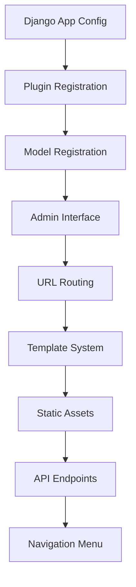

# NetBox Plugin Integration Patterns

## Overview

NetBox plugin integration requires careful coordination with Django's app system, NetBox's plugin architecture, and custom model registration. This document provides patterns for implementing reliable NetBox plugin integrations.

## Architecture Pattern



## Core Integration Components

### 1. Django App Configuration

**File**: `apps.py`

```python
from django.apps import AppConfig
import logging

class NetboxHedgehogConfig(AppConfig):
    """Django app configuration for the Hedgehog NetBox Plugin"""
    
    default_auto_field = 'django.db.models.BigAutoField'
    name = 'netbox_hedgehog'
    label = 'netbox_hedgehog'
    verbose_name = 'Hedgehog NetBox Plugin'
    
    def ready(self):
        """Initialize plugin when Django is ready"""
        try:
            logger = logging.getLogger(__name__)
            logger.info("Hedgehog NetBox Plugin: Loading with minimal initialization")
            
            # Initialize plugin components in correct order
            self._initialize_plugin()
            
        except Exception as e:
            logger = logging.getLogger(__name__)
            logger.warning(f"Hedgehog NetBox Plugin: Initialization warning: {e}")
    
    def _initialize_plugin(self):
        """Initialize plugin-specific functionality"""
        try:
            # Import signals to connect them to Django's signal system
            from . import signals
            
            # Register any custom model behaviors
            self._register_model_behaviors()
            
            # Initialize service registry
            self._initialize_services()
            
            logger = logging.getLogger(__name__)
            logger.info("Hedgehog NetBox Plugin: Initialization complete")
            
        except Exception as e:
            logger = logging.getLogger(__name__)
            logger.error(f"Hedgehog NetBox Plugin: Initialization failed: {e}")
    
    def _register_model_behaviors(self):
        """Register custom model behaviors and validators"""
        # Import models to ensure they're registered with Django
        from .models import (
            HedgehogFabric, 
            HedgehogResource, 
            GitRepository,
            HedgehogReconciliationAlert
        )
        
        # Register any custom field validators
        from .validators import fabric_git_validator
        
    def _initialize_services(self):
        """Initialize service registry and dependencies"""
        from .application.service_registry import ServiceRegistry
        
        # Register core services
        ServiceRegistry.register_core_services()
```

### 2. Plugin Configuration

**File**: `__init__.py`

```python
"""
Hedgehog NetBox Plugin
Provides GitOps integration for Hedgehog Fabric management in NetBox.
"""

from netbox.plugins import PluginConfig

class HedgehogConfig(PluginConfig):
    """NetBox plugin configuration for Hedgehog integration"""
    
    name = 'netbox_hedgehog'
    verbose_name = 'Hedgehog NetBox Plugin'
    description = 'GitOps integration for Hedgehog Open Network Fabric management'
    version = '1.0.0'
    author = 'Hedgehog Team'
    author_email = 'support@hedgehog.io'
    base_url = 'hedgehog'
    required_settings = []
    default_settings = {
        'git_default_branch': 'main',
        'k8s_timeout': 30,
        'sync_interval': 300,  # 5 minutes
        'max_retry_attempts': 3,
        'enable_webhooks': True,
        'enable_realtime_sync': True,
    }
    caching_config = {
        'fabric_cache_ttl': 300,  # 5 minutes
        'k8s_resource_cache_ttl': 60,  # 1 minute
        'git_status_cache_ttl': 30,  # 30 seconds
    }

# Register the plugin configuration
config = HedgehogConfig

# Plugin metadata
__version__ = '1.0.0'
__author__ = 'Hedgehog Team'
```

### 3. Model Registration Pattern

**File**: `models/__init__.py`

```python
"""
Model registration for NetBox plugin integration.
Ensures all models are properly registered with Django ORM.
"""

# Core models
from .base import HedgehogResource
from .fabric import HedgehogFabric  
from .git_repository import GitRepository
from .reconciliation import HedgehogReconciliationAlert
from .gitops import (
    HedgehogGitOpsFile,
    HedgehogGitOpsDirectory, 
    HedgehogGitOpsSyncStatus
)

# VPC API models
from .vpc_api import (
    HedgehogVPC,
    HedgehogSubnet,
    HedgehogVPCAttachment
)

# Wiring API models  
from .wiring_api import (
    HedgehogConnection,
    HedgehogSwitch,
    HedgehogPort
)

# Ensure all models are registered for Django admin
__all__ = [
    # Core models
    'HedgehogResource',
    'HedgehogFabric',
    'GitRepository', 
    'HedgehogReconciliationAlert',
    
    # GitOps models
    'HedgehogGitOpsFile',
    'HedgehogGitOpsDirectory',
    'HedgehogGitOpsSyncStatus',
    
    # VPC API models
    'HedgehogVPC',
    'HedgehogSubnet', 
    'HedgehogVPCAttachment',
    
    # Wiring API models
    'HedgehogConnection',
    'HedgehogSwitch',
    'HedgehogPort',
]

# Register models with admin interface
def register_admin_models():
    """Register all models with Django admin interface"""
    from django.contrib import admin
    from . import fabric, git_repository, reconciliation, gitops, vpc_api, wiring_api
    
    # Register admin classes
    admin.site.register(HedgehogFabric, fabric.HedgehogFabricAdmin)
    admin.site.register(GitRepository, git_repository.GitRepositoryAdmin)
    admin.site.register(HedgehogReconciliationAlert, reconciliation.ReconciliationAlertAdmin)
    
    # Register additional admin interfaces as needed
    for model_class in [HedgehogVPC, HedgehogSubnet, HedgehogConnection]:
        if not admin.site.is_registered(model_class):
            admin.site.register(model_class)
```

### 4. URL Configuration Pattern

**File**: `urls.py`

```python
"""
URL routing for NetBox plugin.
Defines all URL patterns for views, APIs, and webhooks.
"""

from django.urls import path, include
from django.views.generic import RedirectView

from .views import (
    # Fabric views
    fabric,
    fabric_views,
    fabric_delete,
    
    # Git repository views  
    git_repository_views,
    
    # GitOps views
    gitops_onboarding_views,
    gitops_edit_views,
    
    # API views
    sync_views,
    
    # Specialized views
    catalog,
    drift_dashboard,
    minimal_test,
)

# App namespace for URL reversing
app_name = 'netbox_hedgehog'

# Main URL patterns
urlpatterns = [
    # Root redirect to fabric list
    path('', RedirectView.as_view(pattern_name='plugins:netbox_hedgehog:hedgehogfabric_list')),
    
    # Fabric management URLs
    path('fabrics/', include([
        path('', fabric_views.HedgehogFabricListView.as_view(), name='hedgehogfabric_list'),
        path('add/', fabric_views.HedgehogFabricEditView.as_view(), name='hedgehogfabric_add'),
        path('<int:pk>/', fabric_views.HedgehogFabricView.as_view(), name='hedgehogfabric'),
        path('<int:pk>/edit/', fabric_views.HedgehogFabricEditView.as_view(), name='hedgehogfabric_edit'),
        path('<int:pk>/delete/', fabric_delete.HedgehogFabricDeleteView.as_view(), name='hedgehogfabric_delete'),
        path('<int:pk>/changelog/', fabric_views.HedgehogFabricChangeLogView.as_view(), name='hedgehogfabric_changelog'),
    ])),
    
    # Git repository management URLs
    path('git-repositories/', include([
        path('', git_repository_views.GitRepositoryListView.as_view(), name='gitrepository_list'),
        path('add/', git_repository_views.GitRepositoryEditView.as_view(), name='gitrepository_add'),
        path('<int:pk>/', git_repository_views.GitRepositoryView.as_view(), name='gitrepository'),
        path('<int:pk>/edit/', git_repository_views.GitRepositoryEditView.as_view(), name='gitrepository_edit'),
        path('<int:pk>/delete/', git_repository_views.GitRepositoryDeleteView.as_view(), name='gitrepository_delete'),
    ])),
    
    # GitOps workflow URLs
    path('gitops/', include([
        path('onboarding/', gitops_onboarding_views.GitOpsOnboardingView.as_view(), name='gitops_onboarding'),
        path('edit/', gitops_edit_views.GitOpsEditView.as_view(), name='gitops_edit'),
        path('sync/', sync_views.GitOpsSyncView.as_view(), name='gitops_sync'),
    ])),
    
    # API endpoints
    path('api/', include('netbox_hedgehog.api.urls', namespace='api')),
    
    # Utility views
    path('catalog/', catalog.CatalogView.as_view(), name='catalog'),
    path('drift-dashboard/', drift_dashboard.DriftDashboardView.as_view(), name='drift_dashboard'),
    path('test/', minimal_test.MinimalTestView.as_view(), name='test'),
]

# Error handling patterns
handler404 = 'netbox_hedgehog.views.errors.handler404'
handler500 = 'netbox_hedgehog.views.errors.handler500'
```

### 5. Navigation Integration

**File**: `navigation.py`

```python
"""
NetBox navigation menu integration.
Defines menu items and navigation structure for the plugin.
"""

from netbox.plugins import PluginMenuButton, PluginMenuItem, PluginMenu
from utilities.choices import ButtonColorChoices

# Define menu buttons
hedgehog_buttons = (
    PluginMenuButton(
        link='plugins:netbox_hedgehog:hedgehogfabric_add',
        title='Add Fabric',
        icon_class='mdi mdi-plus-thick',
        color=ButtonColorChoices.GREEN
    ),
    PluginMenuButton(
        link='plugins:netbox_hedgehog:gitrepository_add', 
        title='Add Git Repository',
        icon_class='mdi mdi-git',
        color=ButtonColorChoices.BLUE
    ),
)

# Define menu items
menu_items = (
    PluginMenuItem(
        link='plugins:netbox_hedgehog:hedgehogfabric_list',
        link_text='Fabrics',
        buttons=hedgehog_buttons[:1],  # Only fabric add button
    ),
    PluginMenuItem(
        link='plugins:netbox_hedgehog:gitrepository_list',
        link_text='Git Repositories', 
        buttons=hedgehog_buttons[1:],  # Only git repository add button
    ),
    PluginMenuItem(
        link='plugins:netbox_hedgehog:gitops_onboarding',
        link_text='GitOps Onboarding',
    ),
    PluginMenuItem(
        link='plugins:netbox_hedgehog:drift_dashboard',
        link_text='Drift Dashboard',
    ),
    PluginMenuItem(
        link='plugins:netbox_hedgehog:catalog',
        link_text='Resource Catalog',
    ),
)

# Main plugin menu
menu = PluginMenu(
    label='Hedgehog',
    groups=(
        ('Management', menu_items[:2]),  # Fabrics and Git Repositories
        ('Operations', menu_items[2:4]), # GitOps and Drift Dashboard  
        ('Utilities', menu_items[4:]),   # Catalog and other tools
    ),
    icon_class='mdi mdi-router-network'
)
```

### 6. Template Integration Pattern

**Directory Structure**:
```
templates/netbox_hedgehog/
├── base/
│   ├── layout.html              # Base layout template
│   └── navigation.html          # Navigation components
├── fabric/
│   ├── fabric_list.html         # Fabric list view
│   ├── fabric_detail.html       # Fabric detail view
│   └── fabric_form.html         # Fabric edit form
├── git_repository/
│   ├── repository_list.html     # Repository list view
│   └── repository_detail.html   # Repository detail view
├── gitops/
│   ├── onboarding.html          # GitOps onboarding workflow
│   └── edit.html                # GitOps file editing
└── components/
    ├── status_badges.html       # Reusable status components
    ├── action_buttons.html      # Action button templates
    └── sync_indicators.html     # Sync status indicators
```

**Template Integration Example**:

```html
<!-- fabric_detail.html -->



{{ object.name }} - Hedgehog Fabrics


    {{ block.super }}
    <li class="breadcrumb-item"><a href="">Fabrics</a></li>
    <li class="breadcrumb-item active">{{ object.name }}</li>



    <div class="row">
        <div class="col-md-8">
            <!-- Fabric details -->
            
        </div>
        <div class="col-md-4">
            <!-- Status and actions -->
            
            
        </div>
    </div>



    {{ block.super }}
    <script src=""></script>

```

### 7. Static Asset Management

**Directory Structure**:
```
static/netbox_hedgehog/
├── css/
│   ├── hedgehog.css            # Main plugin styles
│   ├── fabric.css              # Fabric-specific styles
│   └── dark-theme.css          # Dark theme support
├── js/
│   ├── hedgehog.js             # Main plugin JavaScript
│   ├── fabric_detail.js        # Fabric detail functionality
│   └── sync_status.js          # Real-time sync updates
└── img/
    ├── hedgehog-logo.png       # Plugin branding
    └── status-icons/           # Status indicator icons
```

**CSS Integration Pattern**:

```css
/* hedgehog.css */
.hedgehog-plugin {
    /* Plugin-specific base styles */
}

.hedgehog-fabric-card {
    border-left: 4px solid var(--hedgehog-primary-color);
    transition: all 0.3s ease;
}

.hedgehog-sync-status {
    display: inline-flex;
    align-items: center;
    gap: 0.5rem;
}

.hedgehog-sync-status.synced {
    color: var(--success-color);
}

.hedgehog-sync-status.pending {
    color: var(--warning-color);
}

.hedgehog-sync-status.error {
    color: var(--error-color);
}

/* Dark theme support */
@media (prefers-color-scheme: dark) {
    .hedgehog-plugin {
        --hedgehog-primary-color: #4a90e2;
        --hedgehog-secondary-color: #6c757d;
    }
}
```

### 8. API Integration Pattern

**File**: `api/urls.py`

```python
"""
API URL routing for NetBox plugin.
Provides RESTful endpoints for external integration.
"""

from django.urls import path, include
from rest_framework.routers import DefaultRouter

from .views import (
    HedgehogFabricViewSet,
    GitRepositoryViewSet,
    SyncStatusViewSet,
)

# Create API router
router = DefaultRouter()

# Register viewsets
router.register(r'fabrics', HedgehogFabricViewSet)
router.register(r'git-repositories', GitRepositoryViewSet)
router.register(r'sync-status', SyncStatusViewSet)

# API URL patterns
app_name = 'netbox_hedgehog_api'

urlpatterns = [
    # RESTful API routes
    path('', include(router.urls)),
    
    # Custom API endpoints
    path('sync/', include([
        path('fabric/<int:fabric_id>/', 'sync_endpoints.sync_fabric', name='sync_fabric'),
        path('repository/<int:repo_id>/', 'sync_endpoints.sync_repository', name='sync_repository'),
        path('status/', 'sync_endpoints.sync_status', name='sync_status'),
    ])),
    
    # Health check endpoints
    path('health/', 'views.health_check', name='health_check'),
    path('metrics/', 'views.metrics', name='metrics'),
]
```

## Integration Testing Patterns

### 1. Unit Test Pattern

```python
# tests/test_plugin_integration.py
from django.test import TestCase, override_settings
from django.contrib.auth import get_user_model
from netbox_hedgehog.models import HedgehogFabric

class PluginIntegrationTest(TestCase):
    """Test NetBox plugin integration"""
    
    @classmethod
    def setUpTestData(cls):
        """Set up test data"""
        User = get_user_model()
        cls.user = User.objects.create_user(
            username='testuser',
            password='testpass'
        )
    
    def setUp(self):
        """Set up each test"""
        self.client.force_login(self.user)
    
    def test_plugin_registration(self):
        """Test that plugin is properly registered"""
        from django.apps import apps
        
        app_config = apps.get_app_config('netbox_hedgehog')
        self.assertEqual(app_config.verbose_name, 'Hedgehog NetBox Plugin')
    
    def test_model_registration(self):
        """Test that models are properly registered"""
        # Test model creation
        fabric = HedgehogFabric.objects.create(
            name='test-fabric',
            description='Test fabric'
        )
        
        self.assertEqual(fabric.name, 'test-fabric')
        self.assertTrue(fabric.pk)
    
    def test_url_patterns(self):
        """Test URL pattern registration"""
        response = self.client.get('/plugins/hedgehog/')
        self.assertEqual(response.status_code, 302)  # Redirect to fabric list
        
        response = self.client.get('/plugins/hedgehog/fabrics/')
        self.assertEqual(response.status_code, 200)
    
    def test_api_endpoints(self):
        """Test API endpoint registration"""
        response = self.client.get('/plugins/hedgehog/api/fabrics/')
        self.assertEqual(response.status_code, 200)
        
        # Test API authentication
        response = self.client.post('/plugins/hedgehog/api/fabrics/', {
            'name': 'api-fabric',
            'description': 'API created fabric'
        })
        self.assertEqual(response.status_code, 201)
```

### 2. Integration Test Pattern

```python
# tests/test_integration_workflows.py
from django.test import TransactionTestCase
from django.db import transaction
from netbox_hedgehog.models import HedgehogFabric, GitRepository
from netbox_hedgehog.services.github_sync_service import GitHubSyncService

class IntegrationWorkflowTest(TransactionTestCase):
    """Test complete integration workflows"""
    
    def test_fabric_git_integration(self):
        """Test fabric to git repository integration"""
        # Create fabric
        fabric = HedgehogFabric.objects.create(
            name='integration-test-fabric',
            description='Integration test fabric'
        )
        
        # Create git repository
        repo = GitRepository.objects.create(
            name='test-repo',
            url='https://github.com/test/test-repo.git',
            fabric=fabric
        )
        
        # Test sync integration
        sync_service = GitHubSyncService()
        result = sync_service.sync_fabric_to_repository(fabric.id)
        
        self.assertTrue(result['success'])
        self.assertIn('files_created', result)
    
    def test_async_task_integration(self):
        """Test Celery task integration"""
        from netbox_hedgehog.tasks.git_sync_tasks import sync_fabric_task
        
        fabric = HedgehogFabric.objects.create(
            name='async-test-fabric',
            description='Async test fabric'
        )
        
        # Test task execution
        result = sync_fabric_task.delay(fabric.id)
        
        self.assertIsNotNone(result.id)
        # In real tests, would wait for completion and check result
```

## Configuration Management

### 1. Settings Integration

```python
# settings.py integration
PLUGINS_CONFIG = {
    'netbox_hedgehog': {
        'git_default_branch': 'main',
        'k8s_timeout': 30,
        'sync_interval': 300,
        'max_retry_attempts': 3,
        'enable_webhooks': True,
        'enable_realtime_sync': True,
        'github_api_token': os.environ.get('GITHUB_API_TOKEN'),
        'kubernetes_config_path': os.environ.get('KUBECONFIG'),
        'celery_broker_url': 'redis://localhost:6379/0',
    }
}

# Add plugin to installed apps
PLUGINS = [
    'netbox_hedgehog',
]
```

### 2. Environment Configuration

```python
# utils/environment.py
import os
from django.conf import settings

class EnvironmentConfig:
    """Environment configuration management"""
    
    @classmethod
    def get_plugin_config(cls, key, default=None):
        """Get plugin configuration value"""
        config = getattr(settings, 'PLUGINS_CONFIG', {})
        return config.get('netbox_hedgehog', {}).get(key, default)
    
    @classmethod
    def validate_configuration(cls):
        """Validate required configuration values"""
        required_settings = [
            'github_api_token',
            'kubernetes_config_path',
        ]
        
        missing = []
        for setting in required_settings:
            if not cls.get_plugin_config(setting):
                missing.append(setting)
        
        if missing:
            raise ValueError(f"Missing required settings: {missing}")
        
        return True
    
    @classmethod
    def get_github_token(cls):
        """Get GitHub API token"""
        token = cls.get_plugin_config('github_api_token')
        if not token:
            raise ValueError("GitHub API token not configured")
        return token
    
    @classmethod
    def get_kubernetes_config(cls):
        """Get Kubernetes configuration path"""
        config_path = cls.get_plugin_config('kubernetes_config_path')
        if not config_path or not os.path.exists(config_path):
            raise ValueError("Kubernetes config not found")
        return config_path
```

## Error Handling Integration

### Plugin-Specific Error Handling

```python
# exceptions.py
class HedgehogPluginError(Exception):
    """Base exception for Hedgehog plugin errors"""
    pass

class PluginConfigurationError(HedgehogPluginError):
    """Plugin configuration error"""
    pass

class PluginIntegrationError(HedgehogPluginError):
    """Plugin integration error"""
    pass

class ModelValidationError(HedgehogPluginError):
    """Model validation error"""
    pass

# Error handling middleware
class HedgehogErrorMiddleware:
    """Middleware for handling plugin-specific errors"""
    
    def __init__(self, get_response):
        self.get_response = get_response
    
    def __call__(self, request):
        try:
            response = self.get_response(request)
        except HedgehogPluginError as e:
            # Handle plugin-specific errors
            logger.error(f"Plugin error: {e}")
            # Return appropriate error response
            response = self.handle_plugin_error(request, e)
        
        return response
    
    def handle_plugin_error(self, request, error):
        """Handle plugin-specific errors"""
        # Implementation based on error type
        pass
```

## Best Practices Summary

### 1. Initialization Best Practices

- ✅ Use proper Django app configuration
- ✅ Initialize in correct order (database → services → signals)
- ✅ Handle initialization failures gracefully  
- ✅ Log initialization status clearly
- ✅ Avoid circular imports in ready() method

### 2. Model Integration Best Practices

- ✅ Register all models in `__init__.py`
- ✅ Use proper model inheritance patterns
- ✅ Implement custom managers where needed
- ✅ Add appropriate model metadata
- ✅ Include comprehensive validation

### 3. URL Pattern Best Practices

- ✅ Use namespace for URL reversing
- ✅ Group related URLs logically
- ✅ Implement proper error handlers
- ✅ Use redirect views for root URLs
- ✅ Follow RESTful conventions for APIs

### 4. Template Integration Best Practices

- ✅ Extend NetBox base templates
- ✅ Use template inheritance effectively
- ✅ Implement responsive design patterns
- ✅ Support dark theme out of the box
- ✅ Include proper JavaScript integration

### 5. Testing Best Practices

- ✅ Test plugin registration and initialization
- ✅ Test model creation and validation
- ✅ Test URL routing and view responses
- ✅ Test API endpoint functionality
- ✅ Test integration with external services

This NetBox plugin integration pattern ensures reliable, maintainable integration with the NetBox platform while following Django and NetBox best practices.