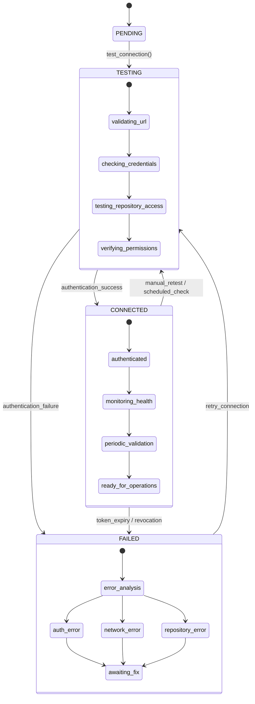
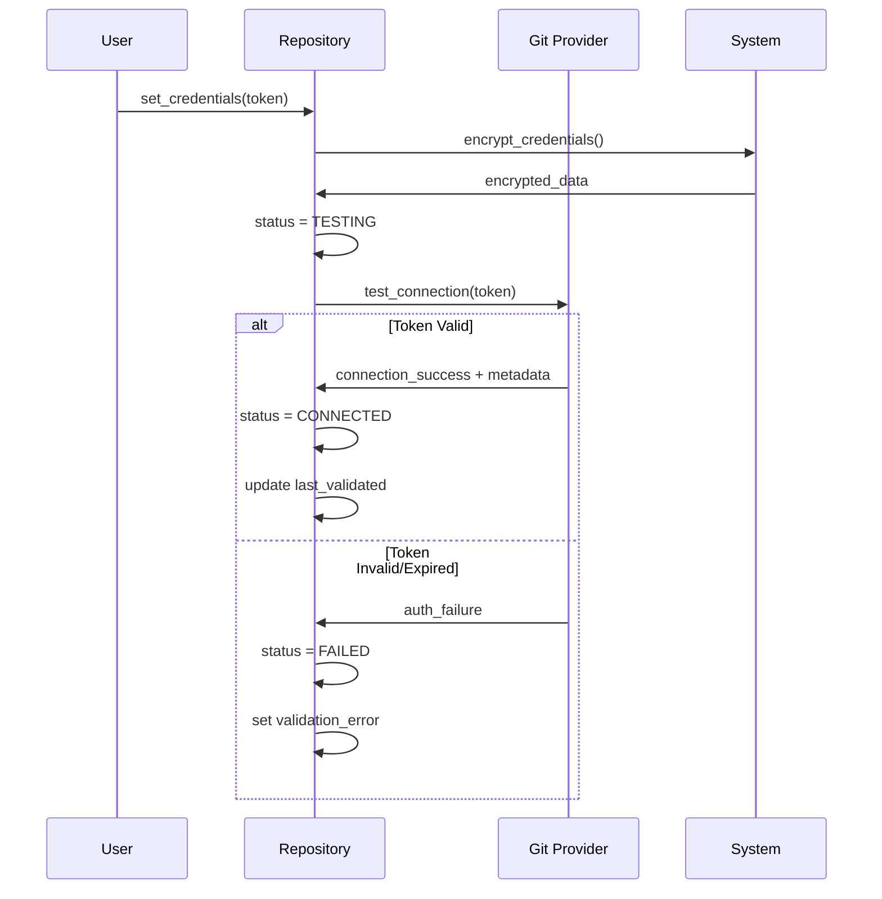
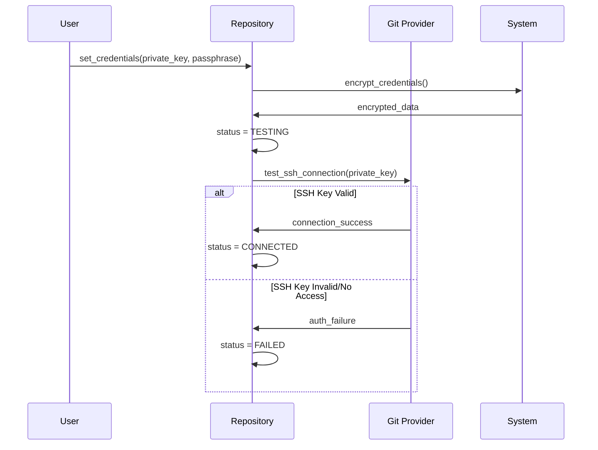
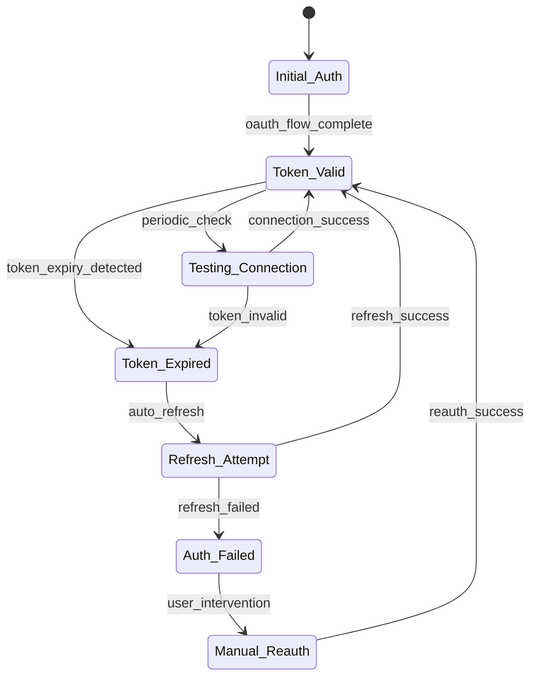
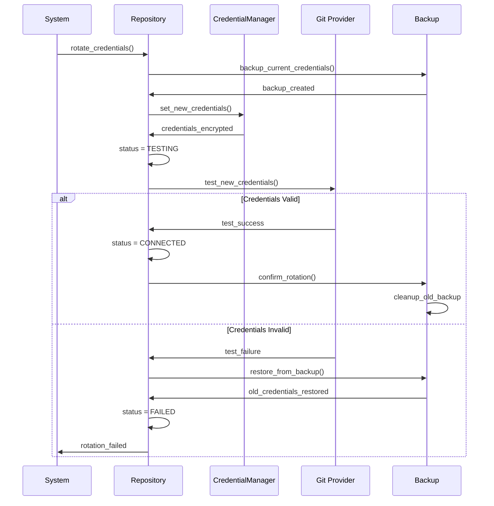
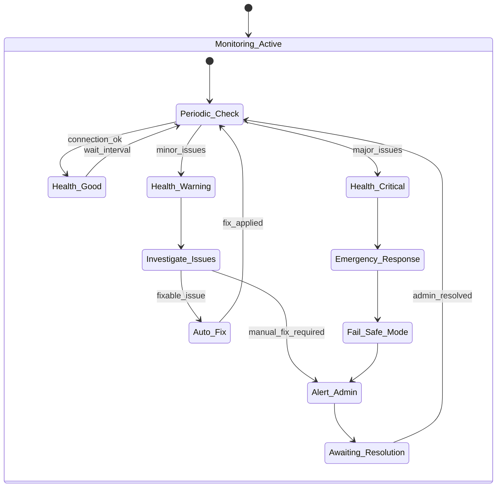
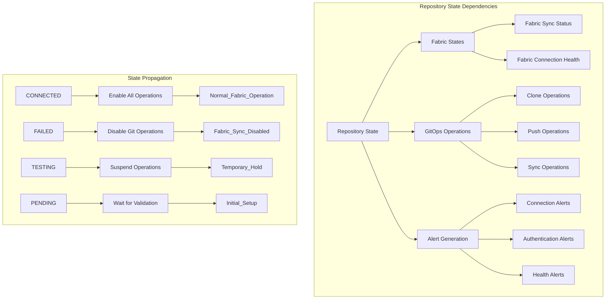
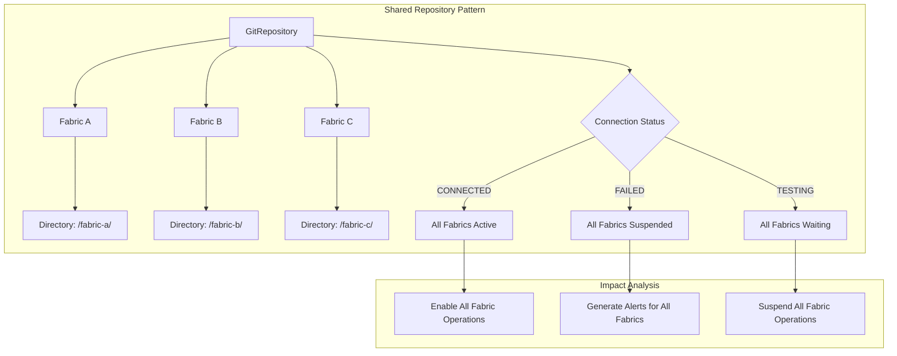
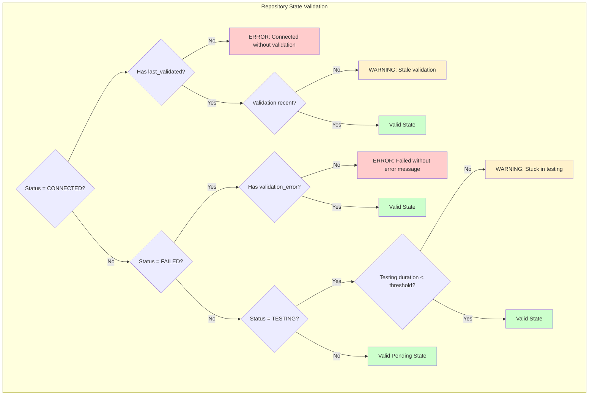

# GitRepository State Diagrams

## Connection Status State Machine



## Authentication Type Workflows

### Token Authentication Flow



### SSH Key Authentication Flow



### OAuth Authentication Flow



## Error Handling and Recovery Patterns

### Connection Failure Recovery

```mermaid
flowchart TD
    CF[Connection Failure] --> AT{Analyze Error Type}
    
    AT --> AE[Authentication Error]
    AT --> NE[Network Error]
    AT --> RE[Repository Error]
    AT --> UE[Unknown Error]
    
    AE --> AE1{Token Expired?}
    AE1 -->|Yes| AE2[Generate New Token]
    AE1 -->|No| AE3[Check Token Permissions]
    AE2 --> RT[Retry Test]
    AE3 --> RT
    
    NE --> NE1{Transient Network Issue?}
    NE1 -->|Yes| NE2[Wait and Retry]
    NE1 -->|No| NE3[Check Network Configuration]
    NE2 --> RT
    NE3 --> MI[Manual Intervention]
    
    RE --> RE1{Repository Exists?}
    RE1 -->|Yes| RE2[Check Repository Permissions]
    RE1 -->|No| RE3[Verify Repository URL]
    RE2 --> RT
    RE3 --> MI
    
    UE --> UE1[Log Error Details]
    UE1 --> MI
    
    RT --> TC{Test Connection}
    TC -->|Success| CS[CONNECTED State]
    TC -->|Failure| FC{Failure Count < Max?}
    FC -->|Yes| EB[Exponential Backoff]
    FC -->|No| MI
    EB --> RT
    
    MI --> MS[Manual State]
    CS --> [*]
    MS --> [*]
```

### Credential Rotation Workflow



## Health Monitoring State Flow



## Repository State Dependencies



## Multi-Fabric Repository Sharing



## State Validation and Consistency



This comprehensive state diagram documentation provides agents with complete visual understanding of GitRepository authentication and connection management workflows.