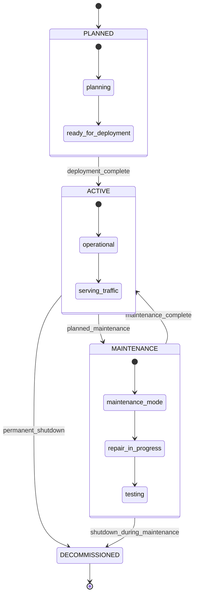
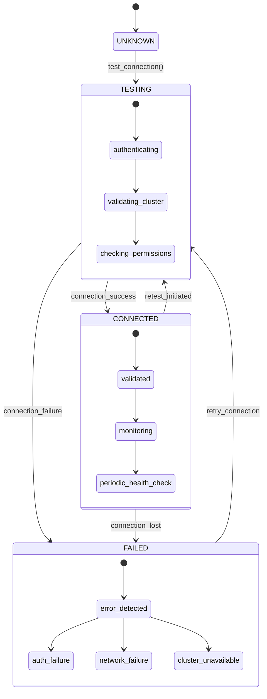
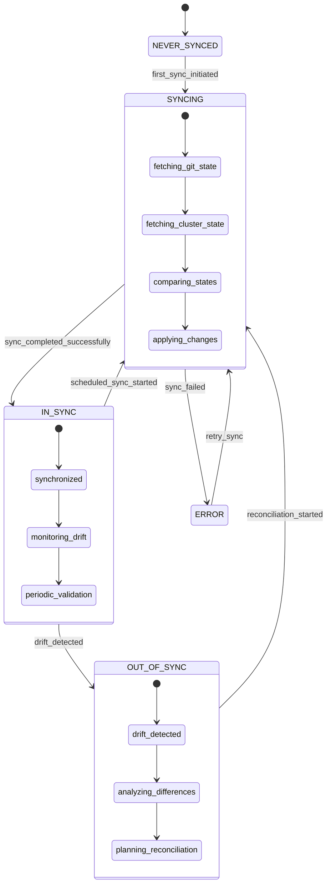
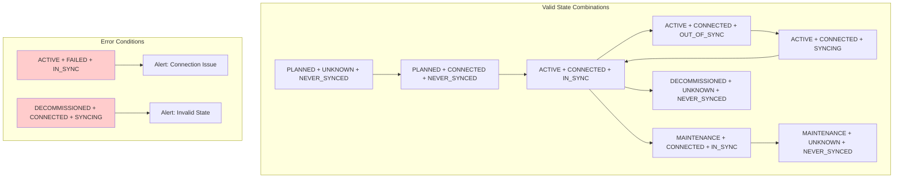
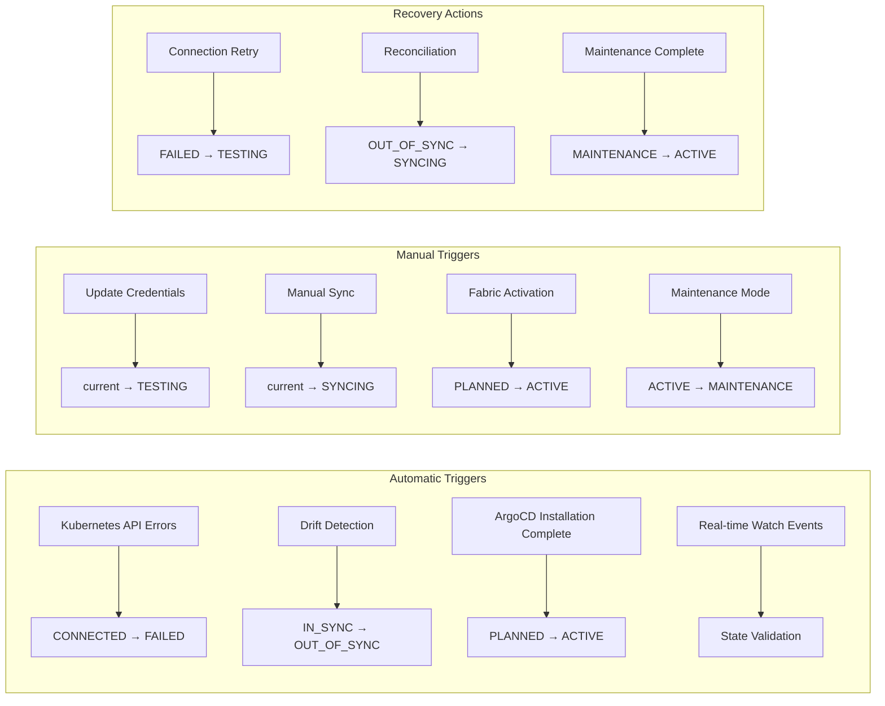
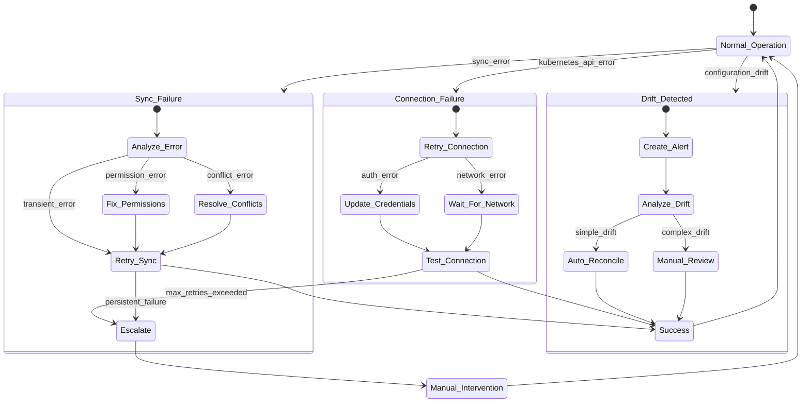
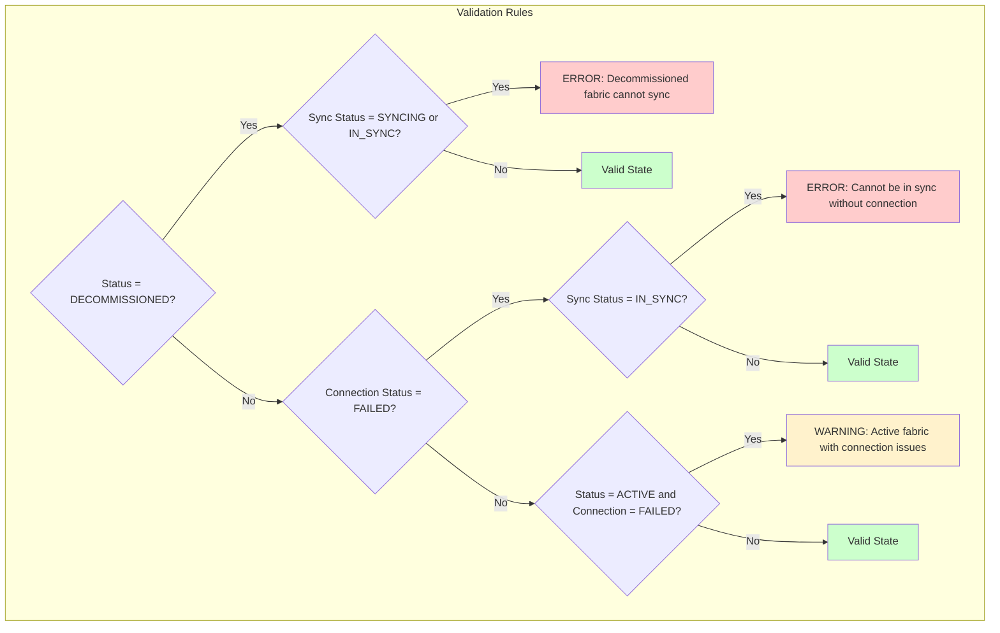

# HedgehogFabric State Diagrams

## Three-Dimensional State Space

HedgehogFabric has three independent state dimensions that work together:

### 1. Configuration Status Flow

### 2. Connection Status Flow

### 3. Sync Status Flow

## Combined State Interaction Matrix

## State Transition Triggers

## Error Recovery Flows

## State Validation Rules

This comprehensive state diagram documentation provides agents with visual understanding of all HedgehogFabric state transitions and interactions.