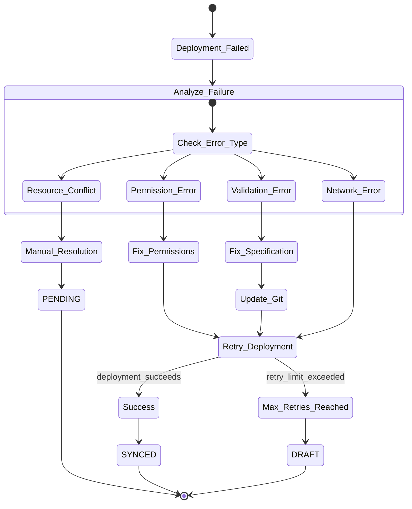

# HedgehogResource State Diagrams

## Six-State GitOps Lifecycle

## Full GitOps Workflow Patterns

### Standard Creation Workflow

### Drift Detection and Resolution

### Orphan Resource Adoption

## State Transition Validation

## Drift Analysis State Machine

## Resource State Dependencies

## Batch State Operations

## Error Recovery Patterns

### State Inconsistency Recovery

### Deployment Failure Recovery

This comprehensive state diagram documentation enables agents to understand and implement the complete HedgehogResource GitOps lifecycle with proper error handling and recovery mechanisms.