# ReconciliationAlert State Diagrams

## Alert Lifecycle State Machine


## Alert Type-Specific Workflows

### Drift Detection Alert Flow

```mermaid
flowchart TD
    DD[Drift Detected] --> CA[Create Alert]
    CA --> AS[Analyze Severity]
    
    AS --> LS{Low Severity?}
    AS --> MS{Medium Severity?}  
    AS --> HS{High Severity?}
    AS --> CS{Critical Severity?}
    
    LS -->|Yes| LSA[Auto-suggest: update_git]
    MS -->|Yes| MSA[Auto-suggest: import_to_git]
    HS -->|Yes| HSA[Auto-suggest: manual_review]
    CS -->|Yes| CSA[Escalate: immediate_review]
    
    LSA --> QP[Queue for Processing]
    MSA --> QP
    HSA --> QP  
    CSA --> IP[Immediate Processing]
    
    QP --> PA[Process Alert]
    IP --> PA
    
    PA --> EA{Execute Action}
    EA -->|update_git| UG[Update Git Repository]
    EA -->|import_to_git| IG[Import to Git]
    EA -->|manual_review| MR[Require Manual Review]
    EA -->|ignore| IA[Ignore Alert]
    
    UG --> VS[Verify Success]
    IG --> VS
    MR --> AUR[Await User Resolution]
    IA --> RA[Resolve Alert]
    
    VS --> RA
    AUR --> RA
    RA --> [*]
```

### Orphaned Resource Alert Flow

```mermaid
sequenceDiagram
    participant M as Monitor
    participant R as Resource
    participant A as Alert System
    participant U as User
    participant G as Git
    participant K as Kubernetes
    
    M->>R: Detect Orphaned Resource
    R->>A: Create Orphan Alert (CRITICAL)
    A->>A: Priority = 10 (Critical)
    A->>U: Immediate Notification
    
    U->>A: Acknowledge Alert
    A->>A: Status: ACKNOWLEDGED
    
    alt User Chooses Import
        U->>A: Resolve with import_to_git
        A->>G: Extract Resource Spec
        G->>G: Create YAML File
        G->>G: Commit to Repository
        G->>A: Import Success
        A->>A: Status: RESOLVED
        A->>R: Update State: ORPHANED → COMMITTED
    else User Chooses Delete
        U->>A: Resolve with delete_from_cluster
        A->>K: Delete Resource
        K->>A: Deletion Success
        A->>A: Status: RESOLVED
        A->>R: Remove Resource Record
    else User Chooses Ignore
        U->>A: Suppress Alert
        A->>A: Status: SUPPRESSED
        A->>R: Mark as Ignored
    end
```



### Sync Failure Alert Flow


## Queue Management and Priority System

### Priority Calculation Flow

```mermaid
flowchart TD
    AC[Alert Created] --> CSev[Calculate Severity]
    CSev --> CBP[Calculate Base Priority]
    
    CBP --> CRIT{Critical?}
    CBP --> HIGH{High?}
    CBP --> MED{Medium?}  
    CBP --> LOW{Low?}
    
    CRIT -->|Yes| P10[Priority = 10]
    HIGH -->|Yes| P30[Priority = 30]
    MED -->|Yes| P50[Priority = 50]
    LOW -->|Yes| P70[Priority = 70]
    
    P10 --> AAF[Apply Age Factor]
    P30 --> AAF
    P50 --> AAF
    P70 --> AAF
    
    AAF --> CAH{Calculate Age Hours}
    CAH --> AF[Age Factor = min(age_hours, 20)]
    AF --> FP[Final Priority = Base - Age Factor]
    FP --> MP[Max(Final Priority, 1)]
    MP --> UQ[Update Queue Position]
```

### Batch Processing Workflow


## Resolution Action State Machines

### Import to Git Action


### Delete from Cluster Action


## Error Handling and Recovery

### Alert Processing Failure Recovery

```mermaid
flowchart TD
    APF[Alert Processing Failed] --> AE{Analyze Error}
    
    AE --> TE[Transient Error]
    AE --> PE[Permission Error]  
    AE --> RE[Resource Error]
    AE --> UE[Unknown Error]
    
    TE --> RWB[Retry with Backoff]
    RWB --> RCount{Retry Count < Max?}
    RCount -->|Yes| WAR[Wait and Retry]
    RCount -->|No| ESC[Escalate to Manual]
    
    PE --> FP[Fix Permissions]
    FP --> TRY[Try Again]
    TRY --> SUC[Success]
    TRY --> ESC
    
    RE --> VR[Validate Resource]
    VR --> FR[Fix Resource]
    FR --> TRY
    VR --> ESC
    
    UE --> LOG[Log Detailed Error]
    LOG --> ESC
    
    WAR --> SUC
    SUC --> RA[Resolve Alert]
    ESC --> MR[Manual Review Required]
    
    RA --> [*]
    MR --> [*]
```

### Alert Consistency Validation


## Monitoring and Analytics

### Alert Queue Analytics


This comprehensive state diagram documentation provides agents with complete visual understanding of the reconciliation alert workflow, enabling automated drift detection and remediation with proper error handling and recovery mechanisms.