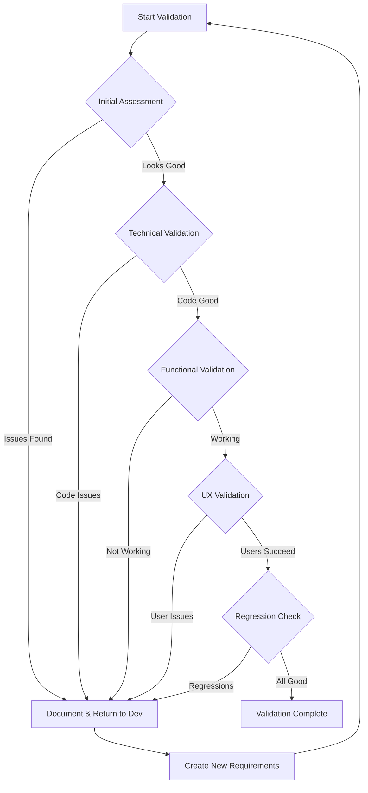

# Validation Protocols: Systematic Verification Excellence

**Purpose**: Standardize validation procedures to ensure consistent quality  
**Goal**: Zero false completions through rigorous verification

## Core Validation Principles

### 1. Independent Verification
Never trust—always verify independently. The person claiming completion should not be the only validator.

### 2. User-Centric Testing
Validation succeeds when users succeed, not when code compiles.

### 3. Systematic Approach
Follow protocols consistently to catch issues others miss.

### 4. Evidence-Based Decisions
Every validation produces evidence that supports or refutes completion claims.

## Validation Protocol Framework

### Phase 1: Initial Assessment

**Purpose**: Establish current state before trusting any reports

**Protocol Steps**:
1. **Environment Setup**
   ```markdown
   □ Access appropriate environment
   □ Verify correct version/branch
   □ Confirm authentication works
   □ Check system health
   ```

2. **Baseline Testing**
   ```markdown
   □ Test reported issue yourself
   □ Document actual behavior
   □ Compare with reported behavior
   □ Identify discrepancies
   ```

3. **Evidence Collection**
   ```markdown
   □ Screenshot current state
   □ Capture error messages
   □ Record console output
   □ Note environment details
   ```

**Fabric Edit Example**:
```markdown
Initial Assessment Results:
- Reported: "TypeError on fabric edit page"
- Actual: Page loads but TypeError occurs during render
- Evidence: Screenshot shows partial form render
- Console: "TypeError: 'NoneType' object is not callable"
- Different from report: Error happens during render, not on load
```

### Phase 2: Technical Validation

**Purpose**: Verify code changes are correct and complete

**Protocol Steps**:
1. **Code Review Protocol**
   ```markdown
   □ Verify files mentioned were actually modified
   □ Check git diff matches described changes
   □ Validate no syntax errors introduced
   □ Confirm changes address root cause
   □ Review for security implications
   ```

2. **Test Validation Protocol**
   ```markdown
   □ Verify test reproduces original issue
   □ Confirm test fails without fix
   □ Validate test passes with fix
   □ Check test is meaningful (not trivial)
   □ Ensure adequate test coverage
   ```

3. **Build Validation Protocol**
   ```markdown
   □ Clean build succeeds
   □ No new warnings introduced
   □ Dependencies properly managed
   □ Database migrations work
   □ Static analysis passes
   ```

### Phase 3: Functional Validation

**Purpose**: Confirm the feature/fix works as intended

**Protocol Steps**:
1. **Feature Testing Protocol**
   ```markdown
   □ Test primary functionality
   □ Verify all form fields work
   □ Check data saves correctly
   □ Validate success messages
   □ Confirm error handling
   ```

2. **Integration Testing Protocol**
   ```markdown
   □ API endpoints respond correctly
   □ Database transactions complete
   □ Cache invalidation works
   □ Events propagate properly
   □ External services integrate
   ```

3. **Edge Case Protocol**
   ```markdown
   □ Test with minimal data
   □ Test with maximum data
   □ Test with special characters
   □ Test concurrent operations
   □ Test permission boundaries
   ```

### Phase 4: User Experience Validation

**Purpose**: Ensure real users can successfully use the feature

**Protocol Steps**:
1. **User Journey Protocol**
   ```markdown
   □ Start from login screen
   □ Navigate as user would
   □ Complete intended task
   □ Verify success indicators
   □ Check workflow efficiency
   ```

2. **Multi-Persona Protocol**
   ```markdown
   □ Test as admin user
   □ Test as regular user
   □ Test as read-only user
   □ Test as new user
   □ Test with disabilities (a11y)
   ```

3. **Cross-Platform Protocol**
   ```markdown
   □ Test on Chrome
   □ Test on Firefox
   □ Test on Safari
   □ Test on mobile
   □ Test on different OS
   ```

### Phase 5: Regression Validation

**Purpose**: Ensure no existing functionality was broken

**Protocol Steps**:
1. **Test Suite Protocol**
   ```markdown
   □ Run full test suite
   □ Verify 100% pass rate
   □ Check coverage metrics
   □ Review any skipped tests
   □ Validate performance tests
   ```

2. **Adjacent Feature Protocol**
   ```markdown
   □ Test related features
   □ Verify list views work
   □ Check detail views work
   □ Validate create flows
   □ Confirm delete operations
   ```

3. **System Health Protocol**
   ```markdown
   □ Check application logs
   □ Monitor error rates
   □ Verify response times
   □ Review resource usage
   □ Confirm no memory leaks
   ```

## Validation Decision Tree



## Specialized Validation Protocols

### Bug Fix Validation Protocol

1. **Reproduce Original Bug**
   - Use original steps
   - Confirm bug exists
   - Document evidence

2. **Apply Fix**
   - Deploy changes
   - Clear caches
   - Restart services

3. **Verify Fix**
   - Repeat original steps
   - Confirm bug resolved
   - Test related scenarios

4. **Check Side Effects**
   - Test adjacent features
   - Verify performance
   - Monitor errors

### New Feature Validation Protocol

1. **Requirements Verification**
   - Match implementation to specs
   - Verify all acceptance criteria
   - Check edge cases

2. **Integration Verification**
   - Test with existing features
   - Verify data flow
   - Check permissions

3. **User Acceptance**
   - Demo to stakeholders
   - Gather feedback
   - Confirm meets needs

4. **Production Readiness**
   - Verify monitoring
   - Check documentation
   - Validate rollback plan

### Performance Fix Validation Protocol

1. **Baseline Metrics**
   - Current response times
   - Resource usage
   - Error rates

2. **Apply Optimization**
   - Deploy changes
   - Warm up caches
   - Stabilize system

3. **Measure Improvement**
   - New response times
   - Resource efficiency
   - Load testing

4. **Sustained Performance**
   - Monitor over time
   - Check under load
   - Verify no degradation

## Validation Anti-Patterns

### 1. The Spot Check
**Anti-Pattern**: Only testing the exact reported issue  
**Problem**: Misses related problems and edge cases  
**Solution**: Always test the full feature and related workflows

### 2. The Developer's Word
**Anti-Pattern**: Accepting "I tested it" without evidence  
**Problem**: Developers test differently than users  
**Solution**: Always validate independently with user perspective

### 3. The Happy Path Only
**Anti-Pattern**: Only testing successful scenarios  
**Problem**: Users encounter errors and edge cases  
**Solution**: Test error conditions and boundaries

### 4. The Quick Glance
**Anti-Pattern**: Superficial testing without depth  
**Problem**: Deep issues remain hidden  
**Solution**: Follow systematic protocols completely

## Validation Tools and Techniques

### Browser Developer Tools
- **Console**: Check for JavaScript errors
- **Network**: Verify API calls and responses
- **Elements**: Inspect DOM for issues
- **Performance**: Check for bottlenecks

### Testing Utilities
- **Selenium**: Automated user journey testing
- **Postman**: API endpoint validation
- **JMeter**: Load and performance testing
- **pytest**: Automated test execution

### Evidence Collection
- **Screenshots**: Full context with annotations
- **Video Recording**: Complex workflow documentation
- **HAR Files**: Complete network traffic analysis
- **Log Aggregation**: Centralized error tracking

## Validation Reporting Template

```markdown
# Validation Report

## Summary
- Feature/Fix: [Name]
- Validation Date: [Date]
- Validator: [Name]
- Result: [PASS/FAIL]

## Validation Phases Completed

### ✅ Initial Assessment
- Current state documented
- Baseline established
- Evidence collected

### ✅ Technical Validation  
- Code changes verified
- Tests reviewed and run
- Build successful

### ✅ Functional Validation
- Primary features work
- Integrations verified
- Edge cases tested

### ✅ UX Validation
- User journeys complete
- Multi-persona tested
- Cross-platform verified

### ⚠️ Regression Validation
- Test suite: 342/345 passed
- Adjacent features: OK
- Performance: Slight degradation noted

## Issues Found
1. Performance degradation on large datasets
   - Evidence: Page load increased from 250ms to 400ms
   - Impact: Noticeable lag for power users
   - Recommendation: Optimize query before release

## Evidence Attached
- Screenshots/: 15 images
- TestResults/: Full test output
- Logs/: Application and error logs
- Videos/: User workflow recordings

## Validation Decision
CONDITIONAL PASS - Pending performance optimization
```

## Continuous Improvement

### Validation Metrics
- **False Completion Rate**: Track and drive to zero
- **Validation Time**: Optimize without compromising quality
- **Issue Discovery Rate**: Find problems before users do
- **Evidence Quality Score**: Improve documentation

### Protocol Evolution
- Review protocols monthly
- Incorporate lessons learned
- Update for new technologies
- Share best practices

### Team Development
- Train new validators
- Peer review validations
- Share difficult cases
- Celebrate thorough work

## Conclusion

Validation protocols are the backbone of quality assurance. They transform subjective opinions into objective evidence and ensure that every feature delivery meets our standards of excellence.

Remember the fabric edit investigation: systematic validation revealed the true issue was different from initial reports. That's the power of following protocols—they reveal truth, not assumptions.

Follow these protocols religiously, and you'll never have to apologize for a false completion.