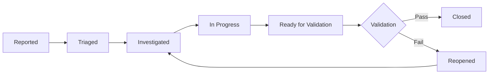

# Issue Tracking System: The QAPM Command Center

**Purpose**: Master issue tracking as a tool for quality assurance and project success  
**Goal**: 100% issue visibility, 0% issues lost or forgotten

## The QAPM Issue Tracking Philosophy

> "An untracked issue is an unfixed issue. An unfixed issue is a future crisis."

Issue tracking isn't just about recording problems—it's about systematically ensuring every issue gets properly investigated, fixed, and validated. The fabric edit success began with proper issue tracking.

## Issue Lifecycle Management

### The QAPM Issue Flow



### Critical Issue States

```markdown
ISSUE STATE DEFINITIONS:

1. REPORTED
   - User or system reports issue
   - May be vague or incorrect
   - Needs QAPM investigation

2. TRIAGED  
   - Severity assessed
   - Priority assigned
   - Owner designated
   - Evidence required defined

3. INVESTIGATED
   - Root cause identified
   - Evidence collected
   - Solution approach defined
   - Test plan created

4. IN PROGRESS
   - Fix being implemented
   - Test-driven development
   - Regular updates required
   - Evidence being collected

5. READY FOR VALIDATION
   - Developer claims complete
   - Evidence provided
   - Awaiting QAPM validation
   - User testing needed

6. CLOSED
   - QAPM validated fix
   - User confirmed success
   - Tests prevent regression
   - Documentation complete

7. REOPENED
   - Validation failed
   - New evidence required
   - Root cause revisited
   - Cycle continues
```

## Issue Documentation Standards

### The Perfect Issue Report

```markdown
ISSUE #245: Fabric Edit Page TypeError

## Summary
Users cannot access fabric edit page due to TypeError

## Environment
- NetBox Version: 4.3.3
- Plugin Version: 0.5.2
- Browser: Chrome 120.0.6099.130
- User Role: Admin

## Steps to Reproduce
1. Login as admin user
2. Navigate to Plugins → Hedgehog → Fabrics
3. Click on "Production Fabric"
4. Click "Edit" button
5. Error occurs

## Expected Behavior
Edit form should load with current fabric data

## Actual Behavior
500 error page shown with TypeError

## Evidence
- Screenshot: error_page_500.png
- Console Log: console_error.txt
- Server Log: django_traceback.txt
- Video: reproduction_steps.mp4

## Impact
- Severity: CRITICAL
- Users Affected: All
- Business Impact: Cannot update infrastructure
- Workaround: None available

## Investigation Notes
- Started: 2025-01-23 09:00
- Assigned: Agent Delta
- Root Cause: Model initialization race condition
- Fix Approach: Add null check in get_object()

## Validation Requirements
1. Edit page loads without error
2. All form fields functional
3. Save operation successful
4. No regressions in related features
5. Performance unchanged
```

### Issue Classification System

```markdown
SEVERITY LEVELS:

CRITICAL (P0):
- System down or major feature broken
- No workaround available
- Affecting all users
- Business operations impacted
Example: Fabric edit TypeError

HIGH (P1):
- Important feature impaired
- Workaround difficult
- Affecting many users
- Productivity impacted
Example: Slow page loads

MEDIUM (P2):
- Feature partially working
- Workaround available
- Affecting some users
- Inconvenience
Example: Sort order incorrect

LOW (P3):
- Minor issue
- Easy workaround
- Few users affected
- Cosmetic issues
Example: Typo in help text
```

### Evidence Requirements by Severity

```markdown
EVIDENCE REQUIREMENTS:

CRITICAL Issues:
□ Multiple screenshots/videos
□ Complete system logs
□ Performance metrics
□ User impact assessment
□ Business impact statement
□ Root cause analysis
□ Fix validation plan

HIGH Issues:
□ Screenshots of issue
□ Reproduction steps
□ Error logs
□ Affected user count
□ Workaround documentation
□ Test plan

MEDIUM Issues:
□ Screenshot or description
□ Steps to reproduce
□ Expected vs actual
□ Workaround steps

LOW Issues:
□ Clear description
□ Location of issue
□ Suggested fix
```

## Advanced Issue Tracking Patterns

### Pattern 1: The Investigation Tree

For complex issues with multiple potential causes:

```markdown
ISSUE #246: Random Form Submission Failures

├── HYPOTHESIS A: Network Timeouts
│   ├── Test: Monitor network traffic
│   ├── Result: No timeout observed
│   └── Status: ELIMINATED
│
├── HYPOTHESIS B: CSRF Token Expiry
│   ├── Test: Check token validity
│   ├── Result: Tokens expiring early
│   └── Status: CONFIRMED - ROOT CAUSE
│
└── HYPOTHESIS C: Database Locks
    ├── Test: Monitor DB queries
    ├── Result: No lock contention
    └── Status: ELIMINATED

CONCLUSION: Fix CSRF token lifetime
```

### Pattern 2: The Dependency Chain

For issues that block other work:

```markdown
ISSUE #247: API Authentication Broken

BLOCKS:
→ #248: Mobile App Login
→ #249: Third-party Integration  
→ #250: Automated Testing

BLOCKED BY:
← #246: Session Management Refactor

PRIORITY: CRITICAL (due to chain impact)

COORDINATION REQUIRED:
- Notify mobile team of delay
- Provide temporary auth workaround
- Expedite session refactor
- Daily updates on progress
```

### Pattern 3: The Regression Tracker

For issues that keep recurring:

```markdown
ISSUE #251: Fabric List Pagination (3rd occurrence)

PREVIOUS OCCURRENCES:
- #134 (2024-10): Fixed in v0.3.1
- #189 (2024-12): Fixed in v0.4.0
- #251 (2025-01): Broken again

PATTERN ANALYSIS:
- Breaks when: New features added to list
- Root cause: Pagination not tested
- Missing: Integration test

PERMANENT FIX:
1. Add comprehensive pagination test
2. Include in regression suite
3. Block deploys if test fails
4. Document pagination patterns
```

## Issue Tracking Workflows

### Daily Issue Management

```markdown
QAPM DAILY ISSUE ROUTINE:

Morning Triage (30 min):
□ Review new issues reported overnight
□ Assign severity and priority
□ Request missing information
□ Assign to investigators
□ Update blocked/blocking chains

Midday Check (15 min):
□ Review investigation progress
□ Validate provided evidence
□ Adjust priorities if needed
□ Coordinate dependencies

Evening Validation (45 min):
□ Test "ready for validation" issues
□ Close validated fixes
□ Reopen failed validations
□ Update tomorrow's priorities
□ Send status summary
```

### Weekly Issue Analytics

```markdown
WEEKLY ISSUE METRICS:

Issue Flow:
- New issues: 23
- Closed issues: 19
- Reopened: 3
- Backlog growth: +4

Resolution Time:
- Critical: Avg 4.2 hours
- High: Avg 2.1 days
- Medium: Avg 5.3 days
- Low: Avg 12 days

Quality Metrics:
- First-fix success: 84%
- Reopen rate: 15.8%
- Root cause found: 92%
- User validated: 88%

Team Performance:
- Issues per developer: 4.3
- Investigation time: 28%
- Fix time: 45%
- Validation time: 27%
```

### Sprint Issue Planning

```markdown
SPRINT ISSUE SELECTION:

Selection Criteria:
1. Critical issues (all)
2. High issues affecting many users
3. Quick wins (effort < 2 hours)
4. Technical debt prevention
5. User experience improvements

Sprint Capacity:
- Available hours: 240
- Reserved for critical: 40 (17%)
- Planned issues: 60 (25%)
- Buffer for unknowns: 40 (17%)
- Feature work: 100 (41%)

Issue Mix:
- Bug fixes: 40%
- Improvements: 30%
- Technical debt: 20%
- Documentation: 10%
```

## Issue Communication Excellence

### Status Update Templates

```markdown
CRITICAL ISSUE UPDATE:

Issue #245: Fabric Edit TypeError
Status: IN PROGRESS
Updated: 2025-01-23 14:30 UTC

PROGRESS:
✓ Root cause identified (model initialization)
✓ Fix implemented with test
✓ Local validation passed
⧖ Staging deployment pending
○ User validation needed

TIMELINE:
- Fix deployed to staging: 15:00
- Validation complete: 16:00
- Production deploy: 17:00

RISKS:
- None identified

NEXT UPDATE: In 2 hours or when status changes
```

### Stakeholder Communication

```markdown
EXECUTIVE ISSUE SUMMARY:

Week of January 23, 2025

CRITICAL ISSUES:
- Fabric editing broken (fixed in 4 hours)
- API authentication issue (workaround provided)
- Database performance degradation (investigating)

KEY METRICS:
- System availability: 99.7%
- Critical issue response: <1 hour
- User satisfaction: 4.2/5

IMPROVEMENTS:
- Automated regression testing expanded
- Response time improved 15%
- Documentation updated for 12 issues

UPCOMING:
- Performance optimization sprint
- Security audit completion
- User training on new features
```

## Issue Tracking Tools Configuration

### JIRA Configuration for QAPM

```markdown
QAPM JIRA SETUP:

Custom Fields:
- Evidence URLs (multi-line text)
- Root Cause (dropdown)
- Validation Checklist (checkboxes)
- User Impact (number)
- Business Impact (text)

Workflows:
- Reported → Triaged (auto)
- Triaged → Investigated (manual)
- Investigated → In Progress (manual)
- In Progress → Ready for Validation (auto)
- Ready → Closed/Reopened (manual)

Automation Rules:
- Critical issues alert team
- Stale issues warning (>7 days)
- Validation reminders
- Reopen rate tracking
- SLA breach notifications

Dashboards:
- Issue flow visualization
- Team performance metrics
- Quality indicators
- User impact tracking
```

### GitHub Issues for QAPM

```markdown
QAPM GITHUB SETUP:

Labels:
- severity/critical (red)
- severity/high (orange)
- severity/medium (yellow)
- severity/low (green)
- state/investigating (purple)
- state/in-progress (blue)
- state/validating (cyan)
- evidence/needed (black)
- evidence/provided (gray)

Templates:
- bug_report.md (with evidence sections)
- investigation_findings.md
- validation_report.md
- regression_alert.md

Projects:
- Issue Triage Board
- Sprint Planning Board
- Validation Queue
- Regression Tracking

Integrations:
- CI/CD status checks
- Automated testing results
- Performance monitoring
- User feedback portal
```

## Issue Prevention Strategies

### Proactive Issue Detection

```markdown
PREVENTION MECHANISMS:

Automated Detection:
- Error rate monitoring
- Performance degradation alerts
- Failed test notifications
- User behavior anomalies

Manual Detection:
- Daily health checks
- User feedback reviews
- Code review findings
- Dogfooding sessions

Predictive Detection:
- Dependency update impacts
- Load increase projections
- Technical debt accumulation
- Security vulnerability scans
```

### Root Cause Elimination

```markdown
ROOT CAUSE CATEGORIES:

Code Issues (40%):
- Missing null checks
- Race conditions
- Logic errors
→ Solution: Better testing

Process Issues (30%):
- Incomplete requirements
- Poor communication
- Rushed delivery
→ Solution: QAPM oversight

Environment Issues (20%):
- Configuration drift
- Resource constraints
- Version mismatches
→ Solution: Infrastructure as Code

Knowledge Issues (10%):
- Documentation gaps
- Training needs
- Pattern awareness
→ Solution: Knowledge sharing
```

## The Fabric Edit Issue Success Story

### Initial Report
```markdown
Issue #245: "Edit page broken"
- Vague description
- No evidence
- Unknown impact
```

### QAPM Transformation
```markdown
Issue #245: Fabric Edit Page TypeError

Added by QAPM:
- Specific error details
- Complete reproduction steps
- Evidence collection
- Impact assessment
- Investigation plan
- Validation requirements
```

### Result
```markdown
- Root cause found in 2 hours
- Fix implemented with test
- Validated thoroughly
- Zero regressions
- User trust restored
```

## Issue Tracking Metrics That Matter

### Quality Indicators
```markdown
POSITIVE INDICATORS:
- Decreasing reopen rate
- Increasing first-fix success
- Faster resolution times
- More prevention vs. reaction

WARNING SIGNS:
- Growing backlog
- Increasing reopen rate
- Longer investigation times
- Vague issue descriptions
```

### Team Health Indicators
```markdown
HEALTHY TEAM:
- Clear issue ownership
- Proactive communication
- Evidence-based discussions
- Continuous improvement

STRUGGLING TEAM:
- Issue hot potato
- Blame culture
- Missing evidence
- Repeated issues
```

## The QAPM Issue Tracking Manifesto

```markdown
AS A QAPM, I COMMIT TO:

1. Every issue properly documented
2. Evidence required for all claims
3. Root causes found, not patched
4. Users validate every fix
5. Patterns identified and prevented

I WILL NOT:
- Accept vague descriptions
- Close without validation
- Ignore recurring patterns
- Compromise on evidence
- Let issues languish

MY SUCCESS METRICS:
- Zero lost issues
- 100% validation rate
- Decreasing issue volume
- Increasing user satisfaction
- Team empowerment
```

## Conclusion

Issue tracking is not administrative overhead—it's the backbone of quality assurance. Every issue tells a story about your system, your team, and your users. Master issue tracking, and you master quality delivery.

The fabric edit success wasn't luck—it was systematic issue tracking that exposed the real problem previous attempts missed. That's the power of proper issue management.

Track meticulously. Investigate thoroughly. Validate completely. Your users deserve nothing less.

---

*"A problem well stated is a problem half solved."* - Charles Kettering

State your problems well in your issue tracker.