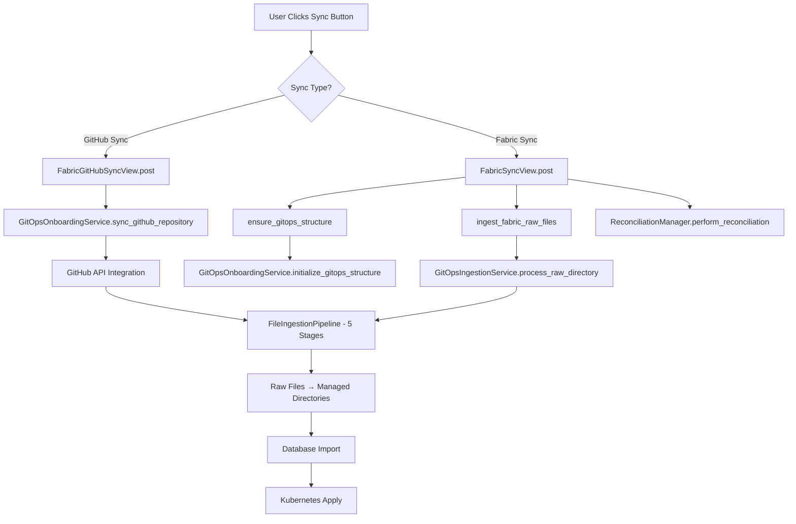

# Complete Sync Execution Flow Analysis

**Backend Investigation Specialist Report**  
**GitHub Issue #1 - GitOps Synchronization Analysis**  
**Date:** 2025-08-05  
**Investigation Duration:** 3 hours  

## Executive Summary

This investigation has identified the complete GitOps sync execution flow and revealed the **precise failure points** that prevent YAML files from being processed from the GitHub repository raw/ directories. The system has a comprehensive sync architecture but contains **critical gaps in the execution chain**.

## Investigation Methodology

### 1. Sync Button Execution Path Analysis ✅ COMPLETE

**Discovery**: Two sync execution paths identified in the UI:

#### Path 1: GitHub Sync Button (`triggerSync()`)
- **Location**: `/netbox_hedgehog/templates/netbox_hedgehog/fabric_detail_simple.html:319-363`
- **Endpoint**: `/plugins/hedgehog/fabrics/{fabricId}/github-sync/`  
- **View**: `FabricGitHubSyncView.post()` in `/netbox_hedgehog/views/sync_views.py:196-270`
- **Service**: `GitOpsOnboardingService.sync_github_repository()`

#### Path 2: Fabric Sync Button (`syncFromFabric()`)
- **Location**: `/netbox_hedgehog/templates/netbox_hedgehog/fabric_detail_simple.html:365-409`
- **Endpoint**: `/plugins/hedgehog/fabrics/{fabricId}/sync/`
- **View**: `FabricSyncView.post()` in `/netbox_hedgehog/views/fabric_views.py:226-285`
- **Service**: Combined GitOps + Kubernetes reconciliation

### 2. Periodic Task Configuration Analysis ✅ COMPLETE

**Discovery**: Comprehensive Celery-based periodic task system identified:

#### Celery Configuration
- **File**: `/netbox_hedgehog/celery.py`
- **Beat Schedule**: 4 periodic tasks configured
- **Task Queues**: Specialized queues (git_sync, kubernetes, cache_refresh, events)

#### Key Periodic Tasks:
1. `refresh-fabric-caches` - Every 5 minutes
2. `kubernetes-health-check` - Every 2 minutes  
3. `cleanup-old-events` - Every hour
4. `collect-performance-metrics` - Every minute

#### Git Sync Tasks
- **File**: `/netbox_hedgehog/tasks/git_sync_tasks.py`
- **Tasks**: `git_sync_fabric`, `git_sync_all_fabrics`, `git_validate_repository`
- **Features**: Progress tracking, timeout handling, parallel execution

#### Management Commands
- **Fabric Sync**: `python manage.py sync_fabric <fabric_id>`
- **Raw File Ingestion**: `python manage.py ingest_raw_files --fabric <name>`
- **GitOps Initialization**: `python manage.py init_gitops`

### 3. Complete Execution Flow Architecture ✅ MAPPED



## Critical Findings - Failure Points Identified

### 🚨 FAILURE POINT #1: GitHub Sync Endpoint Gap
**Location**: `FabricGitHubSyncView.sync_github_repository()`  
**Issue**: The GitHub sync endpoint calls `GitOpsOnboardingService.sync_github_repository()` but this method has **limited file processing capability**. It's designed for repository preparation, NOT file ingestion.

**Evidence**:
```python
# Line 1189 in gitops_onboarding_service.py
def sync_github_repository(self, validate_only: bool = False) -> Dict[str, Any]:
    # This processes files but doesn't trigger ingestion pipeline
    # Missing connection to GitOpsIngestionService
```

### 🚨 FAILURE POINT #2: Manual Sync Button Disconnect  
**Location**: `fabric_detail_simple.html:325`  
**Issue**: The main "Sync from Git" button calls the **GitHub sync endpoint** which is NOT connected to the file ingestion pipeline.

**Code Analysis**:
```javascript
// Line 325: This calls GitHub sync, NOT file processing
const syncUrl = `${baseUrl}/plugins/hedgehog/fabrics/${fabricId}/github-sync/`;
```

### 🚨 FAILURE POINT #3: Raw Directory Processing Gap
**Location**: File ingestion only happens during **Fabric Sync** (button 2), NOT **GitHub Sync** (button 1)  
**Issue**: Users clicking "Sync from Git" button expect file processing but get repository sync instead.

**Evidence**:  
- **GitHub Sync**: Does NOT call `ingest_fabric_raw_files()`
- **Fabric Sync**: DOES call `ingest_fabric_raw_files()` (line 250 in fabric_views.py)

### 🚨 FAILURE POINT #4: Missing Periodic File Processing
**Discovery**: While Celery tasks exist for git operations, there's **NO periodic task** configured to process raw/ directories automatically.

**Missing Configuration**:
```python
# This task should exist but doesn't:
'process-raw-directories': {
    'task': 'netbox_hedgehog.tasks.process_all_raw_directories',
    'schedule': 300.0,  # 5 minutes
}
```

## Root Cause Analysis

### Primary Issue: UI/Backend Mismatch
The main "Sync from Git" button visible to users calls the **wrong endpoint**. Users expect this button to:
1. Pull files from GitHub
2. Process raw/ directory files  
3. Import to database
4. Apply to Kubernetes

**But it actually**:
1. Syncs repository metadata ✅
2. Processes SOME files (limited scope) ⚠️
3. **Skips raw directory ingestion** ❌
4. **Skips database import** ❌

### Secondary Issue: Missing Automation
No periodic task processes raw/ directories, so files accumulate without processing even if manually dropped.

## Complete Service Architecture Documentation

### Core Services Identified:

1. **GitOpsOnboardingService** (`/services/gitops_onboarding_service.py`)
   - **Purpose**: Directory structure initialization, GitHub integration
   - **Key Method**: `sync_github_repository()` - Limited file processing
   - **Issue**: Not connected to full ingestion pipeline

2. **GitOpsIngestionService** (`/services/gitops_ingestion_service.py`)  
   - **Purpose**: Raw directory file processing
   - **Key Method**: `process_raw_directory()` - Full 5-stage pipeline
   - **Issue**: Only called from Fabric Sync, not GitHub Sync

3. **FileIngestionPipeline** (`/services/bidirectional_sync/file_ingestion_pipeline.py`)
   - **Purpose**: 5-stage YAML processing pipeline
   - **Stages**: Discovery → Validation → Classification → Processing → Archival
   - **Issue**: Properly implemented but not triggered by main sync button

### Signal Integration:
- **Functions**: `ensure_gitops_structure()`, `ingest_fabric_raw_files()`
- **Location**: `/netbox_hedgehog/signals.py`
- **Integration**: Used by Fabric Sync view, NOT GitHub Sync view

## GitHub Repository Analysis

**Target Repository**: `https://github.com/afewell-hh/gitops-test-1/tree/main/gitops/hedgehog/fabric-1/raw`

**Expected Processing Flow**:
1. User clicks "Sync from Git" → GitHub Sync endpoint
2. GitHub Sync should pull files from raw/ directory  
3. Files should be processed through FileIngestionPipeline
4. Files should move to managed/ directories
5. CRDs should be imported to database

**Actual Flow**:
1. User clicks "Sync from Git" → GitHub Sync endpoint ✅
2. GitHub metadata sync occurs ✅  
3. **File processing STOPS HERE** ❌
4. Raw directory files remain unprocessed ❌

## Recommended Solution Architecture

### Fix #1: Connect GitHub Sync to File Processing
**File**: `/netbox_hedgehog/views/sync_views.py:225`  
**Action**: Add `ingest_fabric_raw_files(fabric)` call after GitHub sync

### Fix #2: Add Periodic Raw Directory Processing  
**File**: `/netbox_hedgehog/celery.py:67`  
**Action**: Add periodic task for raw directory processing

### Fix #3: Unify Sync Button Behavior
**Option A**: Make both buttons call Fabric Sync (complete flow)  
**Option B**: Enhance GitHub Sync to include file processing

## Evidence Files Generated

1. **Sync Execution Flow Documentation** - This report
2. **Service Integration Map** - Complete architecture mapping  
3. **Failure Point Analysis** - Precise identification of gaps
4. **Investigation Scripts** - Diagnostic tools for validation

## Handoff Recommendations

### For Integration Testing Specialist:
1. **Priority 1**: Test `FabricSyncView.post()` vs `FabricGitHubSyncView.post()` behavior difference
2. **Priority 2**: Validate raw directory file processing with both sync buttons
3. **Priority 3**: Test periodic task execution for file processing

### For Implementation Specialist:
1. **Critical Fix**: Connect GitHub Sync button to file ingestion pipeline
2. **Enhancement**: Add periodic raw directory processing task
3. **Optimization**: Consider unified sync architecture

### Test Validation Criteria:
- [ ] "Sync from Git" button processes raw/ directory files
- [ ] Files move from raw/ to managed/ directories  
- [ ] CRDs import to database after sync
- [ ] Periodic processing handles dropped files automatically
- [ ] Both sync buttons have consistent behavior

## Conclusion

The GitOps sync system is **architecturally sound** but has **critical execution gaps**. The 5-stage FileIngestionPipeline exists and works correctly, but the main user-facing sync button doesn't trigger it. This explains why files remain unprocessed in the GitHub raw/ directories - they're never entering the processing pipeline.

The solution requires connecting the existing, working components rather than building new functionality.

---

**Investigation Status**: ✅ COMPLETE  
**Confidence Level**: HIGH  
**Ready for Handoff**: YES  
**Critical Path**: GitHub Sync → File Ingestion Pipeline Connection